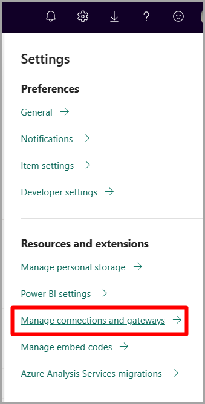

# Merge or append on-premises and cloud data sources

[!INCLUDE [gateway-rewrite](../includes/gateway-rewrite.md)]

You can use the on-premises data gateway to merge or append on-premises and cloud data sources in the same query. This solution is helpful when you want to combine data from multiple sources without having to use separate queries.

>[!NOTE]
>This article applies only to datasets that have cloud and on-premises data sources merged or appended in a single query. For datasets that include separate queries--one that connects to an on-premises data source and the other to a cloud data source--the gateway doesn't execute the query for the cloud data source.

## Prerequisites

- A [gateway installed](/data-integration/gateway/service-gateway-install) on a local computer.
- A Power BI Desktop file with queries that combine on-premises and cloud data sources.

>[!NOTE]
>To access any cloud data sources, you must ensure that the gateway has access to those data sources.

1. In the upper-right corner of the Power BI service, select the gear icon  > **Manage gateways**.

    

2. Select the gateway you want to configure.

3. Under **Gateway Cluster Settings**, select **Allow user's cloud data sources to refresh through this gateway cluster** > **Apply**.

    

4. Under this gateway cluster, add any [on-premises data sources](service-gateway-enterprise-manage-scheduled-refresh.md#add-a-data-source) used in your queries. You don't need to add the cloud data sources here.

5. Upload to the Power BI service your Power BI Desktop file with the queries that combine on-premises and cloud data sources.

6. On the **Dataset settings** page for the new dataset:

   - For the on-premises source, select the gateway associated with this data source.
   - Under **Data source credentials**, edit the cloud data source credentials, as necessary.

    Make sure privacy levels for both cloud and on-premises data sources are set appropriately to ensure the joins are handled securely.

     

7. With the cloud credentials set, you can now refresh the dataset by using the **Refresh now** option. Or, you can schedule it to refresh periodically.

## Next steps

To learn more about data refresh for gateways, see [Use the data source for scheduled refresh](service-gateway-enterprise-manage-scheduled-refresh.md#use-the-data-source-for-scheduled-refresh).
