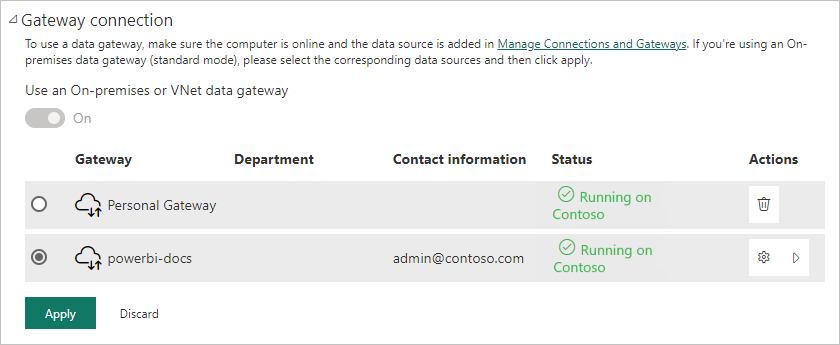

# Manage your data source - Oracle

[!INCLUDE [gateway-rewrite](../includes/gateway-rewrite.md)]

After you [install the on-premises data gateway](/data-integration/gateway/service-gateway-install), you can [add data sources](service-gateway-data-sources.md#add-a-data-source) to use with the gateway. This article looks at how to work with the on-premises gateway and Oracle data sources either for scheduled refresh or for DirectQuery.

## Connect to an Oracle database

To connect to an Oracle database with the on-premises data gateway, [download and install the 64-bit Oracle Client for Microsoft Tools (OCMT)](https://www.oracle.com/database/technologies/appdev/ocmt.html) on the computer running the gateway. 

Supported Oracle versions are: 
- Oracle Database Server 12c (12.1.0.2) and later
- Oracle Autonomous Database - all versions

After you install and configure OCMT properly, you can use Power BI Desktop or another test client to verify the correct installation and configuration on the gateway.

## Add a data source

1. On the **New connection** screen for your on-premises data gateway, select **Oracle** for **Connection type**.

   :::image type="content" source="media/service-gateway-onprem-manage-oracle/add-data-source-oracle.png" alt-text="Screenshot of adding an Oracle data source to the gateway." :::

1. In **Server**, enter the name for the data source, such as your Oracle net service name (for example, myADB_high) or Easy Connect Plus connection string.

1. Under **Authentication method**, choose either **Windows** or **Basic**. Choose **Basic** if you plan to log in as an Oracle database user. Then enter the credentials to use for this data source. Choose **Windows** when using Windows operating system authentication and with both the Oracle client and server running on Windows.

   > [!NOTE]
   > All queries to the data source run with these credentials. To learn more about credential storage, see [Store encrypted credentials in the cloud](service-gateway-data-sources.md#store-encrypted-credentials-in-the-cloud).

1. Configure the **Privacy level** for your data source. This setting controls how data can combine for scheduled refresh. The privacy-level setting doesn't apply to DirectQuery. To learn more about privacy levels for your data source, see [Privacy levels (Power Query)](https://support.office.com/article/Privacy-levels-Power-Query-CC3EDE4D-359E-4B28-BC72-9BEE7900B540).

1. Select **Create**.

   :::image type="content" source="media/service-gateway-onprem-manage-oracle/authentication-oracle.png" alt-text="Screenshot of filling in credentials and privacy level for the Oracle data source." :::

   If the creation succeeds, you see **Created \<Data source name>**. You can now use this data source for scheduled refresh or DirectQuery with the Oracle database server. 

   :::image type="content" source="media/service-gateway-onprem-manage-oracle/successful-data-source-oracle.png" alt-text=" Screenshot of successful creation for the Oracle data source." :::

## Use the data source

After you create the data source, it's available to use with either DirectQuery or scheduled refresh.

> [!IMPORTANT]
> The server and database names must match between Power BI Desktop and the data source within the on-premises data gateway.

The link between your dataset and the data source within the gateway is based on your server name and database name. These names must match exactly. For example, if you supply an IP address for the server name within Power BI Desktop, you must use the IP address for the data source within the gateway configuration. This name also has to match a net service name or alias that the *tnsnames.ora* file defines. This requirement is the case for both DirectQuery and scheduled refresh.

### Use the data source with DirectQuery connections

Make sure that the server and database names match between Power BI Desktop and the configured data source for the gateway. Also, to be able to publish DirectQuery datasets, your users must appear under **Users** in the data source listing.

After you publish reports, either from Power BI Desktop or by getting data in Power BI service, your database connection should work. It might take several minutes after you create the data source in the gateway to be able to use the connection.

### Use the data source with scheduled refresh

If you're in the **Users** list of a data source you configure within the gateway, and the server and database names match, you see the gateway as an option to use with scheduled refresh.

## Troubleshooting

You might get one of the following Oracle errors when the naming syntax is either incorrect or improperly configured:

* `ORA-12154: TNS:could not resolve the connect identifier specified.`
* `ORA-12514: TNS:listener does not currently know of service requested in connect descriptor.`
* `ORA-12541: TNS:no listener.`
* `ORA-12170: TNS:connect timeout occurred.`
* `ORA-12504: TNS:listener was not given the SERVICE_NAME in CONNECT_DATA.`

These errors might occur if the Oracle tnsnames.ora database connect descriptor is misconfigured, the net service name provided is misspelled, or the Oracle database listener is not running or not reachable, such as a firewall blocking the listener or database port. Be sure you are meeting the minimum installation prerequisites.

Visit the [Oracle Database Error Help Portal](https://docs.oracle.com/en/error-help/db/) to review common causes and resolutions for the specific Oracle error you encounter. Enter your Oracle error in the portal search bar.

To diagnose connectivity issues between the data source server and the gateway machine, install a client like Power BI Desktop on the gateway machine. You can use the client to check connectivity to the data source server.

For more gateway troubleshooting information, see [Troubleshoot the on-premises data gateway](/data-integration/gateway/service-gateway-tshoot).

## Related content

* [Troubleshoot gateways - Power BI](service-gateway-onprem-tshoot.md)
* [Power BI Premium](../enterprise/service-premium-what-is.md)

More questions? Try asking the [Power BI Community](https://community.powerbi.com/).
