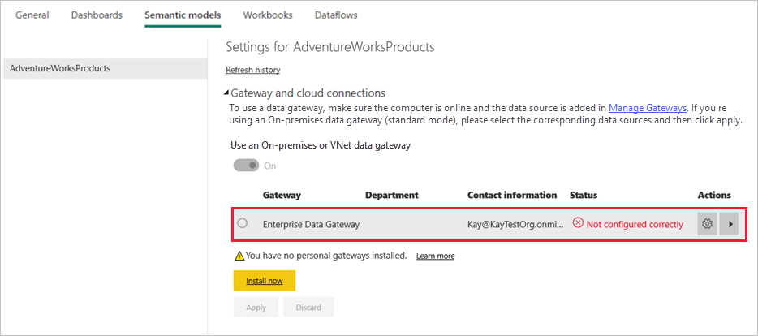
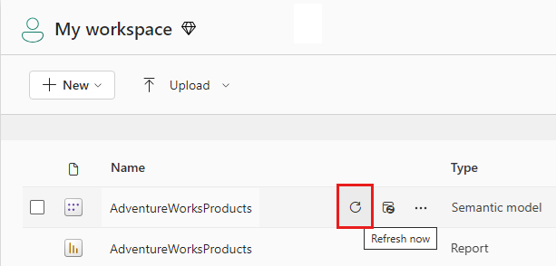
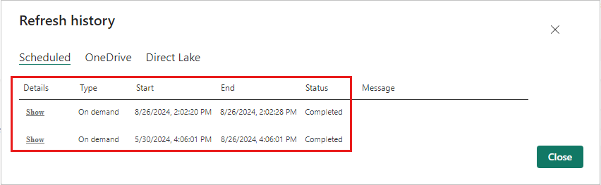

# Refresh data from an on-premises SQL Server database

In this tutorial, you explore how to refresh a Power BI dataset from a relational database that exists on premises in your local network. Specifically, this tutorial uses a sample SQL Server database, which Power BI must access through an on-premises data gateway.

In this tutorial, you complete the following steps:

> [!div class="checklist"]
> * Create and publish a Power BI Desktop (.pbix) file that imports data from an on-premises SQL Server database.
> * Configure data source and dataset settings in Power BI for SQL Server connectivity through a data gateway.
> * Configure a refresh schedule to ensure your Power BI dataset has recent data.
> * Perform an on-demand refresh of your dataset.
> * Review the refresh history to analyze the outcomes of past refresh cycles.
> * Clean up resources by deleting the artifacts created in this tutorial.

## Prerequisites

- If you don't already have one, sign up for a [free Power BI trial](https://app.powerbi.com/signupredirect?pbi_source=web) before you begin.
- [Install Power BI Desktop](https://powerbi.microsoft.com/desktop/) on a local computer.
- [Install SQL Server](/sql/database-engine/install-windows/install-sql-server) on a local computer, and restore the [sample database from a backup](https://github.com/Microsoft/sql-server-samples/releases/download/adventureworks/AdventureWorksDW2017.bak). For more information about AdventureWorks, see [AdventureWorks installation and configuration](/sql/samples/adventureworks-install-configure).
- [Install an on-premises data gateway](service-gateway-onprem.md) on the same local computer as SQL Server (in production, it would typically be a different computer).

> [!NOTE]
> If you're not a gateway administrator and don't want to install a gateway yourself, contact a gateway administrator in your organization. They can create the required data source definition to connect your dataset to your SQL Server database.

## Create and publish a Power BI Desktop file

Use the following procedure to create a basic Power BI report using the AdventureWorksDW sample database. Publish the report to the Power BI service, so that you get a dataset in Power BI, which you can then configure and refresh in subsequent steps.

1. In Power BI Desktop, on the **Home** tab, select **Get data** \> **SQL Server**.

2. In the **SQL Server database** dialog box, enter the **Server** and **Database (optional)** names, make sure the **Data Connectivity mode** is **Import**, and then select **OK**.

    

    We're not using **Advanced options** in this tutorial, but note that you can specify a SQL statement and set other options like using [SQL Server Failover](/sql/database-engine/availability-groups/windows/failover-clustering-and-always-on-availability-groups-sql-server).

    

3. Verify your **credentials**, then select **Connect**.

    > [!NOTE]
    > If you're unable to authenticate, make sure you select the correct authentication method and use an account with database access. In test environments, you might use Database authentication with an explicit username and password. In production environments, you typically use Windows authentication. Refer to [Troubleshooting refresh scenarios](refresh-troubleshooting-refresh-scenarios.md) and contact your database administrator for additional assistance.

1. If an **Encryption Support** dialog box appears, select **OK**.

2. In the **Navigator** dialog box, select the **DimProduct** table, then select **Load**.

    

3. In the Power BI Desktop **Report** view, in the **Visualizations** pane, select the **Stacked column chart**.

    

4. With the column chart selected in the report canvas, in the **Fields** pane select the **EnglishProductName** and **ListPrice** fields.

    

5. Drag the **EndDate** onto **Filters on this page**, and under **Basic filtering** select only the checkbox for **(Blank)**.

    

    The chart should now look like the following.

    

    Notice that the five **Road-250** products are listed with the highest list price. This will change when you update the data and refresh the report later in this tutorial.

6. Save the report with the name "AdventureWorksProducts.pbix".

7. On the **Home** tab select **Publish** \> **My Workspace** \> **Select**. Sign in to the Power BI service if you're asked to do so.

8. On the **Success** screen, select **Open 'AdventureWorksProducts.pbix' in Power BI**.

    [Publish to Power BI](./media/service-gateway-sql-tutorial/publish-to-power-bi.png)

## Connect a dataset to a SQL Server database

In Power BI Desktop, you connected directly to your on-premises SQL Server database, but the Power BI service requires a data gateway to act as a bridge between the cloud and your on-premises network. Follow these steps to add your on-premises SQL Server database as a data source to a gateway and then connect your dataset to this data source.

1. Sign in to Power BI. In the upper-right corner, select the settings gear icon and then select **Settings**.

    

2. On the **Datasets** tab, select the dataset **AdventureWorksProducts**, so you can connect to your on-premises SQL Server database through a data gateway.

3. Expand **Gateway connection** and verify that at least one gateway is listed. If you don't have a gateway, see the [Prerequisites](#prerequisites) section earlier in this tutorial for a link to the product documentation for installing and configuring a gateway.

    

4. Under **Actions**, expand the toggle button to view the data sources and select the **Add to gateway** link.

    

    > [!NOTE]
    > If you're not a gateway administrator and don't want to install a gateway yourself, contact a gateway administrator in your organization. They can create the required data source definition to connect your dataset to your SQL Server database.

5. On the **Gateways** management page, on the **Data Source Settings** tab, enter and verify the following information, and select **Add**.

    | Option | Value |
    | --- | --- |
    | Data Source Name | AdventureWorksProducts |
    | Data Source Type | SQL Server |
    | Server | The name of your SQL Server instance, such as SQLServer01 (must be identical to what you specified in Power BI Desktop). |
    | Database | The name of your SQL Server database, such as AdventureWorksDW (must be identical to what you specified in Power BI Desktop). |
    | Authentication Method | Windows or Basic (typically Windows). |
    | Username | The user account you use to connect to SQL Server. |
    | Password | The password for the account you use to connect to SQL Server. |

    

6. On the **Datasets** tab, expand the **Gateway connection** section again. Select the data gateway you configured, which shows a **Status** of running on the machine where you installed it, and select **Apply**.

    

## Configure a refresh schedule

Now you've connected your dataset in Power BI to your SQL Server database on-premises through a data gateway, follow these steps to configure a refresh schedule. Refreshing your dataset on a scheduled basis helps to ensure that your reports and dashboards have the most recent data.

1. In the nav pane, open **My Workspace** \> **Datasets**. Select the ellipsis (**. . .**) for the **AdventureWorksProducts** dataset, then select **Schedule refresh**.

    > [!NOTE]
    > Make sure you select the ellipsis for the **AdventureWorksProducts** dataset and not the ellipsis for the report with the same name. The context menu of the **AdventureWorksProducts** report does not include a **Schedule refresh** option.

2. In the **Scheduled refresh** section, under **Keep your data up to date**, set refresh to **On**.

3. Select an appropriate **Refresh frequency**, ( **Daily** for this example), and then under **Time**, select **Add another time** to specify the desired refresh time (6:30 AM and PM for this example).

    

    > [!NOTE]
    > You can configure up to 8 daily time slots if your dataset is on shared capacity, or 48 time slots on Power BI Premium.

4. Leave the checkbox **Send refresh failure notification emails to me** enabled and select **Apply**.

## Perform an on-demand refresh

Now that you've configured a refresh schedule, Power BI refreshes your dataset at the next scheduled time, within a margin of 15 minutes. If you want to refresh the data sooner, such as to test your gateway and data source configuration, perform an on-demand refresh by using the **Refresh Now** option in the dataset menu in the nav pane. On-demand refreshes don't affect the next scheduled refresh time, but they count against the daily refresh limit, mentioned in the previous section.

For illustration purposes, simulate a change to the sample data by updating the DimProduct table in the AdventureWorksDW database using SQL Server Management Studio (SSMS).

```sql

UPDATE [AdventureWorksDW].[dbo].[DimProduct]
SET ListPrice = 5000
WHERE EnglishProductName ='Road-250 Red, 58'

```

Now follow these steps so the updated data can flow through the gateway connection to the dataset and into the reports in Power BI.

1. In the Power BI Service, in the nav pane, select and expand **My Workspace**.

2. Under **Datasets**, for the **AdventureWorksProducts** dataset, select the ellipsis (**. . .**) then select **Refresh now**.

    

    Note in the upper right corner, that Power BI is preparing to perform the requested refresh.

3. Select **My Workspace \> Reports \> AdventureWorksProducts**. See how the updated data flowed through, and the product with the highest list price is now **Road-250 Red, 58**.

    

## Review the refresh history

It is a good idea to check the outcomes of past refresh cycles periodically in the refresh history. Database credentials might have expired, or the selected gateway might have been offline when a scheduled refresh was due. Follow these steps to examine the refresh history and check for issues.

1. In the upper-right corner of the Power BI user interface, select the settings gear icon and then select **Settings**.

2. Switch to **Datasets** and select the dataset, such as **AdventureWorksProducts**, you want to examine.

3. Select the **Refresh history** link to open the **Refresh history** dialog.

    

4. On the **Scheduled** tab, notice the past scheduled and on-demand refreshes with their **Start** and **End** times, and a **Status** of **Completed**, which indicates that Power BI performed the refreshes successfully. For failed refreshes, you can see the error message and examine error details.

    

    > [!NOTE]
    > The OneDrive tab is only relevant for datasets connected to Power BI Desktop files, Excel workbooks, or CSV files on OneDrive or SharePoint Online, as explained in more detail in [Data refresh in Power BI](refresh-data.md).

## Clean up resources

If you don't want to use the sample data anymore, drop the database in SQL Server Management Studio (SSMS). If you don't want to use the SQL Server data source, remove the data source from your data gateway. Also consider uninstalling the data gateway if you only installed it for the purposes of completing this tutorial. You should also delete the AdventureWorksProducts dataset and AdventureWorksProducts report that Power BI created when you uploaded the AdventureWorksProducts.pbix file.

## Next steps

In this tutorial, you've explored how to import data from an on-premises SQL Server database into a Power BI dataset and how to refresh this dataset on a scheduled and on-demand basis to keep the reports and dashboards that use this dataset updated in Power BI. Now you can learn more about managing data gateways and data sources in Power BI. It might also be a good idea to review the conceptual article Data Refresh in Power BI.

- [Manage an on-premises data gateway](/data-integration/gateway/service-gateway-manage)
- [Manage your data source - Import/Scheduled Refresh](service-gateway-enterprise-manage-scheduled-refresh.md)
- [Data refresh in Power BI](refresh-data.md)
