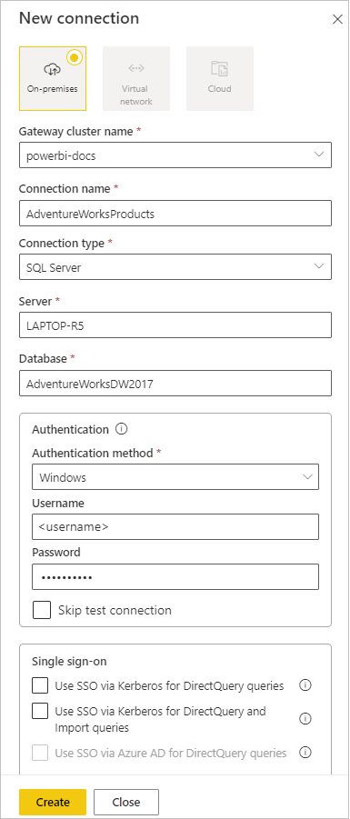
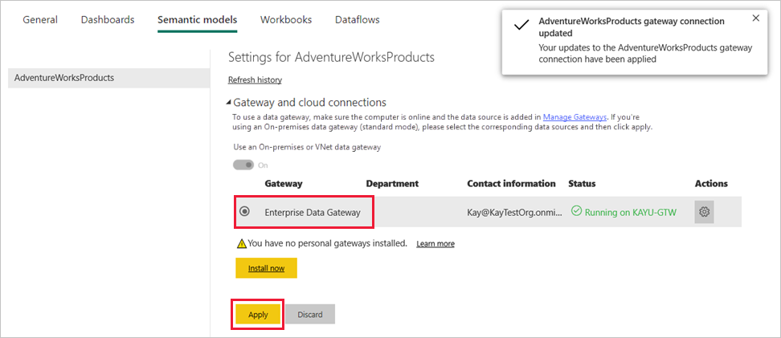
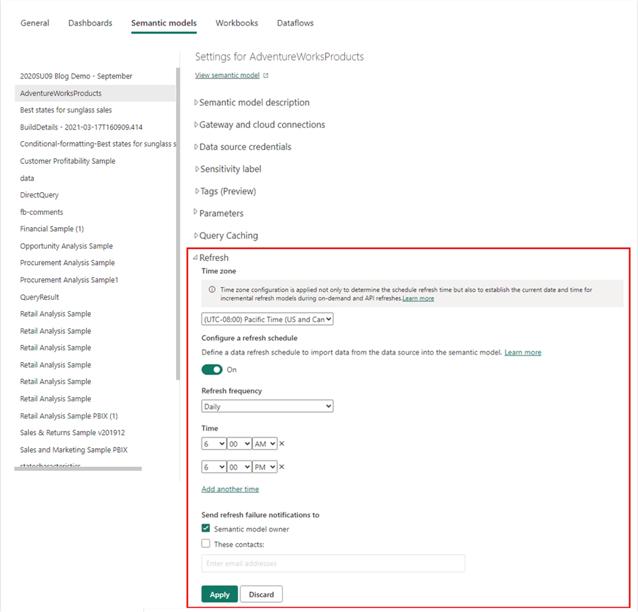

# Refresh data from an on-premises SQL Server database

In this tutorial, you explore how to refresh a Power BI semantic model from a relational database that exists on premises in your local network. Specifically, this tutorial uses a sample SQL Server database, which Power BI must access through an on-premises data gateway.

In this tutorial, you complete the following steps:

> [!div class="checklist"]
>
> * Create and publish a Power BI Desktop *.pbix* file that imports data from an on-premises SQL Server database.
> * Configure data source and semantic model settings in Power BI for SQL Server connectivity through a data gateway.
> * Configure a refresh schedule to ensure your Power BI semantic model has recent data.
> * Do an on-demand refresh of your semantic model.
> * Review the refresh history to analyze the outcomes of past refresh cycles.
> * Clean up resources by deleting the items you created in this tutorial.

## Prerequisites

* If you don't already have one, sign up for a [free Power BI trial](https://powerbi.microsoft.com/getting-started-with-power-bi) before you begin.
* [Install Power BI Desktop](https://powerbi.microsoft.com/desktop) on a local computer.
* [Install SQL Server](/sql/database-engine/install-windows/install-sql-server) on a local computer, and restore the [AdventureWorksDW2017 sample database from a backup](https://github.com/Microsoft/sql-server-samples/releases/download/adventureworks/AdventureWorksDW2017.bak). For more information about the AdventureWorks sample databases, see [AdventureWorks installation and configuration](/sql/samples/adventureworks-install-configure).
* [Install SQL Server Management Studio (SSMS)](/sql/ssms/download-sql-server-management-studio-ssms).
* [Install an on-premises data gateway](/data-integration/gateway/service-gateway-install) on the same local computer as SQL Server. In production, the gateway would usually be on a different computer.

> [!NOTE]
> If you're not a gateway administrator, or don't want to install a gateway yourself, ask a gateway administrator in your organization to create the required data source definition to connect your semantic model to your SQL Server database.

## Create and publish a Power BI Desktop file

Use the following procedure to create a basic Power BI report that uses the AdventureWorksDW2017 sample database. Publish the report to the Power BI service to get a Power BI semantic model, which you configure and refresh in later steps.

1. In Power BI Desktop, on the **Home** tab, select **Get data** > **SQL Server**.

1. In the **SQL Server database** dialog box, enter the **Server** and **Database (optional)** names, and make sure the **Data Connectivity mode** is set to **Import**.

   > [!NOTE]
   > If you plan to use a stored procedure, you must use **Import** as the **Data connectivity** mode.

   

   Optionally, under **Advanced options**, you could specify a SQL statement and set other options like using [SQL Server Failover](/sql/database-engine/availability-groups/windows/failover-clustering-and-always-on-availability-groups-sql-server).

   

1. Select **OK**.

1. On the next screen, verify your credentials, and then select **Connect**.

   > [!NOTE]
   > If authentication fails, make sure you selected the correct authentication method and used an account with database access. In test environments, you might use **Database** authentication with an explicit username and password. In production environments, you typically use **Windows** authentication. For more assistance, see [Troubleshoot refresh scenarios](refresh-troubleshooting-refresh-scenarios.md), or contact your database administrator.

1. If an **Encryption Support** dialog box appears, select **OK**.

1. In the **Navigator** dialog box, select the **DimProduct** table, and then select **Load**.

   

1. In the Power BI Desktop **Report** view, in the **Visualizations** pane, select the **Stacked column chart**.

   

1. With the new column chart selected in the report canvas, in the **Data** pane, select the **EnglishProductName** and **ListPrice** fields.

   

1. Drag **EndDate** from the **Data** pane onto **Filters on this page** in the **Filters** pane, and under **Basic filtering**, select the checkbox for **(Blank)**.

   

   The visualization should now look similar to the following chart:

   

   Notice that the **Road-250 Red** product has the same list price as the other **Road-250** products. This price changes when you later update the data and refresh the report.

1. Save the report with the name *AdventureWorksProducts.pbix*.

1. On the **Home** tab, select **Publish**.

1. On the **Publish to Power BI** screen, choose **My Workspace**, and then select **Select**. Sign in to the Power BI service if necessary.

1. When the **Success** message appears, select **Open 'AdventureWorksProducts.pbix' in Power BI**.

   

## Connect the semantic model to the SQL Server database

In Power BI Desktop, you connected directly to your on-premises SQL Server database. In the Power BI service, you need a data gateway to act as a bridge between the cloud and your on-premises network. Follow these steps to add your on-premises SQL Server database as a data source to a gateway and connect your semantic model to this data source.

1. In the Power BI service, go to your workspace and locate the **AdventureWorksProducts** semantic model in the workspace content list.

1. Select the **More options** three horizontal dots icon next to the name of the semantic model, then choose **Settings**.

1. Expand **Gateway and cloud connections** and verify that at least one gateway is listed. If you don't see a gateway, make sure you followed the instructions to [install an on-premises data gateway](/data-integration/gateway/service-gateway-install).

   

1. Select the arrow toggle under **Actions** to expand the data sources, and then select the **Add to gateway** link next to your data source.

   

1. On the **New connection** screen with **On-premises** selected, complete or verify the following fields. Most fields are already filled in.

   * **Gateway cluster name**: Verify or enter the gateway cluster name.
   * **Connection name**: Enter a name for the new connection, such as **AdventureWorksProducts**.
   * **Connection type**: Select **SQL Server** if not already selected.
   * **Server**: Verify or enter your SQL Server instance name. Must be identical to what you specified in Power BI Desktop.
   * **Database**: Verify or enter your SQL Server database name, such as **AdventureWorksDW2017**. Must be identical to what you specified in Power BI Desktop.

   Under **Authentication**:

   * **Authentication method**: Select **Windows**, **Basic**, or **OAuth2**, usually **Windows**.
   * **Username** and **Password**: Enter the credentials you use to connect to SQL Server.

   

1. Select **Create**.

1. Back on the **Settings** screen, expand the **Gateway connection** section, and verify that the data gateway you configured now shows a **Status** of running on the machine where you installed it. Select **Apply**.

   

## Configure a refresh schedule

Once you have connected your Power BI semantic model to your SQL Server on-premises database through a data gateway, follow these steps to configure a refresh schedule. Refreshing your semantic model on a scheduled basis helps ensure that your reports and dashboards have the most recent data.

1. In the left navigation pane, select **My Workspace**.

1. Select the **AdventureWorksProducts** semantic model from the workspace content list.

   > [!TIP]
   > Make sure you point to the **AdventureWorksProducts** semantic model, not the report with the same name, which doesn't have a **Schedule refresh** option.

1. On the semantic model settings page, select **Refresh**, then **Schedule refresh** from the ribbon.

1. In the **Refresh** section, under **Configure a refresh schedule**, set the slider to **On**.

1. Under **Refresh frequency**, select **Daily** for this example, and then under **Time**, select **Add another time**.

   For this example, specify **6:00 AM**, then select **Add another time** and specify **6:00 PM**.

   

   > [!NOTE]
   > You can configure up to eight daily time slots if your semantic model is on shared capacity, or 48 time slots on Power BI Premium.

1. Leave the checkbox under **Send refresh failure notifications to** set to **Semantic model owner**, and select **Apply**.

With a configured refresh schedule, Power BI refreshes your semantic model at the next scheduled time, within a margin of 15 minutes.

## Refresh on demand

To refresh the data anytime, such as to test your gateway and data source configuration, you can do an on-demand refresh by using the **Refresh now** option in the ribbon at the top of the semantic model settings page. You can also find this option in the workspace content list next to the name of the semantic model. On-demand refreshes don't affect the next scheduled refresh time.

To illustrate an on-demand refresh, first change the sample data by using SSMS to update the `DimProduct` table in the AdventureWorksDW2017 database, as follows:

```sql

UPDATE [AdventureWorksDW2017].[dbo].[DimProduct]
SET ListPrice = 5000
WHERE EnglishProductName ='Road-250 Red, 58'

```

Follow these steps to make the updated data flow through the gateway connection to the semantic model and into the Power BI reports:

1. Navigate to **My Workspace** in the left navigation pane and locate the **AdventureWorksProducts** semantic model.

2. Select the **Refresh now** icon next to the name of the semantic model. A **Preparing for refresh** message appears in the upper right corner.

   

   A **Preparing for refresh** message appears at upper right.

3. Now select the **AdventureWorksProducts** report to open it. See how the updated data flowed through into the report, and the product with the highest list price is now **Road-250 Red, 58**.

   

## Review the refresh history

It's a good idea to periodically use the refresh history to check the outcomes of past refresh cycles. Database credentials might have expired, or the selected gateway might have been offline when a scheduled refresh was due. Follow these steps to examine the refresh history and check for issues.

1. In **My Workspace**, select the **AdventureWorksProducts** semantic model.

2. On the semantic model settings page, select **Refresh**, then **Refresh history** from the ribbon at the top of the page.

3. On the **Scheduled** tab of the **Refresh history** dialog box, notice the past scheduled and on-demand refreshes with their **Start** and **End** times. A **Status** of **Completed** indicates that Power BI did the refreshes successfully. For failed refreshes, you can see the error message and examine error details.

   

   > [!NOTE]
   > The OneDrive tab is relevant only for semantic models that are connected to Power BI Desktop files, Excel workbooks, or CSV files on OneDrive or SharePoint Online. For more information, see [Data refresh in Power BI](refresh-data.md).

## Clean up resources

Follow these instructions to clean up the resources you created for this tutorial:

* If you don't want to use the sample data anymore, use SSMS to drop the database.
* If you don't want to use the SQL Server data source, [remove the data source](service-gateway-data-sources.md#remove-a-data-source) from your data gateway. Also consider uninstalling the data gateway, if you installed it only for this tutorial.
* Also delete the AdventureWorksProducts semantic model and report that Power BI created when you published the *AdventureWorksProducts.pbix* file.

## Related content

This tutorial explored how to:

* Import data from an on-premises SQL Server database into a Power BI semantic model.
* To update reports and dashboards that use the semantic model, refresh the Power BI semantic model on a scheduled and on-demand basis.

Check out the following resources to learn more about Power BI data refresh and managing data gateways and data sources:

* [Manage an on-premises data gateway](/data-integration/gateway/service-gateway-manage)
* [Manage your data source - import and scheduled refresh](service-gateway-enterprise-manage-scheduled-refresh.md)
* [Data refresh in Power BI](refresh-data.md)
