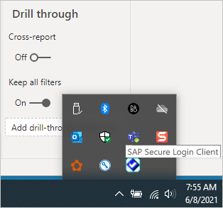
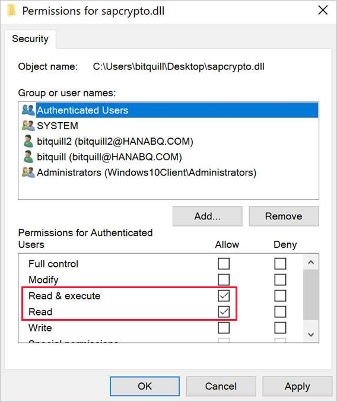
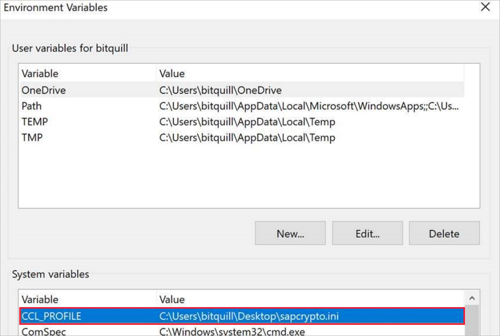
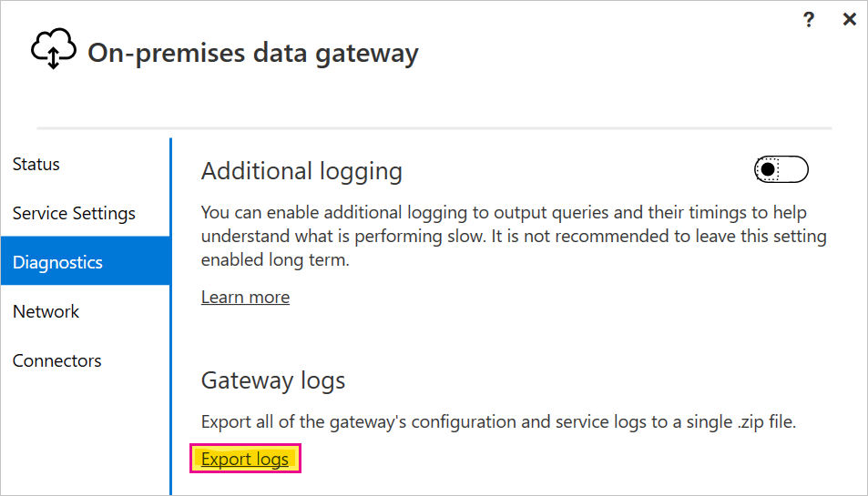
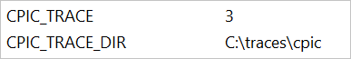

# Use Kerberos single sign-on for SSO to SAP BW using CommonCryptoLib (sapcrypto.dll)

This article describes how to configure your SAP BW data source to enable single sign-on (SSO) from the Power BI service by using CommonCryptoLib (sapcrypto.dll).

> [!NOTE]
> Before you attempt to refresh an SAP BW-based report that uses Kerberos SSO, complete both the steps in this article and the steps in [Configure Kerberos-based SSO](service-gateway-sso-kerberos.md). Using CommonCryptoLib as your Secure Network Communications (SNC) library enables SSO connections to both SAP BW Application Servers and SAP BW Message Servers.

> [!NOTE]
> Configuring both libraries(sapcrypto and gx64krb5) on the same gateway server is an unsupported scenario. It's not recommended to configure both libraries on the same gateway server as it'll lead to a mix of libraries. If you want to use both libraries, please fully separate the gateway server. For example, configure gx64krb5 for server A then sapcrypto for server B. Please remember that any failure on server A which uses gx64krb5 is not supported, as gx64krb5 is no longer supported by SAP and Microsoft.

## Configure SAP BW to enable SSO using CommonCryptoLib

> [!NOTE]
> The on-premises data gateway is 64-bit software and therefore requires the 64-bit version of CommonCryptoLib (sapcrypto.dll) to perform BW SSO. If you plan to test the SSO connection to your SAP BW server in SAP GUI prior to attempting an SSO connection through the gateway (recommended), you'll also need the 32-bit version of CommonCryptoLib, as SAP GUI is 32-bit software.

1. Ensure that your BW server is correctly configured for Kerberos SSO using CommonCryptoLib. If it is, you can use SSO to access your BW server (either directly or through an SAP BW Message Server) with an SAP tool like SAP GUI that has been configured to use CommonCryptoLib.

   For more information on setup steps, see [SAP Single Sign-On: Authenticate with Kerberos/SPNEGO](https://blogs.sap.com/2017/07/27/sap-single-sign-on-authenticate-with-kerberosspnego/). Your BW server should use CommonCryptoLib as its SNC Library and have an SNC name that starts with *CN=*, such as *CN=BW1*. For more information on SNC name requirements (specifically, the snc/identity/as parameter), see [SNC Parameters for Kerberos Configuration](https://help.sap.com/viewer/df185fd53bb645b1bd99284ee4e4a750/3.0/360534094511490d91b9589d20abb49a.html).

1. If you haven't already done so, install the x64-version of the [SAP .NET Connector](https://support.sap.com/en/product/connectors/msnet.html) on the computer the gateway has been installed on.

   You can check whether the component has been installed by attempting to connect to your BW server in  Power BI Desktop from the gateway computer. If you can't connect by using the 2.0 implementation, the .NET Connector isn't installed or hasn't been installed to the global assembly cache.

1. Ensure that SAP Secure Login Client (SLC) isn't running on the computer the gateway is installed on.

   SLC caches Kerberos tickets in a way that can interfere with the gateway's ability to use Kerberos for SSO.

1. If SLC is installed, uninstall it or make sure you exit SAP Secure Login Client. Right-click the icon in the system tray and select **Log Out** and **Exit** before you attempt an SSO connection by using the gateway.

   SLC isn't supported for use on Windows Server machines. For more information, see [SAP Note 2780475](https://launchpad.support.sap.com/#/notes/2780475) (s-user required).

   

1. If you uninstall SLC or select **Log Out** and **Exit**, open a cmd window and enter `klist purge` to clear any cached Kerberos tickets before you attempt an SSO connection through the gateway.

1. Download 64-bit CommonCryptoLib (sapcrypto.dll) version *8.5.25 or greater* from the SAP Launchpad, and copy it to a folder on your gateway machine. In the same directory where you copied sapcrypto.dll, create a file named sapcrypto.ini, with the following content:

    ```
    ccl/snc/enable_kerberos_in_client_role = 1
    ```

    The .ini file contains configuration information required by CommonCryptoLib to enable SSO in the gateway scenario.

    > [!NOTE]
    > These files must be stored in the same location; in other words, _/path/to/sapcrypto/_ should contain both sapcrypto.ini and sapcrypto.dll.

    Both the gateway service user and the Active Directory (AD) user that the service user impersonates need read and execute permissions for both files. We recommend granting permissions on both the .ini and .dll files to the Authenticated Users group. For testing purposes, you can also explicitly grant these permissions to both the gateway service user and the AD user you use for testing. In the following screenshot we've granted the Authenticated Users group **Read &amp; execute** permissions for sapcrypto.dll:

    

1. If you don't already have an SAP BW data source associated with the gateway you want the SSO connection to flow through, add one on the **Manage Connections and Gateways** page in the Power BI service. If you already have such a data source, edit it:
    - Choose **SAP Business Warehouse** as the **Data Source Type** if you want to create an SSO connection to a BW Application Server.
    - Select **Sap Business Warehouse Message Server** if you want to create an SSO connection to a BW Message Server.

1. For **SNC Library**, select either the **SNC\_LIB** or **SNC\_LIB\_64** environment variable, or **Custom**.

   - If you select **SNC\_LIB**, you must set the value of the **SNC\_LIB\_64** environment variable on the gateway machine to the absolute path of the 64-bit copy of sapcrypto.dll on the gateway machine. For example, *C:\Users\Test\Desktop\sapcrypto.dll*.

   - If you choose **Custom**, paste the absolute path to *sapcrypto.dll* into the Custom SNC Library Path field that appears on the **Manage gateways** page.

1. For **SNC Partner Name**, enter the SNC Name of the BW server. Under **Advanced settings**, ensure that **Use SSO via Kerberos for DirectQuery queries** is checked. Fill in the other fields as if you were establishing a Windows Authentication connection from PBI Desktop.

1. Create a **CCL\_PROFILE** system environment variable and set its value to the path to sapcrypto.ini.

    

    The sapcrypto .dll and .ini files must exist in the same location. In the above example, sapcrypto.ini and sapcrypto.dll are both located on the desktop.

1. Restart the gateway service.

    

1. [Run a Power BI report](service-gateway-sso-kerberos.md#section-3-validate-configuration)

## Troubleshooting

If you're unable to refresh the report in the Power BI service, you can use gateway tracing, CPIC tracing, and CommonCryptoLib tracing to diagnose the issue. Because CPIC tracing and CommonCryptoLib are SAP products, Microsoft can't provide support for them.

### Gateway logs

1. Reproduce the issue.

2. Open the [gateway app](/data-integration/gateway/service-gateway-app), and select **Export logs** from the **Diagnostics** tab.

      

### CPIC tracing

1. To enable CPIC tracing, set two environment variables: **CPIC\_TRACE** and **CPIC\_TRACE\_DIR**.

   The first variable sets the trace level and the second variable sets the trace file directory. The directory must be a location that  members of the Authenticated Users group can write to. 
 
2. Set **CPIC\_TRACE** to *3* and **CPIC\_TRACE\_DIR** to whichever directory you want the trace files written to. For example:

   

3. Reproduce the issue and ensure that **CPIC\_TRACE\_DIR** contains trace files.

    CPIC tracing can diagnose higher level issues such as a failure to load the sapcrypto.dll library. For example, here's a snippet from a CPIC trace file where a .dll load error occurred:

    ```output
    [Thr 7228] *** ERROR => DlLoadLib()==DLENOACCESS - LoadLibrary("C:\Users\test\Desktop\sapcrypto.dll")
    Error 5 = "Access is denied." [dlnt.c       255]
    ```

    If you encounter such a failure but you've set the Read & Execute permissions on sapcrypto.dll and sapcrypto.ini as described [in the section above](#configure-sap-bw-to-enable-sso-using-commoncryptolib), try setting the same Read & Execute permissions on the folder that contains the files.

    If you're still unable to load the .dll, try turning on [auditing for the file](/windows/security/threat-protection/auditing/apply-a-basic-audit-policy-on-a-file-or-folder). Examining the resulting audit logs in the Windows Event Viewer might help you determine why the file is failing to load. Look for a failure entry initiated by the impersonated AD user. For example, for the impersonated user `MYDOMAIN\mytestuser` a failure in the audit log would look something like this:

    ```output
    A handle to an object was requested.

    Subject:
        Security ID:        MYDOMAIN\mytestuser
        Account Name:       mytestuser
        Account Domain:     MYDOMAIN
        Logon ID:           0xCF23A8

    Object:
        Object Server:      Security
        Object Type:        File
        Object Name:        <path information>\sapcrypto.dll
        Handle ID:          0x0
        Resource Attributes:    -

    Process Information:
        Process ID:     0x2b4c
        Process Name:   C:\Program Files\On-premises data gateway\Microsoft.Mashup.Container.NetFX45.exe

    Access Request Information:
        Transaction ID:     {00000000-0000-0000-0000-000000000000}
        Accesses:           ReadAttributes

    Access Reasons:     ReadAttributes: Not granted

    Access Mask:        0x80
    Privileges Used for Access Check:   -
    Restricted SID Count:   0
    ```

### CommonCryptoLib tracing

1. Turn on CommonCryptoLib tracing by adding these lines to the sapcrypto.ini file you created earlier:

    ```
    ccl/trace/level=5
    ccl/trace/directory=<drive>:\logs\sectrace
    ```

2. Change the `ccl/trace/directory` option to a location to which members of the Authenticated Users group can write.

3. Alternatively, create a new .ini file to change this behavior. In the same directory as sapcrypto.ini and sapcrypto.dll, create a file named sectrace.ini with the following content. Replace the `DIRECTORY` option with a location on your machine that members of the Authenticated Users group can write to:

    ```
    LEVEL = 5
    DIRECTORY = <drive>:\logs\sectrace
    ```

4. Reproduce the issue and verify that the location pointed to by **DIRECTORY** contains trace files.

5. When you're finished, turn off CPIC and CCL tracing.

    For more information on CommonCryptoLib tracing, see [SAP Note 2491573](https://launchpad.support.sap.com/#/notes/2491573) (SAP s-user required).

### Impersonation

This section describes troubleshooting symptoms and resolution steps for impersonation issues.

**Symptom**: When looking at the *GatewayInfo[date].log* you find an entry similar to the following: **About to impersonate user DOMAIN\User (IsAuthenticated: True, ImpersonationLevel: Impersonation)**. If the value for **ImpersonationLevel** is different from **Impersonation**, impersonation isn't happening properly.

**Resolution**: Follow the steps found in [grant the gateway service account local policy rights on the gateway machine](./service-gateway-sso-kerberos.md) article. Restart the gateway service after changing the configuration.

**Validation**: Refresh or create the report and collect the *GatewayInfo[date].log*. Open the latest GatewayInfo log file and check again the string **About to impersonate user DOMAIN\User (IsAuthenticated: True, ImpersonationLevel: Impersonation)** to ensure that the value for **ImpersonationLevel** matches **Impersonation**.

### Delegation

Delegation issues usually appear in the Power BI service as generic errors. To determine whether delegation is the issue, it's useful to collect the Wireshark traces and use *Kerberos* as a filter. For Kerberos errors reference, consult [this blog post](/archive/blogs/askds/kerberos-errors-in-network-captures). The rest of this section describes troubleshooting symptoms and resolution steps for delegation issues.

**Symptom**: In the Power BI service, you might encounter an unexpected error similar to the one in the following screenshot. In *GatewayInfo[date].log* you'll see *[DM.GatewayCore]* ingesting an exception during the ADO query execution attempt for *clientPipelineId* and the import *[0D_NW_CHANN]* matches no exports.

:::image type="content" source="media/service-gateway-sso-kerberos-sap-bw-commoncryptolib/sso-kerberos-sap-bw-troubleshooting-01.png" alt-text="Screenshot of unhelpful error":::

In the *Mashup[date].log* you see the generic error **GSS-API(maj): No credentials were supplied**.

Looking into the CPIC traces (*sec-Microsoft.Mashup*.trc*) you'll see something similar to the following:

```
[Thr 4896] *** ERROR => SncPEstablishContext() failed for target='p:CN=BW5' [sncxxall.c 3638]
[Thr 4896] *** ERROR => SncPEstablishContext()==SNCERR_GSSAPI [sncxxall.c 3604]
[Thr 4896] GSS-API(maj): No credentials were supplied
[Thr 4896] Unable to establish the security context
[Thr 4896] target="p:CN=BW5"
[Thr 4896] <<- SncProcessOutput()==SNCERR_GSSAPI
[Thr 4896]
[Thr 4896] LOCATION CPIC (TCP/IP) on local host HNCL2 with Unicode
[Thr 4896] ERROR GSS-API(maj): No credentials were supplied
[Thr 4896] Unable to establish the security context
[Thr 4896] target="p:CN=BW5"
[Thr 4896] TIME Thu Oct 15 20:49:31 2020
[Thr 4896] RELEASE 721
[Thr 4896] COMPONENT SNC (Secure Network Communication)
[Thr 4896] VERSION 6
[Thr 4896] RC -4
[Thr 4896] MODULE sncxxall.c
[Thr 4896] LINE 3604
[Thr 4896] DETAIL SncPEstablishContext
[Thr 4896] SYSTEM CALL gss_init_sec_context
[Thr 4896] COUNTER 3
[Thr 4896]
[Thr 4896] *** ERROR => STISEND:STISncOut failed 20 [r3cpic.c 9834]
[Thr 4896] STISearchConv: found conv without search
```

The error becomes clearer in the sectraces from the gateway machine *sec-Microsoft.Mashup.Con-[].trc*:

```
[2020.10.15 20:31:38.396000][4][Microsoft.Mashup.Con][Kerberos ][ 3616] AcquireCredentialsHandleA called successfully.
[2020.10.15 20:31:38.396000][2][Microsoft.Mashup.Con][Kerberos ][ 3616] InitializeSecurityContextA returned -2146893053 (0x80090303). Preparation for kerberos failed!
[2020.10.15 20:31:38.396000][2][Microsoft.Mashup.Con][Kerberos ][ 3616] Getting kerberos ticket for 'SAP/BW5' failed (user name is affonso_v@HANABQ.COM)
[2020.10.15 20:31:38.396000][2][Microsoft.Mashup.Con][Kerberos ][ 3616] Error for requested algorithm 18: 0/C000018B The security database on the server does not have a computer account for this workstation trust relationship.
[2020.10.15 20:31:38.396000][2][Microsoft.Mashup.Con][Kerberos ][ 3616] Error for requested algorithm 17: 0/C000018B The security database on the server does not have a computer account for this workstation trust relationship.
[2020.10.15 20:31:38.396000][2][Microsoft.Mashup.Con][Kerberos ][ 3616] Error for requested algorithm 23: 0/C000018B The security database on the server does not have a computer account for this workstation trust relationship.
[2020.10.15 20:31:38.396000][2][Microsoft.Mashup.Con][Kerberos ][ 3616] Error for requested algorithm 3: 0/C000018B The security database on the server does not have a computer account for this workstation trust relationship.
```

You can also see the issue if you look at WireShark traces.

:::image type="content" source="media/service-gateway-sso-kerberos-sap-bw-commoncryptolib/sso-kerberos-sap-bw-troubleshooting-02.png" alt-text="Screenshot of tracing program showing an error":::

> [!NOTE]
> The other errors **KRB5KDC_ERR_PREAUTH_REQUIRED** can be safely ignored.

**Resolution**: You must add an SPN SAP/BW5 to a service account. Detailed information and steps are available in the [SAP documentation](https://wiki.scn.sap.com/wiki/display/Security/Single+Sign-On+with+Kerberos%3A+Recommendations+and+Troubleshooting).

You might run into a similar, but not identical error that manifests in WireShark traces as the following error **KRB5KDC_ERR_BADOPTION**:

:::image type="content" source="media/service-gateway-sso-kerberos-sap-bw-commoncryptolib/sso-kerberos-sap-bw-troubleshooting-03.png" alt-text="Screenshot of WireShark program showing a different error":::

This error indicates the **SPN SAP/BW5** could be found, but it's not under *Services to which this account can present delegated credentials* in the Delegation tab for the gateway service account. To fix this issue, follow the steps to [configure the gateway service account for standard kerberos constrained delegation](./service-gateway-sso-kerberos.md).

**Validation**: Proper configuration will prevent generic or unexpected errors from being presented by the gateway. If you still see errors, check the configuration of the gateway itself, or the configuration of the BW server.

### Credentials errors

This section describes troubleshooting symptoms and resolution steps for credentials error issues. You might also see generic errors from the Power BI service, as described in the earlier section on [delegation](#delegation).

There are different resolutions, based on the symptoms you see in the data source (SAP BW), so we'll review both.

**Symptom 1**: In the *sectraces sec-disp+work[].trc* file from the BW Server, you see traces similar to the following:

```
[2020.05.26 14:21:28.668325][4][disp+work ][SAPCRYPTOLIB][435584] { gss_display_name [2020.05.26 14:21:28.668338][4][disp+work ][GSS ][435584] gss_display_name output buffer (41 bytes) [2020.05.26 14:21:28.668338][4][disp+work ][GSS ][435584] CN=DAVID@XS.CONTOSO.COM@CONTOSO.COM
```

**Resolution**: Complete the configuration steps to [set user mapping configuration parameters on the gateway machine if necessary](./service-gateway-sso-kerberos.md). You'll need to complete those steps even if you already have Microsoft Entra Connect configured.

**Validation**: You'll be able to successfully load the report in the Power BI service. If you're unable to load the report, see the steps in Symptom 2.

**Symptom 2**: In the *sectraces sec-disp+work[].trc* file from the BW Server, you see traces similar to the following:

```
[2020.10.19 23:10:15.469000][4][disp+work.EXE ][SAPCRYPTOLIB][ 4460] { gss_display_name
[2020.10.19 23:10:15.469000][4][disp+work.EXE ][GSS ][ 4460] gss_display_name output buffer (23 bytes)
[2020.10.19 23:10:15.469000][4][disp+work.EXE ][GSS ][ 4460] CN=DAVID@CONTOSO.COM
```

**Resolution**: Check whether the Kerberos external ID for the User match what the sectraces are showing.

1. Open SAP Logon.
2. Use the SU01 transaction.
3. Edit the user.
4. Navigate to the **SNC** tab and verify that the SNC name matches what is shown in your logs.

**Validation**: When properly completed, you'll be able to create and refresh reports in the Power BI service.

## Related content

For more information about the on-premises data gateway and DirectQuery, see the following resources:

- [What is an on-premises data gateway?](/data-integration/gateway/service-gateway-onprem)
- [DirectQuery in Power BI](desktop-directquery-about.md)
- [Data sources supported by DirectQuery](power-bi-data-sources.md)
- [DirectQuery and SAP BW](desktop-directquery-sap-bw.md)
- [DirectQuery and SAP HANA](desktop-directquery-sap-hana.md)
