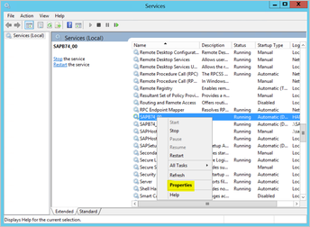
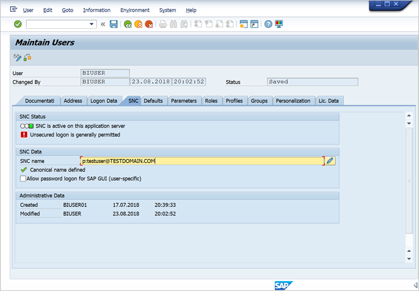
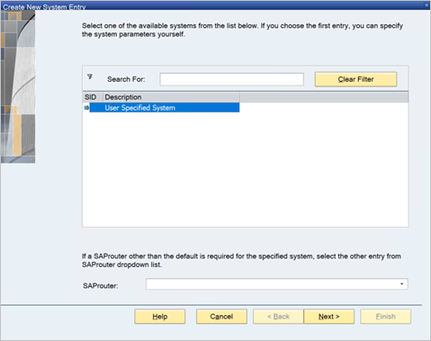

# Use Kerberos for single sign-on (SSO) to SAP BW using gx64krb5

This article describes how to configure your SAP Business Warehouse (BW) data source to enable single sign-on (SSO) from the Power BI service by using gx64krb5.

> [!IMPORTANT]
> Microsoft will allow you to create connections using Secure Network Communications (SNC) libraries (like gx64krb5) but will not provide support for these configurations. Additionally SAP no longer supports the gx64krb5 for on-premises data gateways in Power BI and the steps required to configure it for the gateway are significantly more complex compared to CommonCryptoLib. As a result, Microsoft recommends using CommonCryptoLib instead.  For more information, see [SAP Note 352295](https://launchpad.support.sap.com/#/notes/352295). Note that gx64krb5 doesn't allow for SSO connections from the data gateway to SAP BW Message Servers; only connections to SAP BW Application Servers are possible. This restriction doesn't exist if you use [CommonCryptoLib](service-gateway-sso-kerberos-sap-bw-commoncryptolib.md) as your SNC library. 
> For information about how to configure SSO by using CommonCryptoLib, see [Configure SAP BW for SSO using CommonCryptoLib](service-gateway-sso-kerberos-sap-bw-commoncryptolib.md). Use CommonCryptoLib *or* gx64krb5 as your SNC library, but not both. Do not complete the configuration steps for both libraries.

> [!NOTE]
> Configuring both libraries(sapcrypto and gx64krb5) on the same gateway server is an unsupported scenario. It’s not recommended to configure both libraries on the same gateway server as it’ll lead to a mix of libraries. If you want to use both libraries, please fully separate the gateway server. For example, configure gx64krb5 for server A then sapcrypto for server B. Please remember that any failure on server A which uses gx64krb5 is not supported, as gx64krb5 is no longer supported by SAP and Microsoft.

This guide is comprehensive; if you've already completed some of the described steps, you can skip them. For example, you might have already configured your SAP BW server for SSO using gx64krb5.

## Set up gx64krb5 on the gateway machine and the SAP BW server

The gx64krb5 library must be used by both the client and server to complete an SSO connection through the gateway. That is, both the client and server must be using the same SNC library.

1. Download gx64krb5.dll from [SAP Note 2115486](https://launchpad.support.sap.com/) (SAP s-user required). Ensure you have at least version 1.0.11.x. Also, download gsskrb5.dll (the 32-bit version of the library) if you want to test the SSO connection in SAP GUI before you attempt the SSO connection through the gateway (recommended). The 32-bit version is required to test with SAP GUI because SAP GUI is 32-bit only.

1. Put gx64krb5.dll in a location on your gateway machine that's accessible by your gateway service user. If you want to test the SSO connection with SAP GUI, also put a copy of gsskrb5.dll on your machine and set the **SNC_LIB** environment variable to point to it. Both the gateway service user and the Active Directory (AD) users that the service user will impersonate need read and execute permissions for the copy of gx64krb5.dll. We recommend granting permissions on the .dll to the Authenticated Users group. For testing purposes, you can also explicitly grant these permissions to both the gateway service user and the AD user you use to test.

1. If your BW server hasn't already been configured for SSO using gx64krb5.dll, put another copy of the .dll on your SAP BW server machine in a location accessible by the SAP BW server.

    For more information on configuring gx64krb5.dll for use with an SAP BW server, see [SAP documentation](https://launchpad.support.sap.com/#/notes/2115486) (SAP s-user required).

1. On the client and server machines, set the **SNC_LIB** and **SNC_LIB_64** environment variables:
    - If you use gsskrb5.dll, set the **SNC_LIB** variable to its absolute path.
    - If you use gx64krb5.dll, set the **SNC_LIB_64** variable to its absolute path.

## Configure an SAP BW service user and enable SNC communication on the BW server

Complete this section if you haven't already configured your SAP BW server for SNC communication (for example, SSO) by using gx64krb5.

> [!NOTE]
> This section assumes that you've already created a service user for BW and bound a suitable SPN to it (that is, a name that begins with *SAP/*).

1. Give the service user access to your SAP BW Application Server:

    1. On the SAP BW server machine, add the service user to the Local Admin group. Open the **Computer Management** program and identify the Local Admin group for your server.

        

    1. Double-click the Local Admin group, then select **Add** to add your service user to the group.

    1. Select **Check Names** to ensure you've entered the name correctly, and then select **OK**.

1. Set the SAP BW server's service user as the user that starts the SAP BW server service on the SAP BW server machine:

    1. Open **Run**, and then enter **Services.msc**.

    1. Find the service corresponding to your SAP BW Application Server instance, right-click it, and then select **Properties**.

        

    1. Switch to the **Log on** tab and change the user to your SAP BW service user.

    1. Enter the user's password, then select **OK**.

1. In SAP Logon, sign in to your server and set the following profile parameters by using the RZ10 transaction:

    1. Set the **snc/identity/as** profile parameter to *p:&lt;SAP BW service user you created&gt;*. For example, *p:BWServiceUser\@MYDOMAIN.COM*. Note that *p:* precedes the service user's user principal name (UPN), as opposed to *p:CN=*, which precedes the UPN when you use CommonCryptoLib as the SNC library.

    1. Set the **snc/gssapi\_lib** profile parameter to *&lt;path to gx64krb5.dll on the BW server&gt;*. Place the library in a location that the SAP BW Application Server can access.

    1. Set the following additional profile parameters, changing the values as required to fit your needs. The last five options enable clients to connect to the SAP BW server by using SAP Logon without having SNC configured.

        | **Setting** | **Value** |
        | --- | --- |
        | snc/data\_protection/max | 3 |
        | snc/data\_protection/min | 1 |
        | snc/data\_protection/use | 9 |
        | snc/accept\_insecure\_cpic | 1 |
        | snc/accept\_insecure\_gui | 1 |
        | snc/accept\_insecure\_r3int\_rfc | 1 |
        | snc/accept\_insecure\_rfc | 1 |
        | snc/permit\_insecure\_start | 1 |

    1. Set the **snc/enable** property to 1.

1. After you set these profile parameters, open the SAP Management Console on the server machine and restart the SAP BW instance.

   If the server won't start, confirm that you've set the profile parameters correctly. For more information on profile parameter settings, see the [SAP documentation](https://help.sap.com/saphelp_nw70ehp1/helpdata/en/e6/56f466e99a11d1a5b00000e835363f/frameset.htm). You can also consult the [Troubleshooting](#troubleshooting) section in this article.

## Map an SAP BW user to an Active Directory user

If you haven't done so already, map an AD user to an SAP BW Application Server user and test the SSO connection in SAP Logon.

1. Sign in to your SAP BW server with SAP Logon. Run transaction SU01.

1. For **User**, enter the SAP BW user for which you want to enable SSO connection. Select the **Edit** icon (pen icon) near the top left of the SAP Logon window.

    

1. Select the **SNC** tab. In the SNC name input box, enter *p:&lt;your Active Directory user&gt;@&lt;your domain&gt;*. For the SNC name, *p:* must precede the AD user's UPN. Note that the UPN is case-sensitive.

   The AD user you specify should belong to the person or organization for whom you want to enable SSO access to the SAP BW Application Server. For example, if you want to enable SSO access for the user testuser\@TESTDOMAIN.COM, enter *p:testuser\@TESTDOMAIN.COM*.

    

1. Select the **Save** icon (floppy disk image) near the top left of the screen.

## Test sign in via SSO

Verify that you can sign in to the server by using SAP Logon through SSO as the AD user for whom you've enabled SSO access:

1. As the AD user for which you've just enabled SSO access, sign in to a machine in your domain on which SAP Logon is installed. Launch SAP Logon, and create a new connection.

1. Copy the gsskrb5.dll file you downloaded earlier to a location on the machine you signed in to. Set the **SNC_LIB** environment variable to the absolute path of this location.

1. Launch SAP Logon and create a new connection.

1. In the **Create New System Entry** screen, select **User Specified System**, then select **Next**.

    

1. Fill in the appropriate details on the next screen, including the application server, instance number, and system ID. Then, select **Finish**.

1. Right-click the new connection, select **Properties**, and then select the **Network** tab.

1. In the **SNC Name** box, enter *p:&lt;SAP BW service user's UPN&gt;*. For example, *p:BWServiceUser\@MYDOMAIN.COM*. Select **OK**.

    

1. Double-click the connection you just created to attempt an SSO connection to your SAP BW server.

   If this connection succeeds, continue to the next section. Otherwise, review the earlier steps in this document to make sure they've been completed correctly, or review the [Troubleshooting](#troubleshooting) section. If you can't connect to the SAP BW server via SSO in this context, you won't be able to connect to the SAP BW server by using SSO in the gateway context.

## Add registry entries to the gateway machine

Add required registry entries to the registry of the machine that the gateway is installed on, and to machines intended to connect from Power BI Desktop. To add these registry entries, run the following commands:

- ```REG ADD HKLM\SOFTWARE\Wow6432Node\SAP\gsskrb5 /v ForceIniCredOK /t REG_DWORD /d 1 /f```

- ```REG ADD HKLM\SOFTWARE\SAP\gsskrb5 /v ForceIniCredOK /t REG_DWORD /d 1 /f```

## Add a new SAP BW Application Server data source to the Power BI service, or edit an existing one

1. In the data source configuration window, enter the SAP BW Application Server's **Hostname**, **System Number**, and **client ID**, as you would to sign in to your SAP BW server from Power BI Desktop.

1. In the **SNC Partner Name** field, enter *p:&lt;SPN you mapped to your SAP BW service user&gt;*. For example, if the SPN is SAP/BWServiceUser\@MYDOMAIN.COM, enter *p:SAP/BWServiceUser\@MYDOMAIN.COM* in the **SNC Partner Name** field.

1. For the SNC Library, select the **Custom** option and provide the absolute path for GX64KRB5.DLL or GSSKRB5.DLL on the gateway machine.

1. Select **Use SSO via Kerberos for DirectQuery queries**, and then select **Apply**. If the test connection is not successful, verify that the previous setup and configuration steps were completed correctly.

1. [Run a Power BI report](service-gateway-sso-kerberos.md#section-3-validate-configuration).

## Troubleshooting

### Troubleshoot gx64krb5 configuration

If you encounter any of the following problems, follow these steps to troubleshoot the gx64krb5 installation and SSO connections:

- You encounter errors when you complete the gx64krb5 setup steps. For example, the SAP BW server won't start after you've changed the profile parameters. View the server logs (…work\dev\_w0 on the server machine) to troubleshoot these errors.

- You can't start the SAP BW service due to a sign-on failure. You might have provided the wrong password when you set the SAP BW *start-as* user. Verify the password by signing in as the SAP BW service user on a machine in your AD environment.

- You get errors about underlying data source credentials (for example, SQL Server), which prevent the server from starting. Verify that you've granted the service user access to the SAP BW database.

- You get the following message: *(GSS-API) specified target is unknown or unreachable*. This error usually means you have the wrong SNC name specified. Make sure to use *p:* only, not *p:CN=*, to precede the service user's UPN in the client application.

- You get the following message: *(GSS-API) An invalid name was supplied*. Make sure *p:* is the value of the server's SNC identity profile parameter.

- You get the following message: *(SNC error) the specified module could not be found*. This error is often caused by placing gx64krb5.dll in a location that requires elevated privileges (../administrator rights) to access.

### Troubleshoot gateway connectivity issues

1. Check the gateway logs. Open the gateway configuration application and select **Diagnostics**, then **Export logs**. The most recent errors are at the end of any log files you examine.

    

1. Turn on SAP BW tracing and review the generated log files. There are several different types of SAP BW tracing available (for example, CPIC tracing):

   a. To enable CPIC tracing, set two environment variables: **CPIC\_TRACE** and **CPIC\_TRACE\_DIR**.

      The first variable sets the trace level and the second variable sets the trace file directory. The directory must be a location that  members of the Authenticated Users group can write to. 

    b. Set **CPIC\_TRACE** to *3* and **CPIC\_TRACE\_DIR** to whichever directory you want the trace files written to. For example:

      

    c. Reproduce the issue and ensure that **CPIC\_TRACE\_DIR** contains trace files.

    d. Examine the contents of the trace files to determine the blocking issue. For example, you might find that gx64krb5.dll wasn't loaded properly, or that an AD user different than the one you were expecting initiated the SSO connection attempt.

## Related content

For more information about the on-premises data gateway and DirectQuery, see the following resources:

- [What is an on-premises data gateway?](/data-integration/gateway/service-gateway-onprem)
- [DirectQuery in Power BI](desktop-directquery-about.md)
- [Data sources supported by DirectQuery](power-bi-data-sources.md)
- [DirectQuery and SAP BW](desktop-directquery-sap-bw.md)
- [DirectQuery and SAP HANA](desktop-directquery-sap-hana.md)
