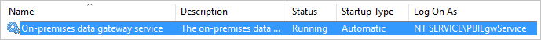
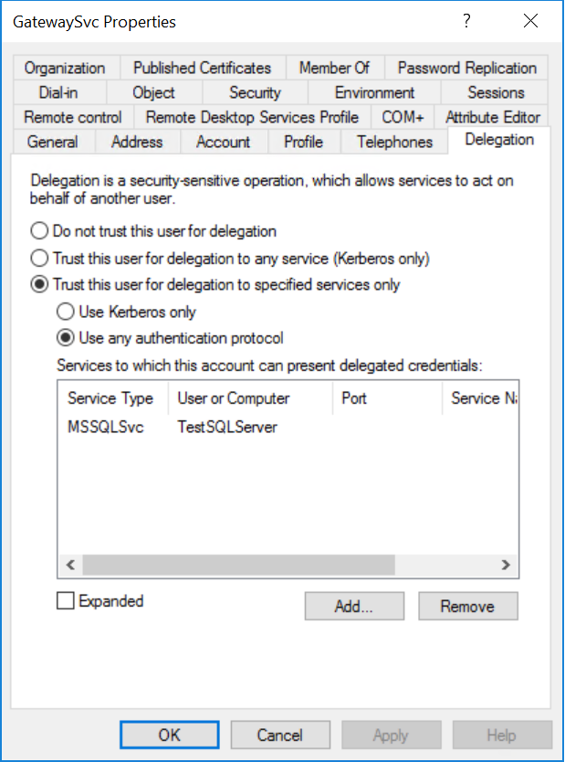
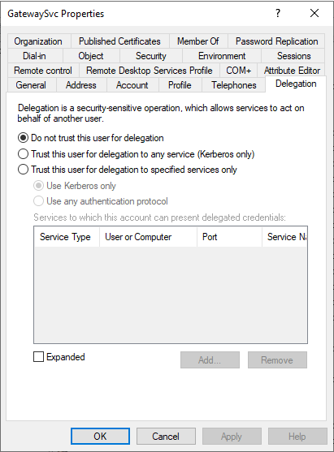
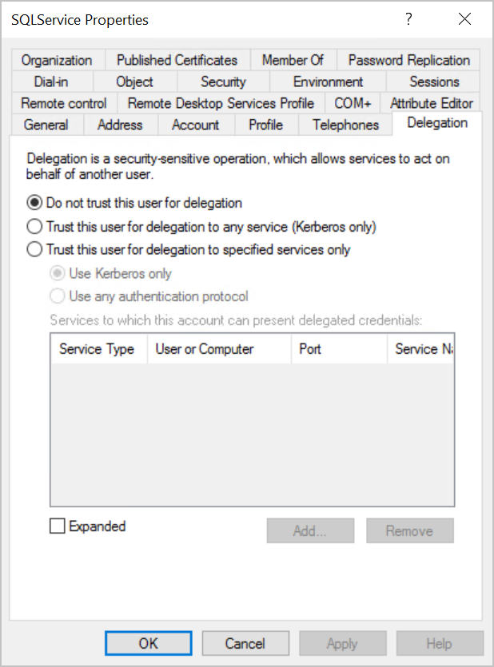
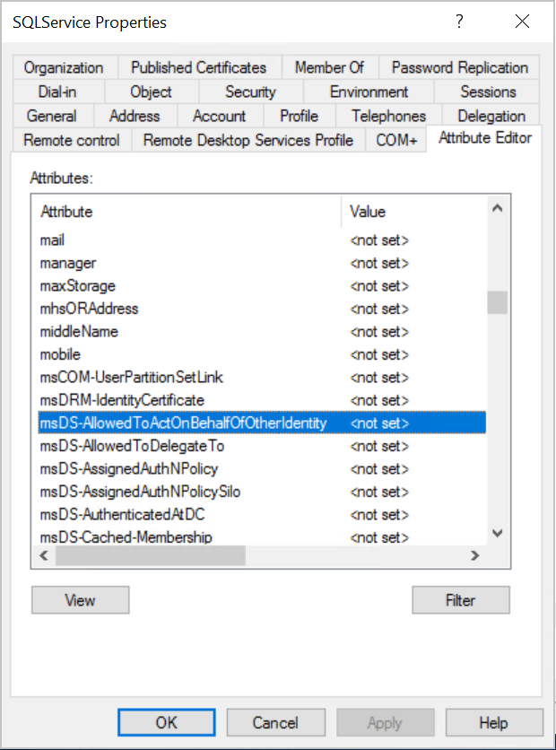
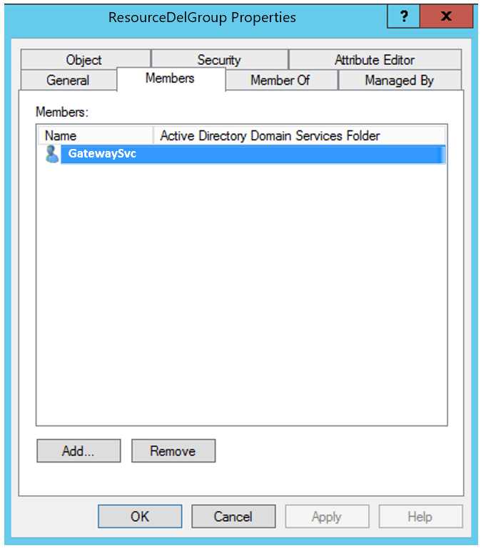
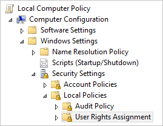
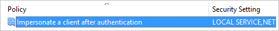
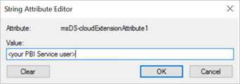
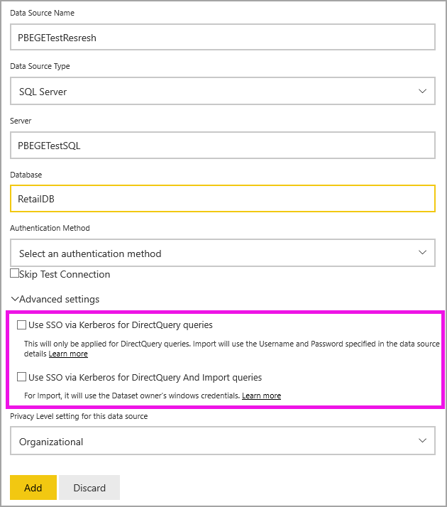

# Configure Kerberos-based SSO from Power BI service to on-premises data sources

Enabling SSO makes it easy for Power BI reports and dashboards to refresh data from on-premises sources while respecting user-level permissions configured on those sources. Use [Kerberos constrained delegation](/windows-server/security/kerberos/kerberos-constrained-delegation-overview) to enable seamless SSO connectivity. 

## Prerequisites

Several items must be configured for Kerberos constrained delegation to work properly, including _Service Principal Names (SPN)_ and delegation settings on service accounts.

> [!NOTE]
> Using DNS aliasing with SSO is not supported.


### Install and configure the Microsoft on-premises data gateway

The on-premises data gateway supports an in-place upgrade, and _settings takeover_ of existing gateways.

### Run the gateway Windows service as a domain account

In a standard installation, the gateway runs as the machine-local service account, **NT Service\PBIEgwService**.



To enable Kerberos constrained delegation, the gateway must run as a domain account, unless your Azure Active Directory (Azure AD) instance is already synchronized with your local Active Directory instance (by using Azure AD DirSync/Connect). To switch to a domain account, see [change the gateway service account](/data-integration/gateway/service-gateway-service-account).

> [!NOTE]
> If Azure AD Connect is configured and user accounts are synchronized, the gateway service doesn't need to perform local Azure AD lookups at runtime. Instead, you can simply use the local service SID for the gateway service to complete all required configuration in Azure AD. The Kerberos constrained delegation configuration steps outlined in this article are the same as the configuration steps required in the Azure AD context. They are applied to the gateway's computer object (as identified by the local service SID) in Azure AD instead of the domain account.The local service SID for NT SERVICE/PBIEgwService is as follows: 

> S-1-5-80-1835761534-3291552707-3889884660-1303793167-3990676079

> To create the SPN for this SID against the Power BI Gateway computer, you would need to run the following command from an administrative command prompt (replace <COMPUTERNAME> with the name of the Power BI Gateway computer): 
> SetSPN -s HTTP/S-1-5-80-1835761534-3291552707-3889884660-1303793167-3990676079 <COMPUTERNAME>

## Obtain domain admin rights to configure SPNs (SetSPN) and Kerberos constrained delegation settings

To configure SPNs and Kerberos delegation settings, a domain administrator should avoid granting rights to someone that doesn't have domain admin rights. In the following section, we cover the recommended configuration steps in more detail.

## Configure Kerberos constrained delegation for the gateway and data source

If necessary, configure an SPN for the gateway service domain account as a domain administrator and configure delegation settings on the gateway service domain account.

### Configure an SPN for the gateway service account

First, determine whether an SPN was already created for the domain account used as the gateway service account:

1. As a domain administrator, launch the **Active Directory Users and Computers** Microsoft Management Console (MMC) snap-in.

2. In the left pane, right-click the domain name, select **Find**, and then enter the account name of the gateway service account.

3. In the search result, right-click the gateway service account and select **Properties**.

4. If the **Delegation** tab is visible on the **Properties** dialog, then an SPN was already created and you can skip to [Decide on the type of Kerberos constrained delegation to use](#decide-on-the-type-of-kerberos-constrained-delegation-to-use).

5. If there isn't a **Delegation** tab on the **Properties** dialog box, you can manually create an SPN on the account to enable it. Use the [setspn tool](/previous-versions/windows/it-pro/windows-server-2012-R2-and-2012/cc731241(v=ws.11)) that comes with Windows (you need domain admin rights to create the SPN).

   For example, suppose the gateway service account is **Contoso\GatewaySvc** and the gateway service is running on the machine named **MyGatewayMachine**. To set the SPN for the gateway service account, run the following command:

   ```setspn -S gateway/MyGatewayMachine Contoso\GatewaySvc```

   You can also set the SPN by using the **Active Directory Users and Computers** MMC snap-in.
   
### Add gateway service account to Windows Authorization and Access Group if required

In certain scenarios the gateway service account must be added to the Windows Authorization and Access Group. These scenarios include security hardening of the Active Directory environment, and when the gateway service account and the user accounts that the gateway will impersonate are in separate domains or forests. You can also add the gateway service account to Windows Authorization and Access Group in situations where the domain / forest has not been hardened, but it isn't required.

For more information, see [Windows Authorization and Access Group](/windows/security/identity-protection/access-control/active-directory-security-groups#bkmk-winauthaccess).

To complete this configuration step, for each domain that contains Active Directory users you want the gateway service account to be able to impersonate:
1. Sign in to a computer in the domain, and launch the Active Directory Users and Computers MMC snap-in.
2. Locate the group **Windows Authorization and Access Group**, which is typically found in the **Builtin** container.
3. Double click on the group, and click on the **Members** tab.
4. Click **Add**, and change the domain location to the domain that the gateway service account resides in.
5. Type in the gateway service account name and click **Check Names** to verify that the gateway service account is accessible.
6. Click **OK**.
7. Click **Apply**.
8. Restart the gateway service.

### Decide on the type of Kerberos constrained delegation to use

You can configure delegation settings for either standard Kerberos constrained delegation or resource-based Kerberos constrained delegation. Use resource-based delegation (requires Windows Server 2012 or later) if your data source belongs to a different domain than your gateway. For more information on the differences between the two approaches to delegation, see [Kerberos constrained delegation overview](/windows-server/security/kerberos/kerberos-constrained-delegation-overview).

 Depending on which approach you want to use, proceed to one of the following sections. Don't complete both sections:
 - [Configure the gateway service account for standard Kerberos constrained delegation](#configure-the-gateway-service-account-for-standard-kerberos-constrained-delegation)
- [Configure the gateway service account for resource-based Kerberos constrained delegation](#configure-the-gateway-service-account-for-resource-based-kerberos-constrained-delegation). 

## Configure the gateway service account for standard Kerberos constrained delegation

> [!NOTE]
> Complete the steps in this section if you want to enable [standard Kerberos constrained delegation](/windows-server/security/kerberos/kerberos-constrained-delegation-overview). Otherwise, if you want to enable resource-based Kerberos constrained delegation, complete the steps in [Configure the gateway service account for resource-based Kerberos constrained delegation](#configure-the-gateway-service-account-for-resource-based-kerberos-constrained-delegation).

We'll now set the delegation settings for the gateway service account. There are multiple tools you can use to perform these steps. Here, we'll use the **Active Directory Users and Computers** MMC snap-in to administer and publish information in the directory. It's available on domain controllers by default; on other machines, you can enable it through Windows feature configuration.

We need to configure Kerberos constrained delegation with protocol transiting. With constrained delegation, you must be explicit about which services you allow the gateway to present delegated credentials to. For example, only SQL Server or your SAP HANA server accepts delegation calls from the gateway service account.

This section assumes you have already configured SPNs for your underlying data sources (such as SQL Server, SAP HANA, SAP BW, Teradata, or Spark). To learn how to configure those data source server SPNs, refer to the technical documentation for the respective database server and see the section *What SPN does your app require?* in the [My Kerberos Checklist](https://techcommunity.microsoft.com/t5/SQL-Server-Support/My-Kerberos-Checklist-8230/ba-p/316160) blog post.

In the following steps, we assume an on-premises environment with two machines in the same domain: a gateway machine and a database server running SQL Server that has already been configured for Kerberos-based SSO. The steps can be adopted for one of the other supported data sources, so long as the data source has already been configured for Kerberos-based single sign-on. For this example, we'll use the following settings:

* Active Directory Domain (Netbios): **Contoso**
* Gateway machine name: **MyGatewayMachine**
* Gateway service account: **Contoso\GatewaySvc**
* SQL Server data source machine name: **TestSQLServer**
* SQL Server data source service account: **Contoso\SQLService**

Here's how to configure the delegation settings:

1. With domain administrator rights, open the **Active Directory Users and Computers** MMC snap-in.

2. Right-click the gateway service account (**Contoso\GatewaySvc**), and select **Properties**.

3. Select the **Delegation** tab.

4. Select **Trust this computer for delegation to specified services only** > **Use any authentication protocol**.

5. Under **Services to which this account can present delegated credentials**, select **Add**.

6. In the new dialog box, select **Users or Computers**.

7. Enter the service account for the data source, and then select **OK**.

   For example, a SQL Server data source can have a service account like  *Contoso\SQLService*. An appropriate SPN for the data source should have already been set on this account. 

8. Select the SPN that you created for the database server. 

   In our example, the SPN begins with *MSSQLSvc*. If you added both the FQDN and the NetBIOS SPN for your database service, select both. You might see only one.

9. Select **OK**. 

   You should now see the SPN in the list of services to which the gateway service account can present delegated credentials.

    

10. To continue the setup process, proceed to [Grant the gateway service account local policy rights on the gateway machine](#grant-the-gateway-service-account-local-policy-rights-on-the-gateway-machine).

## Configure the gateway service account for resource-based Kerberos constrained delegation

> [!NOTE]
> Complete the steps in this section if you want to enable [resource-based Kerberos constrained delegation](/windows-server/security/kerberos/kerberos-constrained-delegation-overview#resource-based-constrained-delegation-across-domains). Otherwise, if you want to enable standard Kerberos constrained delegation, complete the steps in [Configure the gateway service account for standard Kerberos constrained delegation](#configure-the-gateway-service-account-for-standard-kerberos-constrained-delegation).

You use [resource-based Kerberos constrained delegation](/windows-server/security/kerberos/kerberos-constrained-delegation-overview#resource-based-constrained-delegation-across-domains) to enable single sign-on connectivity for Windows Server 2012 and later versions. This type of delegation permits front-end and back-end services to be in different domains. For it to work, the back-end service domain needs to trust the front-end service domain.

In the following steps, we assume an on-premises environment with two machines in different domains: a gateway machine and a database server running SQL Server that has already been configured for Kerberos-based SSO. These steps can be adopted for one of the other supported data sources, so long as the data source has already been configured for Kerberos-based single sign-on. For this example, we'll use the following settings:

* Active Directory frontend Domain (Netbios): **ContosoFrontEnd**
* Active Directory backend Domain (Netbios): **ContosoBackEnd**
* Gateway machine name: **MyGatewayMachine**
* Gateway service account: **ContosoFrontEnd\GatewaySvc**
* SQL Server data source machine name: **TestSQLServer**
* SQL Server data source service account: **ContosoBackEnd\SQLService**

Complete the following configuration steps:

1. Use the **Active Directory Users and Computers** MMC snap-in on the domain controller for the **ContosoFrontEnd** domain and verify no delegation settings are applied for the gateway service account.

    

2. Use **Active Directory Users and Computers** on the domain controller for the **ContosoBackEnd** domain and verify no delegation settings are applied for the back-end service account.

    

3. In the **Attribute Editor** tab of the account properties, verify that the **msDS-AllowedToActOnBehalfOfOtherIdentity** attribute isn't set.

    

4. In **Active Directory Users and Computers**, create a group on the domain controller for the **ContosoBackEnd** domain. Add the **GatewaySvc** gateway service account to the **ResourceDelGroup** group. 

    

5. Open a command prompt and run the following commands in the domain controller for the **ContosoBackEnd** domain to update the **msDS-AllowedToActOnBehalfOfOtherIdentity** attribute of the back-end service account:

    ```powershell
    $c = Get-ADGroup ResourceDelGroup
    Set-ADUser SQLService -PrincipalsAllowedToDelegateToAccount $c
    ```

6. In **Active Directory Users and Computers**, verify that the update is reflected in the **Attribute Editor** tab in the properties for the back-end service account. 

## Grant the gateway service account local policy rights on the gateway machine

Finally, on the machine running the gateway service (**MyGatewayMachine** in our example), grant the gateway service account the local policies **Impersonate a client after authentication** and **Act as part of the operating system (SeTcbPrivilege)**. Perform this configuration with the Local Group Policy Editor (**gpedit.msc**).

1. On the gateway machine, run **gpedit.msc**.

2. Go to **Local Computer Policy** &gt; **Computer Configuration** &gt; **Windows Settings** &gt; **Security Settings** &gt; **Local Policies** &gt; **User Rights Assignment**.

    

3. Under **User Rights Assignment**, from the list of policies, select **Impersonate a client after authentication**.

    
    
4. Right-click the policy, open **Properties**, and then view the list of accounts. 

    The list must include the gateway service account (**Contoso\GatewaySvc** or **ContosoFrontEnd\GatewaySvc** depending on the type of constrained delegation).

5. Under **User Rights Assignment**, select **Act as part of the operating system (SeTcbPrivilege)** from the list of policies. Ensure that the gateway service account is included in the list of accounts.

6. Restart the **On-premises data gateway** service process.

### Set user-mapping configuration parameters on the gateway machine (if necessary)

If you don't have Azure AD Connect configured, follow these steps to map a Power BI service user to a local Active Directory user. Each Active Directory user mapped in this way needs to have SSO permissions for your data source. For more information, see [Guy in a Cube video](https://www.youtube.com/watch?v=NG05PG9aiRw).

1. Open the main gateway configuration file, Microsoft.PowerBI.DataMovement.Pipeline.GatewayCore.dll. By default, this file is stored at C:\Program Files\On-premises data gateway.

1. Set **ADUserNameLookupProperty** to an unused Active Directory attribute. We'll use `msDS-cloudExtensionAttribute1` in the steps that follow. This attribute is available only in Windows Server 2012 and later. 

1. Set **ADUserNameReplacementProperty** to `SAMAccountName` and then save the configuration file.

> [!NOTE]
> Set **ADUserNameReplacementProperty** to `userPrincipalName` to always use the Power BI UPN.

1. From the **Services** tab of Task Manager, right-click the gateway service and select **Restart**.

    

1. For each Power BI service user you want to enable Kerberos SSO for, set the `msDS-cloudExtensionAttribute1` property of a local Active Directory user (with SSO permission to your data source) to the full username (UPN) of the Power BI service user. For example, if you sign in to Power BI service as test@contoso.com and you want to map this user to a local Active Directory user with SSO permissions, say, test@LOCALDOMAIN.COM, set this user's `msDS-cloudExtensionAttribute1` attribute to test@contoso.com.

    You can set the `msDS-cloudExtensionAttribute1` property with the Active Directory Users and Computers MMC snap-in:
    
    1. As a domain administrator, launch **Active Directory Users and Computers**.
    
    1. Right-click the domain name, select **Find**, and then enter the account name of the local Active Directory user to map.
    
    1. Select the **Attribute Editor** tab.
    
        Locate the `msDS-cloudExtensionAttribute1` property, and double-click it. Set the value to the full username (UPN) of the user you use to sign in to the Power BI service.
    
    1. Select **OK**.
    
        
    
    1. Select **Apply**. Verify that the correct value has been set in the **Value** column.

## Complete data source-specific configuration steps

SAP HANA and SAP BW have additional data-source specific configuration requirements and prerequisites that you need to meet before you can establish an SSO connection through the gateway to these data sources. For more information, see [SAP HANA configuration](service-gateway-sso-kerberos-sap-hana.md) and [the SAP BW - CommonCryptoLib (sapcrypto.dll) configuration page](service-gateway-sso-kerberos-sap-bw-commoncryptolib.md). Although it's possible to [configure SAP BW for use with the gx64krb5 SNC library](service-gateway-sso-kerberos-sap-bw-gx64krb.md), this library isn't recommended because it's no longer supported by SAP. You should use CommonCryptoLib _or_ gx64krb5 as your SNC library. Don't complete the configuration steps for both libraries.

Similarly, Teradata also has additional data-source specific configuration requirements and prerequisites. For more information, see [Use Kerberos for SSO to Teradata](service-gateway-sso-kerberos-teradata.md). 

> [!NOTE]
> Although other SNC libraries might also work for BW SSO, they aren't officially supported by Microsoft.

## Run a Power BI report

After you complete all the configuration steps, use the **Manage Gateway** page in Power BI to configure the data source to use for SSO. If you have multiple gateways, ensure that you select the gateway you've configured for Kerberos SSO. Then, under **Advanced Settings** for the data source, ensure **Use SSO via Kerberos for DirectQuery queries** or **Use SSO via Kerberos for DirectQuery And Import queries** is checked for DirectQuery based Reports and **Use SSO via Kerberos for DirectQuery And Import queries** is checked for Import based Reports.

> [!NOTE]
> SSO uses Windows Authentication so make sure the windows account can access the gateway machine. If not sure, make sure to add NT-AUTHORITY\Authenticated Users (S-1-5-11) to the local machine “Users” group.



The settings  **Use SSO via Kerberos for DirectQuery queries** and **Use SSO via Kerberos for DirectQuery And Import queries** give a different behaviour for DirectQuery based reports and Import based reports.

**Use SSO via Kerberos for DirectQuery queries**:
* For DirectQuery based report, SSO credentials of the user are used.
* For Import based report, SSO credentials are not used, but the credentials entered in data source page are used. 

**Use SSO via Kerberos for DirectQuery And Import queries**:
* For DirectQuery based report, SSO credentials of the user are used.
* For Import based report, the SSO credentials of the dataset owner are used, regardless of the user triggering the Import. 

When you publish, select the gateway you've configured for SSO if you have multiple gateways. 

This configuration works in most cases. However, with Kerberos there can be different configurations depending on your environment. If the report won't load, contact your domain administrator to investigate further. If your data source is SAP BW, refer to the troubleshooting sections of the data source-specific configuration pages for [CommonCryptoLib](service-gateway-sso-kerberos-sap-bw-commoncryptolib.md#troubleshooting) and [gx64krb5/gsskrb5](service-gateway-sso-kerberos-sap-bw-gx64krb.md#troubleshooting), depending on which SNC library you've chosen.

## Next steps

For more information about the on-premises data gateway and DirectQuery, see the following resources:

* [What is an on-premises data gateway?](/data-integration/gateway/service-gateway-onprem)
* [DirectQuery in Power BI](desktop-directquery-about.md)
* [Data sources supported by DirectQuery](power-bi-data-sources.md)
* [DirectQuery and SAP BW](desktop-directquery-sap-bw.md)
* [DirectQuery and SAP HANA](desktop-directquery-sap-hana.md)
