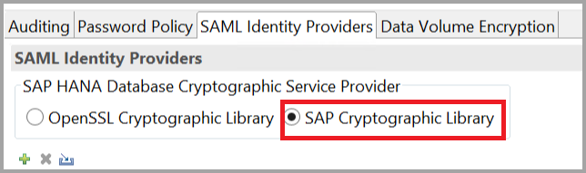
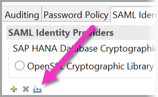
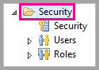
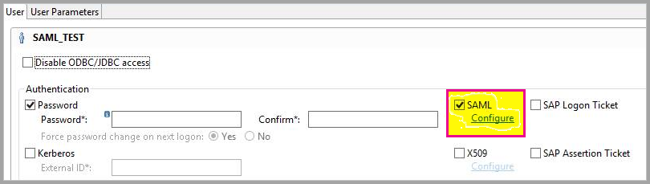
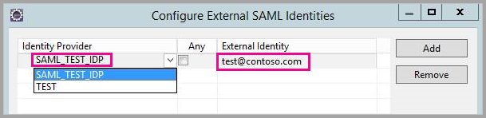
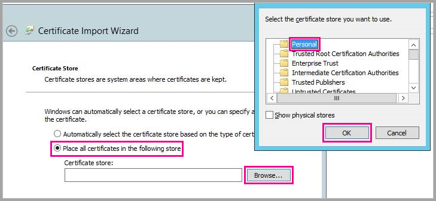
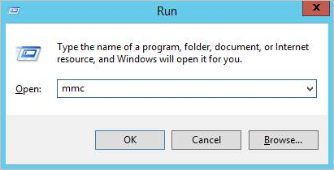
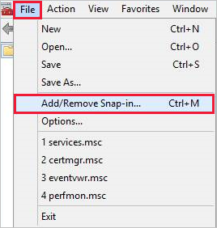

# Use Security Assertion Markup Language for SSO from Power BI to on-premises data sources

By enabling single sign-on (SSO), you can make it easy for Power BI reports and dashboards to refresh data from on-premises sources while you respect user-level permissions that are configured on those sources. To enable seamless SSO connectivity, you use [Security Assertion Markup Language (SAML)](https://www.onelogin.com/pages/saml). 

> [!NOTE]
> You can connect to only one data source using Single Sign-On SAML with an on-premises data gateway. To connect to an additional data source using Single Sign-On SAML, you must use a different on-premises data gateway.

## Supported data sources for SAML

Microsoft currently supports SAP HANA with SAML. For more information about setting up and configuring single sign-on for SAP HANA by using SAML, see [SAML SSO for BI Platform to HANA](https://blogs.sap.com/2020/03/22/sap-bi-platform-saml-sso-to-hana-database/).

We support additional data sources with [Kerberos](service-gateway-sso-kerberos.md) (including SAP HANA).

For SAP HANA, we recommend that you enable encryption before you establish a SAML SSO connection. To enable encryption, configure the HANA server to accept encrypted connections, and then configure the gateway to use encryption to communicate with your HANA server. Because the HANA ODBC driver doesn't encrypt SAML assertions by default, the signed SAML assertion is sent from the gateway to the HANA server *in the clear* and is vulnerable to interception and reuse by third parties.

> [!IMPORTANT]
> Because [SAP no longer supports OpenSSL](https://help.sap.com/viewer/b3ee5778bc2e4a089d3299b82ec762a7/2.0.05/en-US/de15ffb1bb5710148386ffdfd857482a.html), Microsoft has also discontinued its support. Your existing connections continue to work but you can no longer create new connections. Use SAP Cryptographic Library (CommonCryptoLib), or sapcrypto, instead.

## Configure the gateway and data source

To use SAML, you must establish a trust relationship between the HANA servers for which you want to enable SSO and the gateway. In this scenario, the gateway serves as the SAML identity provider (IdP). You can establish this relationship in various ways. SAP recommends that you use CommonCryptoLib to complete the setup steps. For more information, see the official SAP documentation.

### Create the certificates

You can establish a trust relationship between a HANA server and the gateway IdP by signing the gateway IdP's X509 certificate with a root certificate authority (CA) that's trusted by the HANA server. 

To create the certificates, do the following:

1. On the device that's running SAP HANA, create an empty folder to store your certificates, and then go to that folder.
1. Create the root certificates by running the following command:

   ```
   openssl req -new -x509 -newkey rsa:2048 -days 3650 -sha256 -keyout CA_Key.pem -out CA_Cert.pem -extensions v3_ca'''
   ```

    Be sure to copy and save the passphrase to use this certificate to sign other certificates. You should see the *CA_Cert.pem* and *CA_Key.pem* files being created.

   
1. Create the IdP certificates by running the following command:
 
    ```
    openssl req -newkey rsa:2048 -days 365 -sha256 -keyout IdP_Key.pem -out IdP_Req.pem -nodes
    ```
    You should see the *IdP_Key.pem* and *IdP_Req.pem* files being created.

1. Sign the IdP certificates with the root certificates:

    ```
    openssl x509 -req -days 365 -in IdP_Req.pem -sha256 -extensions usr_cert -CA CA_Cert.pem -CAkey CA_Key.pem -CAcreateserial -out IdP_Cert.pem
    ```
    You should see the *CA_Cert.srl* and *IdP_Cert.pem* files being created. At this time, you're concerned only with the *IdP_Cert.pem* file.    

### Create mapping for the SAML identity provider certificate

To create mapping for the SAML Identity Provider certificate, do the following:

1. In SAP HANA Studio, right-click your SAP HANA server name, and then select **Security** > **Open Security Console** > **SAML Identity Provider**.
1. Select the **SAP Cryptographic Library** option. Do *not* use the OpenSSL Cryptographic Library option, which is deprecated by SAP.

    

1. To import the signed certificate *IdP_Cert.pem*, select the blue **Import** button, as shown in the following image:

    

1. Remember to assign a name for your identity provider.

### Import and create the signed certificates in HANA

To import and create the signed certificates in HANA, do the following:

1. In SAP HANA Studio, run the following query:

    ```
    CREATE CERTIFICATE FROM '<idp_cert_pem_certificate_content>'
    ```
    
    Here's an example:

    ```
    CREATE CERTIFICATE FROM
    '-----BEGIN CERTIFICATE-----
    MIIDyDCCArCgA...veryLongString...0WkC5deeawTyMje6
    -----END CERTIFICATE-----
    '
    ```

1. If there's no personal security environment (PSE) with purpose SAML, create one by running the following query in SAP HANA Studio:
    
    ```
    CREATE PSE SAMLCOLLECTION;
    set pse SAMLCOLLECTION purpose SAML;
    ```

1. Add the newly created signed certificate to the PSE by running the following command:

    ```
    alter pse SAMLCOLLECTION add CERTIFICATE <certificate_id>;
    ```

    For example:
    ```
    alter pse SAMLCOLLECTION add CERTIFICATE 1978320;
    ```

    You can check the list of created certificates by running the following query:
    ```
    select * from PUBLIC"."CERTIFICATES"
    ```

    The certificate is now properly installed. To confirm the installation, you can run the following query:
    ```
    select * from "PUBLIC"."PSE_CERTIFICATES"
    ```

### Map the user

To map the user, do the following:

1. In SAP HANA Studio, select the **Security** folder.

    

1. Expand **Users**, and then select the user that you want to map your Power BI user to.

1. Select the **SAML** checkbox, and then select **Configure**, as shown in the following image:

    

1. Select the identity provider that you created in the [Create mapping for the SAML identity provider certificate](#create-mapping-for-the-saml-identity-provider-certificate) section. For **External Identity**, enter the Power BI user's UPN (ordinarily, the email address the user uses to sign in to Power BI), and then select **Add**.

    

    If you've configured your gateway to use the *ADUserNameReplacementProperty* configuration option, enter the value that will replace the Power BI user's original UPN. For example, if you set *ADUserNameReplacementProperty* to *SAMAccountName*, enter the user's *SAMAccountName*.

### Configure the gateway

Now that you've configured the gateway certificate and identity, convert the certificate to a PFX file format, and then configure the gateway to use the certificate by doing the following:

1. Convert the certificate to PFX format by running the following command. This command names the resulting file *samlcert.pfx* and sets *root* as its password, as shown here:

    ```
    openssl pkcs12 -export -out samltest.pfx -in IdP_Cert.pem -inkey IdP_Key.pem -passin pass:root -passout pass:root
    ```

1. Copy the PFX file to the gateway machine:

    a. Double-click *samltest.pfx*, and then select **Local Machine** > **Next**.

    b. Enter the password, and then select **Next**.

    c. Select **Place all certificates in the following store**, and then select **Browse** > **Personal** > **OK**.

      

    d. Select **Next**, and then select **Finish**.


1. To grant the gateway service account access to the private key of the certificate, do the following:

    a. On the gateway machine, run Microsoft Management Console (MMC).

     

    b. In MMC, select **File** > **Add/Remove Snap-in**.

     

    c. Select **Certificates** > **Add**, and then select **Computer account** > **Next**.

    d. Select **Local Computer** > **Finish** > **OK**.

    e. Expand **Certificates** > **Personal** > **Certificates**, and then look for the certificate.

    f. Right-click the certificate, and then select **All Tasks** > **Manage Private Keys**.

      

    g. Add the gateway service account to the list. By default, the account is **NT SERVICE\PBIEgwService**. You can find out which account is running the gateway service by running **services.msc** and then looking for **On-premises data gateway service**.

      

Finally, add the certificate thumbprint to the gateway configuration:

1. To list the certificates on your machine, run the following PowerShell command:

    ```powershell
    Get-ChildItem -path cert:\LocalMachine\My
    ```

1. Copy the thumbprint for the certificate you created.

1. Go to the gateway directory, which is *C:\Program Files\On-premises data gateway* by default.

1. Open *PowerBI.DataMovement.Pipeline.GatewayCore.dll.config*, and then look for the *SapHanaSAMLCertThumbprint* section. Paste the thumbprint you copied in step&nbsp;2.

1. Restart the gateway service.

## Run a Power BI report

Now you can use the **Manage Gateway** page in Power BI to configure the SAP HANA data source. Under **Advanced Settings**, enable SSO via SAML. By doing so, you can publish reports and datasets binding to that data source.

   :::image type="content" source="media/service-gateway-sso-saml/enable-ss-saml.png" alt-text=" Screenshot of advanced settings with single sign-on for SAML.":::

> [!NOTE]
> SSO uses Windows Authentication so make sure the windows account can access the gateway machine. If not sure, make sure to add NT-AUTHORITY\Authenticated Users (S-1-5-11) to the local machine “Users” group.

## Troubleshoot using SAML for single sign-on to SAP HANA
This section provides extensive steps to troubleshoot using SAML for single sign-on to SAP HANA. Using these steps can help you self-diagnose and correct any issues you might face.

### Rejected credentials

After you configure SAML-based SSO, you might see the following error in the Power BI portal: "The credentials provided cannot be used for the SapHana source." This error indicates that the SAML credentials were rejected by SAP HANA.

Server-side authentication traces provide detailed information for troubleshooting credential issues on SAP HANA. To configure tracing for your SAP HANA server, do the following:

1. On the SAP HANA server, turn on the authentication trace by running the following query:

    ```
    ALTER SYSTEM ALTER CONFIGURATION ('indexserver.ini', 'SYSTEM') set ('trace', 'authentication') = 'debug' with reconfigure 
    ```

1. Reproduce the issue.

1. In SAP HANA Studio, open the administration console, and then select the **Diagnosis Files** tab.

1. Open the most recent index server trace, and then search for *SAMLAuthenticator.cpp*.

    You should find a detailed error message that indicates the root cause, as shown in the following example:

    ```
    [3957]{-1}[-1/-1] 2018-09-11 21:40:23.815797 d Authentication   SAMLAuthenticator.cpp(00091) : Element '{urn:oasis:names:tc:SAML:2.0:assertion}Assertion', attribute 'ID': '123123123123123' is not a valid value of the atomic type 'xs:ID'.
    [3957]{-1}[-1/-1] 2018-09-11 21:40:23.815914 i Authentication   SAMLAuthenticator.cpp(00403) : No valid SAML Assertion or SAML Protocol detected
    ```

1. After you've finished troubleshooting, turn off the authentication trace by running the following query:

    ```
    ALTER SYSTEM ALTER CONFIGURATION ('indexserver.ini', 'SYSTEM') UNSET ('trace', 'authentication');
    ```

### Verify and troubleshoot gateway errors

To follow the procedures in this section, you need to [collect gateway logs](/data-integration/gateway/service-gateway-tshoot#collect-logs-from-the-on-premises-data-gateway-app).

#### SSL error (certificate)

**Error symptoms**

This issue has multiple symptoms. When you try to add a new data source, you might see an error message like the following:

```Unable to connect: We encountered an error while trying to connect to . Details: "We could not register this data source for any gateway instances within this cluster. Please find more details below about specific errors for each gateway instance."```

When you try to create or refresh a report, you might see an error message like the one in the following image:

:::image type="content" source="media/service-gateway-sso-kerberos-sap-hana/sap-hana-kerberos-troubleshooting-01.png" alt-text="Screenshot of a 'Cannot load model' troubleshooting SSL error window.":::

When you investigate the Mashup[date]*.log, you'll see the following error message:

```A connection was successfully established with the server, but then an error occurred during the login process and the certificate chain was issued by an authority that is not trusted```

**Resolution**

To resolve this SSL error, go to the data source connection and then, in the **Validate Server Certificate** dropdown list, select **No**, as shown in the following image:

:::image type="content" source="media/service-gateway-sso-saml/validate-server-certificate.png" alt-text="Screenshot showing the S S L error being resolved on the 'Data Source Settings' pane.":::

After you've selected this setting, the error message will no longer appear.

#### Gateway SignXML error

The gateway SignXML error can be the result of incorrect *SapHanaSAMLCertThumbprint* settings, or it can be an issue with the HANA server. Entries in the gateway logs help identify where the issue resides, and how to resolve it. 

**Error symptoms**

Log entries for ```SignXML: Found the cert...```: If your GatewayInfo[*date*].log file contains this error, the SignXML cert was found, and your troubleshooting efforts should focus on steps that are found in the ["Verify and troubleshoot the HANA server side"](#verify-and-troubleshoot-the-hana-server-side) section.

Log entries for ```Couldn't find saml cert```: If your GatewayInfo[*date*].log file contains this error, *SapHanaSAMLCertThumbprint* is set incorrectly. The following resolution section describes how to resolve the issue.

**Resolution**

To properly set *SapHanaSAMLCertThumbprint*, follow the instructions in the ["Configure the gateway"](service-gateway-sso-saml.md) section. The instructions begin with *Finally, add the certificate thumbprint to the gateway configuration*.

After you've changed the configuration file, you need to restart the gateway service for the change to take effect.

**Validation**

When *SapHanaSAMLCertThumbprint* is properly set, your gateway logs will have entries that include ```SignXML: Found the cert...```. At this point, you should be able to proceed to the ["Verify and troubleshoot the HANA server side"](#verify-and-troubleshoot-the-hana-server-side) section. 

If the gateway is unable to use the certificate to sign the SAML assertion, you might see an error in the logs that's similar to the following: 

```GatewayPipelineErrorCode=DM_GWPipeline_UnknownError GatewayVersion= InnerType=CryptographicException InnerMessage=<pi>Signing key is not loaded.</pi> InnerToString=<pi>System.Security.Cryptography.CryptographicException: Signing key is not loaded.```

To resolve this error, follow the instructions beginning with step 3 in the ["Configure the gateway"](service-gateway-sso-saml.md#configure-the-gateway) section.

After you've changed the configuration, restart the gateway service for the change to take effect.

#### Verify and troubleshoot the HANA server side

Use the solutions in this section if the gateway can find the certificate and sign the SAML assertion but you're still experiencing errors. You'll need to collect HANA authentication traces, as described earlier in the ["Rejected credentials" section](#rejected-credentials). 

**The SAML identity provider**

The presence of the ```Found SAML provider``` string in the HANA authentication traces indicates that the SAML identity provider is configured properly. If the string is not present, the configuration is incorrect.

**Resolution**

First, determine whether your organization is using OpenSSL or commoncrypto as the sslcryptoprovider. To determine which provider is being used, do the following:

1. Open SAP HANA Studio.
1. Open the Administration Console for the tenant that you're using.
1. Select the **Configuration** tab, and use **sslcryptoprovider** as a filter, as shown in the following image:

   :::image type="content" source="media/service-gateway-sso-saml/sap-hana-kerberos-troubleshooting-03.png" alt-text="Screenshot of the sslcryptoprovider information in SAP HANA Studio.":::

Next, verify that the cryptographic library is set correctly by doing the following:

1. Go to Security Console in SAP HANA Studio by selecting the **SAML Identity Providers** tab, and do either of the following: 
   * If the sslcryptoprovider is OpenSSL, select **OpenSSL Cryptographic Library**. 
   * If the sslcryptoprovider is commonCrypto, select **SAP Cryptographic Library**. 

    In the following image, **SAP Cryptographic Library** is selected:

    :::image type="content" source="media/service-gateway-sso-saml/sap-hana-kerberos-troubleshooting-04.png" alt-text="Screenshot of SAP HANA Studio with 'SAP Cryptographic Library' selected as the sslcryptoprovider.":::

1. Deploy your changes by selecting the **Deploy** button at the upper right, as shown in the following image:

    :::image type="content" source="media/service-gateway-sso-saml/sap-hana-kerberos-troubleshooting-05.png" alt-text="Screenshot of the 'Deploy' button for deploying your solution changes.":::

**Validation**

When the traces are properly configured, they'll report ```Found SAML provider``` and will *not* report ```SAML Provider not found```. You can proceed to the next section, ["Troubleshoot the SAML assertion signature."](#troubleshoot-the-saml-assertion-signature) 


If the cryptographic provider is set but ```SAML Provider not found``` is still being reported, search for a string in the trace that begins with the following text:

```Search SAML provider for certificate with subject =```

In that string, ensure that the subject and issuer are exactly the same as displayed in the SAML identity provider tab in Security Console. A difference of even a single character can cause the problem. If you find a difference, you can fix the issue in the SAP Cryptographic Library so that the entries match exactly.

If changing the SAP Cryptographic Library doesn't fix the issue, you can manually edit the *Issued To* and *Issued By* fields simply by double-clicking them.


#### Troubleshoot the SAML assertion signature

You might find HANA authentication traces that contain entries similar to the following:

```[48163]{-1}[-1/-1] 2020-09-11 21:15:18.896165 i Authentication SAMLAuthenticator.cpp(00398) : Unable to verify XML signature```
```[48163]{-1}[-1/-1] 2020-09-11 21:15:18.896168 i Authentication MethodSAML.cpp(00103) : unsuccessful login attempt with SAML ticket!```

The presence of such entries means that the signature isn't trusted.

**Resolution**

If you're using **OpenSSL** as your sslcryptoprovider, check to see whether the *trust.pem* and *key.pem* files are in the SSL directory. For more information, see the SAP blog [Securing the communication between SAP HANA Studio and SAP HANA Server through SSL](https://blogs.sap.com/2015/09/28/securing-the-communication-between-sap-hana-studio-and-sap-hana-server-through-ssl/).

If you're using **commoncrypto** as your sslcryptoprovider, check to see whether there's a collection with your certificate in the tenant.

**Validation**

When the traces are properly configured, they'll report ```Found valid XML signature```. 


#### Troubleshoot the UPN mapping

You might find HANA traces that contain entries similar to the following:

```SAMLAuthenticator.cpp(00886) : Assertion Subject NameID: `johnny@contoso.com` SAMLAuthenticator.cpp(00398) : Database user does not exist```

The error indicates that nameId `johnny@contoso.com` is found in the SAML assertions, but it doesn't exist or isn't mapped correctly in HANA Server.

**Resolution**

Go to the HANA database user and, under the selected SAML checkbox, select the **Configure** link. The following window appears:

:::image type="content" source="media/service-gateway-sso-saml/sap-hana-kerberos-troubleshooting-06.png" alt-text="Screenshot showing that the incorrect user name is displayed.":::

As the error message describes, HANA was trying to find *johnny@contoso.com*, but the external identity is displayed only as *johnny*. These two values must match. To resolve the issue, under **External Identity**, change the value to *johnny@contoso.com*. Note that this value is case sensitive.


## Related content

For more information about the on-premises data gateway and DirectQuery, see the following resources:

* [What is an on-premises data gateway?](/data-integration/gateway/service-gateway-onprem)
* [DirectQuery in Power BI](desktop-directquery-about.md)
* [Data sources supported by DirectQuery](power-bi-data-sources.md)
* [DirectQuery and SAP Business Warehouse (BW)](desktop-directquery-sap-bw.md)
* [DirectQuery and SAP HANA](desktop-directquery-sap-hana.md)
