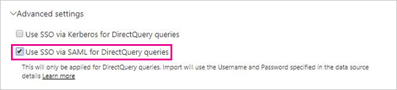

# Use Security Assertion Markup Language (SAML) for SSO from Power BI to on-premises data sources

Enabling SSO makes it easy for Power BI reports and dashboards to refresh data from on-premises sources while respecting user-level permissions configured on those sources. Use [Security Assertion Markup Language (SAML)](https://www.onelogin.com/pages/saml) to enable seamless single sign-on connectivity. 

## Supported data sources

We currently support SAP HANA with SAML. For more information about setting up and configuring single sign-on for SAP HANA by using SAML, see [SAML SSO for BI Platform to HANA](https://blogs.sap.com/2020/03/22/sap-bi-platform-saml-sso-to-hana-database/).

We support additional data sources with [Kerberos](service-gateway-sso-kerberos.md) (including SAP HANA).

For SAP HANA, it's recommended you enable encryption before you establish a SAML SSO connection. To enable encryption, configure the HANA server to accept encrypted connections and configure the gateway to use encryption to communicate with your HANA server. Because the HANA ODBC driver doesn't encrypt SAML assertions by default, the signed SAML assertion is sent from the gateway to the HANA server *in the clear* and is vulnerable to interception and reuse by third parties.

> [!IMPORTANT]
> As [SAP no longer supports the OpenSSL](https://help.sap.com/viewer/b3ee5778bc2e4a089d3299b82ec762a7/2.0.05/en-US/de15ffb1bb5710148386ffdfd857482a.html), Microsoft also has discontinued its support. Existing connections will continue to work, but you won't be able to create new connections starting February 2021. Going forward, please use CommonCryptoLib instead.

## Configuring the gateway and data source

To use SAML, you must establish a trust relationship between the HANA servers for which you want to enable SSO and the gateway. In this scenario, the gateway serves as the SAML Identity Provider (IdP). There are various ways to establish this relationship. SAP recommends you use the SAP Cryptographic Library (also known as CommonCryptoLib or sapcrypto) to complete the setup steps in which we establish the trust relationship. For more information, see the official SAP documentation.

The following steps describe how to establish a trust relationship between a HANA server and the gateway IdP by signing the gateway IdP's X509 certificate with a Root CA trusted by the HANA server. 

### Create the certificates

Take the following steps to create the certificates:

1. On the device that is running SAP HANA, create an empty folder to store your certificates, then navigate to that folder.
2. Create the root certificates by running the following command:

   ```
   openssl req -new -x509 -newkey rsa:2048 -days 3650 -sha256 -keyout CA_Key.pem -out CA_Cert.pem -extensions v3_ca'''
   ```

    You must remember the passphrase to use this certificate to sign other certificates.
    You should see *CA_Cert.pem* and *CA_Key.pem* being created.

   
3. Create the IdP certificates by running the following command:
 
    ```
    openssl req -newkey rsa:2048 -days 365 -sha256 -keyout IdP_Key.pem -out IdP_Req.pem -nodes
    ```
    You should see *IdP_Key.pem* and *IdP_Req.pem* being created.

4. Sign the IdP Certificates with the root certificates:

    ```
    openssl x509 -req -days 365 -in IdP_Req.pem -sha256 -extensions usr_cert -CA CA_Cert.pem -CAkey CA_Key.pem -CAcreateserial -out IdP_Cert.pem
    ```
    You should see *CA_Cert.srl* and *IdP_Cert.pem* being created.
    We are only concerned about the *IdP_Cert.pem*.    

### Create SAML identity provider certificate mapping

Create the SAML Identity Provider certificate mapping with the following steps.

1. In **SAP HANA Studio**, right-click your SAP HANA server name then navigate to **Security > Open Security Console > SAML Identity Provider**.
2. If the SAP Cryptographic Library is not selected, select it. Do *not* use the OpenSSL Cryptographic Library (the selection on the left, in the following image), it is deprecated by SAP.

    

3. Import the signed certificate *IdP_Cert.pem* by clicking the blue import button, shown in the following image.

    

Remember to assign a name to your *Identity Provider Name*.

### Import and create the signed certificates in HANA

Next, you'll import and create the signed certificates in HANA. Follow these steps:

1. In **HANA Studio**, run the following query:

    ```
    CREATE CERTIFICATE FROM '<idp_cert_pem_certificate_content>'
    ```
    
    Here's an example:

    ```
    CREATE CERTIFICATE FROM
    '-----BEGIN CERTIFICATE-----
    MIIDyDCCArCgA...veryLongString...0WkC5deeawTyMje6
    -----END CERTIFICATE-----
    '
    ```

2. If there is no PSEwith SAML Purpose, create one by running the following query in **HANA Studio**:
    
    ```
    CREATE PSE SAMLCOLLECTION;<br>set pse SAMLCOLLECTION purpose SAML;<br>
    ```

3. Add the newly created signed certificate to the PSE with the following command:

    ```
    alter pse SAMLCOLLECTION add CERTIFICATE <certificate_id>;
    ```

    For example:
    ```
    alter pse SAMLCOLLECTION add CERTIFICATE 1978320;
    ```

    You can check the list of certificated created with the following query:
    ```
    select * from PUBLIC"."CERTIFICATES"
    ```

    The certificate is now properly installed. You can run the following query to confirm:
    ```
    select * from "PUBLIC"."PSE_CERTIFICATES"
    ```

### Map the user

Follow these steps to map the user:

1. In **SAP HANA Studio**, select the **Security** folder:

    

2. Expand **Users**, and then select the user to whom you want to map your Power BI user.

3. Select the **SAML** checkbox, and then select **Configure**, shown highlighted in the following image.

    

4. Select the identity provider you created in the [create SAML identity provider certificate mapping](#create-saml-identity-provider-certificate-mapping) section, earlier in this article. For External Identity, enter the Power BI user's UPN (typically the email address the user uses to sign in to Power BI), and then select **Add**.  The following image shows the options and selections.

    

    If you've configured your gateway to use the *ADUserNameReplacementProperty* configuration option, enter the value that will replace the Power BI user's original UPN. For example, if you set *ADUserNameReplacementProperty* to *SAMAccountName* enter the user's *SAMAccountName*.

### Configure the gateway

Now that you have the gateway's certificate and identity configured, convert the certificate to a pfx format and configure the gateway to use the certificate with the following steps.

1. Convert the certificate to pfx format by running the following command. This command names the resulting .pfx file samlcert.pfx and sets *root* as its password:

    ```
    openssl pkcs12 -export -out samltest.pfx -in IdP_Cert.pem -inkey IdP_Key.pem -passin pass:root -passout pass:root
    ```

2. Copy the pfx file to the gateway machine:

    1. Double-click *samltest.pfx*, then select **Local Machine** > **Next**.

    2. Enter the password, then select **Next**.

    3. Select **Place all certificates in the following store,** then select **Browse** > **Personal** > **OK**.

    4. Select **Next**, and then **Finish**.

       

3. Grant the gateway service account access to the private key of the certificate, with the following steps:

    1. On the gateway machine, run the Microsoft Management Console (MMC).

        

    2. Under **File**, select **Add/Remove Snap-in**.

        

    3. Select **Certificates** > **Add**, then select **Computer account** > **Next**.

    4. Select **Local Computer** > **Finish** > **OK**.

    5. Expand **Certificates** > **Personal** > **Certificates**, and find the certificate.

    6. Right-click the certificate and navigate to **All Tasks** &gt; **Manage Private Keys**.

        

    1. Add the gateway service account to the list. By default, the account is **NT SERVICE\PBIEgwService**. You can find out which account is running the Gateway service by running **services.msc** and locating **On-premises data gateway service**.

        

Finally, follow these steps to add the certificate thumbprint to the gateway configuration:

1. Run the following PowerShell command to list the certificates on your machine:

    ```powershell
    Get-ChildItem -path cert:\LocalMachine\My
    ```

2. Copy the thumbprint for the certificate you created.

3. Navigate to the gateway directory, which by default is *C:\Program Files\On-premises data gateway*.

4. Open *PowerBI.DataMovement.Pipeline.GatewayCore.dll.config*, and find the *SapHanaSAMLCertThumbprint* section. Paste the thumbprint you copied.

5. Restart the gateway service.

## Running a Power BI report

Now you can use the **Manage Gateway** page in Power BI to configure the SAP HANA data source. Under **Advanced Settings**, enable SSO via SAML. Doing so allows you to publish reports and datasets binding to that data source.

   

## Troubleshooting

This section provides extensive steps about how to troubleshoot using SAML for single sign-on (SSO) to SAP HANA. Using these troubleshooting steps can help you self-diagnose and correct issues you may be facing.

### Rejected credentials

After you configure SAML-based SSO, you might see the following error in the Power BI portal: *The credentials provided cannot be used for the SapHana source.* This error indicates that the SAML credential was rejected by SAP HANA.

Server-side authentication traces provide detailed information for troubleshooting credential issues on SAP HANA. Follow these steps to configure tracing for your SAP HANA server:

1. On the SAP HANA server, turn on the authentication trace by running the following query:

    ```
    ALTER SYSTEM ALTER CONFIGURATION ('indexserver.ini', 'SYSTEM') set ('trace', 'authentication') = 'debug' with reconfigure 
    ```

1. Reproduce the issue.

1. In HANA Studio, open the administration console, and select the **Diagnosis Files** tab.

1. Open the latest index server trace and search for *SAMLAuthenticator.cpp*.

    You should find a detailed error message that indicates the root cause, for example:

    ```
    [3957]{-1}[-1/-1] 2018-09-11 21:40:23.815797 d Authentication   SAMLAuthenticator.cpp(00091) : Element '{urn:oasis:names:tc:SAML:2.0:assertion}Assertion', attribute 'ID': '123123123123123' is not a valid value of the atomic type 'xs:ID'.
    [3957]{-1}[-1/-1] 2018-09-11 21:40:23.815914 i Authentication   SAMLAuthenticator.cpp(00403) : No valid SAML Assertion or SAML Protocol detected
    ```

1. After the troubleshooting is complete, turn off the authentication trace by running the following query:

    ```
    ALTER SYSTEM ALTER CONFIGURATION ('indexserver.ini', 'SYSTEM') UNSET ('trace', 'authentication');
    ```

### Verifying and troubleshooting gateway errors

To follow the steps in this section, you need to [collect gateway logs](https://docs.microsoft.com/data-integration/gateway/service-gateway-tshoot#collect-logs-from-the-on-premises-data-gateway-app).

#### SSL Error (certificate)

**Error symptoms:**

There are multiple symptoms of this issue. When trying to add a new data source, you might see an error like the following:

```Unable to connect: We encountered an error while trying to connect to . Details: "We could not register this data source for any gateway instances within this cluster. Please find more details below about specific errors for each gateway instance."```

When trying to create or refresh a report, you may see the following:

:::image type="content" source="media/service-gateway-sso-kerberos-sap-hana/sap-hana-kerberos-troubleshooting-01.png" alt-text="Troubleshooting SSL error window":::

When you investigate the Mashup[date]*.log you will see the following error:

```A connection was successfully established with the server, but then an error occurred during the login process and The certificate chain was issued by an authority that is not trusted```

**Resolution:**

To resolve this SSL error, go to the data source connection and set **Validate Server Certificate** to **No**, as shown in the following image:

:::image type="content" source="media/service-gateway-sso-kerberos-sap-hana/sap-hana-kerberos-troubleshooting-02.png" alt-text="Resolving SSL error window":::

Once selected, the error will no longer appear.

#### Gateway SignXML error

The gateway SignXML error can be the result of incorrect settings with the *SapHanaSAMLCertThumbprint*, or it can be an issue with the HANA server. Entries in the gateway logs help identify where the issue resides, and how to resolve it. 

**Error symptoms:**

Log entries for ```SignXML: Found the cert...```: If your GatewayInfo[*date*].log file contains this error, the SignXML cert was found, and your troubleshooting efforts should focus on steps found in the [verifying and troubleshooting the HANA server side](#verifying-and-troubleshooting-the-hana-server-side) section, later in this article.

Log entries for ```Couldn't find saml cert```: If your GatewayInfo[*date*].log file contains this error, then *SapHanaSAMLCertThumbprint* is set incorrectly. The following resolution section describes how to resolve the issue.

**Resolution:**

To properly set *SapHanaSAMLCertThumbprint*, follow the steps outlined in [Use Security Assertion Markup Language (SAML) for SSO from Power BI to on-premises data sources](service-gateway-sso-saml.md), and specifically, follow the steps outlined toward the bottom of that article that begins with: *Finally, follow these steps to add the certificate thumbprint to the gateway configuration:*

Once the configuration file is changed, restart the gateway service for the change to take effect.

**Validation:**

When *SapHanaSAMLCertThumbprint* is properly set, your gateway logs will have entries that include ```SignXML: Found the cert...```. At this point, you should be able to proceed to [verifying and troubleshooting the HANA server side](#verifying-and-troubleshooting-the-hana-server-side). 

If the gateway is not able to use the certificate to sign the SAML assertion, you may see an error similar to the following in the logs: 

```GatewayPipelineErrorCode=DM_GWPipeline_UnknownError GatewayVersion= InnerType=CryptographicException InnerMessage=<pi>Signing key is not loaded.</pi> InnerToString=<pi>System.Security.Cryptography.CryptographicException: Signing key is not loaded.```

To resolve that error, follow the steps beginning with **Step 3:** in the following [configure the gateway](service-gateway-sso-saml.md#configure-the-gateway) section of that article.

After changing the configuration, restart the gateway service for the change to take effect.

#### Verifying and troubleshooting the HANA server side

Use the troubleshooting steps in this section if the gateway is finding the certificate and is able to sign the SAML assertion, but you're still experiencing errors. Following the steps in this section requires collecting HANA authentication traces, described in the following article's [troubleshooting](service-gateway-sso-saml.md#troubleshooting) section. 

**The SAML identity provider**

Seeing the string ```Found SAML provider``` in the HANA authentication traces indicates proper configuration of the SAML Identity Provider. If the string is not present, the configuration is not correct.

**Resolution:**

First determine whether your organization is using **OpenSSL** or **commoncrypto** as the sslcryptoprovider. Take the following steps to determine which is being used:

1. Open HANA Studio
2. Open the Administration Console for the tenant being used.
3. Go to the configuration tab and use sslcryptoprovider as a filter, as shown in the following image:

:::image type="content" source="media/service-gateway-sso-kerberos-sap-hana/sap-hana-kerberos-troubleshooting-03.png" alt-text="HANA Studio sslcryptoprovider information":::

Next, verify the cryptographic library is set correctly with the following steps:

1. Go to Security Console in the HANA Studio in the SAML Identity Providers tab
2. If the sslcryptoprovider is OpenSSL, choose the **OpenSSL Cryptographic Library** radio button. If the sslcryptoprovider is commonCrypto, choose the **SAP Cryptographic Library** radio button. The following image shows the **SAP Cryptographic Library** selection:

    :::image type="content" source="media/service-gateway-sso-kerberos-sap-hana/sap-hana-kerberos-troubleshooting-04.png" alt-text="HANA Studio sslcryptoprovider selection":::

3. Make sure you deploy any changes by selecting the **Deploy** button in the upper right corner of the window, shown in the following image:

    :::image type="content" source="media/service-gateway-sso-kerberos-sap-hana/sap-hana-kerberos-troubleshooting-05.png" alt-text="Deploy solution changes":::

**Validation:**

When properly configured, the traces will report ```Found SAML provider``` and will *not* report ```SAML Provider not found```. You can proceed to [troubleshooting the SAML Assertion signature](#troubleshooting-the-saml-assertion-signature) later in this article. 


If the cryptographic provider is set but the ```SAML Provider not found``` is still being reported, search for a string in the trace that begins with the following:

```Search SAML provider for certificate with subject =```

In that string, check if the subject and issuer are exactly the same as the SAML identity provider tab in the Security Console. Even a single character of difference can cause the problem. If you find a difference, you can change the SAP Cryptographic library so the entries match exactly.

If changing the SAP Cryptographic library doesn't fix the issue, you can manually edit the fields *Issued To* and *Issued By*. Simply double-click to edit the field.


#### Troubleshooting the SAML Assertion signature

You may run into HANA authentication traces that contain entries similar to the following:

```[48163]{-1}[-1/-1] 2020-09-11 21:15:18.896165 i Authentication SAMLAuthenticator.cpp(00398) : Unable to verify XML signature```
```[48163]{-1}[-1/-1] 2020-09-11 21:15:18.896168 i Authentication MethodSAML.cpp(00103) : unsuccessful login attempt with SAML ticket!```

Such entries means the signature is not trusted.

**Resolution:**
If you're using **OpenSSL** as your sslcryptoprovider, check whether the trust.pem and key.pem are in the SSL directory. The following link provides information on how to check them: [SAP article](https://blogs.sap.com/2015/09/28/securing-the-communication-between-sap-hana-studio-and-sap-hana-server-through-ssl/)

If you're using **commoncrypto** as your sslcryptoprovider, check whether there's a collection with your certificate in the tenant.

**Validation:**

When properly configured, the traces will report ```Found valid XML signature``` 


#### Troubleshooting the UPN mapping

You may run into HANA  traces that contain entries similar to the following:

```SAMLAuthenticator.cpp(00886) : Assertion Subject NameID: johnny@contoso.com SAMLAuthenticator.cpp(00398) : Database user does not exist```

The error indicates that nameId johnny@contoso.com is found in the SAML assertions, but does not exist or is not mapped correctly in HANA Server.

**Resolution:**

Go to the HANA database user and click on the *Configure* link below the checked SAML box. The following window appears:

    :::image type="content" source="media/service-gateway-sso-kerberos-sap-hana/sap-hana-kerberos-troubleshooting-06.png" alt-text="Wrong user name":::

As the error message describes, HANA was trying to find johnny@contoso.com but in the external identity is only johnny. These two values need to match, so to fix it, edit the *External Identity* to be johnny@contoso.com. Note these entries are case sensitive.


## Next steps

For more information about the on-premises data gateway and DirectQuery, see the following resources:

* [What is an on-premises data gateway?](/data-integration/gateway/service-gateway-onprem)
* [DirectQuery in Power BI](desktop-directquery-about.md)
* [Data sources supported by DirectQuery](power-bi-data-sources.md)
* [DirectQuery and SAP BW](desktop-directquery-sap-bw.md)
* [DirectQuery and SAP HANA](desktop-directquery-sap-hana.md)
