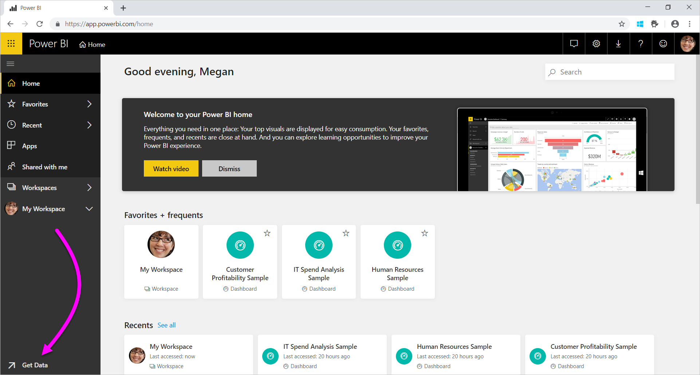
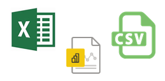

# Data sources for the Power BI service
Data is at the heart of Power BI. Let's say you're exploring data. You may do that by creating charts and dashboards, or asking questions with **Q&A**. The visualizations and answers you see are getting their underlying data from a dataset. But where does that dataset come from? Well, it comes from a data source.

In this article, we're going to cover the data source types you can connect to from the Power BI service. Keep in mind that there are many other types of data sources you can get data from, too. If you choose these data sources, you may need to use Power BI Desktop or Excel's advanced data query and modeling features first. We'll go into more about those options later. For now, let's look at the different types of data sources available right from your Power BI service site.

You can get data from any of the data sources in Power BI by selecting **Get Data** in the bottom-left corner of the page.

 

After you select **Get data**, you can choose the data you want to access.

## Discover content

The **Discover content** section contains all the data and reports you need already prepared for you. In Power BI, there are two types of content packs: Organizational and Services. 

**Organizational**: If you and other users in your organization have a Power BI Pro or Premium Per User (PPU) account, you can create, share, and use content packs. To learn more, see [Intro to organizational content packs](../collaborate-share/service-organizational-content-pack-introduction.md).

**Services**: There are literally dozens of services with content packs for Power BI, and more are being added all the time. Most services require you to have an account. To learn more, see [Connect to services you use with Power BI](service-connect-to-services.md).

## Create new content

The **Create new content** section contains options for creating and importing content yourself. In Power BI, there are two ways to create or import your own content: Files and Databases. 

### Files

**Excel** (*.xlsx*, *.xlsm*) - In Excel, a workbook may include different data types. For example, it can include data you've entered into worksheets yourself. It can also include data that you've queried and loaded from external data sources by using Power Query. Power Query is available through **Get & Transform** in Excel 2016 or Power Pivot. You may import data from tables in worksheets, or import data from a data model. To learn more, see [Get data from files for Power BI](service-get-data-from-files.md).

**Power BI Desktop** (*.pbix*) - You can use Power BI Desktop to query and load data from external data sources and create reports. You can also extend your data model with measures and relationships, or import your Power BI Desktop file into your Power BI site. Power BI Desktop is best for more advanced users. Typically these users are ones who have a good understanding of their data sources. They also understand data query and transformation, and data modeling concepts. To learn more, see [Connect to data in Power BI Desktop](desktop-connect-to-data.md).

**Comma-Separated Value** (*.csv*) - Files are simple text files with rows of data. Each row may contain one or more values, each separated by a comma. For example, a *.csv* containing name and address data might have many rows. Each row may have values for first name, last name, street address, city, state, and so on. You can't import data into a *.csv* file, but many applications, like Excel, can save simple table data as a *.csv* file.

For other file types, like XML Table (*.xml*) or text (*.txt*) files, you can use **Get & Transform** to query, transform, and load that data into an Excel or Power BI Desktop file first. You can then import the Excel or Power BI Desktop file into Power BI.

Where you store your files makes a significant difference, too. OneDrive for Business provides the greatest amount of flexibility and integration with Power BI. It's OK to keep your files on your local drive. Though if you need to refresh your data, there are a few extra steps. For more information, see the article links below.

### Databases

**Databases in the Cloud** - From the Power BI service, you can connect live to:

* Azure SQL Database
* Azure Synapse Analytics (formerly SQL Data Warehouse)
* Spark on Azure HDInsight

Connections from Power BI to these databases are live. Let's say you connect to an Azure SQL Database. You then begin exploring its data by creating reports in Power BI. Whenever you slice your data or add another field to a visualization, Power BI makes a query right to the database. To learn more, see [Azure and Power BI](service-azure-and-power-bi.md).

For other database types in your organization, you'll need to use Power BI Desktop or Excel to connect to, query, and load data into a data model. You can then import your file into Power BI where a dataset exists. If you configure a scheduled refresh, Power BI will use that configuration and connection information from the file to connect directly to the datasource and query for updates. Power BI then loads those updates into the dataset. To learn more, see [Connect to data in Power BI Desktop](desktop-connect-to-data.md).

## What if my data comes from a different source?
There are hundreds of different data sources you can use with Power BI. Wherever you get your data from, that data has to be in a format consumable by the Power BI service. With consumable data, the Power BI service can create reports and dashboards, answer questions with **Q&A**, and so on.

Some data sources already have data formatted for the Power BI service. These sources are like content packs from service providers like Google Analytics and Twilio. SQL Server Analysis Services Tabular model databases are ready for use, too. You can also connect live to databases in the cloud like Azure SQL Database and Spark on HDInsight.

In other cases, it might be necessary to query and load the data you want into a file. For example, let's say you have logistics data in your organization. You store that data in a data warehouse database on a server. In the Power BI service, you can't connect to that database and begin exploring its data unless it's a tabular model database. But, you can use Power BI Desktop or Excel to query and load that logistics data into a data model you then save as a file. You can then import that file into Power BI where a dataset exists.

You're probably thinking, "But the logistics data on that database changes every day. How do I refresh my Power BI dataset?" When you import the data into the dataset, you also import the connection information from either the Power BI Desktop or the Excel file.

Let's say you configure a scheduled refresh or do a manual refresh on the dataset. Power BI uses the connection information from the dataset, along with a couple of other settings, to connect directly to the database. It then queries for updates and loads those updates into the dataset. As a side note, you likely will need a Power BI gateway to secure any data transfer between your on-premises server and Power BI. When the transfer is complete, any visualizations in reports and dashboards refresh automatically.

You see, even though you can't connect to your data source directly from the Power BI service you can still get that data into Power BI. It just might take a few more steps and maybe some help from your IT department. See [Data sources in Power BI Desktop](desktop-data-sources.md) to learn more.

## Some more details
You'll see the terms dataset and data source used a lot in Power BI. They're often used synonymously. But they really are two different things, although they're related.

You create a **dataset** automatically in Power BI when you use **Get Data**. With **Get Data**, you connect to and import data from a content pack, file, or you connect to a live data source. A dataset contains information about the data source and data-source credentials. In many cases, it also includes a subset of data copied from the data source. When you create visualizations in reports and dashboards, you're often looking at data in the dataset.

A **data source** is where the data in a dataset comes from. For example, the data could come from:

* An online service like Google Analytics or QuickBooks
* A database in the cloud like Azure SQL Database
* A database or file on a local computer or server in your own organization

## Data refresh
Maybe you save your files on your local drive or a drive somewhere in your organization. You may need a Power BI gateway so that you can refresh the dataset in Power BI. The computer that stores the file needs to be on when a refresh happens. You can reimport your file or use Publish from Excel or Power BI Desktop, but those options aren't automated processes.

If you save your files on OneDrive for Business or SharePoint - Team Sites, you can then connect to or import them into Power BI. Then, your dataset, reports, and dashboard will always be up-to-date. Because both OneDrive and Power BI are in the cloud, Power BI can connect directly to your saved file. It connects about once every hour and checks for updates. The dataset and any visualizations refresh automatically if there are any updates.

Content packs from services are automatically updated. In most cases, they're updated once a day. You can manually refresh, but if you see any updated data will depend on the service provider. Updates to content packs from people in your organization will depend on the data sources used. They'll also depend on how the person who created the content pack configured the refresh.

Azure SQL Database, Azure Synapse Analytics (formerly SQL Data Warehouse), and Spark on Azure HDInsight are data sources in the Cloud. The Power BI service is also in the cloud so Power BI can connect to those data sources live, using **DirectQuery**. What you see in Power BI is always in sync and there's no need to set up a scheduled refresh.

When you connect to SQL Server Analysis Services from Power BI, it's a live connection just like an Azure database in the cloud. The difference is the database itself is on a server in your organization. This type of connection requires a Power BI gateway, which an IT department configures.

Data refresh is a super important part of Power BI, and much too deep to cover here. If you want to get a thorough understanding, be sure to check out [Data Refresh in Power BI](refresh-data.md).

## Considerations and limitations
For all data sources used in the Power BI service, consider the following limitations. There are other limitations that apply to specific features, but the following list applies to the full Power BI service:

* **Dataset size limit** - There's a 1-GB limit for datasets stored in Shared capacities in the Power BI service. If you need larger datasets, you can use [Power BI Premium](../admin/service-premium-what-is.md).

* **Distinct values in a column** - When caching data in a Power BI dataset (sometimes called 'Import' mode), there is a 1,999,999,997  limit on the number of distinct values that can be stored in a column.

* **Row limit** - When using **DirectQuery**, Power BI imposes a limit on the query results that are sent to your underlying data source. If the query sent to the data source returns more than one million rows, you see an error and the query fails. Your underlying data can still contain more than one million rows. You're unlikely to run into this limit as most reports aggregate the data into smaller sets of results.

* **Column limit** - The maximum number of columns allowed in a dataset, across all tables in the dataset, is 16,000 columns. This limit applies to the Power BI service and to datasets used in Power BI Desktop. Power BI tracks the number of columns and tables in the dataset in this way, which means the maximum number of columns is 16,000 minus one for each table in the dataset.
