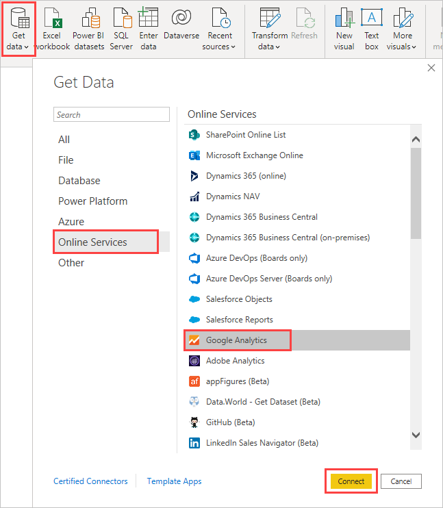
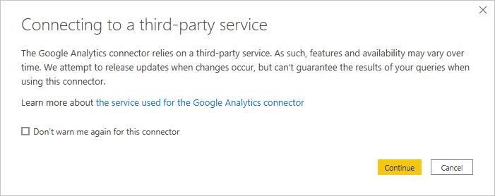
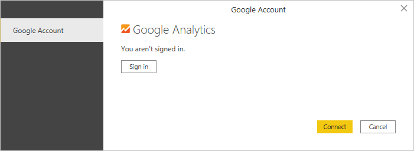
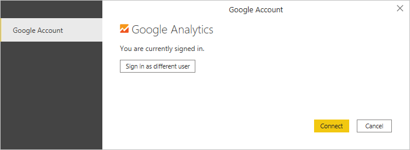
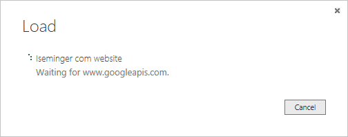

# Use the Google Analytics connector for Power BI Desktop
> [!NOTE]
> The Google Analytics template app and the connector in Power BI Desktop rely on the Google Analytics Core Reporting API. As such, features and availability may vary over time.

You can connect to Google Analytics data using the **Google Analytics** connector. To connect, follow these steps:

1. In **Power BI Desktop**, select **Get Data** from the **Home** ribbon tab.
2. In the **Get Data** window, select **Online Services** from the categories in the left pane.
3. Select **Google Analytics** from the selections in the right pane.
4. At the bottom of the window, select **Connect**.  
   

You're prompted with a dialog that explains that the connector is a Third-Party Service, and warns about how features and availability may change over time, and other clarifications.  

When you select **Continue**, you're prompted to sign in to Google Analytics.  

When you enter your credentials, you're prompted that Power BI would like to have offline access. This is how you use **Power BI Desktop** to access your Google Analytics data.  

Once you accept, **Power BI Desktop** shows that you're currently signed in.  

Select **Connect**, and your Google Analytics data is connected to **Power BI Desktop**, and loads the data.  

## Changes to the API
Although we attempt to release updates in accordance with any changes, the API may change in a way that affects the results of the queries we generate. In some cases, certain queries may no longer be supported. Due to this dependency we cannot guarantee the results of your queries when using this connector.

More details on changes to the Google Analytics API can be found in their [changelog](https://developers.google.com/analytics/devguides/changelog).

