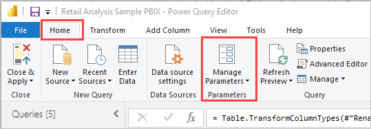
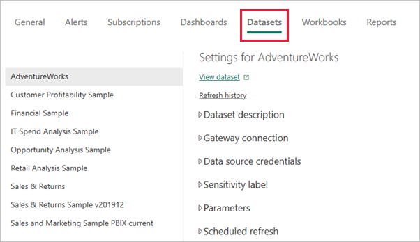
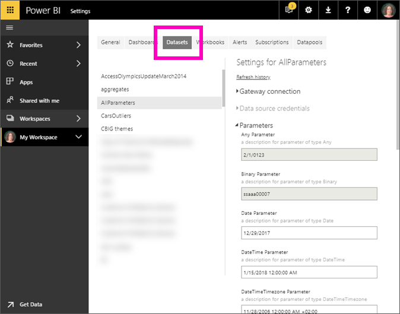

# Edit parameter settings in the Power BI service

Report creators add query parameters to reports in Power BI Desktop. Parameters allow you to make parts of reports depend on one or more parameter *values*. For example, a report creator might create a parameter that restricts the data to a single country/region, or a parameter that defines acceptable formats for fields like dates, time, and text.

## Review and edit parameters in Power BI service

As a report creator, you define parameters in Power BI Desktop. When you [publish that report to the Power BI service](../create-reports/desktop-upload-desktop-files.md), the parameter settings and selections travel with it. You can review and edit parameter settings in the Power BI service, but not create them.

1. In the Power BI service, select the cog icon and then choose **Settings**.

   

1. Select the tab for **Semantic models** and highlight a semantic model in the list.

    

1. Expand **Parameters**.  If the selected semantic model has no parameters, you see a message with a link to **Learn more** about query parameters. If the semantic model does have parameters, expand the **Parameters** heading to reveal those parameters.

    

1. Review the parameter settings and make changes if needed.

## Considerations and limitations

Grayed-out fields aren't editable. *Any* and *Binary* type parameters work in Power BI Desktop. The Power BI service doesn't currently support them for security reasons.

## Related content

- An ad-hoc way to add simple parameters is by [modifying filters](../collaborate-share/service-url-filters.md).
