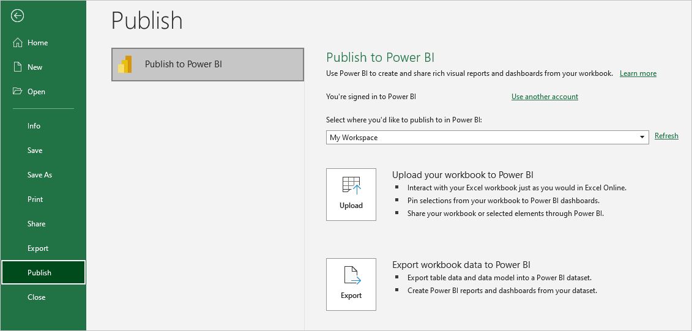
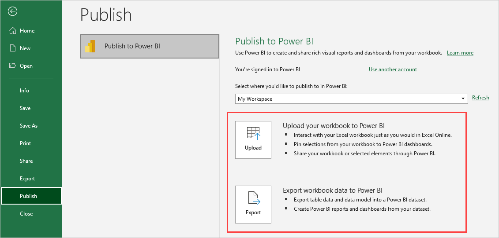
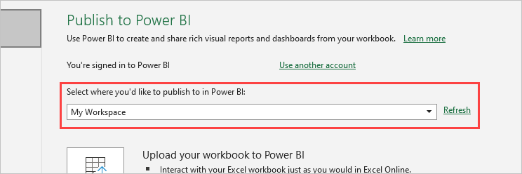
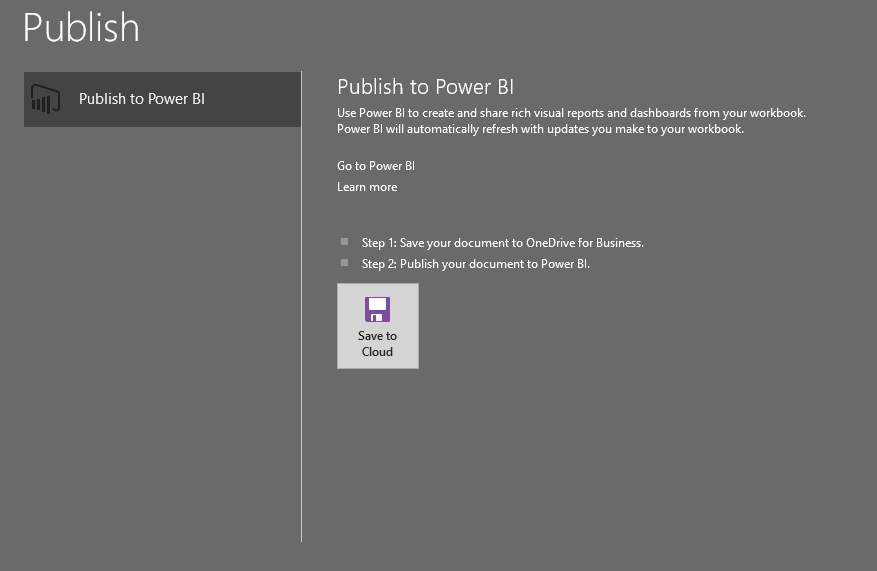
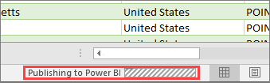

# Publish to Power BI from Microsoft Excel
> [!IMPORTANT]
> Publish to Power BI will be deprecated from Excel in Microsoft 365 starting August 19th, 2024, and Publish to Power BI will not be included in the Excel 2024 perpetual release. This doesn't impact prior versions of on-premises Office.
> 
> The following capabilities are deprecated and will no longer be available starting September 29th, 2023:
> - Upload of local workbooks to Power BI workspaces will no longer be allowed.
> - Configuring scheduling of refresh and refresh now for Excel files that don’t already have scheduled refresh configured will no longer be allowed.
>
> The following capabilities are deprecated and will no longer be available starting October 31, 2023:
> - Scheduled refresh and refresh now for existing Excel files that were previously configured for scheduled refresh will no longer be allowed.
> - Local workbooks uploaded to Power BI workspaces will no longer open in Power BI.
>
> After October 31, 2023:
> - You can download existing local workbooks from your Power BI workspace.
> - You can publish your Excel data model as a Power BI semantic model and schedule refresh.
> - You can import Excel workbooks from OneDrive and SharePoint Document libraries to view them in Power BI.
>
> If your organization uses these capabilities, see more details in [Migrating your Excel workbooks](service-excel-workbook-files.md#migrating-your-excel-workbooks).  

With Microsoft Excel 2016 and later, you can publish your Excel workbooks directly to your [Power BI](https://powerbi.microsoft.com) workspace. In Power BI, you can create highly interactive reports and dashboards based on your workbook data. You can then share your insights with others in your organization.

When you publish a workbook to Power BI, there are few things to consider:

* You must use the same account to sign in to Office, OneDrive for work or school if your workbooks are saved there, and Power BI.
* You can't publish an empty workbook, or a workbook that doesn't have any Power BI supported content.
* You can't publish encrypted or password protected workbooks, or workbooks with Information Protection Management applied.
* Publishing to Power BI requires modern authentication to be enabled, the default. Otherwise, the **Publish** option isn't available from the **File** menu.
* Publishing to Power BI from Excel Desktop isn't supported for sovereign clouds.

## Publish your Excel workbook

To publish your Excel workbook to Power BI, in Excel, select **File** > **Publish** and select either **Upload** or **Export**. The following screenshot shows the two options for how to get your workbook into Power BI:

- If you select **Upload**, you can interact with the workbook just as you would in Excel Online. You can also pin selections from your workbook onto Power BI dashboards, and share your workbook or selected elements through Power BI.

- If you select **Export**, you can export table data and its data model into a Power BI semantic model, and use the semantic model to create Power BI reports and dashboards.

When you select **Publish**, you can select the workspace to publish to. If your Excel file is on OneDrive for work or school, you can publish only to your *My Workspace*. If your Excel file is on a local drive, you can publish to *My Workspace* or to a shared workspace you can access.

### Publish local files

Excel supports publishing local Excel files. Files don't need to be saved to OneDrive for work or school or to SharePoint Online.

> [!IMPORTANT]
> You can publish local files only if you're using Excel 2016 or later with a Microsoft 365 subscription. Excel 2016 standalone installations can publish to Power BI, but only when the workbook is saved to OneDrive for work or school or to SharePoint Online.

Once published, the workbook content you publish imports into Power BI, separate from the local file. If you want to update the file in Power BI, you must update the local file and publish the updated version again. Or, you can refresh the data by configuring scheduled refresh on the workbook or semantic model in Power BI.

### Publish from a standalone Excel installation

When you publish from a standalone Excel installation, you must save the workbook to OneDrive for work or school. Select **Save to Cloud** and choose a location in OneDrive for work or school.

Once you save your workbook to OneDrive for work or school, when you select **Publish**, you can use the **Upload** or **Export** options to get your workbook into Power BI.

#### Upload your workbook to Power BI

When you choose the **Upload** option, your workbook appears in Power BI just as it would in Excel Online. But unlike in Excel Online, you have options to let you pin elements from your worksheets to dashboards.

If you choose **Upload**, you can't edit your workbook in Power BI. If you need to change the data, you can select **Edit**, and then choose to edit your workbook in Excel Online or open it in Excel on your computer. Any changes you make are saved to the workbook on OneDrive for work or school.

When you choose **Upload**, no semantic model is created in Power BI. Your workbook appears in your workspace navigation pane under **Reports**. Workbooks uploaded to Power BI have an Excel icon that identifies them as uploaded Excel workbooks.

Choose the **Upload** option if you only have data in worksheets, or you have PivotTables and Charts you want to see in Power BI.

Using **Upload** from **Publish to Power BI** in Excel is a similar experience to using **Upload** > **OneDrive for Business** > **Upload** in Power BI, and then opening the file in Excel Online from Power BI in your browser.

#### Export workbook data to Power BI

When you choose the **Export** option, any supported data in tables and/or a data model are exported into a new semantic model in Power BI. You can continue editing your workbook. When you save your changes, they synchronize with the semantic model in Power BI, usually within about an hour. If you need more immediate updates, you can select **Publish** again from Excel to export your changes immediately. Any visualizations in reports and dashboards update too.

Choose the **Export** option if you used the **Get & Transform data** or **Power Pivot** features to load data into a data model.

Using **Export** is similar to using **New** > **Upload a file** > **Excel** > **Import** from Power BI in your browser.

### Publish

When you choose either **Upload** or **Export**, Excel signs in to Power BI with your current account and publishes your workbook to your Power BI workspace. You can monitor the status bar in Excel to see publishing progress.

When publishing is complete, you can go to Power BI directly from Excel.

## Related content

- [Excel data in Power BI](service-excel-workbook-files.md)  
- More questions? [Try the Power BI Community.](https://community.powerbi.com/)

