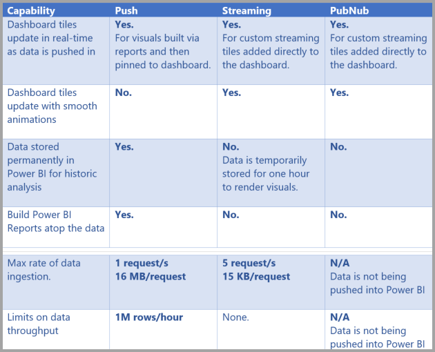
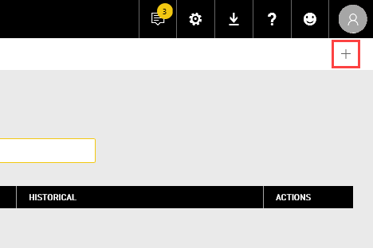

# Real-time streaming in Power BI
Power BI with real-time streaming lets you stream data and update dashboards in real time. Any visual or dashboard created in Power BI can display and update real-time data and visuals. The devices and sources of streaming data can be factory sensors, social media sources, service usage metrics, or many other time-sensitive data collectors or transmitters.

This article shows you how to set up real-time streaming dataset in Power BI. First, it's important to understand the types of real-time datasets that are designed to display in tiles (and dashboards), and how those datasets differ.

## Types of real-time datasets
There are three types of real-time datasets, which are designed for display on real-time dashboards:

* Push dataset
* Streaming dataset
* PubNub streaming dataset

First let's understand how these datasets differ from one another (this section), then we discuss how to push data into those each of these datasets.

### Push dataset
With a **push dataset**, data is pushed into the Power BI service. When the dataset is created, the Power BI service automatically creates a new database in the service to store the data. Since there is an underlying database that continues to store the data as it comes in, reports can be created with the data. These reports and their visuals are just like any other report visuals, which means you can use all of Power BI's report building features to create visuals, including Power BI visuals, data alerts, pinned dashboard tiles, and more.

Once a report is created using the push dataset, any of its visuals can be pinned to a dashboard. On that dashboard,  visuals update in real-time whenever the data is updated. Within the service, the dashboard is triggering a tile refresh every time new data is received.

There are two considerations to note about pinned tiles from a push dataset:

* Pinning an entire report using the *pin live page* option will **not** result in the data automatically being updated.
* Once a visual is pinned to a dashboard, you can use **Q&A** to ask questions of the push dataset in natural language. Once you make a **Q&A** query, you can pin the resulting visual back to the dashboard, and that dashboard will *also* update in real-time.

### Streaming dataset
With a **streaming dataset**, data is also pushed into the Power BI service, with an important difference: Power BI only stores the data into a temporary cache, which quickly expires. The temporary cache is only used to display visuals, which have some transient sense of history, such as a line chart that has a time window of one hour.

With a **streaming dataset**, there is *no* underlying database, so you *cannot* build report visuals using the data that flows in from the stream. As such, you cannot make use of report functionality such as filtering, Power BI visuals, and other report functions.

The only way to visualize a streaming dataset is to add a tile and use the streaming dataset as a **custom streaming data** source. The custom streaming tiles that are based on a **streaming dataset** are optimized for quickly displaying real-time data. There is little latency between when the data is pushed into the Power BI service and when the visual is updated, since there's no need for the data to be entered into or read from a database.

In practice, streaming datasets and their accompanying streaming visuals are best used in situations when it is critical to minimize the latency between when data is pushed and when it is visualized. In addition, it's best practice to have the data pushed in a format that can be visualized as-is, without any additional aggregations. Examples of data that's ready as-is include temperatures, and pre-calculated averages.

### PubNub streaming dataset
With a **PubNub** streaming dataset, the Power BI web client uses the PubNub SDK to read an existing PubNub data stream. No data is stored by the Power BI service. Because this call is made from the web client directly, you would have to list traffic to PubNub as allowed, if you only allowed approved outbound traffic from your network. Refer to the instructions in the support article about [approving outbound traffic for PubNub](https://support.pubnub.com/hc/en-us/articles/360051496672).

As with the **streaming dataset**, with the **PubNub streaming dataset** there is no underlying database in Power BI, so you cannot build report visuals against the data that flows in, and cannot take advantage of report functionality such as filtering, Power BI visuals, and so on. As such, the **PubNub streaming dataset** can also only be visualized by adding a tile to the dashboard, and configuring a PubNub data stream as the source.

Tiles based on a **PubNub streaming dataset** are optimized for quickly displaying real-time data. Since Power BI is directly connected to the PubNub data stream, there is little latency between when the data is pushed into the Power BI service and when the visual is updated.

### Streaming dataset matrix
The following table (or matrix, if you like) describes the three types of datasets for real-time streaming, and lists capabilities and limitations of each.

> [!NOTE]
> See [this article](../developer/automation/api-rest-api-limitations.md) for information on **Push** limits on how much data can be pushed in.

## Pushing data to datasets
The previous section described the three primary types of real-time datasets you can use in real-time streaming, and how they differ. This section describes how to create and push data into those datasets.

There are three primary ways you can push data into a dataset:

* Using the Power BI REST APIs
* Using the Streaming Dataset UI
* Using Azure Stream Analytics

Let's take a look at each of those approaches in turn.

### Using Power BI REST APIs to push data
**Power BI REST APIs** can be used to create and send data to **push** datasets and to **streaming** datasets. 
When you create a dataset using Power BI REST APIs, the *defaultMode* flag specifies whether the dataset is push or streaming. If no *defaultMode* flag is set, the dataset defaults to a **push** dataset.

If the *defaultMode* value is set to *pushStreaming*, the dataset is both a **push** *and* **streaming** dataset, providing the benefits of both dataset types. 

> [!NOTE]
> When using datasets with the *defaultMode* flag set to *pushStreaming*, if a request exceeds the 15Kb size restriction for a **streaming** dataset, but is less than the 16MB size restriction of a **push** dataset, the request will succeed and the data will be updated in the push dataset. However, any streaming tiles will temporarily fail.

Once a dataset is created, use the REST APIs to push data using the [**PostRows** API](/rest/api/power-bi/pushdatasets/datasets_postrows).

All requests to REST APIs are secured using **Azure AD OAuth**.

### Using the Streaming Dataset UI to push data
In the Power BI service, you can create a dataset by selecting the **API** approach as shown in the following image.

When creating the new streaming dataset, you can select to enable **Historic data analysis** as shown below, which has a significant impact.

When **Historic data analysis** is disabled, and it is by default, you create a **streaming dataset** as described earlier in this article. When **Historic data analysis** is *enabled*, the dataset created becomes both a **streaming dataset** and a **push dataset**. This is equivalent to using the Power BI REST APIs to create a dataset with its *defaultMode* set to *pushStreaming*, as described earlier in this article.

> [!NOTE]
> For streaming datasets created using the Power BI service UI, as described in the previous paragraph, Azure AD authentication is not required. In such datasets, the dataset owner receives a URL with a rowkey, which authorizes the requestor to push data into the dataset with out using an Azure AD OAuth bearer token. Take note, however, that the Azure AD (AAD) approach still works to push data into the dataset.
> 
> 

### Using Azure Stream Analytics to push data
You can add Power BI as an output within **Azure Stream Analytics** (ASA), and then visualize those data streams in the Power BI service in real time. This section describes technical details about how that process occurs.

Azure Stream Analytics uses the Power BI REST APIs to create its output data stream to Power BI, with *defaultMode* set to *pushStreaming*, resulting in a dataset that can take advantage of both **push** and **streaming**. When the dataset is created, Azure Stream Analytics sets the **retentionPolicy** flag to *basicFIFO*. With that setting, the database supporting its push dataset stores 200,000 rows, and which rows are dropped in a first-in first-out (FIFO) fashion.

> [!CAUTION]
> If your Azure Stream Analytics query results in very rapid output to Power BI (for example, once or twice per second), Azure Stream Analytics will begin batching those outputs into a single request. This may cause the request size to exceed the streaming tile limit. In that case, as mentioned in previous sections, streaming tiles will fail to render. In such cases, the best practice is to slow the rate of data output to Power BI; for example, instead of a maximum value every second, set it to a maximum over 10 seconds.
> 
> 

## Set up your real-time streaming dataset in Power BI
Now that we've covered the three primary types of datasets for real-time streaming, and the three primary ways you can push data into a dataset, let's get your real-time streaming dataset working in Power BI.

To get started with real-time streaming, you need to choose one of the two ways that streaming data can be consumed in Power BI:

* **tiles** with visuals from streaming data
* **datasets** created from streaming data that persist in Power BI

With either option, you'll need to set up **Streaming data** in Power BI. To do this, in your dashboard (either an existing dashboard, or a new one) select **Add a tile** and then select **Custom streaming data**.

If you don't have streaming data set up yet, don't worry - you can select **manage data** to get started.

On this page, you can input the endpoint of your streaming dataset if you already have one created (into the text box). If you don't have a streaming dataset yet, select the plus icon ( **+** ) in the upper right corner to see the available options to create a streaming dataset.

When you click on the **+** icon, you see two options:

The next section describes these options, and goes into more detail about how to create a streaming **tile** or how to create a **dataset** from the streaming data source, which you can then use later to build reports.

## Create your streaming dataset with the option you like best
There are two ways to create a real-time streaming data feed that can be consumed and visualized by Power BI:

* **Power BI REST API** using a real-time streaming endpoint
* **PubNub**

The next sections look at each option in turn.

### Using the POWER BI REST API
**Power BI REST API** - Recent improvements to the Power BI REST API are designed to make real-time streaming easier for developers. When you select **API** from the **New streaming dataset** window, you're presented with entries to provide that enable Power BI to connect to and use your endpoint:

If you want Power BI to store the data that's sent through this data stream, enable *Historic data analysis* and you'll be able to do reporting and analysis on the collected data stream. You can also [learn more about the API](/rest/api/power-bi/).

Once you successfully create your data stream, you're provided with a REST API URL endpoint, which your application can call using *POST* requests to push your data to Power BI **streaming data** dataset you created.

When making *POST* requests, you should ensure the request body matches the sample JSON provided by the Power BI user interface. For example, wrap your JSON objects in an array.

> [!WARNING]
> For streaming datasets created using the Power BI service UI, the dataset owner receives a URL which includes a **resource key**. This key authorizes the requestor to push data into the dataset without using an Azure AD OAuth bearer token, so please keep in mind the implications of having a **secret key** in the URL when working with this type of dataset and method.

### Using PubNub
With the integration of **PubNub** streaming with Power BI, you can use your low-latency **PubNub** data streams (or create new ones) and use them in Power BI. When you select **PubNub** and then select **Next**, you see the following window:

> [!WARNING]
> PubNub channels can be secured by using a PubNub Access Manager (PAM) authentication key. This key will be shared with all users who have access to the dashboard. You can [learn more about PubNub access control](https://www.pubnub.com/docs/web-javascript/pam-security).
> 
> 

**PubNub** data streams are often high volume, and are not always suitable in their original form for storage and historical analysis. To use Power BI for historical analysis of PubNub data, you'll have to aggregate the raw PubNub stream and send it to Power BI. One way to do that is with [Azure Stream Analytics](https://azure.microsoft.com/services/stream-analytics/).

## Example of using real time streaming in Power BI
Here's a quick example of how real time streaming in Power BI works. You can follow along with this sample to see for yourself the value of real time streaming.

In this sample, we use a publicly available stream from **PubNub**. Here are the steps:

1. In the **Power BI service**, select a dashboard (or create a new one) and select **Add tile** > **Custom Streaming Data** and then select the **Next** button.
   
   
2. If you don't have and streaming data sources yet, select the **manage data** link (just above the **Next** button), then select **+ Add streaming data** from the link in the upper right of the window. Select **PubNub** and then select **Next**.
3. Create a name for your dataset, then paste in the following values into the window that appears, then select **Next**:
   
   **Subscribe key:** *sub-c-5f1b7c8e-fbee-11e3-aa40-02ee2ddab7fe*

   **Channel:** *pubnub-sensor-network*
   
   
4. In the following window, just select the defaults (which are automatically populated), then select **Create**.
   
   
5. Back in your Power BI workspace, create a new dashboard and then add a tile (see above for steps, if you need them). This time when you create a tile and select **Custom Streaming Data**, you have a streaming data set to work with. Go ahead and play around with it. Adding the *number* fields to line charts, and then adding other tiles, you can get a real time dashboard that looks like the following:
   
   

Give it a try, and play around with the sample dataset. Then go create your own datasets, and stream live data to Power BI.

## Questions and answers
Here are some common questions about real-time streaming in Power BI, and answers.

#### Can I use filters on push dataset? How about streaming dataset?
Unfortunately, streaming datasets do not support filtering. For push datasets, you can create a report, filter the report, and then pin the filtered visuals to a dashboard. However, there is no way to change the filter on the visual once it's on the dashboard.

Separately, you can pin the live report tile to the dashboard, in which case you can change the filters. However, live report tiles will not update in real-time as data is pushed in – you'll have to manually update the visual by using the *refresh dashboard tiles* option in the **More** menu.

When applying filters to push datasets with *DateTime* fields with millisecond precision, *equivalence* operators are not supported. However, operators such as greater than (>) or less than (<) do operate properly.

#### How do I see the latest value on a push dataset? How about streaming dataset?
Streaming datasets are designed for displaying the latest data. You can use the **Card** streaming visual to easily see latest numeric values. Unfortunately, the card does not support data of type *DateTime* or *Text*.

For push datasets, when you have a timestamp in the schema you can try creating a report visual with the last N filter.

#### Can I connect to push or streaming datasets in Power BI Desktop?
Push and hybrid datasets can be live connected in Power BI Desktop. Other streaming datasets cannot be connected in Power BI Desktop.

#### Given the previous question, how can I do any modeling on real-time datasets?
Modeling is not possible on a streaming dataset, since the data is not stored permanently. For a push dataset, you can use create dataset REST API to create a dataset with relationship and measures and/or use the update table REST APIs to add measures to an existing table. 

#### How can I clear all the values on a push dataset? How about streaming dataset?
On a push dataset, you can use the delete rows REST API call. There is currently no way to clear data from a streaming dataset, though the data will clear itself after an hour.

#### I set up an Azure Stream Analytics output to Power BI, but I don't see it appearing in Power BI – what's wrong?
Here's a checklist you can use to troubleshoot the issue:

1. Restart the Azure Stream Analytics job (jobs created before the streaming GA release will require a restart)
2. Try reauthorizing your Power BI connection in Azure Stream Analytics
3. Which workspace did you specify in the Azure Stream Analytics output? In the Power BI service, are you checking in that (same) workspace?
4. Does the Azure Stream Analytics query explicitly output to the Power BI output? (using the INTO keyword)
5. Does the Azure Stream Analytics job have data flowing through it? The dataset is only created when data is being transmitted.
6. Can you look into the Azure Stream Analytics logs to see if there are any warnings or errors?

## Automatic page refresh

Automatic page refresh works at a report page level, and allows you to set a refresh interval for visuals that's only active when the page is being consumed. Automatic page refresh is only available for DirectQuery data sources. The minimum refresh interval depends on which type of workspace where the report is published, and capacity admin settings for Premium workspaces.

Learn more about automatic page refresh in the [automatic page refresh](../create-reports/desktop-automatic-page-refresh.md) article.

## Next steps
Here are a few links you might find useful when working with real-time streaming in Power BI:

* [Overview of the Power BI REST API with real-time data](/rest/api/power-bi/)
* [Azure Stream Analytics](https://azure.microsoft.com/services/stream-analytics/)
