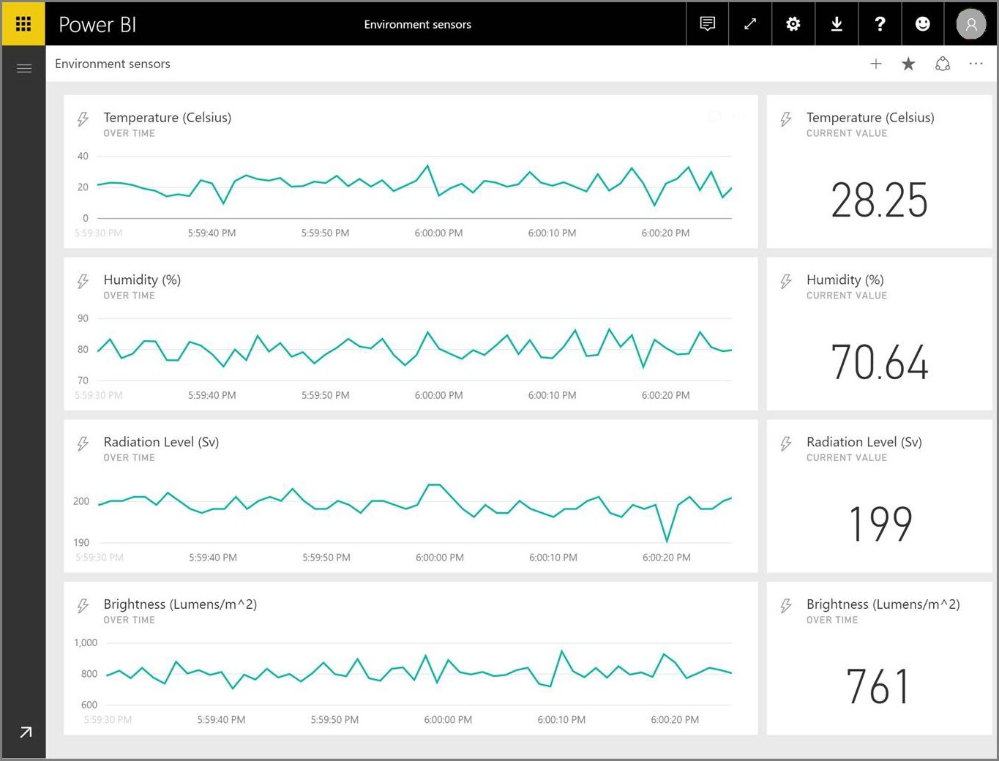
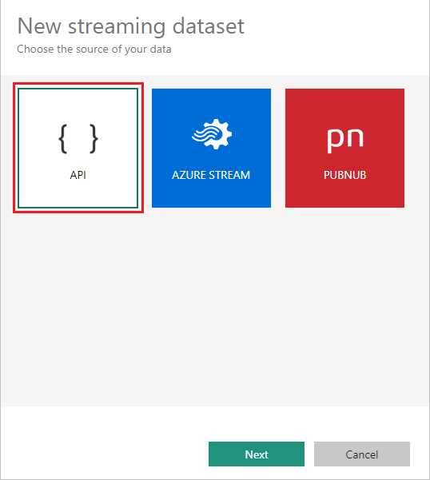
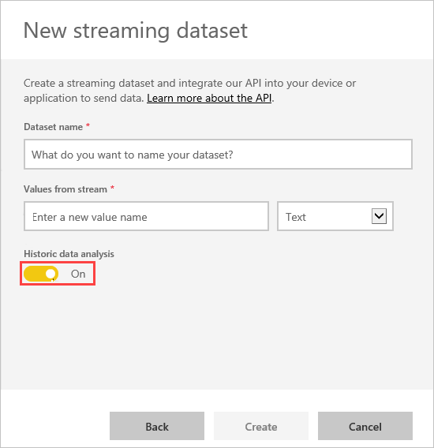
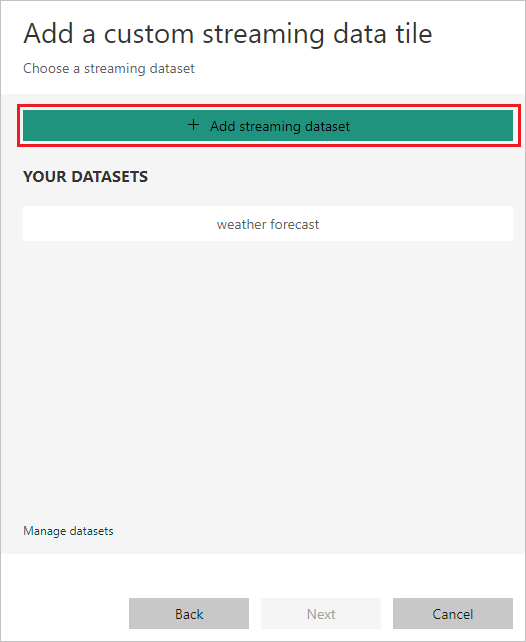
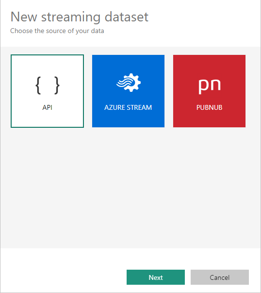
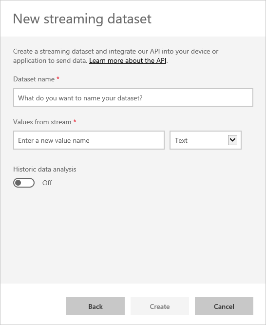
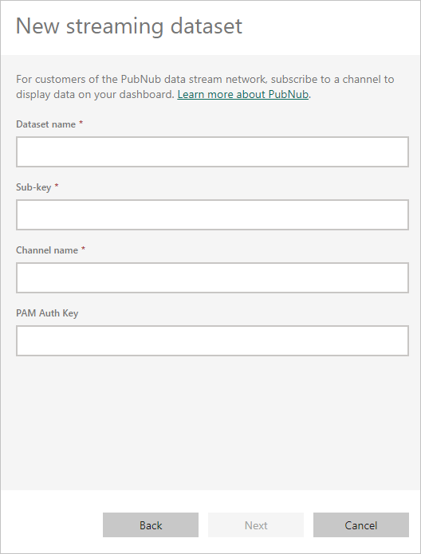
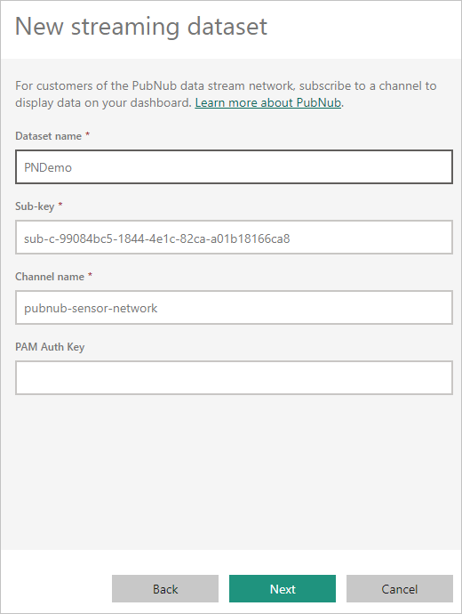
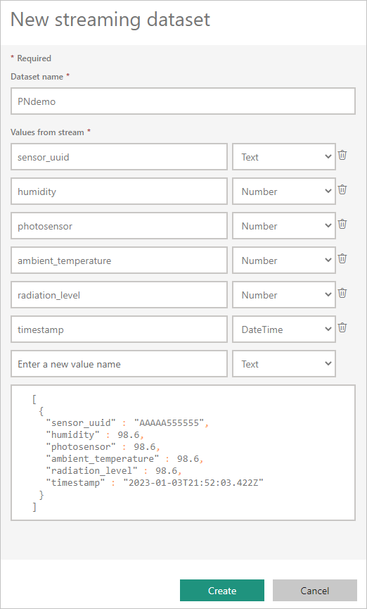

# Real-time streaming in Power BI

Power BI with real-time streaming helps you stream data and update dashboards in real time. Any visual or dashboard created in Power BI can display and update real-time data and visuals. The devices and sources of streaming data can be factory sensors, social media sources, service usage metrics, or many other time-sensitive data collectors or transmitters.

This article shows you how to set up and use real-time streaming semantic models in Power BI.

## Types of real-time semantic models

First, it's important to understand the types of real-time semantic models that are designed to display in tiles and dashboards, and how those semantic models differ.

The following three types of real-time semantic models are designed for display on real-time dashboards:

* Push semantic model
* Streaming semantic model
* PubNub streaming semantic model

This section explains how these semantic models differ from one another. Later sections describe how to push data into each of these semantic models.

### Push semantic model

With a *push semantic model*, data is pushed into the Power BI service. When the semantic model is created, the Power BI service automatically creates a new database in the service to store the data.

Because there's an underlying database that stores the data as it arrives, you can create reports with the data. These reports and their visuals are just like any other report visuals. You can use all of Power BI's report building features, such as Power BI visuals, data alerts, and pinned dashboard tiles.

Once you create a report using the push semantic model, you can pin any of the report visuals to a dashboard. On that dashboard, visuals update in real time whenever the data is updated. Within the Power BI service, the dashboard triggers a tile refresh every time new data is received.

There are two considerations to note about pinned tiles from a push semantic model:

- Pinning an entire report by using the **Pin live** option won't result in the data automatically being updated.
- Once you pin a visual to a dashboard, you can use **Q&A** to ask questions about the push semantic model in natural language. After you make a **Q&A** query, you can pin the resulting visual back to the dashboard, and that visual will also update in real time.

### Streaming semantic model

A *streaming semantic model* also pushes data into the Power BI service, with an important difference: Power BI stores the data only into a temporary cache, which quickly expires. The temporary cache is used only to display visuals that have some transient history, such as a line chart that has a time window of one hour.

A streaming semantic model has no underlying database, so you can't build report visuals by using the data that flows in from the stream. Therefore, you can't use report functionality such as filtering, Power BI visuals, and other report functions.

The only way to visualize a streaming semantic model is to add a tile and use the streaming semantic model as a *custom streaming data* source. The custom streaming tiles that are based on a streaming semantic model are optimized for quickly displaying real-time data. There's little latency between pushing the data into the Power BI service and updating the visual, because there's no need for the data to be entered into or read from a database.

In practice, it's best to use streaming semantic models and their accompanying streaming visuals in situations when it's critical to minimize the latency between pushing and visualizing data. You should have the data pushed in a format that can be visualized as-is, without any more aggregations. Examples of data that's ready as-is include temperatures and pre-calculated averages.

### PubNub streaming semantic model

With a *PubNub streaming semantic model*, the Power BI web client uses the [PubNub SDK](https://www.pubnub.com/docs/sdks) to read an existing PubNub data stream. The Power BI service stores no data. Because the web client makes this call directly, if you allow only approved outbound traffic from your network, you must list traffic to PubNub as allowed. For instructions, see the [support article about approving outbound traffic for PubNub](https://support.pubnub.com/hc/en-us/articles/360051496672).

As with the streaming semantic model, with the PubNub streaming semantic model there's no underlying Power BI database. You can't build report visuals against the data that flows in, and can't use report functionality like filtering or Power BI visuals. You can visualize a PubNub streaming semantic model only by adding a tile to the dashboard and configuring a PubNub data stream as the source.

Tiles based on a PubNub streaming semantic model are optimized for quickly displaying real-time data. Since Power BI is directly connected to the PubNub data stream, there's little latency between pushing the data into the Power BI service and updating the visual.

### Streaming semantic model matrix

The following table describes the three types of semantic models for real-time streaming and lists their capabilities and limitations.

|Capability|Push|Streaming|PubNub|
|----------|----|---------|------|
|Dashboard tiles update in real time as data is pushed in|**Yes.** For visuals built via reports and then pinned to dashboard.|**Yes.** For custom streaming tiles added directly to the dashboard.|**Yes.** For custom streaming tiles added directly to the dashboard.|
|Dashboard tiles update with smooth animations|**No.**|**Yes.**|**Yes.**|
|Data stored permanently in Power BI for historic analysis|**Yes.**|**No.** Data is temporarily stored for one hour to render visuals.|**No.**|
|Build Power BI reports on top of the data|**Yes.**|**No.**|**No.**|
|Max rate of data ingestion|**1 requests** **16 MB/request**|**5 requests** **15 KB/request**|**N/A** Data isn't being pushed into Power BI.|
|Limits on data throughput|**1M rows/hour**|None.|**N/A** Data isn't being pushed into Power BI.|

## Push data to semantic models

This section describes how to create and push data into the three primary types of real-time semantic models that you can use in real-time streaming.

You can push data into a semantic model by using the following methods:

* The Power BI REST APIs
* The Power BI streaming semantic model UI
* Azure Stream Analytics

### Use Power BI REST APIs to push data

You can use *Power BI REST APIs* to create and send data to push semantic models and to streaming semantic models. When you create a semantic model by using Power BI REST APIs, the `defaultMode` flag specifies whether the semantic model is push or streaming.

If no `defaultMode` flag is set, the semantic model defaults to a push semantic model. If the `defaultMode` value is set to `pushStreaming`, the semantic model is both a push and streaming semantic model, and provides the benefits of both semantic model types.

> [!NOTE]
> When you use semantic models with the `defaultMode` flag set to `pushStreaming`, if a request exceeds the 15 KB size restriction for a streaming semantic model, but is less than the 16 MB size restriction for a push semantic model, the request succeeds and the data updates in the push semantic model. However, any streaming tiles temporarily fail.

Once a semantic model is created, you can use the [PostRows](/rest/api/power-bi/pushdatasets/datasets_postrows) REST APIs to push data. All requests to REST APIs are secured by using *Microsoft Entra ID OAuth*.

### Use the streaming semantic model UI to push data

In the Power BI service, you can create a semantic model by selecting the **API** approach, as shown in the following screenshot:

When you create the new streaming semantic model, you can enable **Historic data analysis**, as shown in the following screenshot. This selection has a significant impact.

When **Historic data analysis** is disabled, as it is by default, you create a streaming semantic model as described earlier. When **Historic data analysis** is enabled, the semantic model you create becomes both a streaming semantic model and a push semantic model. This setting is equivalent to using the Power BI REST APIs to create a semantic model with its `defaultMode` set to `pushStreaming`, as described earlier.

> [!NOTE]
> Streaming semantic models created by using the Power BI service UI don't require Microsoft Entra authentication. In such semantic models, the semantic model owner receives a URL with a *rowkey*, which authorizes the requestor to push data into the semantic model without using a Microsoft Entra ID OAuth bearer token. However, the Microsoft Entra ID approach still works to push data into the semantic model.

### Use Azure Stream Analytics to push data

You can add Power BI as an output within Azure Stream Analytics, and then visualize those data streams in the Power BI service in real time. This section describes the technical details of that process.

Azure Stream Analytics uses the Power BI REST APIs to create its output data stream to Power BI, with `defaultMode` set to `pushStreaming`. The resulting semantic model can use both push and streaming. When you create the semantic model, Azure Stream Analytics sets the `retentionPolicy` flag to `basicFIFO`. With that setting, the database that supports the push semantic model stores 200,000 rows, and drops rows in a first-in first-out (FIFO) fashion.

> [!IMPORTANT]
> If your Azure Stream Analytics query results in very rapid output to Power BI, for example once or twice per second, Azure Stream Analytics begins batching the outputs into a single request. This batching might cause the request size to exceed the streaming tile limit, and streaming tiles might fail to render. In this case, the best practice is to slow the rate of data output to Power BI. For example, instead of a maximum value every second, request a maximum value over 10 seconds.

## Set up your real-time streaming semantic model in Power BI

To get started with real-time streaming, you choose one of the following ways to consume streaming data in Power BI:

- *Tiles* with visuals from streaming data
- *Semantic models* created from streaming data that persist in Power BI

For either option, you need to set up streaming data in Power BI. To get your real-time streaming semantic model working in Power BI:

1. In either an existing or new dashboard, select **Add a tile**.

1. On the **Add a tile** page, select **Custom Streaming Data**, and then select **Next**.

   

1. On the **Add a custom streaming data tile** page, you can select an existing semantic model, or select **Manage semantic models** to import your streaming semantic model if you already created one. If you don't have streaming data set up yet, select **Add streaming semantic model** to get started.

   

1. On the **New streaming semantic model** page, select **API**, **Azure Stream**, or **PubNub**, and then select **Next**.

   

## Create a streaming semantic model 

There are three ways to create a real-time streaming data feed that Power BI can consume and visualize:

- Power BI REST API using a real-time streaming endpoint
- Azure Stream
- PubNub

This section describes the Power BI REST API and PubNub options, and explains how to create a streaming tile or semantic model from the streaming data source. You can then use the semantic model to build reports. For more information about the Azure Stream option, see [Power BI output from Azure Stream Analytics](/azure/stream-analytics/power-bi-output).

### Use the Power BI REST API

The Power BI REST API makes real-time streaming easier for developers. After you select **API** on the **New streaming semantic model** screen and select **Next**, you can provide entries that enable Power BI to connect to and use your endpoint. For more information about the API, see [Use the Power BI REST APIs](/rest/api/power-bi).

If you want Power BI to store the data this data stream sends, so you can do reporting and analysis on the collected data, enable **Historic data analysis**.

After you successfully create your data stream, you get a REST API URL endpoint. Your application can call the endpoint by using `POST` requests to push your streaming data to the Power BI semantic model. In your `POST` requests, ensure that the request body matches the sample JSON that the Power BI user interface provided. For example, wrap your JSON objects in an array.

> [!CAUTION]
> For streaming semantic models you create in the Power BI service UI, the semantic model owner gets a URL that includes a *resource key*. This key authorizes the requestor to push data into the semantic model without using a Microsoft Entra ID OAuth bearer token. Keep in mind the implications of having a secret key in the URL when you work with this type of semantic model and method.

### Use PubNub

The integration of PubNub streaming with Power BI helps you create and use your low-latency PubNub data streams in Power BI. When you select **PubNub** on the **New streaming semantic model** screen and select **Next**, you see the following screen:

> [!IMPORTANT]
> You can secure PubNub channels by using a PubNub Access Manager (PAM) authentication key. This key is shared with all users who have access to the dashboard. For more information about PubNub access control, see [Manage Access](https://www.pubnub.com/docs/web-javascript/pam-security).

PubNub data streams are often high volume, and aren't always suitable for storage and historical analysis in their original form. To use Power BI for historical analysis of PubNub data, you must aggregate the raw PubNub stream and send it to Power BI, for example by using [Azure Stream Analytics](https://azure.microsoft.com/services/stream-analytics).

## Example of real-time streaming in Power BI

Here's an example of how real-time streaming in Power BI works. This sample uses a publicly available stream from PubNub. Follow along with the example to see the value of real-time streaming for yourself.

1. In the Power BI service, select or create a new dashboard. At the top of the screen, select **Edit** > **Add a tile**. 

1. On the **Add a tile** screen, select **Custom Streaming Data**, and then select **Next**.
   
   
   
1. On the **Add a custom streaming data tile** page, select **Add streaming semantic model**.

   

1. On the **New streaming semantic model** page, select **PubNub**, and then select **Next**.

1. On the next screen, enter a **Semantic model name**, enter the following values into the next two fields, and then select **Next**.
   
   - **Sub-key:** *sub-c-99084bc5-1844-4e1c-82ca-a01b18166ca8*
   - **Channel name:** *pubnub-sensor-network*
   
   
   
1. On the next screen, keep the automatically populated values, and select **Create**.
   
   
   
1. Back in your Power BI workspace, create a new dashboard, and at the top of the screen, select **Edit** > **Add a tile**.

1. Select **Custom Streaming Data**, and select **Next**.

1. On the **Add a custom streaming data tile** page, select your new streaming semantic model, and then select **Next**.

   Play around with the sample semantic model. By adding value fields to line charts and adding other tiles, you can get a real-time dashboard that looks like the following screenshot:
   
   

Go on to create your own semantic models and stream live data to Power BI.

## Questions and answers

Here are some common questions and answers about real-time streaming in Power BI.

#### Can you use filters on push or streaming semantic models?

Streaming semantic models don't support filtering. For push semantic models, you can create a report, filter the report, and then pin the filtered visuals to a dashboard. However, there's no way to change the filter on the visual once it's on the dashboard.

You can pin the live report tile to the dashboard separately, and then you can change the filters. However, live report tiles won't update in real time as data is pushed in. You have to manually update the visual by selecting the **Refresh** icon at top right on the dashboard page.

When you apply filters to push semantic models that have `DateTime` fields with millisecond precision, equivalence operators aren't supported. Operators such as greater than \> or less than \< operate properly.

#### How do you see the latest value on push or streaming semantic models?

Streaming semantic models are designed to display the latest data. You can use the **Card** streaming visual type to easily see the latest numeric values. Card visuals don't support `DateTime` or `Text` data types.

For push semantic models, if you have a timestamp in the schema, you can try creating a report visual with the `last N` filter.

#### How can you do modeling on real-time semantic models?

Modeling isn't possible on a streaming semantic model, because the data isn't stored permanently. For a push semantic model, you can use the [create semantic model REST API](/rest/api/power-bi/push-datasets/datasets-post-dataset) to create a semantic model with relationship and measures, and use the [update table REST APIs](/rest/api/power-bi/push-datasets/datasets-put-table) to add measures to existing tables.

#### How can you clear all the values on a push or streaming semantic model?

On a push semantic model, you can use the [delete rows REST API](/rest/api/power-bi/push-datasets/datasets-delete-rows) call. There's no way to clear data from a streaming semantic model, although the data will clear itself after an hour.

#### If you set up an Azure Stream Analytics output to Power BI but you don't see it in Power BI, what's wrong?

Take these steps to troubleshoot the issue:

1. Restart the Azure Stream Analytics job.
2. Try reauthorizing your Power BI connection in Azure Stream Analytics.
3. Make sure that you're checking the same workspace in the Power BI service that you specified for the Azure Stream Analytics output.
4. Make sure the Azure Stream Analytics query explicitly outputs to the Power BI output by using the `INTO` keyword.
5. Determine whether the Azure Stream Analytics job has data flowing through it. The semantic model is created only when data is being transmitted.
6. Look into the Azure Stream Analytics logs to see if there are any warnings or errors.

## Automatic page refresh

You can use automatic page refresh at a report page level to set a refresh interval for visuals that's only active when the page is being consumed. Automatic page refresh is available only for DirectQuery data sources. The minimum refresh interval depends on the type of workspace where the report is published and capacity admin settings for Premium workspaces.

For more information about automatic page refresh, see [Automatic page refresh in Power BI](../create-reports/desktop-automatic-page-refresh.md).

## Related content

- [Overview of the Power BI REST API with real-time data](/rest/api/power-bi)
- [Load data in a Power BI streaming semantic model and build a dataflows monitoring report with Power BI](/power-query/dataflows/load-dataflow-metadata-into-power-bi-dataset)
