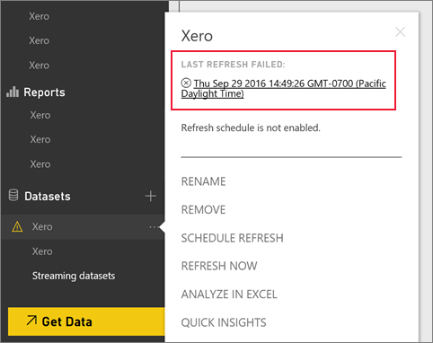

# How to refresh your Xero content pack credentials if refresh failed
If you use the Xero Power BI content pack, you may have experienced some problems with the content pack’s daily refresh due to a recent Power BI service incident.

You can see if your content pack refreshed successfully by checking the last refresh status for your Xero dataset as shown in the screenshot below.

If you do see that refresh failed as shown above, please follow these steps to renew your content pack credentials.

1. Click **More options** (...) next to your Xero dataset, then click **Schedule refresh**. This opens the settings page for the Xero content pack.
   
    
2. In the **Settings for Xero** page, select **Data source credentials** > **Edit credentials**.
   
    
3. Enter your organization’s name > **Next**.
   
    
4. Sign in with your Xero account.
   
    
5. Now that your credentials are updated, let’s make sure the refresh schedule is set to run daily. Check that by clicking **More options** (...) next to your Xero dataset, then clicking **Schedule refresh** again.
   
    
6. You can also choose to refresh the dataset immediately. Click **More options** (...) next to your Xero dataset, then click **Refresh now**.
   
    

If you are still having refresh issues, please don’t hesitate to reach out to us at [https://support.powerbi.com](https://support.powerbi.com) 

To learn more about the Xero content pack for Power BI, please visit the [Xero content pack help page](service-connect-to-xero.md).

### Next steps
* More questions? [Try the Power BI Community](https://community.powerbi.com/)

