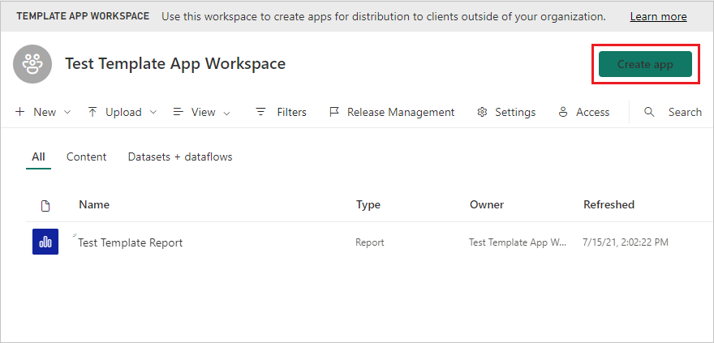
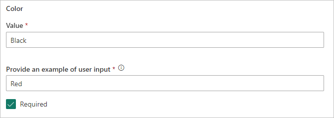
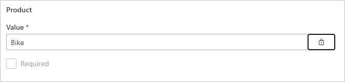
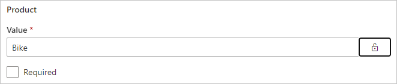
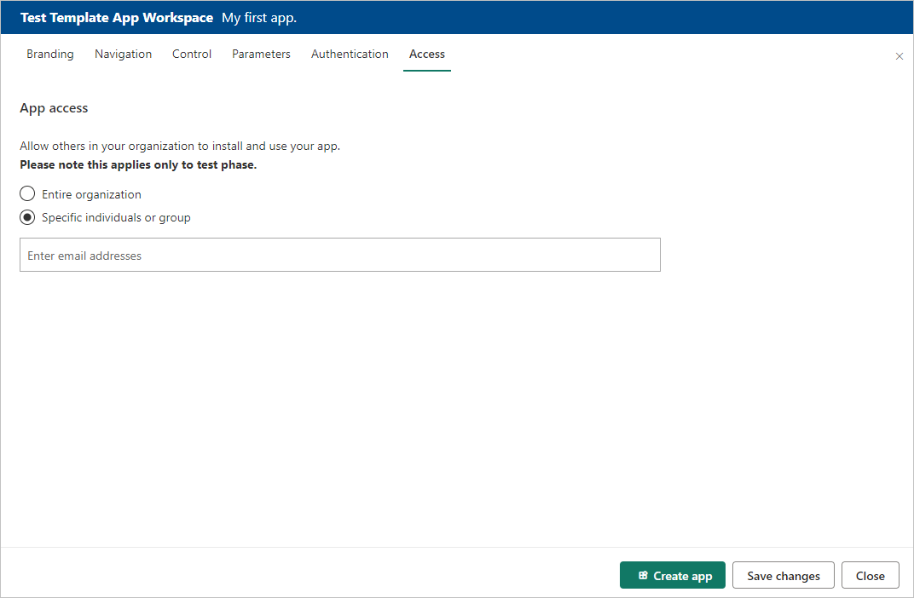
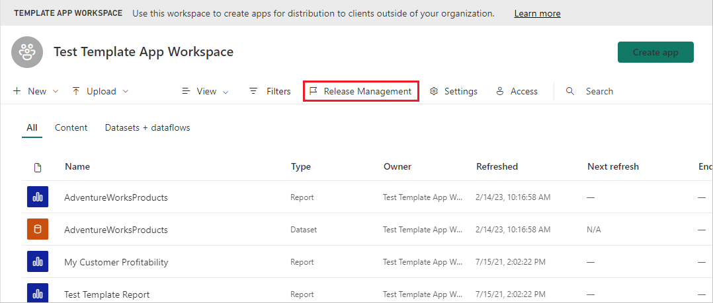
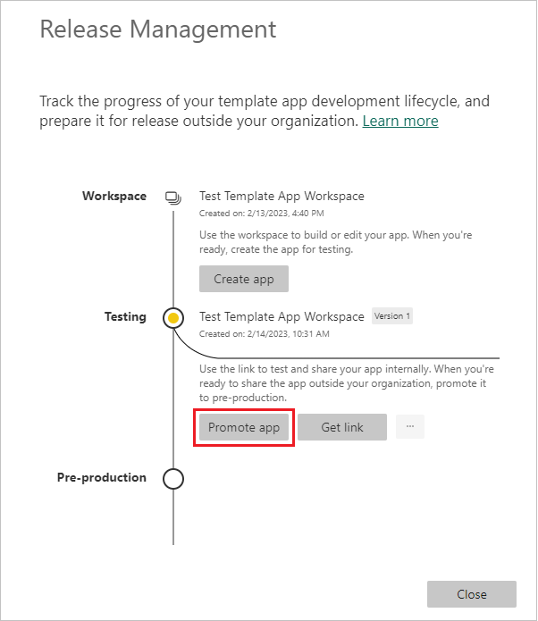

# Create a template app in Power BI

Power BI *template apps* enable Power BI partners to build Power BI apps with little or no coding, and deploy them to any Power BI customer.  This article contains step-by-step instructions for creating a Power BI template app.

If you can create Power BI reports and dashboards, you can become a *template app builder* and build and package analytical content into an *app*. You can then deploy your app to other Power BI tenants through any available platform, such as AppSource or your own web service. If you're distributing your template app through your own web service, you can even [automate part of the installation process](../developer/template-apps/template-apps-auto-install.md) to make things easier for your customers.

Power BI admins govern and control who in their organization can create template apps, and who can install them. Those users who are authorized can install your template app, then modify it and distribute it to the Power BI consumers in their organization.

## Prerequisites

Here are the requirements for building a template app:  

- A [Power BI pro license](../fundamentals/service-self-service-signup-for-power-bi.md)
- An [installation of Power BI Desktop](../fundamentals/desktop-get-the-desktop.md) (optional)
- Familiarity with the [basic concepts of Power BI](../fundamentals/service-basic-concepts.md)
- Permissions to share a template app publicly (for more information, see Power BI [admin portal, Template app settings](../admin/service-admin-portal.md#template-apps-settings)

## Create the template workspace

To create a template app you can distribute to other Power BI tenants, you need to create it in one of the new workspaces.

1. In the Power BI service, select **Workspaces** > **Create a workspace**.

    

2. In **Create a workspace**, enter a name, description (optional), and logo image (optional) for your workspace.

    

4. Expand the **Advanced** section and select **Develop a template app**.

    

5. Select **Save**.
>[!NOTE]
>You need permissions from your Power BI admin to promote template apps.

## Add content to the template app workspace

As with a regular Power BI workspace, your next step is add content to the workspace.  

- [Create your Power BI content](index.yml) in your workspace.

If you're using parameters in Power Query, make sure they have well-defined types (for example, Text). The types Any and Binary aren't supported.

[Tips for authoring template apps in Power BI](service-template-apps-tips.md) has suggestions to consider when creating reports and dashboards for your template app.

## Define the properties of the template app

Now that you have content in your workspace, you're ready to package it in a template app. The first step is to create a test template app, accessible only from within your organization on your tenant.

1. In the template app workspace, select **Create app**.

    

    Here, you fill in additional building options for your template app, in six tabs:

    **Branding**

    
    - App name
    - Description
    - Support site (link is presented under app info after redistributing template app as org app)
    - App logo (45K file size limit, 1:1 aspect ratio, .png .jpg .jpeg formats)
    - App theme color

    **Navigation**

    Activate the **New navigation builder**, where you can define the nav pane of the app (See [Design the navigation experience](../collaborate-share/service-create-distribute-apps.md#design-the-navigation-experience) in this article for details).

   
    
    **App landing page:** If you decide to opt out of the navigation builder, you have the option to select the app landing page. Define a report or dashboard to be the landing page of your app. Use a landing page that gives the right impression.

    **Control**

    Set limits and restrictions that your app's users will have with the content of your app. You can use this control to protect intellectual property in your app.

    

    >[!NOTE]
    >If you want to protect your data, disable the **Download the report to file** option and then configure the other two options as desired.
    >
    >Why:
    >
    > The view, edit, and export controls on this tab apply only to the Power BI service. Once you download the .pbix file, it is no longer in the service. It puts a copy of your data, unprotected, in a location chosen by the user. You then no longer have any control over what the user can do with it.
    >
    > If you want to limit access to your queries and measures while still allowing your users to add their own data sources, consider checking only the **Export or externally connect to data** options. This enables users to add their own data sources without being able to edit your dataset. [Learn more](../transform-model/desktop-composite-models.md)

    **Parameters**

    Parameters are created in the original pbix file (learn more about [creating query parameters](https://powerbi.microsoft.com/blog/deep-dive-into-query-parameters-and-power-bi-templates/)). You use the capabilities on this tab to help the app installer configure the app after installation when they connect to their data.

    In this tab you also provide a link to the app documentation.

    

    Each parameter has a name and a description, which come from the query, and a value field. You have three options for getting a value for the parameter during installation.

    * You can require the installer to enter a value. In this case, you provide an example that they will replace. To configure a parameter in this way, check the **Required** checkbox, and then give an example in the textbox that shows the user what kind of value is expected. For example:

       

    * You can provide a pre-populated value that the user who installs the app can’t change. A parameter configured in this way is hidden from the person installing the app. You should use this method only if you are sure that the pre-populated value is valid for all users; otherwise use the first method mentioned above that requires user input.

       To configure a parameter in this way, enter the value in the **Value** textbox and then click the lock icon. This makes it so the value can't be changed. For example:

       

    * You can provide a default value that the user can change during installation. To configure a parameter in this way, enter the desired default value in the **Value** textbox, and leave the lock icon unlocked. For example:

      

    **Authentication**
    
    In this tab you select the authentication method that will be used. The options that are available depend on the data source types being used.

    

    Privacy level is configured automatically:
   * Single datasource: Automatically configured as private.
   * Multi anonymous datasource: Automatically configured as public.

    **Access**
    
    In the test phase, decide who else in your organization can install and test your app. Don't worry, you can always come back and change these settings later. The setting doesn't affect access of the distributed template app.

    

2. Select **Create app**.

    You see a message that the test app is ready, with a link to copy and share with your app testers.

    

    You've also done the first step of the release management process, which follows.

## Manage the template app release

Before you release this template app publicly, you want to make sure it's ready to go. Power BI has created the release management pane, where you can follow and inspect the full app release path. You can also trigger the transition from stage to stage. The common stages are:

- Generate test app: for testing within your organization only.
- Promote the test package to pre-production stage: test outside of your organization.
- Promote pre-production package to Production: production version.
- Delete any package or start over from previous stage.

The URL doesn't change as you move between release stages. Promotion doesn't affect the URL itself.

Let's go through the stages:

1. In the template workspace, select **Release Management**.

    

2. Select **Get link** if you created the test app in the **Define the properties of the template app** section above (as a result the yellow dot next to **Testing** is already filled in).

    If you didn't yet create the app, select **Create app**. This brings you back into the template app creation process.

    

4. To test the app installation experience, copy the link in the notification window and paste it into a new browser window.

    From here, you're following the same procedure your customers will follow. See [Install and distribute template apps in your organization](service-template-apps-install-distribute.md).

5. In the dialog box, select **Install**.

    When installation succeeds, you see a notification that the new app is ready.

6. Select **Go to app**.

    Verify that the test app has the sample data. To make any changes, go back to the app in the original workspace. Update the test app until you're satisfied.

1. When you're ready to promote your app to pre-production for further testing outside your tenant, go back to the **Release Management** pane and select **Promote app**.

    
    >[!NOTE]
    > When the app is promoted it becomes publicly available outside your organization.

    If you don't see that option, contact your Power BI admin to grant you [permissions for template app development](../admin/service-admin-portal.md#template-apps-settings) in the admin portal.
11. Select **Promote** to confirm your choice.
12. Copy this new URL to share outside your tenant for testing. This link is also the one you submit to begin the process of distributing your app on AppSource by creating a [new Partner center offer](/azure/marketplace/partner-center-portal/create-power-bi-app-offer). Submit only pre-production links to the Partner center. Only after the app is approved and you get notification that it is published in AppSource, can you promote this package to production in Power BI.
13. When your app is ready for production or sharing via AppSource, go back to the **Release Management** pane and select **Promote app** next to **Pre-production**.
14. Select **Promote** to confirm your choice.

    Now your app is in production, and ready for distribution.

    

To make your app widely available to thousands of Power BI users in the world, we encourage you to submit it to AppSource. See the [Power BI Application offer](/azure/marketplace/partner-center-portal/create-power-bi-app-offer) for details.

## Automate parameter configuration during installation

If you are an ISV and are distributing your template app via your web service, you can create automation that configures template app parameters automatically when your customers install the app in their Power BI account. This makes things easier for your customers and increases the likelihood of a successful installation because they don't have to supply details that they might not know. See [Automated configuration of a template app installation](../developer/template-apps/template-apps-auto-install.md) for details.

## Next steps

See how your customers interact with your template app in [Install, customize, and distribute template apps in your organization](service-template-apps-install-distribute.md).

See the [Power BI Application offer](/azure/marketplace/partner-center-portal/create-power-bi-app-offer) for details on distributing your app.