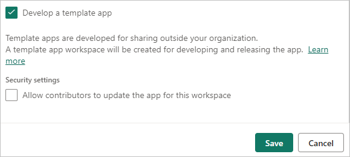
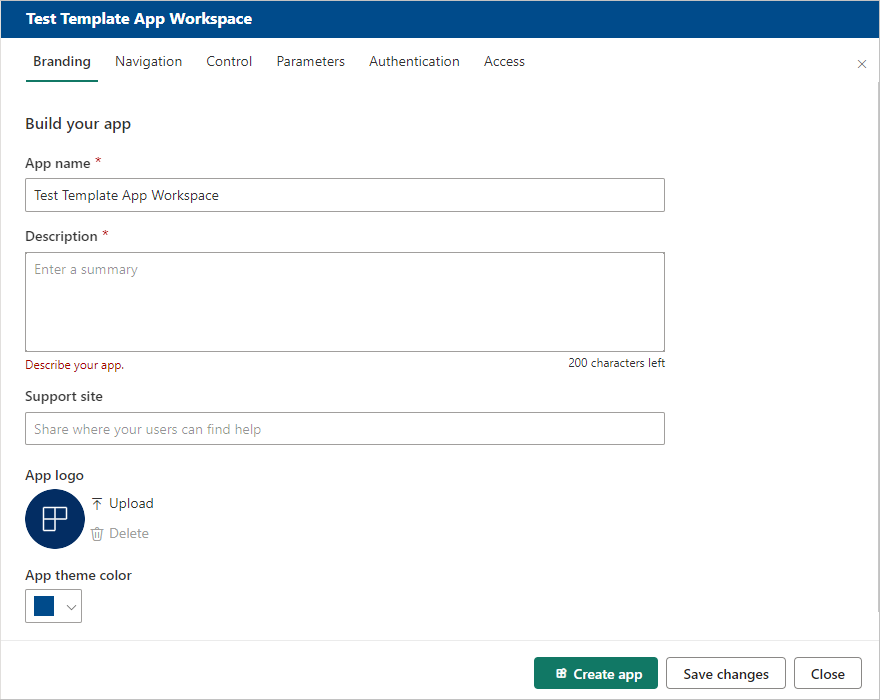
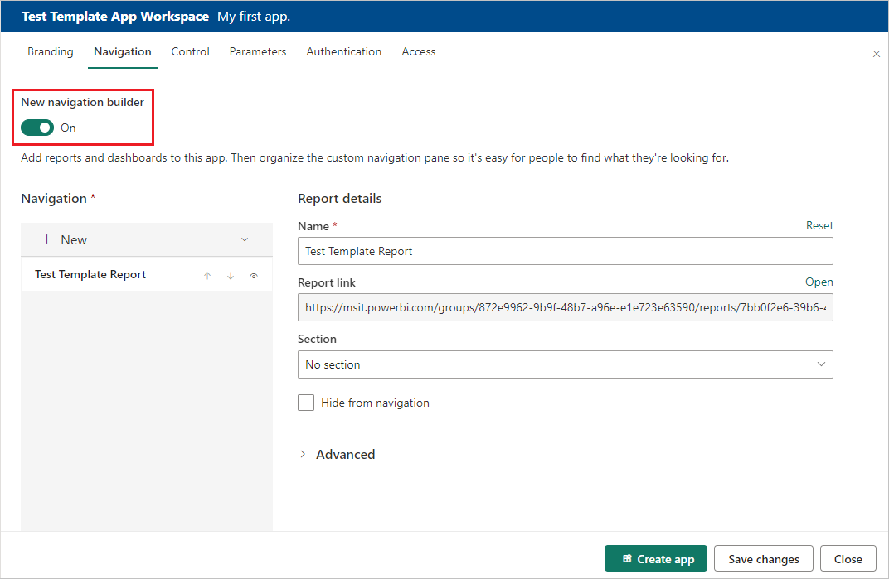
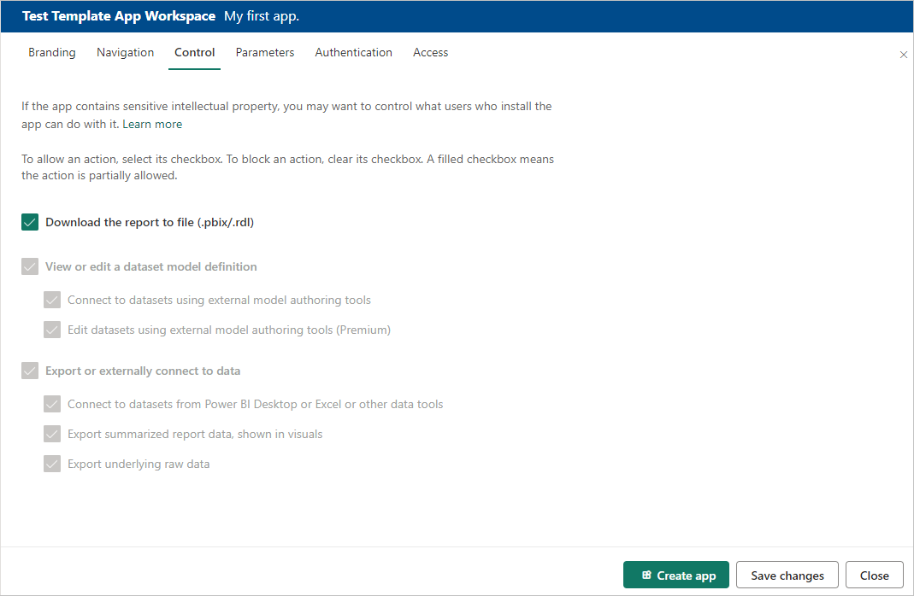
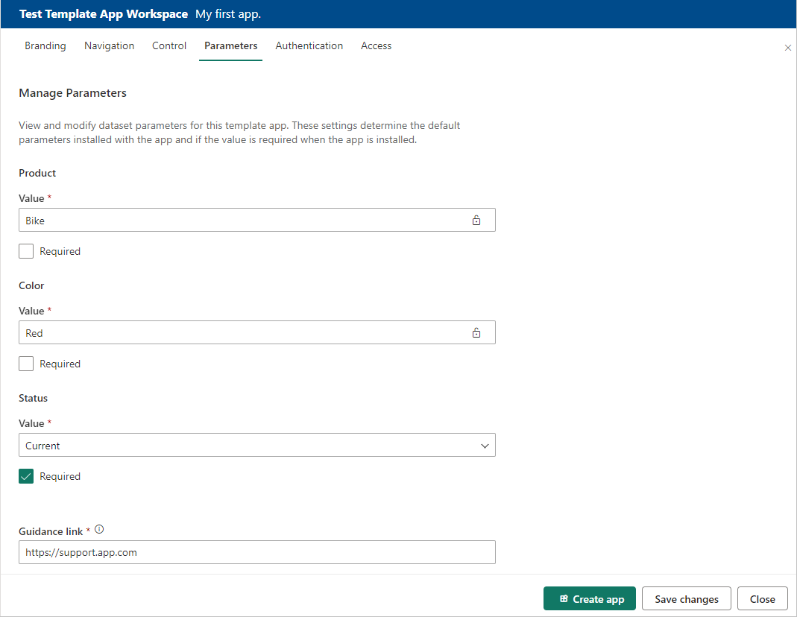
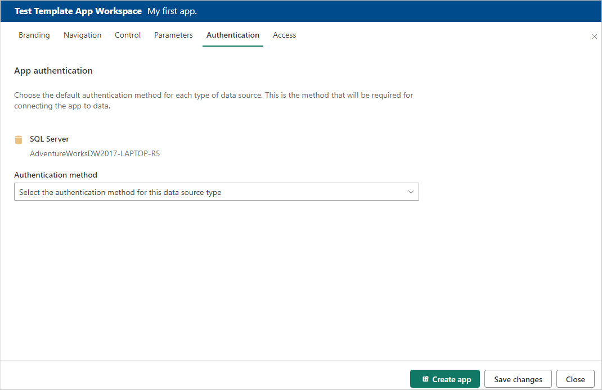
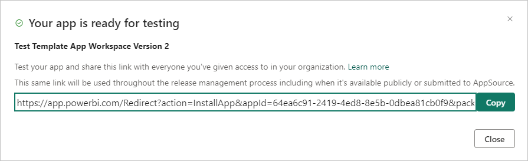
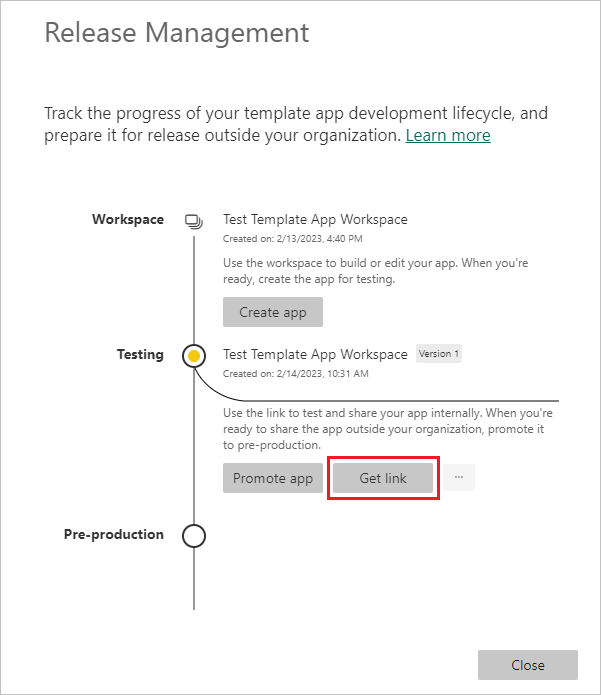

# Create a template app in Power BI

This article contains step-by-step instructions for creating a Power BI *template app*. Power BI template apps let Power BI partners build Power BI apps with little or no coding, and deploy them to any Power BI customer.

If you can create Power BI reports and dashboards, you can become a *template app builder* and build and package analytical content into an app. You can then deploy your app to other Power BI tenants through any available platform, such as AppSource or your own web service. If you're distributing your template app through your own web service, you can [automate part of the installation process](template-apps-auto-install.md) to make things easier for your customers.

Power BI admins govern and control who in their organization can create template apps, and who can install them. Authorized users can install your template app, modify it, and distribute it to the Power BI consumers in their organizations.

## Prerequisites

Here are the requirements for building a template app:  

- A [Power BI pro license](../fundamentals/service-self-service-signup-for-power-bi.md)
- [Power BI Desktop](../fundamentals/desktop-get-the-desktop.md) (optional)
- Familiarity with [basic Power BI concepts](../fundamentals/service-basic-concepts.md)
- Permissions to share a template app publicly as shown in [Template app tenant settings](/fabric/admin/service-admin-portal-template-app)

## Create the template workspace

To create a template app you can distribute to other Power BI tenants, you need to create it in a workspace.

1. In the Power BI service, create a workspace as described in [Create a workspace in Power BI](../collaborate-share/service-create-the-new-workspaces.md). In the **Advanced** section, select **Develop a template app**.

   

   >[!Important]
   > The capacity that the app builder workspace is assigned to does not determine the capacity assignment of workspaces where app installers install the app. This means that an app developed in a premium capacity workspace will not necessarily be installed on a premium capacity workspace. Therefore it is **not** recommended to use premium capacity for the builder workspace, as installer workspaces might not be premium capacity, and functionality that relies on premium capacity won't work unless the installer manually reassigns the installed workspace to premium capacity.

1. When you're done creating the workspace, select **Save**.

>[!NOTE]
>You need permissions from your Power BI admin to promote template apps.

## Add content to the template app workspace

As with a regular Power BI workspace, your next step is to add content to the workspace. If you're using parameters in Power Query, make sure they have well-defined types, such as `Text`. The types `Any` and `Binary` aren't supported.

For suggestions to consider when creating reports and dashboards for your template app, see [Tips for authoring template apps in Power BI](service-template-apps-tips.md).

## Define the properties of the template app

Now that you have content in your workspace, you can package it in a template app. The first step is to create a test template app, accessible only from within your organization on your tenant.

1. In the template app workspace, select **Create app**.

   

   Next, fill in more options for your template app in six tabs.

1. On the **Branding** tab, complete the following fields:

   - **App name**
   - **Description**
   - **Support site**. The support link appears under app info after you redistribute the template app as an organizational app.
   - **App logo**. The logo has a 45K file-size limit, must have a 1:1 aspect ratio, and must be in a *.png*, *.jpg*, or *.jpeg* file format.
   - **App theme color**

   

1. On the **Navigation** tab, you can turn on **New navigation builder** to define the navigation pane of the app. 

   
   
   If you don't turn on **New navigation builder**, you have the option of selecting an app landing page. Define a report or dashboard to be the landing page of your app. Use a landing page that gives the impression you want.

1. On the **Control** tab, set your app users' limits and restrictions on your app's content. You can use this control to protect intellectual property in your app.

   

   > [!NOTE]
   > If you want to protect your data, disable the **Download the report to file** option and then configure the other two options as desired.
   >
   > Why:
   > 
   > The view, edit, and export controls on this tab apply only to the Power BI service. Once you download the *.pbix* file, it is no longer in the service. It puts a copy of your data, unprotected, in a location chosen by the user. You then no longer have any control over what the user can do with it.
   > 
   > If you want to limit access to your queries and measures while still allowing your users to add their own data sources, consider checking only the **Export or externally connect to data** options. This enables users to add their own data sources without being able to edit your semantic model. For more information, see [Use composite models in Power BI Desktop](../transform-model/desktop-composite-models.md).

1. Parameters are created in the original *.pbix* file (learn more about [creating query parameters](https://powerbi.microsoft.com/blog/deep-dive-into-query-parameters-and-power-bi-templates/)). You use the capabilities on this tab to help the app installer configure the app after installation when they connect to their data.

   

   Each parameter has a name, which comes from the query, and a **Value** field. There are three options for getting a value for the parameter during installation:

   - You can require the user who installs the app to enter a value.

     In this case, you provide an example that the user replaces. To configure a parameter in this way, select the **Required** checkbox, and then give an example in the textbox that shows the user what kind of value is expected, as shown in the following example.

     

   - You can provide a pre-populated value that the user who installs the app can't change.

     A parameter configured in this way is hidden from the user who installs the app. You should use this method only if you're sure that the pre-populated value is valid for all users. If not, use the first method that requires user input.

     To configure a parameter in this way, enter the value in the **Value** textbox, and then select the lock icon so the value can't be changed. The following example shows this option:

     

   - You can provide a default value that the user can change during installation.

     To configure a parameter in this way, enter the desired default value in the **Value** textbox, and leave the lock icon unlocked, as in the following example:

     

   In this tab, you also provide a link to the app documentation.

1. On the **Authentication** tab, select the authentication method to use. The available options depend on the data source types being used.

   

   Privacy level is configured automatically:
   - A single datasource is automatically configured as private.
   - A multi anonymous datasource is automatically configured as public.

1. In the test phase, on the **Access** tab decide who else in your organization can install and test your app. You will come back and change these settings later. The setting doesn't affect access of the distributed template app.

   

1. Select **Create app**.

   You see a message that the test app is ready, with a link to copy and share with your app testers.

   

   You've also done the first step of the following release management process.

## Manage the template app release

Before you release the template app publicly, you want to make sure it's ready. In the Power BI release management pane, you can follow and inspect the full app release path. You can also trigger the transition from stage to stage. The common stages are:

- Generate a test app for testing within your organization only.
- Promote the test package to pre-production stage and test outside of your organization.
- Promote the pre-production package to the production version in Production.
- Delete any package or start over from a previous stage.

The URL doesn't change as you move between release stages. Promotion doesn't affect the URL itself.

To go through the release stages:

1. In the template workspace, select **Release Management**.

   

1. If you followed the steps in this article to create the test app, the dot next to **Testing** will already be filled in. Select **Get link**.

   If you haven't created the app yet, select **Create app** to start the template app creation process.

   

1. To test the app installation experience, copy the link in the window and paste it into a new browser window.

   From here, you follow the same procedure your app installers will follow. For more information, see [Install and distribute template apps in your organization](service-template-apps-install-distribute.md).

1. In the dialog box, select **Install**.

1. After installation succeeds, select the app in the **Apps** list to open it.

1. Verify that the test app has the sample data. To make any changes, go back to the app in the original workspace. Update the test app until you're satisfied.

1. When you're ready to promote your app to pre-production for testing outside your tenant, go back to the **Release Management** pane and select **Promote app**.

   

   >[!NOTE]
   > When you promote the app, it becomes publicly available outside your organization.

   If you don't see the **Promote app** option, contact your Power BI admin to grant you [permissions for template app development](/fabric/admin/service-admin-portal-template-app) in the admin portal.

1. In the dialog box, select **Promote**.

1. Copy the new URL to share outside your tenant for testing. This link is also the one you submit to begin the process of distributing your app on AppSource by creating a [new Partner center offer](/azure/marketplace/partner-center-portal/create-power-bi-app-offer).

   Submit only pre-production links to the Partner center. After the app is approved and you get notification that it's published in AppSource, you can promote the package to production in Power BI.

1. When your app is ready for production or sharing via AppSource, go back to the **Release Management** pane and select **Promote app** next to **Pre-production**.

1. Select **Promote**.

    Now your app is in production and ready for distribution.

   

To make your app widely available to Power BI users throughout the world, submit it to AppSource. For more information, see the [Create a Power BI app offer](/azure/marketplace/partner-center-portal/create-power-bi-app-offer).

## Automate parameter configuration during installation

If you're an independent software vendor and distribute your template app via your web service, you can create automation that configures template app parameters automatically when your customers install the app in Power BI. Automatic configuration makes things easier for your customers and increases the likelihood of a successful installation, because customers don't have to supply details that they might not know. For more information, see [Automated configuration of a template app installation](template-apps-auto-install.md).

## Related content

- To learn how your customers interact with your template app, see [Install, customize, and distribute template apps in your organization](service-template-apps-install-distribute.md).
- For details on distributing your app, see the [Create a Power BI app offer](/azure/marketplace/partner-center-portal/create-power-bi-app-offer).

