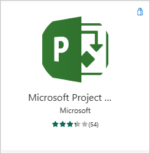
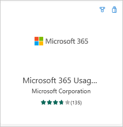

# What are Power BI template apps?

The new Power BI *template apps* enable Power BI partners to build Power BI apps with little or no coding, and deploy them to any Power BI customer. This article is an overview of the Power BI template app program.

As a Power BI partner, you create a set of out-of-the-box content for your customers and publish it yourself.

You build template apps that allow your customers to connect and instantiate within their own accounts. As domain experts, they can unlock the data in a way that's easy for their business users to consume.

You submit a template app to the Partner center. The apps then become publicly available in the [Power BI apps](https://app.powerbi.com/groups/me/getapps/apps) marketplace and on [the Microsoft commercial marketplace](https://appsource.microsoft.com/?product=power-bi). Here's a high-level look at the public template app creation experience.

## Power BI Apps marketplace

Power BI template apps allow Power BI Pro or Power BI Premium users to gain immediate insights through prepackaged dashboards and reports that can be connected to live data sources. Many Power BI Apps are already available in the [Power BI Apps](https://app.powerbi.com/groups/me/getapps/apps) marketplace.

:::row:::
    :::column:::
        
    :::column-end:::
    :::column:::
        
    :::column-end:::
    :::column:::
        
    :::column-end:::
    :::column:::
        
    :::column-end:::
:::row-end:::

 > [!NOTE]
 > Marketplace apps aren't available for US government cloud instances. For more information, see [Power BI for US government customers](../enterprise/service-govus-overview.md).

## Process

The general process to develop and submit a template app involves several stages. Some stages can include more than one activity at the same time.

| Stage | Power BI Desktop |Power BI service |Partner Center  |
|---|--------|---------|---------|
| **One** | Build a data model and report in a *.pbix* file | Create a workspace. Import *.pbix* file. Create a complementary dashboard | Register as a partner |
| **Two** |  |Create a test package and run internal validation        |
| **Three** |  |Promote the test package to preproduction for validation outside your Power BI tenant, and submit it to AppSource  | With your preproduction package, create a Power BI template app offer and start the validation process |
| **Four** | |Promote the preproduction package to production |  Go live |

## Before you begin

To create the template app, you need permissions to create one. For more information, see [Template app tenant settings](/fabric/admin/service-admin-portal-template-app).

To publish a template app to the Power BI service and AppSource, you must meet the requirements for [becoming a Partner Center publisher](/azure/marketplace/become-publisher).

## High-level steps

Here are the high-level steps.

1. [Review the requirements](#requirements) to make sure you meet them.

2. Build a report in Power BI Desktop. Use parameters so you can save it as a file other people can use.

3. Create a workspace for your template app in your tenant on the Power BI service (`app.powerbi.com`).

4. Import your *.pbix* file and add content such as a dashboard to your app.

5. Create a test package to test the template app yourself within your organization.

6. Promote the test app to pre-production to submit the app for validation in AppSource, and to test outside your own tenant.

7. Submit the content to [Partner center](/azure/marketplace/partner-center-portal/create-power-bi-app-offer) for publishing.

8. Make your offer go *Live* in AppSource, and move your app to production in Power BI.

9. Now you can start developing the next version in the same workspace, in preproduction.

## Requirements

To create the template app, you need permissions to create one. For more information, see [Template app tenant settings](/fabric/admin/service-admin-portal-template-app).

To publish a template app to the Power BI service and AppSource, you must meet the requirements for [becoming a Partner Center publisher](/azure/marketplace/become-publisher).

 > [!NOTE]
 > Template apps submissions are managed in [Partner Center](/azure/marketplace/partner-center-portal/create-power-bi-app-offer). Use the same Microsoft Developer Center registration account to sign in. You should have only one Microsoft account for your AppSource offerings. Accounts shouldn't be specific to individual services or offers.

## Tips

- Make sure your app includes sample data to get everyone started in a click.
- Limit semantic model size (rule of thumb: *.pbix* file < 10MBs). This typically means keeping the size of sample data as small as possible.
- Carefully examine your application by installing it in your tenant and in a secondary tenant. Make sure customers only see what you want them to see.
- Use AppSource as your online store to host your application. This way everyone using Power BI can find your app.
- Consider offering more than one template app for separate unique scenarios.
- Enable data customization. For example, support custom connection and parameters configuration by the installer.
- If you're an independent software vendor and are distributing your app through your web service, consider automating parameter configuration during installation to make things easier for your customers and to increase the likelihood of a successful installation. For more information, see [Automated configuration of a template app installation](template-apps-auto-install.md).

See [Tips for authoring template apps in Power BI](service-template-apps-tips.md) for more suggestions.

## Known limitations

| Feature | Known Limitation |
|---------|---------|
| Contents: Semantic models | Exactly one semantic model should be present. Only semantic models built into Power BI Desktop (*.pbix* files) are allowed. Not supported: Semantic models from other template apps, cross-workspace semantic models, paginated reports (*.rdl* files), and Excel workbooks. |
|Contents:  Reports   | A single template app can't include more than 20 reports. |
|Contents: Dashboards | Real-time tiles aren't allowed. In other words, no support for push or streaming datasets. |
|Contents: Dataflows | Not supported: Dataflows. |
|Contents from files | Only *.pbix* files are allowed. Not supported: *.rdl* files (paginated reports) and Excel workbooks. |
| Data sources | Data sources supported for cloud Scheduled Data refresh are allowed. Not supported: Live connections, on-premises data sources (personal and enterprise gateways aren't supported), real time (no support for push dataset), and composite models. |
| Semantic model: cross-workspace | No cross-workspace semantic models are allowed. |
| Query parameters | Not supported: Parameters of type *Any*, *Date*, or *Binary* type block refresh operation for semantic model. |
| Incremental refresh | Template apps don't support incremental refresh. |
| Power BI visuals | Only publicly available Power BI visuals are supported. [Organizational Power BI visuals](../developer/visuals/power-bi-custom-visuals-organization.md) aren't supported. |
| Sovereign clouds | Template apps aren't available in sovereign clouds. |
| Composite models | Composite models shouldn't be used in the app builder workspace. App installers can use composite models after installing the app. |
| Large semantic model storage format | Large semantic model storage format isn't supported for template apps. |
| Mobile layout | Partial support. Mobile layout positioning of elements is supported. Mobile layout changes to other properties, such as color, are not supported. |

## Support

For support during development, use [https://powerbi.microsoft.com/support](https://powerbi.microsoft.com/support). We actively monitor and manage this site. Customer incidents quickly find their way to the appropriate team.

## Related content

- [Create a template app](service-template-apps-create.md)
