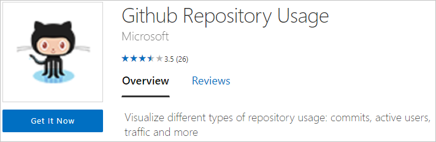

# Tips for authoring template apps in Power BI

When you're [authoring your template app](service-template-apps-create.md) in Power BI, part of it is the logistics of creating the workspace, testing it, and production. But the other important part is obviously authoring the report and the dashboard. We can break down the authoring process into four main components. Working on these components helps you create the best possible template app:

* With **queries**, you [connect](desktop-connect-to-data.md) and [transform](../transform-model/desktop-query-overview.md) the data, and define [parameters](https://powerbi.microsoft.com/blog/deep-dive-into-query-parameters-and-power-bi-templates/). 
* In the **data model**, you create [relationships](../transform-model/desktop-create-and-manage-relationships.md), [measures](../transform-model/desktop-measures.md), and Q&A improvements.  
* **[Report pages](../create-reports/desktop-report-view.md)** include visuals and filters to provide insights into your data.  
* **[Dashboards](../consumer/end-user-dashboards.md)** and [tiles](../create-reports/service-dashboard-create.md) offer an overview of the insights included.
* Sample data makes your app discoverable immediately after installation.

You may be familiar with each piece as existing Power BI features. When building a template app, there are additional things to consider for each piece. See each section below for more details.

## Queries
For template apps, queries developed in Power BI Desktop are used to connect to your data source and import data. These queries are required to return a consistent schema and are supported for Scheduled Data refresh.

### Connect to your API
To get started, you need to connect to your API from Power BI Desktop to start building your queries.

You can use the Data Connectors that are available in Power BI Desktop to connect to your API. You can use the Web Data Connector (**Get data** > **Web**) to connect to your Rest API or the OData connector (**Get data** > **OData feed**) to connect to your OData feed.

> [!NOTE]
> Currently template apps do not support custom connectors, it is recommended to explore using Odatafeed Auth 2.0 as a mitigation for some of the connection use-cases or to submit your connector for certification. For details on how to develop a connector and certify it check the [Data Connectors documentation](https://aka.ms/DataConnectors).

### Consider the source
The queries define the data that's included in the data model. Depending on the size of your system, these queries should also include filters to ensure your customers are dealing with a manageable size that fits your business scenario.

Power BI template apps can execute multiple queries in parallel and for multiple users concurrently.  Plan ahead your throttling and concurrency strategy and ask us how to make your template app fault tolerant.

### Schema enforcement
Ensure your queries are resilient to changes in your system, changes in schema on refresh can break the model. If the source could return null or missing schema result for some queries, consider returning an empty table or a meaningful custom error message.

### Parameters
[Parameters](https://powerbi.microsoft.com/blog/deep-dive-into-query-parameters-and-power-bi-templates/) in Power BI Desktop allow your users to provide input values that customize the data retrieved by the user. Think of the parameters up front to avoid rework after investing time to build detailed queries or reports.

> [!NOTE]
> Template apps support all parameters except Any and Binary.
>

### Additional query tips

* Ensure all columns are typed appropriately.
* Columns have informative names (see [Q&A](#qa)).  
* For shared logic, consider using functions or queries.  
* Privacy levels are currently not supported in the service. If you get a prompt about privacy levels, you may need to rewrite the query to use relative paths.  

## Data models

A well-defined data model ensures your customers can easily and intuitively interact with the template app. Create the data model in Power BI Desktop.

> [!NOTE]
> You should do much of the basic modeling (typing, column names) in the [queries](#queries).

### Q&A
The modeling also affects how well Q&A can provide results for your customers. Ensure you add synonyms to commonly used columns and you've properly named your columns in the [queries](#queries).

### Additional data model tips

Make sure you've:

* Applied formatting to all value columns. Apply types in the query.  
* Applied formatting to all measures.
* Set default summarization. Especially "Do Not Summarize", when applicable (for unique values, for example).  
* Set data category, when applicable.  
* Set relationships, as necessary.  

## Reports
The report pages offer additional insight into the data included in your template app. Use the pages of the reports to answer the key business questions your template app is trying to address. Create the report using Power BI Desktop.

### Additional report tips

* Use more than one visual per page for cross-filtering.  
* Align the visuals carefully (no overlapping).  
* Page is set to "4:3" or "16:9" mode for layout.  
* All of the aggregations presented make numeric sense (averages, unique values).  
* Slicing produces rational results.  
* Logo is present on at least the top report.  
* Elements are in the client's color scheme to the extent possible.

>[!NOTE]
> A single template app cannot include more than twenty reports.  

## Dashboards
The dashboard is the main point of interaction with your template app for your customers. It should include an overview of the content included, especially the important metrics for your business scenario.

To create a dashboard for your template app, just upload your PBIX through **Get data** > **Files** or publish directly from Power BI Desktop.

### Additional dashboard tips

* Maintain the same theme when pinning so that the tiles on your dashboard are consistent.  
* Pin a logo to the theme so consumers know where the pack is from.  
* Suggested layout to work with most screen resolutions is 5-6 small tiles wide.  
* All dashboard tiles should have appropriate titles/subtitles.  
* Consider groupings in the dashboard for different scenarios, either vertically or horizontally.  

## Sample data
Template apps, as part of the app creation stage, wraps the cache data in the workspace as part of the app:

* Allows the installer to understand the functionality and purpose of the app before connecting data.
* Creates an experience that drives the installer to further explore app capabilities, which leads to connecting the app dataset.

We recommend having quality sample data before creating the app to ensure that the app's report and dashboards are populated with data. Try to keep sample data size as small as possible.

## Publishing on AppSource
Template apps can be published on AppSource, follow these guidelines before submitting your app to AppSource:

* Make sure you create a template app with engaging sample data that can help the installer understand what the app can do (empty report & dashboard aren't approved).
Template apps support sample data only apps, make sure to check the static app checkbox. [Learn more](./service-template-apps-create.md#define-the-properties-of-the-template-app)
* Have instruction for the validation team to follow which includes credentials and parameters that are required to connect to data.
* Application must include an App icon in Power BI and on your CPP offer. [Learn more](./service-template-apps-create.md#define-the-properties-of-the-template-app)
* Landing page configured. [Learn more](./service-template-apps-create.md#define-the-properties-of-the-template-app)
* Make sure to follow the documentation on [Partner center -> Power BI App offer](/azure/marketplace/partner-center-portal/create-power-bi-app-offer).
* In case a dashboard is part of your app, make sure it's not empty.
* Install the app using the app link before submitting it, make sure you can connect the dataset and the app experience is as you planned.
* Before uploading pbix into the template workspace, make sure to unload any unnecessary connections.
* Follow Power BI [Best design practices for reports and visuals](../visuals/power-bi-report-visualizations.md) to achieve maximum impact on your users and getting approved for distribution.
<!--- * In general, only application with valuable functionality can be approved for general use on AppSource. Application with sample data content only must have either a guidance or statistical value.) -->

## Create a download link for the app

After publishing the template app on AppSource, consider creating a download link from your website to either:
* AppSource download page - can be viewed by publicly, get the link from your AppSource page.
* Power BI - Can be viewed by a Power BI user.

In order to redirect a user to the app's download link in Power BI see the following code example: [GitHub repo](https://github.com/microsoft/Template-apps-examples).

## Automate parameter configuration during installation

If you are an ISV and are distributing your template app via your web service, you can create automation that configures template app parameters automatically when your customers install the app in their Power BI account. This makes things easier for your customers and increases the likelihood of a successful installation because they don't have to supply details that they might not know. See [Automated configuration of a template app installation](template-apps-auto-install.md) for details.

## Next steps

[What are Power BI template apps?](service-template-apps-overview.md)
