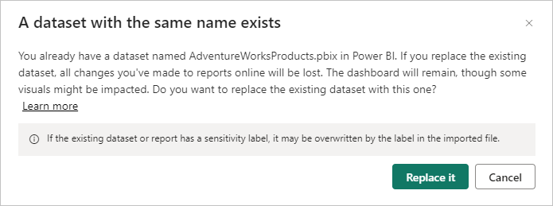
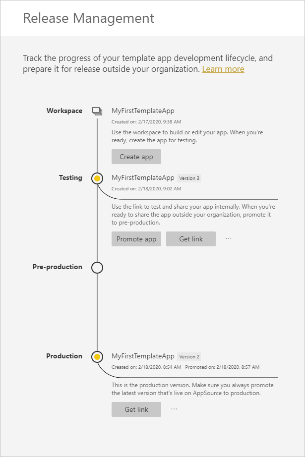
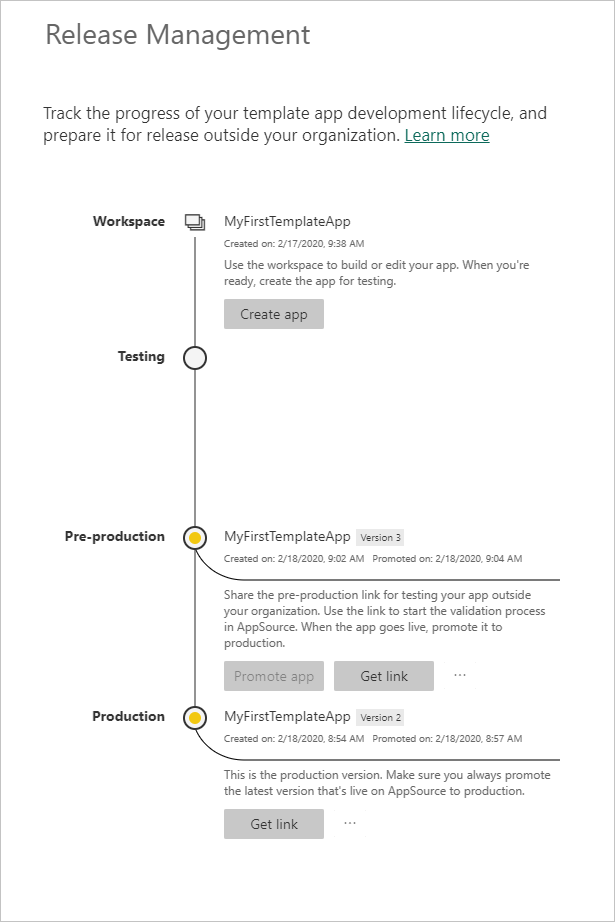
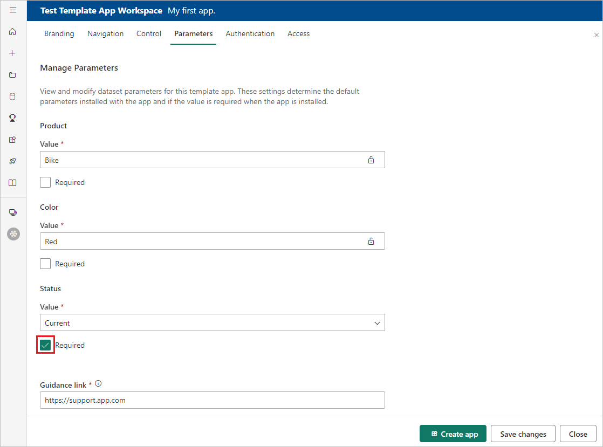
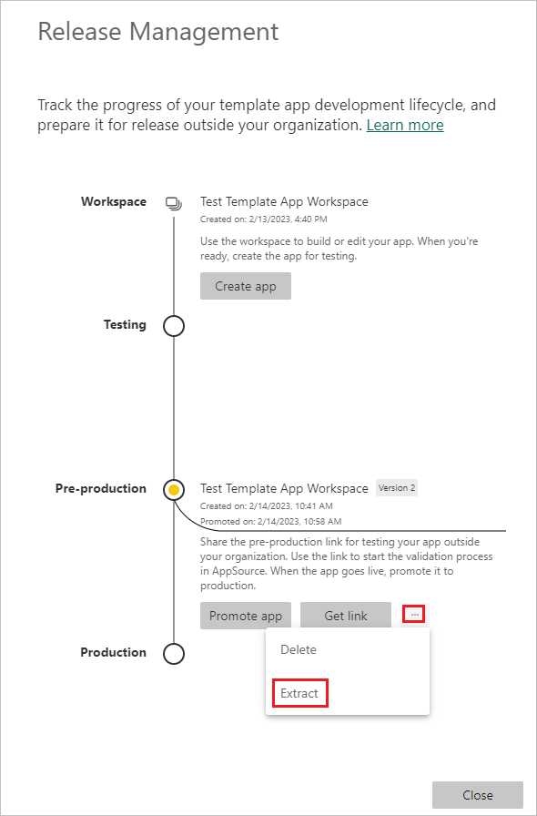
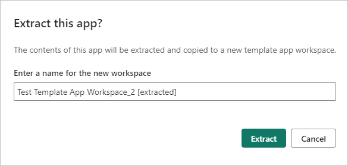
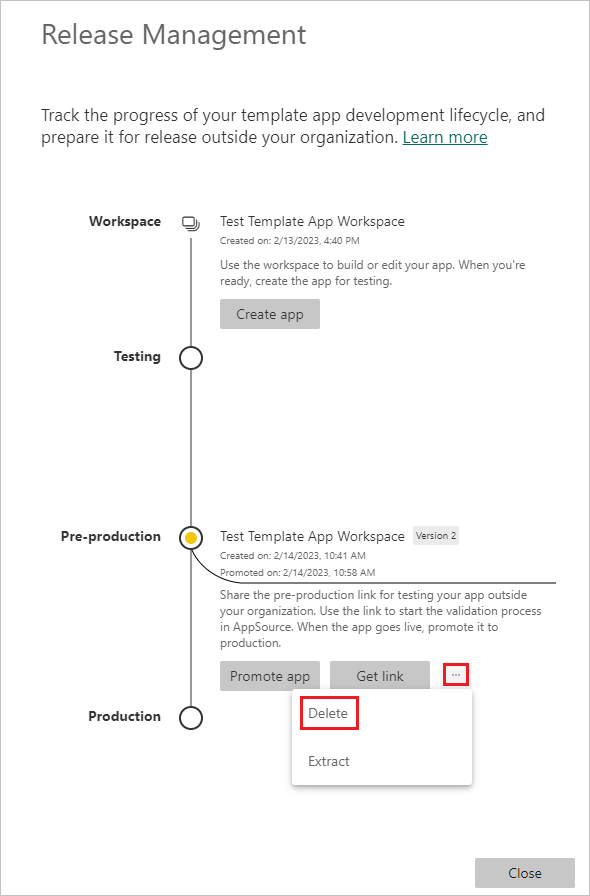
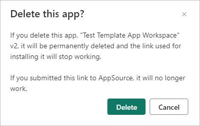

# Manage your published template app

If you have a Power BI template app in production, when you want to make changes to the app, you can start over in the test phase, without interfering with the app in production.

## Update your app

Go to the template app workspace. Then, if you made your changes in Power BI Desktop, start at Step 1. If you did not make any changes in Power BI Desktop, start at Step 2.

1. Upload your updated semantic model and **make sure to overwrite the existing semantic model**.

   - If the *.pbix* file you're uploading has the same name as the semantic model and report used in the app, uploading will overwrite the existing semantic model.
   
   - If you're changing the name of the semantic model and report used in the app, and the *.pbix* file you want to upload has a different name than the semantic model and report used in the app, do the following:

     - Rename the semantic model and report used in the app so that their names exactly match the name of your updated *.pbix* file.
     - Upload your *.pbix* file and overwrite the existing semantic model and report that you just renamed.

     In either case, to upload a local *.pbix* file to the service, select **Upload** > **Browse**, navigate to the file, and select **Open**. A dialog will ask for your permission to overwrite the semantic model the app uses. If you don't overwrite the existing semantic model, customers won't be able to install your updated app.

   
   
   >[!IMPORTANT]
   > Never delete the semantic model the app uses. Deleting the semantic model makes it impossible for customers to update their copies of the app.

1. In the **Release management** pane for the app, select **Create app**.
1. Repeat the [app creation process](service-template-apps-create.md). If you changed the name of the semantic model and report used in the app, you might want to rename the app as well.
1. After you set **Branding**, **Navigation**, **Control**, **Parameters**, **Authentication**, and **Access**, select **Create app** again to save your changes, and then select **Close**.
1. Select **Release management** again.

   In the **Release management** pane, you now see two versions of the app: The version in **Production**, plus a new version in **Testing**.

   

1. When you're ready to promote your app to pre-production for further testing outside your tenant, go back to the **Release Management** pane and select **Promote app** next to **Testing**.

   You now have a version in **Production** and a version in **Pre-production**.

   

   Your link is now live. 
   
   >[!NOTE]
   >The **Promote app** button at the pre-production stage is disabled. Disabling the button prevents accidentally overwriting the live production link with the current app version before the Cloud Partner Portal (CPP) validates and approves the new app version.

1. Submit your link again to the CPP by following the steps at [Power BI App offer update](/azure/marketplace/cloud-partner-portal/power-bi/cpp-update-existing-offer). In the CPP, you must publish your offer again and have it validated and approved. If you've changed the name of the app, be sure to also change the name in the CPP. When your offer is approved, the **Promote app** button becomes active again.
   
1. Promote your app to the **Production** stage.
   
### Update behavior

- Updating the app lets template app installers [update their template app](service-template-apps-install-distribute.md#update-a-template-app) in the already installed workspaces without losing the connection configuration.
- To learn how changes in the semantic model affect the installed template app, see [Overwrite behavior](service-template-apps-install-distribute.md#overwrite-behavior).
- When a template app is overwritten and updates, it first reverts back to sample data, and automatically reconnects using the installer's configuration parameters and authentication. Until refresh is complete, the reports, dashboards, and organizational app display the sample data banner.
- If you added a new query parameter to the updated semantic model that requires user input, you must select the **Required** checkbox. This selection prompts the installer with the connection string after updating the app.

  

## Extract workspace

It's easy to roll back to the previous version of a template app with the extract capability. The following steps extract a specific app version from a release stage into a new workspace:

1. In the **Release Management** pane, next to an app version, select **More options (...)** and then select **Extract**.

   

1. In the confirmation dialog box, enter a name for the extracted workspace, and select **Extract**. Power BI adds a new workspace for the extracted app.

   

Your new workspace versioning resets, and you can continue to develop and distribute the template app from the newly extracted workspace.

## Delete template app version

A template app workspace is the source of an active distributed template app. To protect the template app users, it's not possible to delete a template app workspace without first removing all the created app versions in the workspace. Deleting an app version also deletes the app URL, which no longer works.

1. In the **Release Management** pane, next to the app version you want to delete, select **More options (...)** and then select **Delete**.

   

1. In the confirmation dialog box, select **Delete**.

   

>[!NOTE]
>Make sure not to delete app versions that customers or AppSource are using, or they will no longer work.

## Related content

- See how your customers interact with your template app in [Install, customize, and distribute template apps in your organization](service-template-apps-install-distribute.md).
- See the [Power BI Application offer](/azure/marketplace/cloud-partner-portal/power-bi/cpp-power-bi-offer) for details on distributing your app.