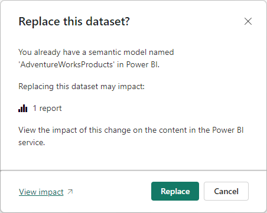
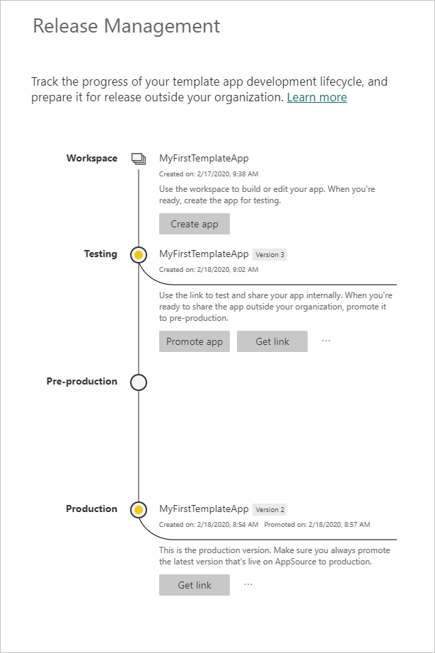

# Manage your published template app

If you have a Power BI template app in production, you can start over in the test phase to make changes to the app without interfering with the app in production.

## Update your app

1. Go to your template app workspace in the Power BI service.

1. If you made your changes in Power BI Desktop, upload the updated dataset to overwrite the existing dataset. If you didn't make any changes in Power BI Desktop, go on to the next step.

   

   - If the *.pbix* file you're uploading has the same name as the dataset and report the app uses, uploading overwrites the existing dataset.
   - If you changed the name of the dataset and report the app uses, and the *.pbix* file you upload has a different name than the previous dataset and report, first rename the dataset and report in the app to exactly match the name of the updated *.pbix* file. Then upload the *.pbix* file to overwrite the existing dataset and report that you just renamed.
   
   In either case, to upload a local *.pbix* file to the service, select **Upload** > **Browse**, navigate to the file, and select **Open**. You get a dialog that asks for your permission to overwrite the dataset the app uses. If you don't overwrite the existing dataset, customers can't install your updated app.

   
   
   >[!IMPORTANT]
   > Never delete the dataset the app uses. Deleting the dataset makes it impossible for customers to update their copies of the app.

1. In the **Release management** pane for the app, select **Create app**.
1. Repeat the [app creation process](service-template-apps-create.md). If you changed the name of the dataset and report the app uses, you might want to also rename the app.
1. After you set **Branding**, **Navigation**, **Control**, **Parameters**, **Authentication**, and **Access**, select **Create app** again to save your changes, and then select **Close**.
1. Select **Release management**.

   In the **Release management** pane, you now see two versions of the app: The version in **Production**, plus a new version in **Testing**.

   

1. When you're ready to promote your app to pre-production for further testing outside your tenant, go back to the **Release Management** pane and select **Promote app** next to **Testing**.

   You now have a version in **Production** and a version in **Pre-production**.

   

   Your link is now live. Note that the **Promote app** button at the pre-production stage is disabled. Disabling the button prevents accidentally overwriting the live production link with the current app version before the Cloud Partner Portal (CPP) validates and approves the new app version.

1. Submit your link again to the CPP by following the steps at [Power BI App offer update](/azure/marketplace/cloud-partner-portal/power-bi/cpp-update-existing-offer). In the CPP, you must publish your offer again and have it validated and approved. If you've changed the name of the app, be sure to also change the name in the CPP. When your offer is approved, the **Promote app** button becomes active again.
   
1. Promote your app to the **Production** stage.
   
### Update behavior

- Updating the app lets template app installers [update their template app](service-template-apps-install-distribute.md#update-a-template-app) in the already installed workspace without losing the connection configuration.
- To learn how changes in the dataset affect the installed template app, see [Overwrite behavior](service-template-apps-install-distribute.md#overwrite-behavior).
- When a template app is overwritten and updates, it first reverts back to using sample data, and automatically reconnects by using the installer's configuration parameters and authentication. Until refresh is complete, the reports, dashboards, and organizational app display the sample data banner.
- If you added a new query parameter to the updated dataset that requires user input, you must select the **Required** checkbox. This selection prompts the installer with the connection string after updating the app.

  

## Extract workspace

It's easy to roll back to the previous version of a template app with the extract capability. The following steps extract a specific app version from a release stage into a new workspace:

1. In the **Release Management** pane, next to an app version, select **More options (...)** and then select **Extract**.

   

1. In the confirmation dialog box, enter a name for the extracted workspace, and select **Extract**. Power BI adds a new workspace for the extracted app.

   

Your new workspace versioning resets, and you can continue to develop and distribute the template app from the newly extracted workspace.

## Delete template app version

A template workspace is the source of an active distributed template app. To protect the template app users, you can't delete a workspace unless you first remove all the created app versions in the workspace. Deleting an app version also deletes the app URL, which no longer works.

1. In the **Release Management** pane, next to the app version you want to delete, select **More options (...)** and then select **Delete**.
   

1. In the confirmation dialog box, select **Delete**.

   

>[!NOTE]
>Make sure not to delete app version that customers or AppSource are using, or they will no longer work.

## Next steps

- See how your customers interact with your template app in [Install, customize, and distribute template apps in your organization](service-template-apps-install-distribute.md).
- See the [Power BI Application offer](/azure/marketplace/cloud-partner-portal/power-bi/cpp-power-bi-offer) for details on distributing your app.