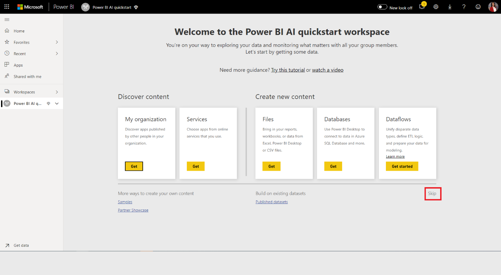

# Tutorial: Build a Machine Learning model in Power BI

In this tutorial article, you use **Automated Machine Learning** to create and apply a binary prediction model in Power BI. The tutorial includes guidance for creating a Power BI dataflow, and using the entities defined in the dataflow to train and validate a machine learning model directly in Power BI. We then use that model for scoring new data to generate predictions.

First, you'll create a Binary Prediction machine learning model, to predict the purchase intent of online shoppers based on a set of their online session attributes. A benchmark machine learning dataset is used for this exercise. Once a model is trained, Power BI will automatically generate a validation report explaining the model results. You can then review the validation report and apply the model to your data for scoring.

This tutorial consists of following steps:
> [!div class="checklist"]

> * Create a dataflow with the input data
> * Create and train a machine learning model
> * Review the model validation report
> * Apply the model to a dataflow entity
> * Using the scored output from the model in a Power BI report

## Create a dataflow with the input data

The first part of this tutorial is to create a dataflow with input data. That process takes a few steps, as shown in the following sections, beginning with getting data.

### Get data

The first step in creating a dataflow is to have your data sources ready. In our case, we use a machine learning dataset from a set of online sessions, some of which culminated in a purchase. The dataset contains a set of attributes about these sessions, which we'll use for training our model.

You can download the dataset from the UC Irvine website. We also have this available, for the purpose of this tutorial, from the following link: [online_shoppers_intention.csv](https://raw.githubusercontent.com/santoshc1/PowerBI-AI-samples/master/Tutorial_AutomatedML/online_shoppers_intention.csv).

### Create the entities

To create the entities in your dataflow, sign into the Power BI service and navigate to a workspace on your capacity that has AI enabled.

If you don't already have a workspace, you can create one by selecting **Workspaces** in the nav pane menu in the Power BI service, and select **Create workspace** at the bottom of the panel that appears. This opens a panel on the right to enter the workspace details. Enter a workspace name and select **Advanced**. Confirm that the workspace uses Dedicated Capacity using the radio button, and that it's assigned to a capacity instance that has the AI preview turned on. Then select **Save**.

Once the workspace is created, you can select **Skip** in the bottom right of the Welcome screen, as shown in the following image.

 Select the **Create** button at the top right of the workspace, and then select **Dataflow**.

Select **Add new entities**. This launches a **Power Query** editor in the browser.

Select **Text/CSV File** as a data source, shown in the following image.

In the **Connect to a data source** page that appears next, paste the following link to the _online_shoppers_intention.csv_ into the **File path or URL** box, and then select **Next**.

`https://raw.githubusercontent.com/santoshc1/PowerBI-AI-samples/master/Tutorial_AutomatedML/online_shoppers_intention.csv`

The Power Query Editor shows a preview of the data from the CSV file. You can rename the query to a friendlier name by changing the value in the Name box found in the right pane. For example, you could change the Query name to _Online Visitors_.

Power Query automatically infers the type of columns. You can change the column type by clicking on the attribute type icon at the top of the column header. In this example, we change the type of the Revenue column to True/False.

Select the **Save & close** button to close Power Query Editor. Provide a name for the dataflow, and then select **Save** on the dialog, as shown in the following image.

## Create and train a machine learning model

To add a machine learning model, Select the **Apply ML model** button in the **Actions** list for the base entity that contains your training data and label information, and then select **Add a machine learning model**.

The first step for creating our machine learning model is to identify the historical data including the outcome field that you want to predict. The model will be created by learning from this data.

In the case of the dataset we're using, this is the **Revenue** field. Select **Revenue** as the 'Outcome field' value and then select **Next**.

Next, we must select the type of machine learning model to create. Power BI analyzes the values in the outcome field that you've identified and suggests the types of machine learning models that can be created to predict that field.

In this case since we're predicting a binary outcome of whether a user will make a purchase or not, Binary Prediction is recommended. Since we are interested in predicting users who will make a purchase, select True as the Revenue outcome that you're most interested in. Additionally, you can provide friendly labels for the outcomes to be used in the automatically generated report that will summarize the results of the model validation. Then select Next.

Next, Power BI does a preliminary scan of a sample of your data and suggests the inputs that may produce more accurate predictions. If Power BI doesn't recommend a field, an explanation would be provided next to it. You have the option to change the selections to include only the fields you want the model to study, or you can select all the fields by selecting the checkbox next to the entity name. Select **Next** to accept the inputs.

In the final step, we must provide a name for our model. Name the model _Purchase Intent Prediction_. You can choose to reduce the training time to see quick results or increase the amount of time spent in training to get the best model. Then select **Save and train** to start training the model.

The training process will begin by sampling and normalizing your historical data and splitting your dataset into two new entities _Purchase Intent Prediction Training Data_ and _Purchase Intent Prediction Testing Data_.

Depending on the size of the dataset, the training process can take anywhere from a few minutes to the training time selected at the previous screen. At this point, you can see the model in the **Machine learning models** tab of the dataflow. The Ready status indicates that the model has been queued for training or is under training.

You can confirm that the model is being trained and validated through the status of the dataflow. This appears as a data refresh in progress in the **Dataflows** tab of the workspace.

Once the model training is completed, the dataflow displays an updated refresh time. You can confirm that the model is trained, by navigating to the **Machine learning models** tab in the dataflow. The model you created should show status as **Trained** and the **Last Trained time** should now be updated.

## Review the model validation report
To review the model validation report, in the Machine learning models tab, select the View training report button in the Actions column for the model. This report describes how your machine learning model is likely to perform.

In the **Model Performance** page of the report, select See **top predictors** to view the top predictors for your model. You can select one of the predictors to see how the outcome distribution is associated with that predictor.

You can use the **Probability Threshold** slicer on the Model Performance page to examine its influence on the Precision and Recall for the model.

The other pages of the report describe the statistical performance metrics for the model.

The report also includes a Training Details page that describes the different iterations that were run, how features were extracted from the inputs, and the hyperparameters for the final model used.

## Apply the model to a dataflow entity

Select the **Apply model** button at the top of the report to invoke this model. In the **Apply** dialog, you can specify the target entity that has the source data to which the model should be applied.

When prompted, you must **Refresh** the dataflow to preview the results of your model.

Applying the model will create two new entities, with the suffix **enriched <model_name>** and **enriched <model_name> explanations**. In our case, applying the model to the **Online Visitors** entity will create **Online Visitors enriched Purchase Intent Prediction** which includes the predicted output from the model, and **Online Visitors enriched Purchase Intent Prediction explanations** which contains top record-specific influencers for the prediction. 

Applying a Binary Prediction model adds four columns with predicted outcome, probability score, the top record-specific influencers for the prediction, and explanation index each prefixed with the column name specified.  

Once the dataflow refresh is completed, you can select the **Online Visitors enriched Purchase Intent Prediction** entity to view the results.

You can also invoke any AutoML model in the workspace, directly from the Power Query Editor in your dataflow. To access the AutoML models, select the Edit button for the entity that you want to enrich with insights from your AutoML model, as shown in the following image.

Selecting the Edit button opens the Power Query Editor for the entities in your dataflow. 
Select the AI Insights button in the ribbon.

 Select the Power BI Machine Learning Models folder from the nav pane menu. All the AutoML models to which you have access are listed here as Power Query functions. Also, the input parameters for the AutoML model are automatically mapped as parameters of the corresponding Power Query function. Note that automatic mapping of parameters happens only if the name and data type of the parameter is the same.
 
To invoke an AutoML model, you can specify any of the selected entity's columns as an input from the drop-down. You can also specify a constant value to be used as an input by toggling the column icon to the left of the input dialog.

Select Apply to view the preview of the AutoML model's output as a new columns in the entity table. You will also see the model invocation as an applied step for the query.

Once you save your dataflow, the model is automatically invoked when the dataflow is refreshed, for any new or updated rows in the entity table.

## Using the scored output from the model in a Power BI report

To use the scored output from your machine learning model you can connect to your dataflow from the Power BI desktop, using the Dataflows connector. The **Online Visitors enriched Purchase Intent Prediction** entity can now be used to incorporate the predictions from your model in Power BI reports.

## Next steps

In this tutorial, you created and applied a binary prediction model in Power BI using these steps:

* Create a dataflow with the input data
* Create and train a machine learning model
* Review the model validation report
* Apply the model to a dataflow entity
* Using the scored output from the model in a Power BI report

For more information about Machine Learning automation in Power BI, see [Automated Machine Learning in Power BI](../transform-model/dataflows/dataflows-machine-learning-integration.md).