# Tutorial: Build a machine learning model in Power BI

In this tutorial, you use *automated machine learning* to create and apply a binary prediction model in Power BI. You create a Power BI dataflow, and use the entities you define in the dataflow to train and validate a machine learning model directly in Power BI. You then use that model to score new data and generate predictions.

First, you create a binary prediction machine learning model to predict the purchase intent of online shoppers, based on a set of their online session attributes. You use a benchmark machine learning semantic model for this exercise. Once you train a model, Power BI automatically generates a validation report that explains the model results. You can then review the validation report and apply the model to your data for scoring.

This tutorial consists of the following steps:
> [!div class="checklist"]
> * Create a dataflow with the input data.
> * Create and train a machine learning model.
> * Review the model validation report.
> * Apply the model to a dataflow entity.
> * Use the scored output from the model in a Power BI report.

## Create a dataflow with the input data

Create a dataflow with input data by following these steps.

### Get data

The first step in creating a dataflow is to have your data sources ready. In this case, you use a machine learning semantic model from a set of online sessions, some of which culminated in a purchase. The semantic model contains a set of attributes about these sessions, which you use to train your model.

You can download the semantic model from the UC Irvine website or by downloading the [online_shoppers_intention.csv](https://raw.githubusercontent.com/santoshc1/PowerBI-AI-samples/master/Tutorial_AutomatedML/online_shoppers_intention.csv). Later in this tutorial, you connect to the semantic model by specifying its URL.

### Create the tables

To create the entities in your dataflow, sign into the Power BI service and navigate to a workspace.

1. If you don't have a workspace, create one by selecting **Workspaces** in the Power BI left navigation pane and selecting **Create a workspace**. In the **Create a workspace** panel, enter a workspace name and select **Save**.

   

1. Select **New** at the top of the new workspace, and then select **Dataflow**.

   [ 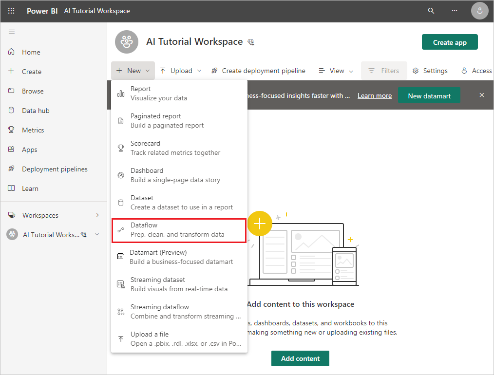](media/service-tutorial-build-machine-learning-model/tutorial-machine-learning-model-03.png#lightbox)

1. Select **Add new tables** to launch a **Power Query** editor in the browser.

   [ 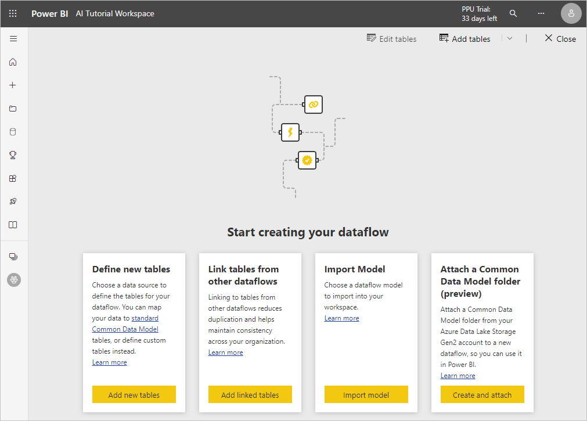](media/service-tutorial-build-machine-learning-model/tutorial-machine-learning-model-04.png#lightbox)

1. On the **Choose data source** screen, select **Text/CSV** as the data source.

   [ 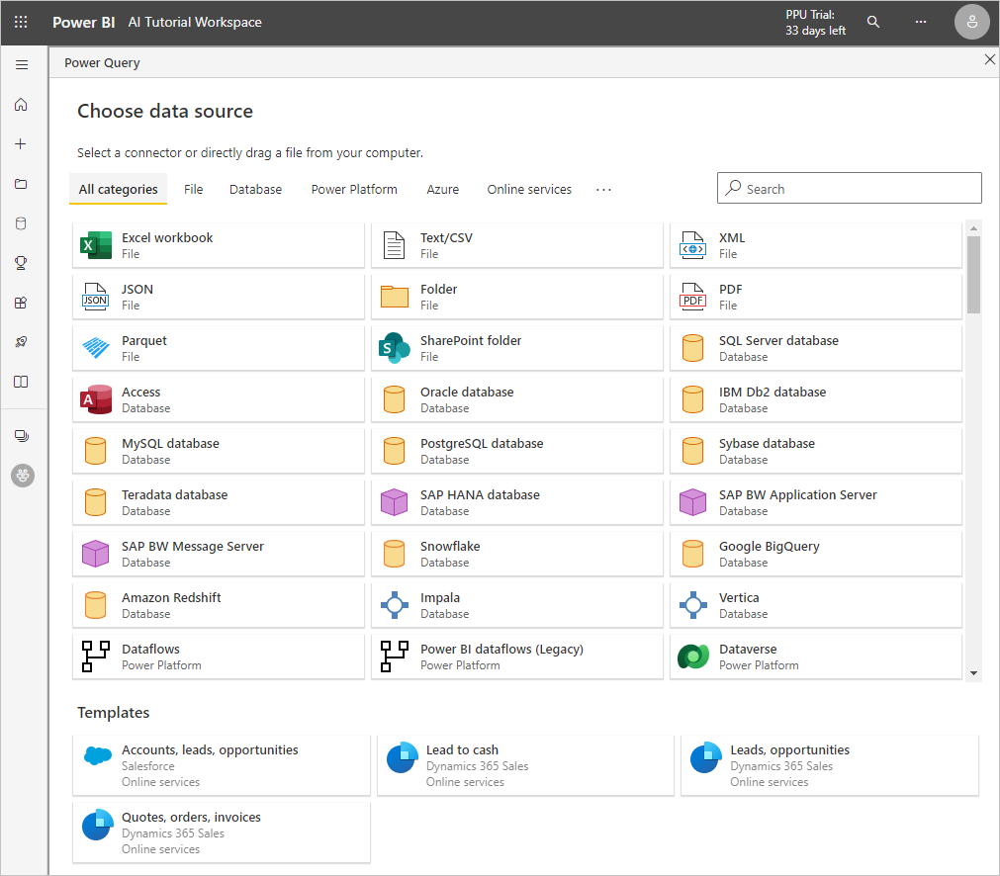](media/service-tutorial-build-machine-learning-model/tutorial-machine-learning-model-05.png#lightbox)

1. On the **Connect to a data source** page, paste the following link to the _online_shoppers_intention.csv_ file into the **File path or URL** box, and then select **Next**.

   `https://raw.githubusercontent.com/santoshc1/PowerBI-AI-samples/master/Tutorial_AutomatedML/online_shoppers_intention.csv`

   [ 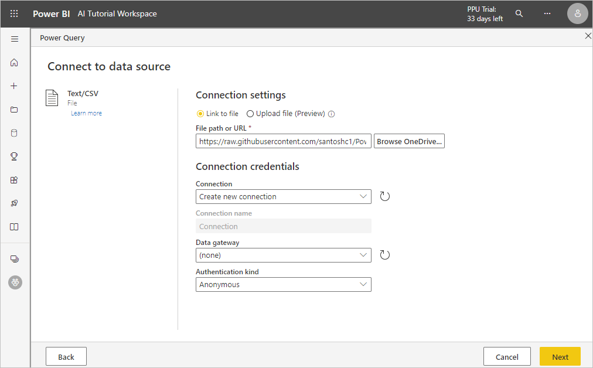](media/service-tutorial-build-machine-learning-model/tutorial-machine-learning-model-06.png#lightbox)

1. The Power Query Editor shows a preview of the data from the CSV file. To make changes in the data before loading it, select **Transform data**.

   [ 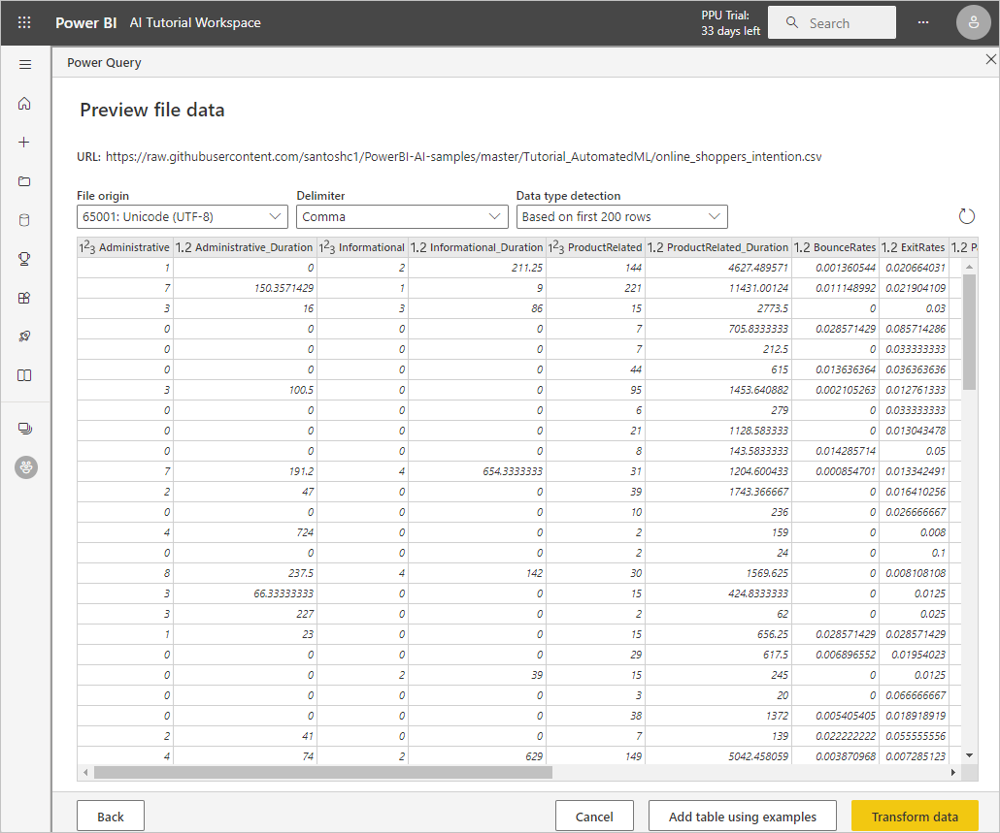](media/service-tutorial-build-machine-learning-model/tutorial-machine-learning-model-07.png#lightbox)

1. Power Query automatically infers the data types of the columns. You can change the data types by selecting the attribute type icon at the tops of the column headers. Change the type of the **Revenue** column to **True/False**.

   You can rename the query to a friendlier name by changing the value in the **Name** box in the right pane. Change the query name to *Online visitors*.

   [ 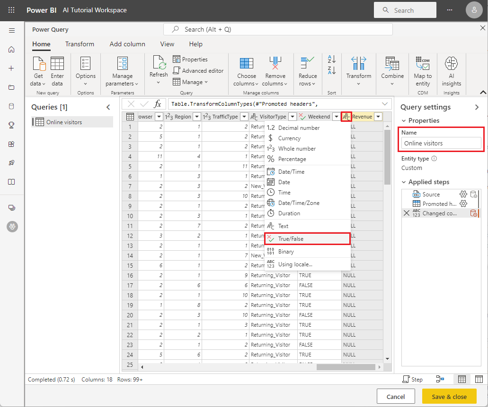](media/service-tutorial-build-machine-learning-model/tutorial-machine-learning-model-08.png#lightbox)

1. Select **Save & close**, and in the dialog box, provide a name for the dataflow and then select **Save**.

   [ 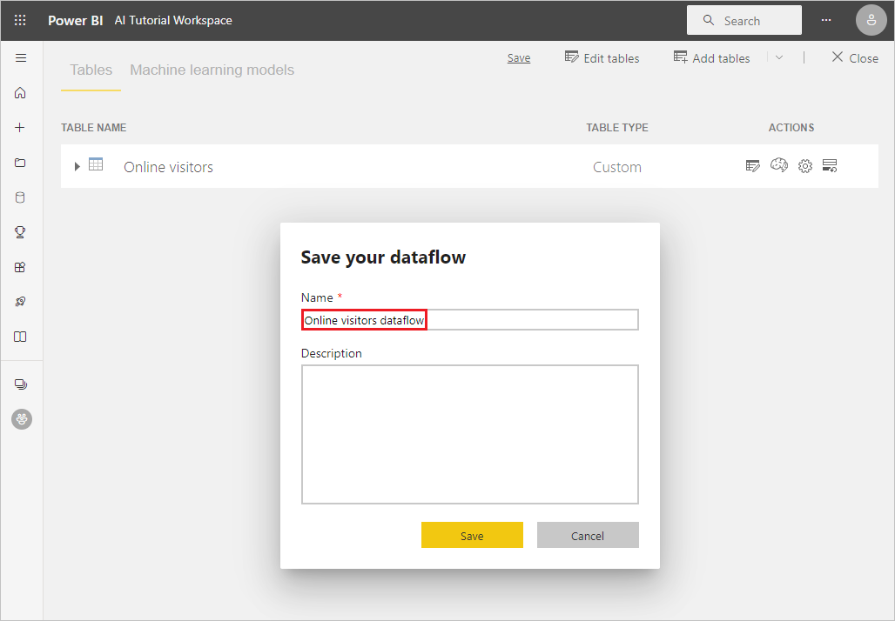](media/service-tutorial-build-machine-learning-model/tutorial-machine-learning-model-09.png#lightbox)

## Create and train a machine learning model

To add a machine learning model:

1. Select the **Apply ML model** icon in the **Actions** list for the table that contains your training data and label information, and then select **Add a machine learning model**.

   [ 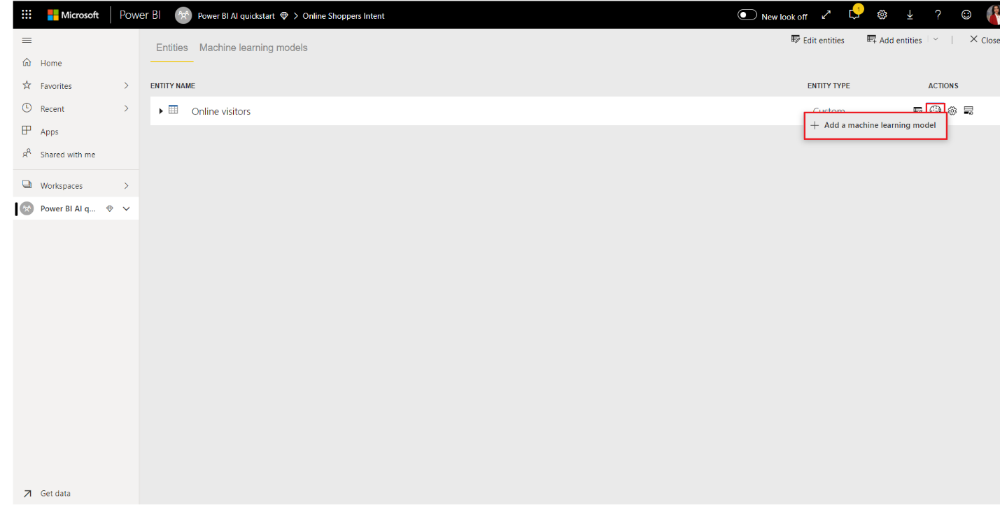](media/service-tutorial-build-machine-learning-model/tutorial-machine-learning-model-10.png#lightbox)

1. The first step to create your machine learning model is to identify the historical data, including the outcome field that you want to predict. The model is created by learning from this data. In this case, you want to predict whether or not visitors are going to make a purchase. The outcome you want to predict is in the **Revenue** field. Select **Revenue** as the **Outcome column** value, and then select **Next**.

   [ 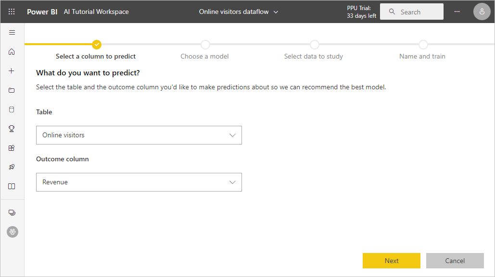](media/service-tutorial-build-machine-learning-model/tutorial-machine-learning-model-11.png#lightbox)

1. Next, you select the type of machine learning model to create. Power BI analyzes the values in the outcome field that you identified, and suggests the types of machine learning models that it can create to predict that field.

   In this case, since you want to predict a binary outcome of whether or not a visitor is going to make a purchase, Power BI recommends **Binary Prediction**. Because you're interested in predicting visitors who are going to make a purchase, select **true** under **Choose a target outcome**. You can also provide different labels to use for the outcomes in the automatically generated report that summarizes the model validation results. Then select **Next**.

   [ 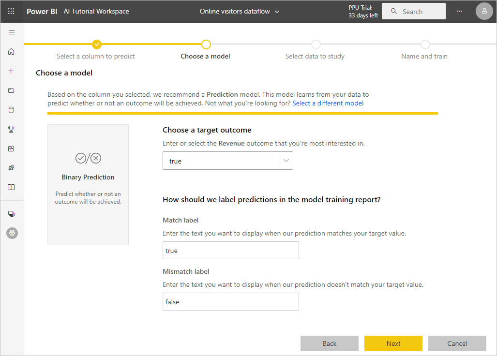](media/service-tutorial-build-machine-learning-model/tutorial-machine-learning-model-12.png#lightbox)

1. Power BI does a preliminary scan of a sample of your data and suggests inputs that might produce more accurate predictions. If Power BI doesn't recommend a column, it explains why not next to the column. You can change the selections to include only the fields you want the model to study by selecting or deselecting the checkboxes next to column names. Select **Next** to accept the inputs.

   [ 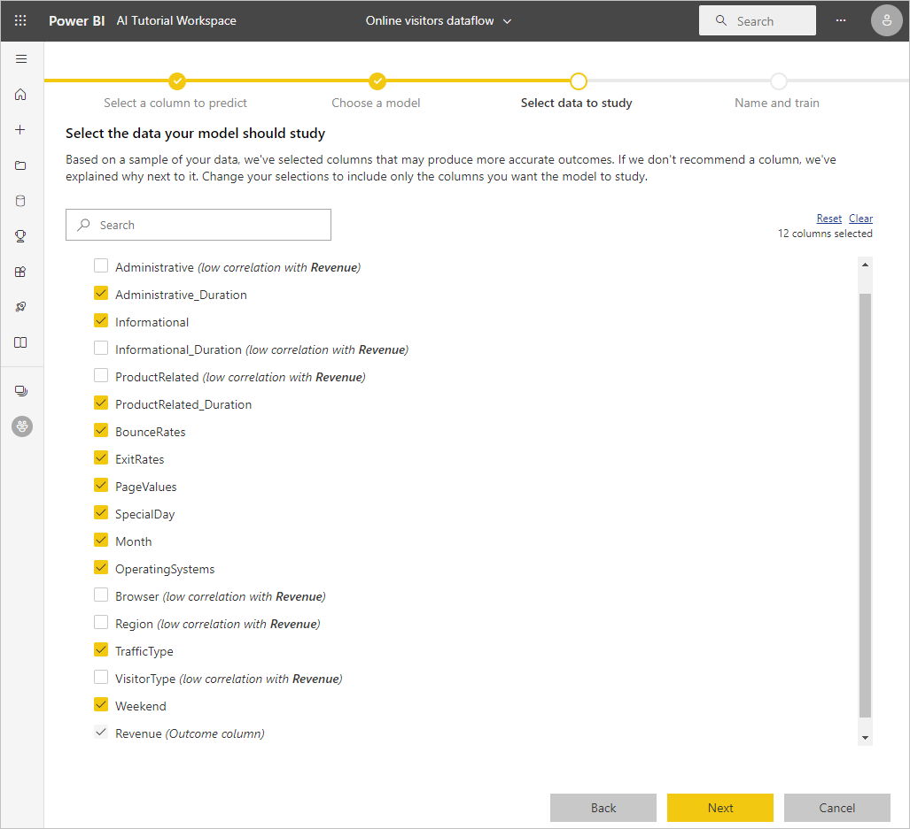](media/service-tutorial-build-machine-learning-model/tutorial-machine-learning-model-13.png#lightbox)

1. In the final step, name the model *Purchase intent prediction*, and choose the amount of time to spend in training. You can reduce the training time to see quick results or increase the time to get the best model. Then select **Save and train** to start training the model.

   

If you get an error similar to **Credentials not found for data source**, you need to update your credentials so Power BI can score the data. To update your credentials, select **More options ...** in the header bar and then select **Settings** > **Settings**.

[ 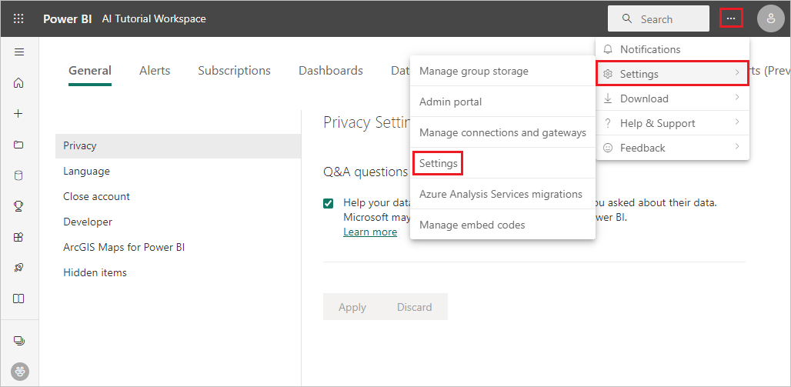](media/service-tutorial-build-machine-learning-model/settings.png#lightbox)

Select your dataflow under **Dataflows**, expand **Data source credentials**, and then select **Edit credentials**.

[ 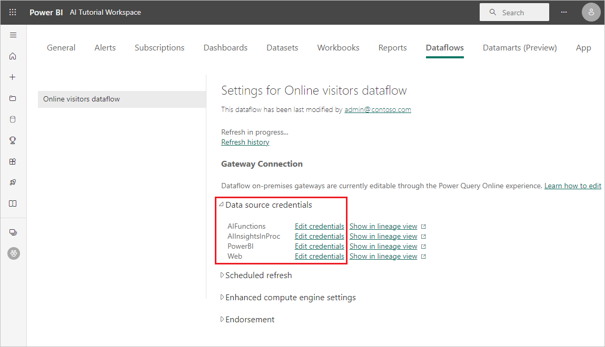](media/service-tutorial-build-machine-learning-model/dataflow-credentials.png#lightbox)

### Track training status

The training process begins by sampling and normalizing your historical data and splitting your semantic model into two new entities: **Purchase Intent Prediction Training Data** and **Purchase Intent Prediction Testing Data**.

Depending on the size of the semantic model, the training process can take anywhere from a few minutes up to the training time you selected. You can confirm that the model is being trained and validated through the status of the dataflow. The status appears as a data refresh in progress in the **Semantic models + dataflows** tab of the workspace.

[ 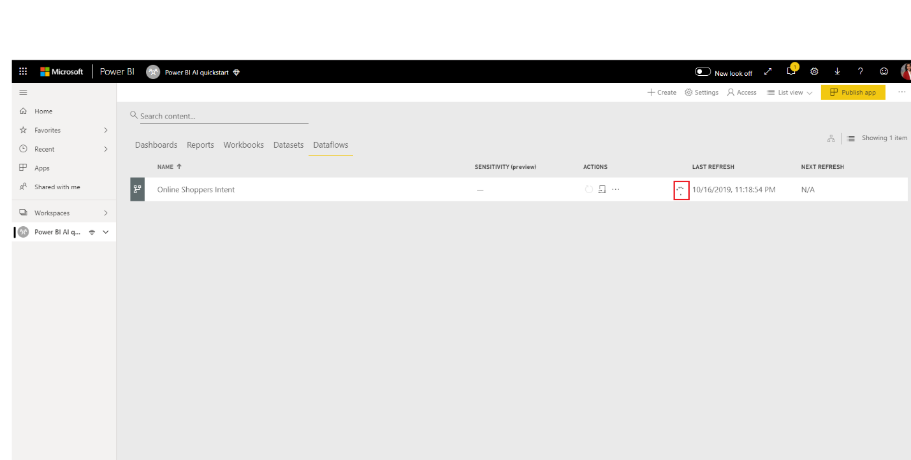](media/service-tutorial-build-machine-learning-model/tutorial-machine-learning-model-15.png#lightbox)

You can see the model in the **Machine learning models** tab of the dataflow. **Status** indicates whether the model has been queued for training, is under training, or is trained. Once the model training is completed, the dataflow displays an updated **Last trained** time and a status of **Trained**.

[ 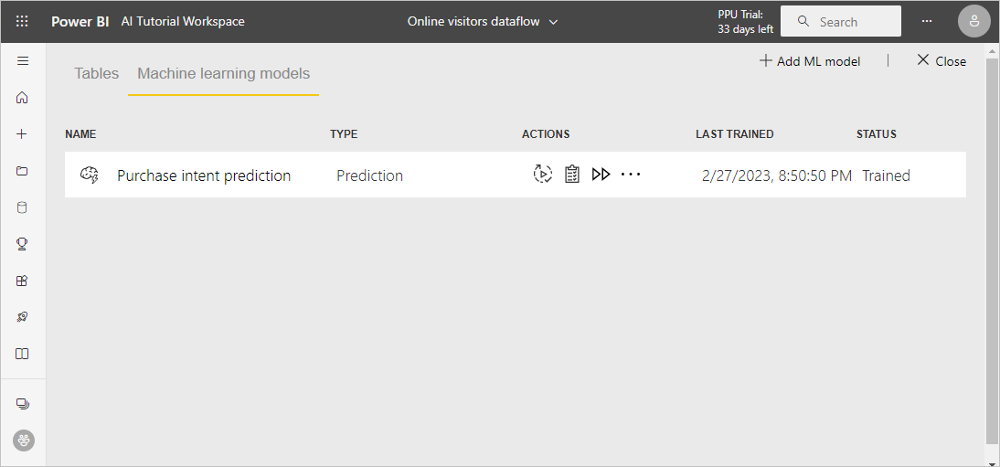](media/service-tutorial-build-machine-learning-model/tutorial-machine-learning-model-16.png#lightbox)

## Review the model validation report

To review the model validation report, in the **Machine learning models** tab, select the **View training report** icon under **Actions**. This report describes how your machine learning model is likely to perform.

In the **Model Performance** page of the report, select **See top predictors** to view the top predictors for your model. You can select one of the predictors to see how the outcome distribution is associated with that predictor.

[ 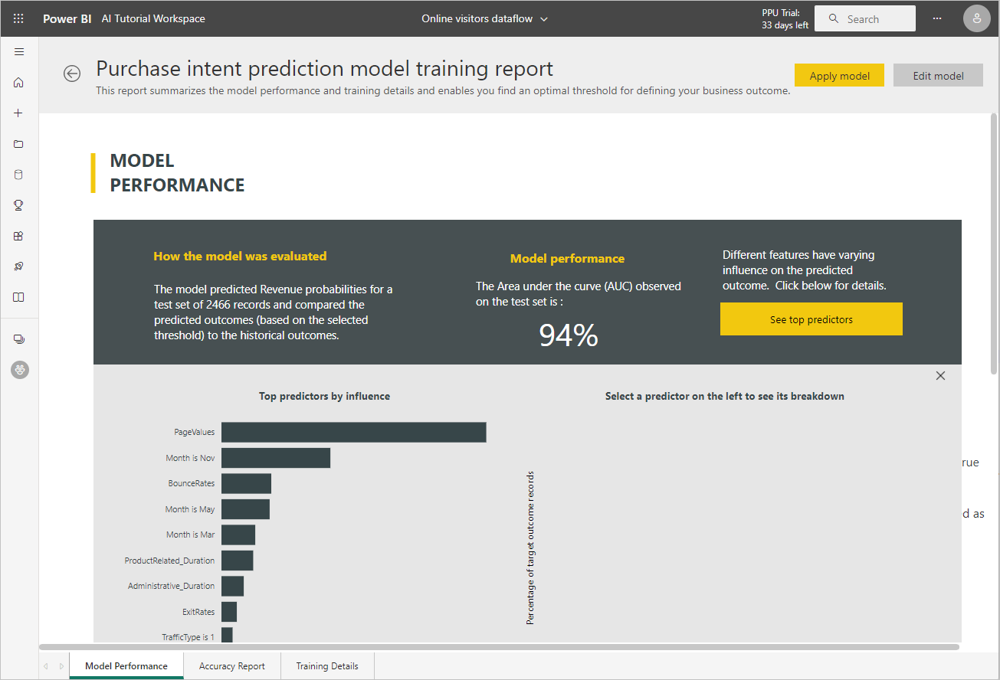](media/service-tutorial-build-machine-learning-model/tutorial-machine-learning-model-18.png#lightbox)

You can use the **Probability Threshold** slicer on the **Model Performance** page to examine the influence of model **Precision** and **Recall** on the model.

[ 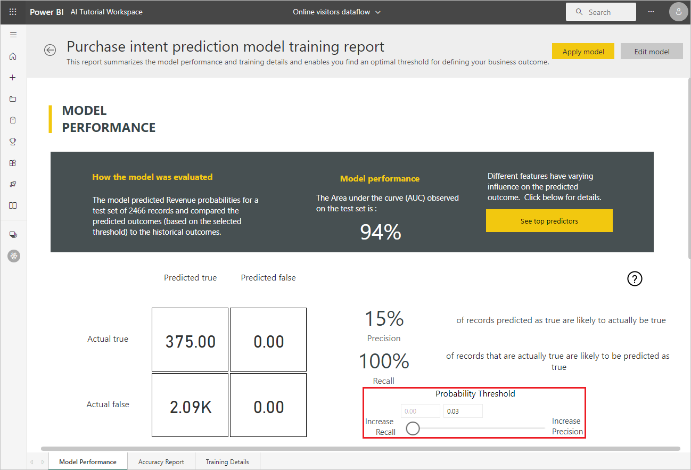](media/service-tutorial-build-machine-learning-model/tutorial-machine-learning-model-17.png#lightbox)

The other pages of the report describe the statistical performance metrics for the model.

The report also includes a **Training Details** page that describes the **Iterations run**, how features were extracted from the inputs, and the hyperparameters for the **Final model used**.

## Apply the model to a dataflow entity

Select the **Apply model** button at the top of the report to invoke this model. In the **Apply** dialog, you can specify the target entity that has the source data to apply the model to. Then select **Save and apply**.

[ 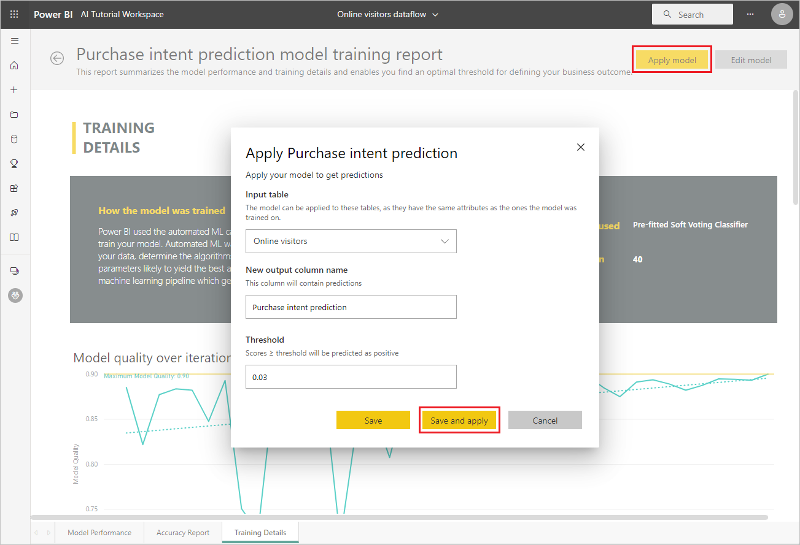](media/service-tutorial-build-machine-learning-model/tutorial-machine-learning-model-19.png#lightbox)

Applying the model creates two new tables, with the suffixes **enriched <model_name>** and **enriched <model_name> explanations**. In this case, applying the model to the **Online visitors** table creates:

- **Online visitors enriched Purchase intent prediction**, which includes the predicted output from the model.
- **Online visitors enriched Purchase intent prediction explanations**, which contains top record-specific influencers for the prediction.

Applying the binary prediction model adds four columns: **Outcome**, **PredictionScore**, **PredictionExplanation**, and **ExplanationIndex**, each with a **Purchase intent prediction** prefix.

[ 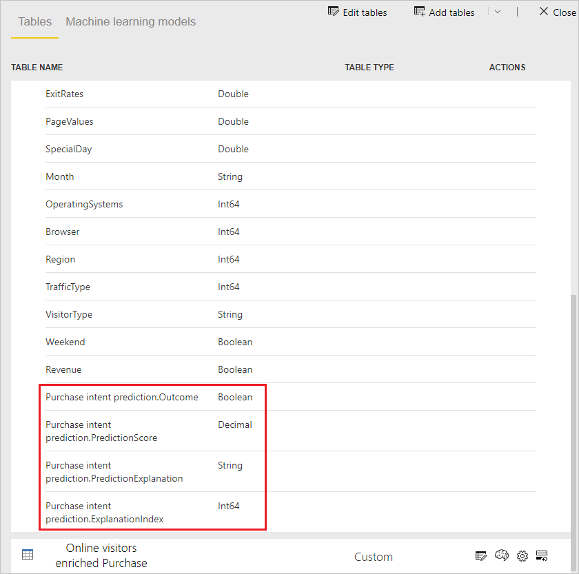](media/service-tutorial-build-machine-learning-model/tutorial-machine-learning-model-20.png#lightbox)

Once the dataflow refresh completes, you can select the **Online visitors enriched Purchase intent prediction** table to view the results.

[ 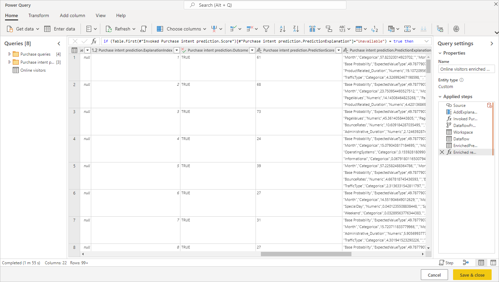](media/service-tutorial-build-machine-learning-model/tutorial-machine-learning-model-21.png#lightbox)

You can also invoke any automated machine learning model in the workspace directly from the Power Query Editor in your dataflow. To access the automated machine learning models, select **Edit** for the table that you want to enrich with insights from your automated machine learning model.

[ 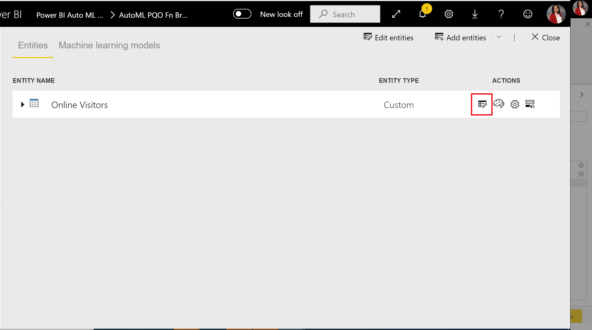](media/service-tutorial-build-machine-learning-model/tutorial-machine-learning-model-22.png#lightbox)

In the Power Query Editor, select **AI insights** in the ribbon.

[ 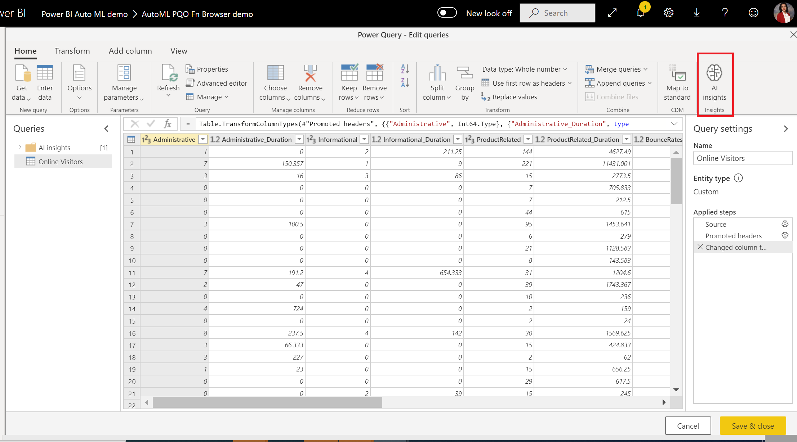](media/service-tutorial-build-machine-learning-model/tutorial-machine-learning-model-23.png#lightbox)

On the **AI insights** screen, select the **Power BI Machine Learning Models** folder from the navigation pane. The list shows all the machine learning models you have access to as Power Query functions. The input parameters for the machine learning model automatically map as parameters of the corresponding Power Query function. The automatic parameter mapping happens only if the names and data types of the parameter are the same.
 
To invoke a machine learning model, you can select any of the selected model's columns as an input in the dropdown list. You can also specify a constant value to use as an input by toggling the column icon next to the input line.

[ 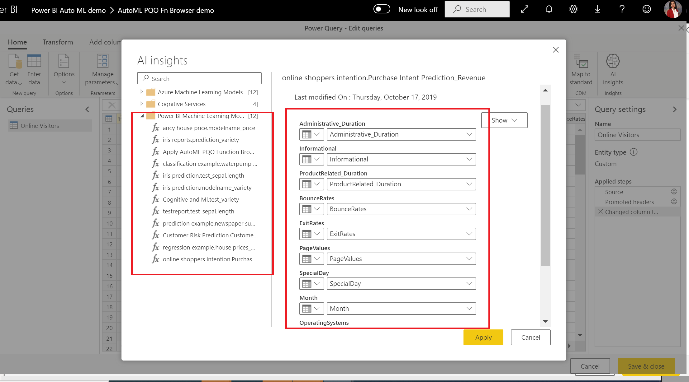](media/service-tutorial-build-machine-learning-model/tutorial-machine-learning-model-24.png#lightbox)

Select **Apply** to view the preview of the machine learning model output as new columns in the table. You also see the model invocation under **Applied steps** for the query.

[ 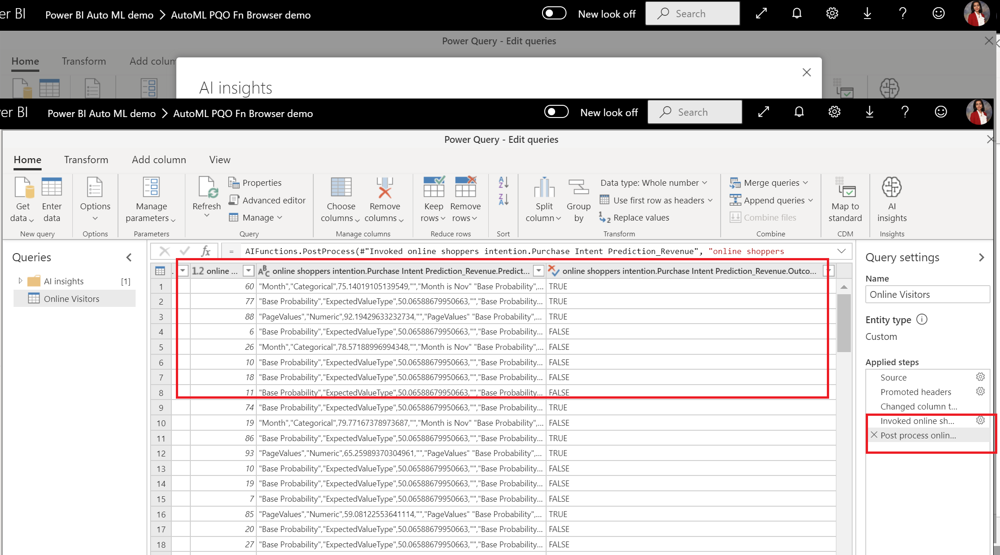](media/service-tutorial-build-machine-learning-model/tutorial-machine-learning-model-25.png#lightbox)

After you save your dataflow, the model automatically invokes when the dataflow refreshes, for any new or updated rows in the entity table.

## Using the scored output from the model in a Power BI report

To use the scored output from your machine learning model, you can connect to your dataflow from Power BI Desktop by using the **Dataflows** connector. You can now use the **Online visitors enriched Purchase intent prediction** table to incorporate the predictions from your model in Power BI reports.

## Limitations

There are some known issues with using gateways with automated machine learning. If you need to use a gateway, it's best to create a dataflow that imports the necessary data via the gateway first. Then create another dataflow that references the first dataflow to create or apply these models.

If your AI work with dataflows fails, you may need to enable Fast Combine when using AI with dataflows. Once you have imported your table and *before* you begin to add AI features, select **Options** from the Home ribbon, and in the window that appears select the checkbox beside *Allow combining data from multiple sources* to enable the feature, then select **OK** to save your selection. Then you can add AI features to your dataflow.

## Related content

In this tutorial, you created and applied a binary prediction model in Power BI by doing these steps:

* Created a dataflow with the input data.
* Created and trained a machine learning model.
* Reviewed the model validation report.
* Applied the model to a dataflow entity.
* Learned how to use the scored output from the model in a Power BI report.

For more information about Machine Learning automation in Power BI, see [Automated machine learning in Power BI](../transform-model/dataflows/dataflows-machine-learning-integration.md).
