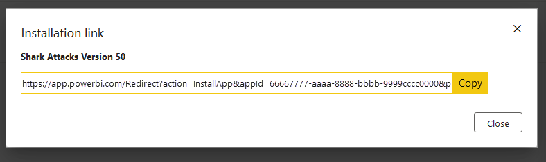

# Tutorial: Automate configuration of template app installation using an Azure function

Template apps are a great way for customers to start getting insights from their data. Template apps get them up and running quickly by connecting them to their data. The template apps provide customers with prebuilt reports that they can customize if they so desire.

Customers aren't always familiar with the details of how to connect to their data. Having to provide these details when they install a template app can be a pain point for them.

If you're a data services provider and have created a template app to help your customers get started with their data on your service, you can make it easier for them to install your template app. You can automate the configuration of your template app's parameters.

When the customer signs in to your portal, they select a special link you've prepared. This link:

- Launches the automation, which gathers the information it needs.
- Preconfigures the template app parameters.
- Redirects the customer to their Power BI account where they can install the app.

All they have to do is select **Install** and authenticate against their data source, and they're good to go!

The customer experience is illustrated here.


In this tutorial, you'll use an automated installation Azure Functions sample that we've created to preconfigure and install your template app. This sample has deliberately been kept simple for demonstration purposes. It encapsulates the setup of an Azure function to use Power BI APIs for installing a template app and automatically configuring it for your users.

For more information about the general automation flow and the APIs that the app uses, see [Automate configuration of a template app installation](template-apps-auto-install.md).

Our simple application uses an Azure function. For more information about Azure Functions, see the [Azure Functions documentation](/azure/azure-functions/).

## Basic flow

The following basic flow lists what the application does when the customer launches it by selecting the link in your portal.

1. The user signs in to the ISV's portal and selects the supplied link. This action initiates the flow. The ISV's portal prepares the user-specific configuration at this stage.

1. The ISV acquires an *app-only* token based on a [service principal (app-only token)](./../developer/embedded/embed-service-principal.md) that's registered in the ISV's tenant.

1. Using [Power BI REST APIs](/rest/api/power-bi/), the ISV creates an *install ticket*, which contains the user-specific parameter configuration as prepared by the ISV.

1. The ISV redirects the user to Power BI by using a ```POST``` redirection method, which contains the install ticket.

1. The user is redirected to their Power BI account with the install ticket and is prompted to install the template app. When the user selects **Install**, the template app is installed for them.

>[!Note]
>While parameter values are configured by the ISV in the process of creating the install ticket, data source-related credentials are only supplied by the user in the final stages of the installation. This arrangement prevents them from being exposed to a third party and ensures a secure connection between the user and the template app data sources.

## Prerequisites

- Your own Microsoft Entra tenant setup. For instructions on how to set one up, see [Create a Microsoft Entra tenant](./../developer/embedded/create-an-azure-active-directory-tenant.md).
- A [service principal (app-only token)](./../developer/embedded/embed-service-principal.md) registered in the preceding tenant.
- A parameterized [template app](service-template-apps-overview.md) that's ready for installation. The template app must be created in the same tenant in which you register your application in Microsoft Entra ID. For more information, see [Tips for authoring template apps](service-template-apps-tips.md) or [Create a template app in Power BI](service-template-apps-create.md).
- To be able to test your automation work flow, add the service principal to the template app workspace as an Admin.
- A Power BI Pro license. If you're not signed up for Power BI Pro, [sign up for a free trial](https://powerbi.microsoft.com/pricing/) before you begin.

## Set up your template apps automation development environment

Before you continue setting up your application, follow the instructions in [Quickstart: Create an Azure Functions app with Azure App Configuration](/azure/azure-app-configuration/quickstart-azure-functions-csharp) to develop an Azure function along with an Azure app configuration. Create your app configuration as described in the article.

<a name='register-an-application-in-azure-ad'></a>

### Register an application in Microsoft Entra ID

Create a service principal as described in [Embed Power BI content with service principal and an application secret](./../developer/embedded/embed-service-principal.md).

Make sure to register the application as a **server-side web application**. You register a server-side web application to create an application secret.

Save the *application ID* (ClientID) and *application secret* (ClientSecret) for later steps.

You can go through the [Embedding setup tool](https://aka.ms/embedsetup/AppOwnsData) to quickly get started creating an app registration. If you're using the [Power BI App Registration Tool](https://app.powerbi.com/embedsetup), select the **Embed for your customers** option.

Add the service principal to the template app workspace as an Admin so that you'll be able to test your automation work flow.

## Template app preparation

After you've created your template app and it's ready for installation, save the following information for the next steps:

- *App ID*, *Package Key*, and *Owner ID* as they appear in the installation URL at the end of the [Define the properties of the template app](service-template-apps-create.md#define-the-properties-of-the-template-app) process when the app was created.

    You can also get the same link by selecting **Get link** in the template app's [Release Management pane](service-template-apps-create.md#manage-the-template-app-release).

- *Parameter names* as they're defined in the template app's semantic model. Parameter names are case-sensitive strings. They can also be retrieved from the **Parameter Settings** tab when you [define the properties of the template app](service-template-apps-create.md#define-the-properties-of-the-template-app) or from the semantic model settings in Power BI.

>[!NOTE]
>You can test your preconfigured installation application on your template app if the template app is ready for installation, even if it isn't publicly available on AppSource yet. For users outside your tenant to be able to use the automated installation application to install your template app, the template app must be publicly available in [AppSource](https://appsource.microsoft.com/en-us/marketplace/apps?product=power-bi). Before you distribute your template app by using the automated installation application you're creating, be sure to [publish it to Partner Center](/azure/marketplace/partner-center-portal/create-power-bi-app-offer).

## Install and configure your template app

In this section, you'll use an automated installation Azure Functions sample that we created to preconfigure and install your template app. This sample has deliberately been kept simple for demonstration purposes. It allows you to use an [Azure function](/azure/azure-functions/functions-overview) and [Azure App Configuration](/azure/azure-app-configuration/overview) to easily deploy and use the automated installation API for your template apps.

### Download [Visual Studio](https://www.visualstudio.com/) (version 2017 or later)

Download [Visual Studio](https://www.visualstudio.com/) (version 2017 or later). Make sure to download the latest [NuGet package](https://www.nuget.org/profiles/powerbi).

### Download the automated installation Azure Functions sample

Download the [automated installation Azure Functions sample](https://github.com/microsoft/Template-apps-examples) from GitHub to get started.


### Set up your Azure app configuration

To run this sample, you need to set up your Azure app configuration with the values and keys as described here. The keys are the **application ID**, the **application secret**, and your template app's **appId**, **packageKey**, and **ownerId** values. See the following sections for information about how to get these values.

The keys are also defined in the **Constants.cs** file.

| Configuration key | Meaning           |
|---------------    |-------------------|
| TemplateAppInstall:Application:AppId | **appId** from the  [installation URL](#get-the-template-app-properties) |
| TemplateAppInstall:Application:PackageKey | **packageKey** from the [installation URL](#get-the-template-app-properties) |
| TemplateAppInstall:Application:OwnerId | **ownerId** from the [installation URL](#get-the-template-app-properties) |
| TemplateAppInstall:ServicePrincipal:ClientId | Service principal [application ID](#get-the-application-id) |
| TemplateAppInstall:ServicePrincipal:ClientSecret | Service principal [application secret](#get-the-application-secret) |
|||


The **Constants.cs** file is shown here.


#### Get the template app properties

Fill in all relevant template app properties as they're defined when the app is created. These properties are the template app's **appId**, **packageKey**, and **ownerId** values.

To get the preceding values, follow these steps:

1. Sign in to [Power BI](https://app.powerbi.com).

1. Go to the application's original workspace.

1. Open the **Release Management** pane.

    

1. Select the app version, and get its installation link.

    

1. Copy the link to the clipboard.

    

1. This installation URL holds the three URL parameters whose values you need. Use the **appId**, **packageKey**, and **ownerId** values for the application. A sample URL will be similar to what is shown here.

    ```html
    https://app.powerbi.com/Redirect?action=InstallApp&appId=66667...9cccc0000&packageKey=b2df4b...dLpHIUnum2pr6k&ownerId=aaaa...22222&buildVersion=5
    ```

#### Get the application ID

Fill in the **applicationId** information with the application ID from Azure. The **applicationId** value is used by the application to identify itself to the users from which you're requesting permissions.

To get the application ID, follow these steps:

1. Sign in to the [Azure portal](https://portal.azure.com).

1. From the portal menu, select **All services**.

1. On the All services page, in the **Identity** section, select > **App registrations**.

1. Select the application that needs the **application ID**.

    

1. There's an application ID that's listed as a GUID. Use this application ID as the **applicationId** value for the application.

    

#### Get the application secret

Fill in the **ApplicationSecret** information from the **Keys** section of your **App registrations** section in Azure. This attribute works when you use the [service principal](./../developer/embedded/embed-service-principal.md).

To get the application secret, follow these steps:

 1. Sign in to the [Azure portal](https://portal.azure.com).

 1. From the portal menu, select **All services**.

 1. On the All services page, in the **Identity** section, select > **App registrations**.

    

 1. Select **Certificates and secrets** under **Manage**.

 1. Select **New client secret**.

 1. Enter a name in the **Description** box, and select a duration. Then select **Add** to get the value for your application, which you'll see under the **Value** heading for the client secret.

## Test your function locally

Follow the steps as described in [Run the function locally](/azure/azure-functions/functions-create-your-first-function-visual-studio#run-the-function-locally) to run your function.

Configure your portal to issue a ```POST``` request to the URL of the function. An example is ```POST http://localhost:7071/api/install```. The request body should be a JSON object that describes key-value pairs. Keys are *parameter names* as defined in Power BI Desktop. Values are the desired values to be set for each parameter in the template app.

>[!Note]
> In production, parameter values are deduced for each user by your portal's intended logic.

The desired flow should be:

1. The portal prepares the request, per user or session.
1. The ```POST /api/install``` request is issued to your Azure function. The request body consists of key-value pairs. The key is the parameter name. The value is the desired value to be set.
1. If everything is configured properly, the browser should automatically redirect to the customer's Power BI account and show the automated installation flow.
1. Upon installation, parameter values are set as configured in steps 1 and 2.

## Related content

### Publish your project to Azure

To publish your project to Azure, follow the instructions in the [Azure Functions documentation](/azure/azure-functions/functions-create-your-first-function-visual-studio#publish-the-project-to-azure). Then you can integrate template app automated installation APIs into your product and begin testing it in production environments.
