# Tutorial: Set alerts on Power BI dashboards

[!INCLUDE[consumer-appliesto-yynn](../includes/consumer-appliesto-yynn.md)]

Set alerts in the Power BI service to notify you when data on a dashboard changes above or below limits you set. Alerts can only be set on tiles pinned from report visuals, and only on gauges, KPIs, and cards. 

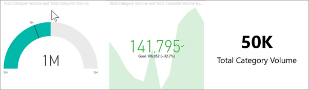

Alerts can be created on dashboards:
- that you have created and saved in **My workspace**
- that have been shared with you in a [Premium reserved capacity](end-user-license.md). 
- in any workspace you can access, if you have a Power BI Pro or Premium Per User (PPU) license.    

Alerts only work on data that is refreshed. When data refreshes, Power BI looks to see if an alert is set for that data. If the data has reached an alert threshold, an alert is triggered. 

This feature is still evolving, so refer to the [Tips and troubleshooting section below](#tips-and-troubleshooting).

Only you can see the alerts you set, even if you share your dashboard. Data alerts are fully synchronized across platforms; set and view data alerts [in the Power BI mobile apps](mobile/mobile-set-data-alerts-in-the-mobile-apps.md), in Power BI for Teams, and in the Power BI service. 

> [!WARNING]
> These alerts provide information about your data. If you view your Power BI data on a mobile device and that device gets stolen, we recommend using the Power BI service to turn off all alerts.
> 

This tutorial covers the following.
> [!div class="checklist"]
> * Who can set alerts
> * Which visuals support alerts
> * Who can see my alerts
> * Do alerts work on Power BI Desktop and mobile
> * How to create an alert
> * Where will I receive my alerts

## Prerequisites

If you're not signed up for Power BI, [sign up for a free trial](https://app.powerbi.com/signupredirect?pbi_source=web) before you begin.

1. This example uses a dashboard card tile from the Sales & Marketing sample. Open the Power BI service (app.powerbi.com), sign in, and open your **My Workspace**.    
    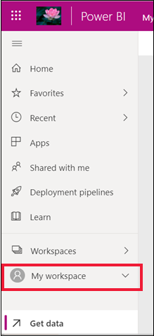

2. In the bottom-left corner, select **Get data**.

    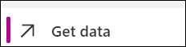

3. On the Get data page that appears, select **Samples**.

4. Select the Sales and Marketing Sample, then choose **Connect**.

    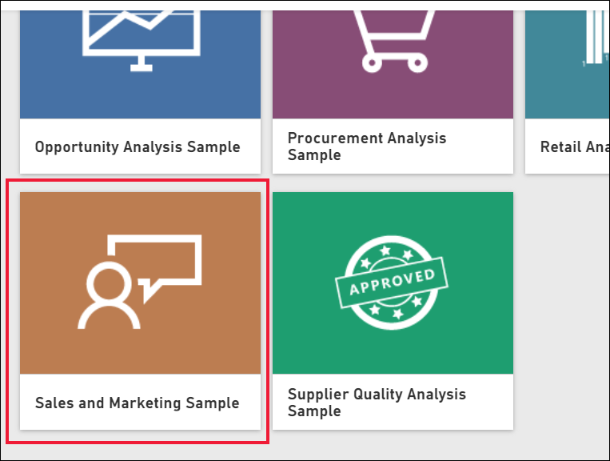

5. After Power BI has connected to the sample, select **Go to dashboard** from the dialog that appears.     
    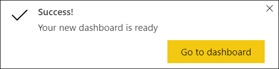

## Add an alert to a dashboard tile

1. From a dashboard gauge, KPI, or card tile, select the ellipsis.
   
   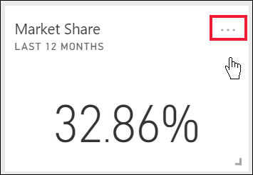

2. Select the alert icon 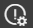, or **Manage alerts**, to add one or more alerts for the **Market share** card.

   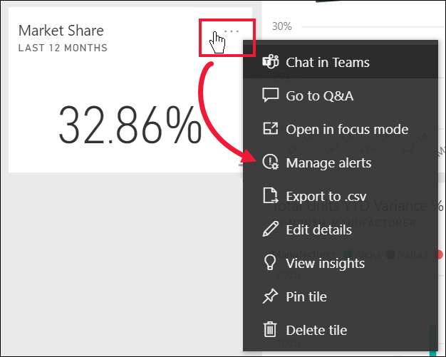

   
1. On the **Manage alerts** pane, select **+ Add alert rule**.  Ensure the slider is set to **On**, and give your alert a title. Titles help you easily recognize your alerts.
   
   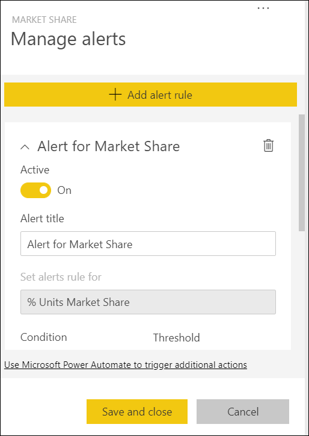
4. Scroll down and enter the alert details.  In this example we'll create an alert that notifies us once a day if our market share increases to 40 or higher. Alerts will appear in our [Notification center](end-user-notification-center.md). And we'll have Power BI send us an email as well.
   
   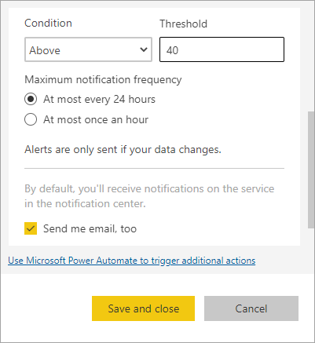

5. Select **Save and close**.
 

   > 

## Receiving alerts
When the data being tracked reaches one of the thresholds you've set, several things happen. First, Power BI checks to see if it has been more than an hour, or more than 24 hours (depending on the option you selected), since the last alert was sent. As long as the data is past the threshold, you'll get an alert.

Next, Power BI sends an alert to your Notification center and, optionally, in email. Each alert contains a direct link to your data. Select the link to see the relevant tile.  

1. If you've set the alert to send you an email, you'll find something like this in your Inbox. This is an alert we set for the **Sentiment** card.
   
   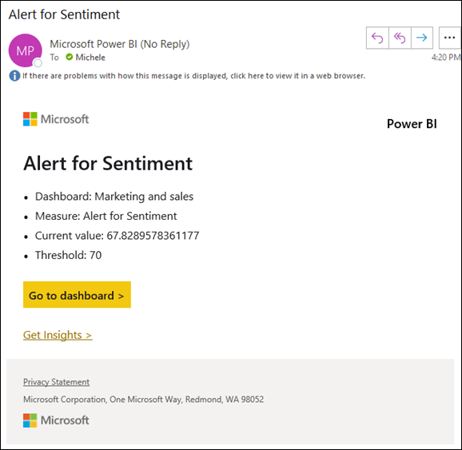
2. Power BI also adds a message to your **Notification center**.
   
   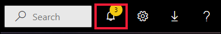
3. Open your Notification center to see the alert details.
   
    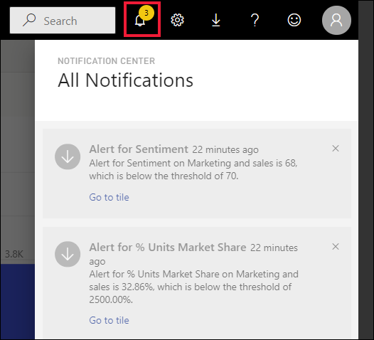
   
  

## Managing alerts

There are many ways to manage your alerts: from the dashboard tile itself, from the Power BI Settings menu, on an individual tile in the [Power BI mobile app on the iPhone](mobile/mobile-set-data-alerts-in-the-mobile-apps.md) or in the [Power BI mobile app for Windows 10](mobile/mobile-set-data-alerts-in-the-mobile-apps.md).

### From the tile itself

1. If you need to change or remove an alert for a tile, re-open the **Manage alerts** window by selecting the alert icon . All the alerts that you've set for that tile are displayed.
   
    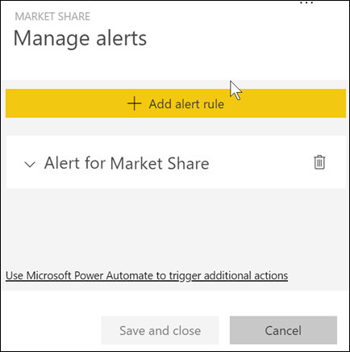.
2. To modify an alert, select the arrow to the left of the alert name.
   
    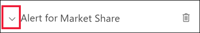.
3. To delete an alert, select the trashcan to the right of the alert name.
   
      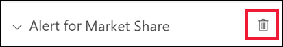

### From the Power BI settings menu

1. Select the gear icon from the Power BI menubar.
   
    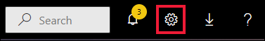.
2. Under **Settings** select **Alerts**.
   
    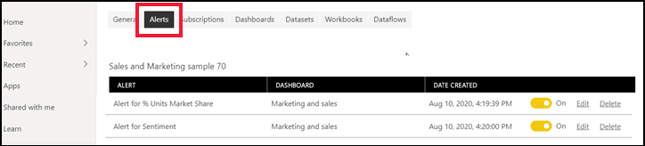
3. From here you can turn alerts on and off, open the **Manage alerts** window to make changes, or delete the alert.

## Tips and troubleshooting 

* If you are unable to set an alert for a gauge, KPI, or card, contact your Power BI admin or IT help desk for help. Sometimes alerts are turned off or unavailable for your dashboard or for specific types of dashboard tiles.
* Alerts only work on data that is refreshed. They do not work on static data. Most of the samples supplied by Microsoft are static. 
* The ability to receive and view shared content requires a Power BI Pro license, a Premium Per User license, or for the report to be saved in Premium reserved capacity. For more information, read [Which license do I have?](end-user-license.md).
* Alerts can be set on visuals created from streaming datasets that are pinned from a report to a dashboard. Alerts can't be set on streaming tiles created directly on the dashboard using **Add tile** > **Custom streaming data**.

## Clean up resources
Instructions for deleting alerts are explained above. In brief, select the gear icon from the Power BI menubar. Under **Settings** select **Alerts** and delete the alert.

> [!div class="nextstepaction"]
> [Set data alerts on your mobile device](mobile/mobile-set-data-alerts-in-the-mobile-apps.md)

