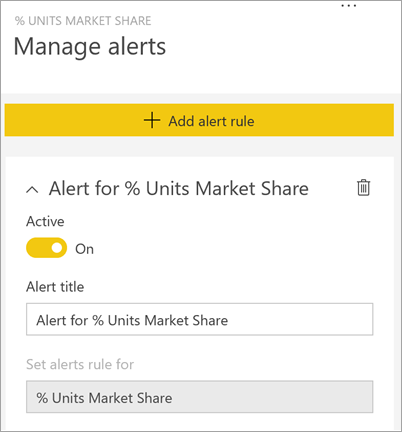

# Tutorial: Set dashboard alerts on Power BI dashboards

[!INCLUDE[consumer-appliesto-ynny](../includes/consumer-appliesto-ynny.md)]

[!INCLUDE [power-bi-service-new-look-include](../includes/power-bi-service-new-look-include.md)]

Set alerts to notify you when data on your dashboards changes above or below limits you set. Alerts work on gauges, kpis, and cards. This feature is still evolving, so refer to the [Tips and troubleshooting section below](#tips-and-troubleshooting).

Only you can see the alerts you set, even if you share your dashboard. Data alerts are fully synchronized across platforms; set and view data alerts [in the Power BI mobile apps](mobile/mobile-set-data-alerts-in-the-mobile-apps.md) and in the Power BI service. 

> [!WARNING]
> These alerts provide information about your data. If you view your Power BI data on a mobile device and that device gets stolen, we recommend using the Power BI service to turn off all alerts.
> 

This tutorial covers the following.
> [!div class="checklist"]
> * Who can set alerts
> * Which visuals support alerts
> * Who can see my alerts
> * Do alerts work on Power BI Desktop and mobile
> * How to create an alert
> * Where will I receive my alerts

If you're not signed up for Power BI, [sign up for a free trial](https://app.powerbi.com/signupredirect?pbi_source=web) before you begin.

This example uses a dashboard card tile from the Sales & Marketing sample app. This app is available on [Microsoft AppSource](https://appsource.microsoft.com). For help getting the app, see [Install and use apps with Power BI](end-user-app-view.md).

1. From a dashboard gauge, KPI, or card tile, select the ellipsis.
   
   
2. Select the bell icon , or **Manage alerts**, to add one or more alerts for **Total stores**.

   

   
1. On the **Manage alerts** pane, select **+ Add alert rule**.  Ensure the slider is set to **On**, and give your alert a title. Titles help you easily recognize your alerts.
   
   
4. Scroll down and enter the alert details.  In this example we'll create an alert that notifies us once a day if our market share increases to 35 or higher. Alerts will appear in our Notification center. And we'll have Power BI send us an email as well.
   
   
5. Select **Save and close**.
 
   > [!NOTE]
   > Alerts only work on data that is refreshed. When data refreshes, Power BI looks to see if an alert is set for that data. If the data has reached an alert threshold, an alert is triggered. 
   > 

## Receiving alerts
When the data being tracked reaches one of the thresholds you've set, several things happen. First, Power BI checks to see if it has been more than an hour, or more than 24 hours (depending on the option you selected), since the last alert was sent. As long as the data is past the threshold, you'll get an alert.

Next, Power BI sends an alert to your Notification center and, optionally, in email. Each alert contains a direct link to your data. Select the link to see the relevant tile.  

1. If you've set the alert to send you an email, you'll find something like this in your Inbox. This is an alert we set on an different dashboard, this dashboard tracks tasks completed by the Usability team.
   
   
2. Power BI adds a message to your **Notification center** and adds a new alert icon to the applicable tile.
   
   
3. Open your Notification center to see the alert details.
   
    
   
  

## Managing alerts

There are many ways to manage your alerts: From the dashboard tile itself, from the Power BI Settings menu, on an individual tile in the [Power BI mobile app on the iPhone](mobile/mobile-set-data-alerts-in-the-mobile-apps.md) or in the [Power BI mobile app for Windows 10](mobile/mobile-set-data-alerts-in-the-mobile-apps.md).

### From the tile itself

1. If you need to change or remove an alert for a tile, re-open the **Manage alerts** window by selecting the bell icon . All the alerts that you've set for that tile are displayed.
   
    .
2. To modify an alert, select the arrow to the left of the alert name.
   
    .
3. To delete an alert, select the trashcan to the right of the alert name.
   
      

### From the Power BI settings menu

1. Select the gear icon from the Power BI menubar.
   
    .
2. Under **Settings** select **Alerts**.
   
    
3. From here you can turn alerts on and off, open the **Manage alerts** window to make changes, or delete the alert.

## Tips and troubleshooting 

* Alerts can only be set on gauges, KPIs and cards.
* If you are unable to set an alert for a gauge, KPI, or card, contact your system administrator for help. Sometimes alerts are turned off or unavailable for your dashboard or for specific types of dashboard tiles.
* Alerts only work on data that is refreshed. They do not work on static data. Most of the samples supplied by Microsoft are static. 

## Clean up resources
Instructions for deleting alerts are explained above. In brief, select the gear icon from the Power BI menubar. Under **Settings** select **Alerts** and delete the alert.

> [!div class="nextstepaction"]
> [Set data alerts on your mobile device](mobile/mobile-set-data-alerts-in-the-mobile-apps.md)

