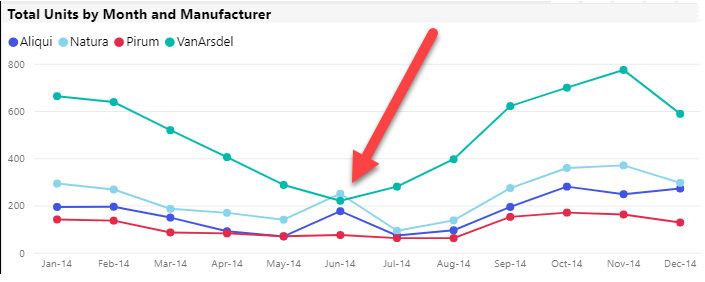
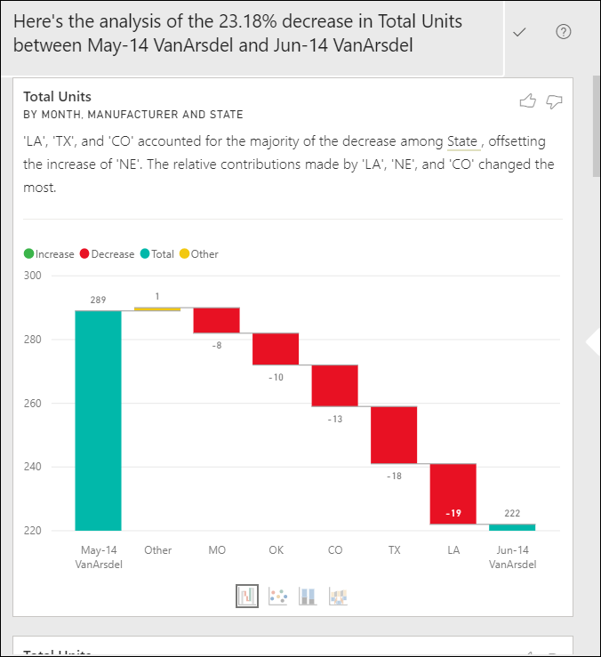
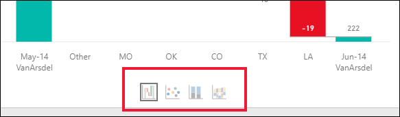
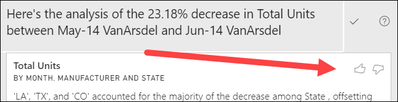
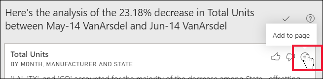
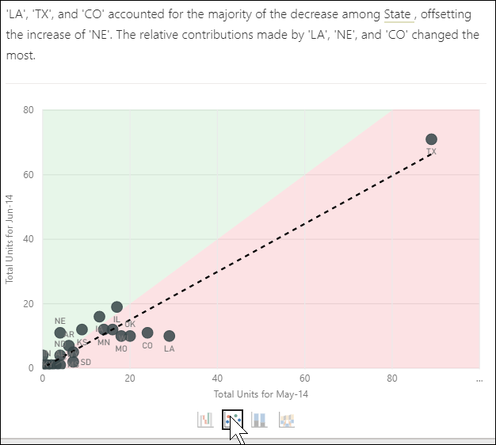
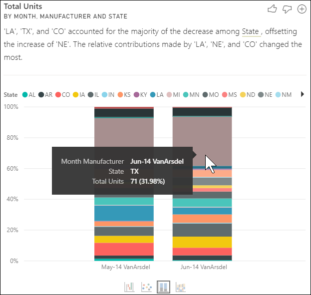
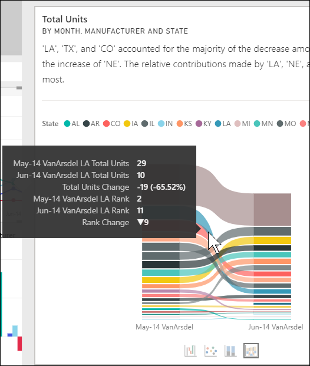

# Use the Analyze feature to explain fluctuations in report visuals

[!INCLUDE[consumer-appliesto-yynn](../includes/consumer-appliesto-yynn.md)]

Often in report visuals, you see a large increase and then a sharp drop in values, and wonder about the cause of such fluctuations. With **Analyze** in **the Power BI service**, you can learn the cause with just a few clicks.

For example, consider the following visual that shows *Total units* by *Month* and *Manufacturer*. VanArsdel is outperforming its competitors but has a deep dip in June 2014. In such cases you can explore the data, to help explain the change that occurred. 

You can ask the Power BI service to explain increases, decreases, or unusual distributions in visuals, and get fast, automated, insightful analysis about your data. Right-click on a data point, and select **Analyze > Explain the decrease** (or increase, if the previous bar was lower), or **Analyze > Find where this distribution is different** and the insight is delivered to you in an easy-to-use window.

The Analyze feature is contextual, and is based on the immediately previous data point - such as the previous bar, or column.

> [!NOTE]
> This feature is in preview, and is subject to change. The insight feature is enabled and on by default (you don't need to check a Preview box to enable it).

### Which factors and categories are chosen

After examining different columns, Power BI selects and displays those factors that show the biggest change to relative contribution. For each, the values which had the most significant change to contribution are called out in the description. In addition, the values that had the largest actual increases and decreases are also called out.

To see all of the insights generated by Power BI, use the scrollbar. The order is ranked with the most significant contributor displayed first. 

## Using insights
To use insights to explain trends seen on visuals, right-click on any data point in a bar or line chart, and select **Analyze**. Then choose the option that appears: **explain the increase**, **explain the decrease**, or **explain the difference**.

Power BI then runs its machine learning algorithms over the data, and populates a window with a visual and a description that describes which categories most influenced the increase or decrease or difference.  For this example, the first insight is a waterfall chart.

By selecting the small icons at the bottom of the waterfall visual, you can choose to have insights display a scatter chart, stacked column chart, or a ribbon chart.

Use the *thumbs up* and *thumbs down* icons at the top of the page to provide feedback about the visual and the feature.  

You can use insights when your report is in Reading or Editing view, making it versatile for both analyzing data, and for creating visuals you can easily add to your reports. If you have the report open in Editing view, you'll see a plus icon next to the thumb icons. Select the plus icon to add the insight to your report as a new visual. 

## Details of the results returned

The details returned by insights are intended to highlight what was different between the two time periods, to help you understand the change between them.  

The algorithm can be thought of as taking all the other columns in the model, and calculating the breakdown by that column for the *before* and *after* time periods, determining how much change occurred in that breakdown, and then returning those columns with the biggest change. For example, *State* was selected in the waterfall insight above, as the contribution made by Louisiana, Texas, and Colorado fell 13% to 19% from June to July, and contributed the most to the decrease in *Total units*.  

For each insight returned, there are four visuals that can be displayed. Three of those visuals are intended to highlight the change in contribution between the two periods. For example, for the explanation of the increase from *Qtr 2* to *Qtr 3*. The ribbon chart shows change both  before and after the selected data point.

### The scatter plot

The scatter plot visual shows the value of the measure in the first period (on the x-axis) against the value of the measure in the second period (on the y-axis), for each value of the column (*State* in this case). Data points are in the green region if they have increased, and in the red region if they have decreased. 

The dotted line shows the best fit, and data points above this line increased by more than the overall trend, and those below it by less.  

Data items whose value was blank in either period will not appear on the scatter plot.

### The 100% stacked column chart

The 100% stacked column chart visual shows the value of the contribution to the total (100%), for the selected data point and the previous. This allows side-by-side comparison of the contribution for each data point. In this example, the tooltips show the actual contribution for the selected value of Texas. Because the list of states is long, tooltips help you see the details. By using the tooltips, we see that Texas contributed about the same percent to the total units (31% and 32%), but the actual number of total units decreased from 89 to 71. Remember, the Y axis is a percentage, not a total, and each column band is a percentage, not a value. 

### The ribbon chart

The ribbon chart visual shows the value of the measure before and after. It's particularly useful in showing the changes in contributions when the *ordering* of contributors changed (for example, *LA* dropped from number two contributor to number eleven).  And, though *TX* is represented by a wide ribbon at the top signifying that it is the most significant contributor before and after, the drop shows that the value of the contribution dropped both during the selected period and after.

### The waterfall chart

The fourth visual is a waterfall chart, showing actual increases or decreases between the periods. This visual clearly shows one significant contributor to the decrease for June 2014 -- in this case, **State**. And the particulars of **State**'s influence on total units are that declines in Louisiana, Texas, and Colorado played the most significant role.      

 

## Considerations and limitations
Since these insights are based on the change from the previous data point, they aren't available when you select the first data point in a visual. 

**Analyze** is not available for all visual types. 

The following list is the collection of currently unsupported scenarios for **Analyze - explain the increase/decrease/difference**:

* TopN filters
* Include/exclude filters
* Measure filters
* Non-numeric measures
* Use of "Show value as"
* Filtered measures - filtered measures are visual level calculations with a specific filter applied (for example, *Total Sales for France*), and are used on some of the visuals created by the insights feature
* Categorical columns on X-axis unless it defines a sort by column that is scalar. If using a hierarchy, then every column in the active hierarchy has to match this condition

## Next steps
[Waterfall charts](../visuals/power-bi-visualization-waterfall-charts.md)    
[Scatter charts](../visuals/power-bi-visualization-scatter.md)    
[Column charts](../visuals/power-bi-report-visualizations.md)    
[Ribbon charts](../visuals/desktop-ribbon-charts.md)
