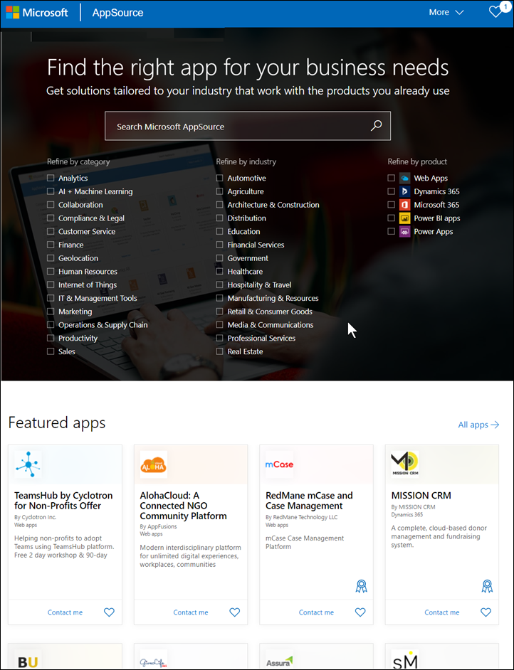
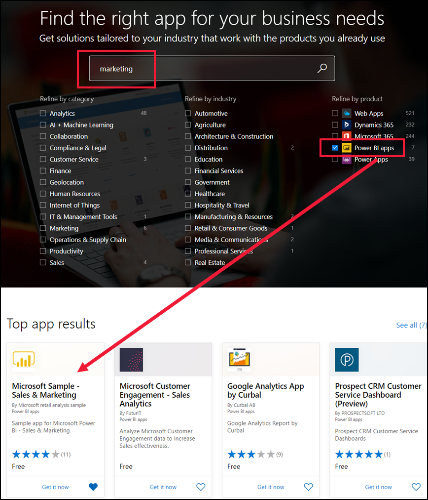
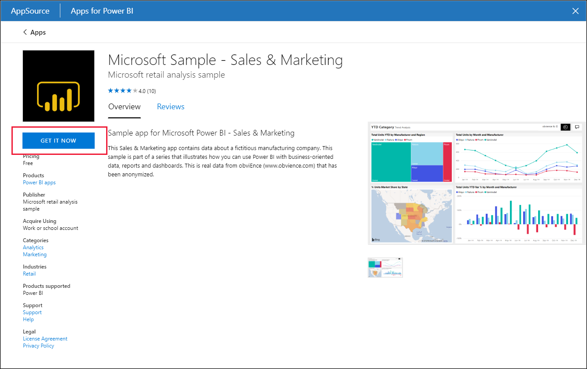
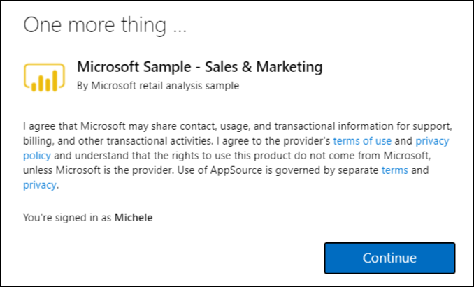
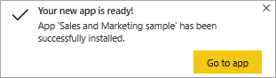
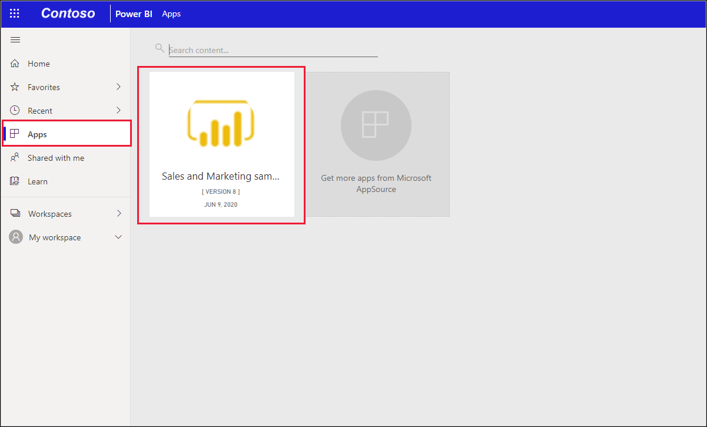
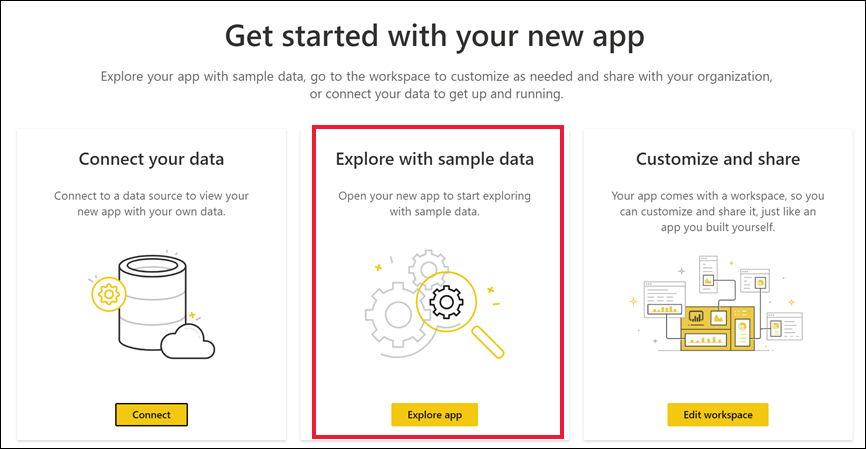
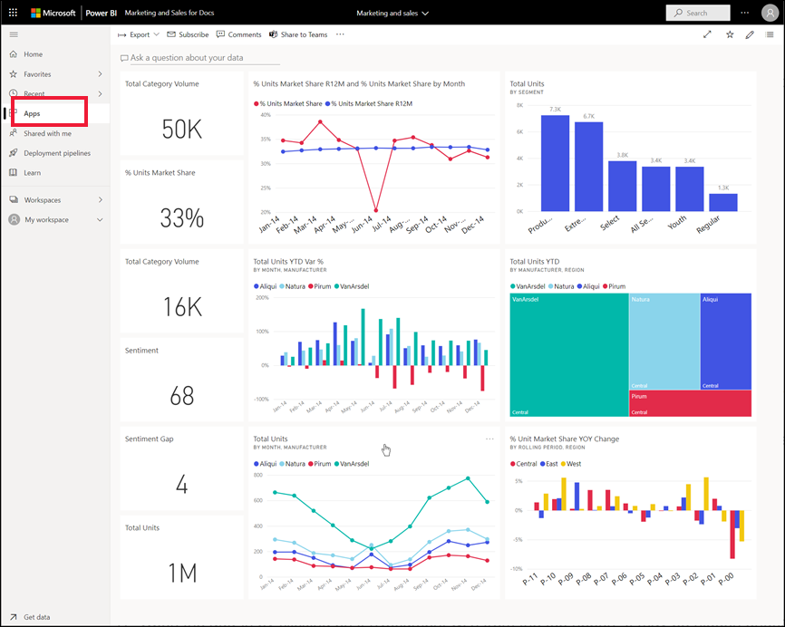

# Install and use the sample Sales and Marketing app in the Power BI service

[!INCLUDE[consumer-appliesto-yyny](../includes/consumer-appliesto-yyny.md)]

Now that you have a [basic understanding of how to get Power BI content](end-user-app-view.md), let's use Microsoft AppSource to get the Marketing and Sales app. 

## Get the app from Microsoft AppSource

1. Open [https://appsource.microsoft.com](https://appsource.microsoft.com).

   

1. In the search box, enter **Marketing** and place a checkmark next to **Refine by product > Power BI apps**. 

    

1. Select the app tile for **Microsoft sample - Sales & Marketing**. Optionally, read through the overview and reviews and take a look at the images.  Then, select **Get it now**.

   

1. Confirm that you want to install this app.

   

5. The Power BI service displays a success message once the app is installed. Select **Go to app** to open the app. Depending on how the designer created the app, either the app dashboard or app report will display.

    

    You can also open the app directly from your app content list by selecting **Apps** and choosing the **Sales & Marketing** app tile.

    

6. Choose whether to connect your own data, explore with sample data, or customize and share your new app. Because we've selected a Microsoft sample app, let's start by exploring. 

    

7.  Your new app opens with a dashboard. The app *designer* could have set the app to open to a report instead.  

    

## Interact with the dashboards and reports in the app
Take some time to explore the data in the dashboards and reports that make up the app. You have access to all of the standard Power BI interactions such as filtering, highlighting, sorting, and drilling down.  Still a little confused by the difference between dashboards and reports?  Read the [article about dashboards](end-user-dashboards.md) and the [article about reports](end-user-reports.md).  

## Next steps
* [Back to the apps overview](end-user-apps.md)    
* [View a Power BI report](end-user-report-open.md)    
* [Other ways content is shared with you](end-user-shared-with-me.md)
