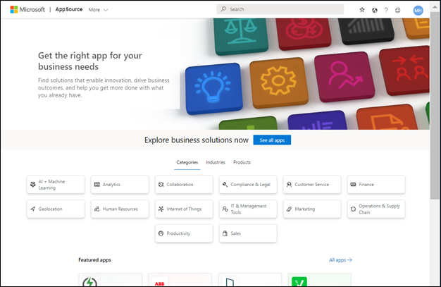
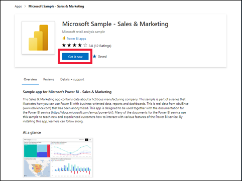
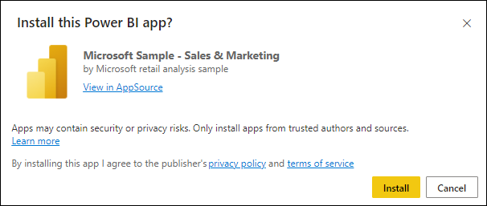
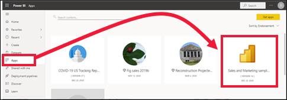
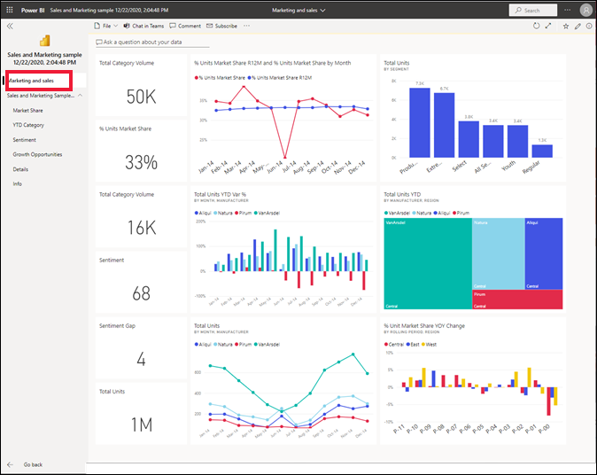

# Install and use the sample Sales and Marketing app in the Power BI service

[!INCLUDE[consumer-appliesto-yyny](../includes/consumer-appliesto-yyny.md)]

Now that you have a [basic understanding of how to get Power BI content](end-user-app-view.md), let's use Microsoft AppSource to get the Marketing and Sales template app. The Marketing and Sales template app contains sample data that you can use to explore the Power BI service. This particular app has one dashboard and several report pages. 

> [!IMPORTANT]
> Installing this app from Microsoft AppSource requires that you have a **Power BI Pro** license.  For more information, see [licenses](end-user-license.md).

## Get the app from Microsoft AppSource

1. Open [https://appsource.microsoft.com](https://appsource.microsoft.com).

   

1. In the search box, enter **Microsoft sample** and select **Microsoft sample - Sales & Marketing**. 

    

1. Optionally, read through the overview and reviews and take a look at the images.  Then, select **Get it now**.

   

1. Confirm that you want to install this app.

   

5. The Power BI service displays a success message once the app is installed. Select **Go to app**. Or select the app itself from your **Apps** canvas. Depending on how the designer created the app, either the app dashboard or app report will display.

    

7.  This template app is set to open to the dashboard. The app *designer* could have set the app to open to one of the report pages instead.  

    

## Interact with the dashboards and reports in the app
Take some time to explore the data in the dashboards and reports that make up the app. You have access to all of the standard Power BI interactions such as filtering, highlighting, sorting, and drilling down.  Still a little confused by the difference between dashboards and reports?  Read the [article about dashboards](end-user-dashboards.md) and the [article about reports](end-user-reports.md).  

## Next steps
* [Back to the apps overview](end-user-apps.md)    
* [View a Power BI report](end-user-report-open.md)    
* [Other ways content is shared with you](end-user-shared-with-me.md)
