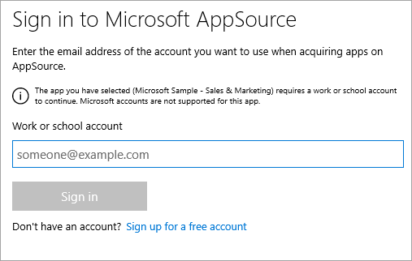
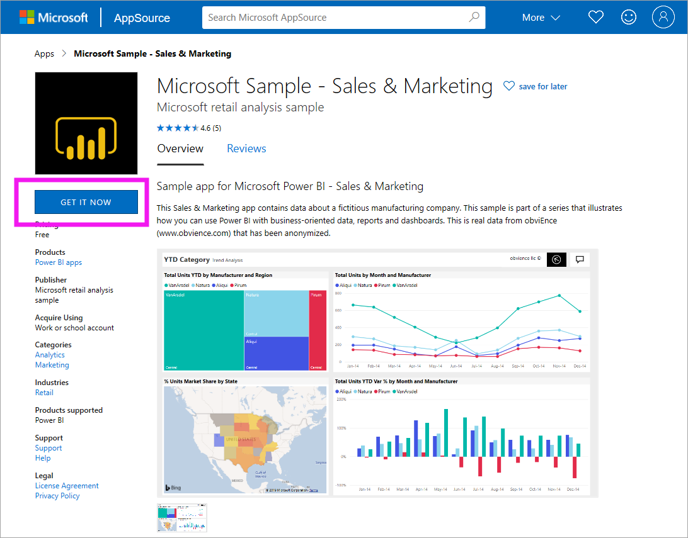
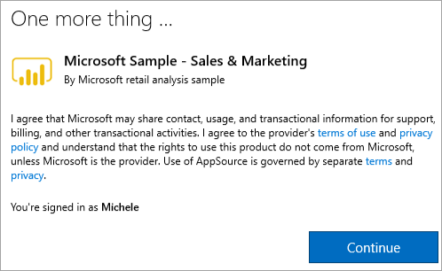
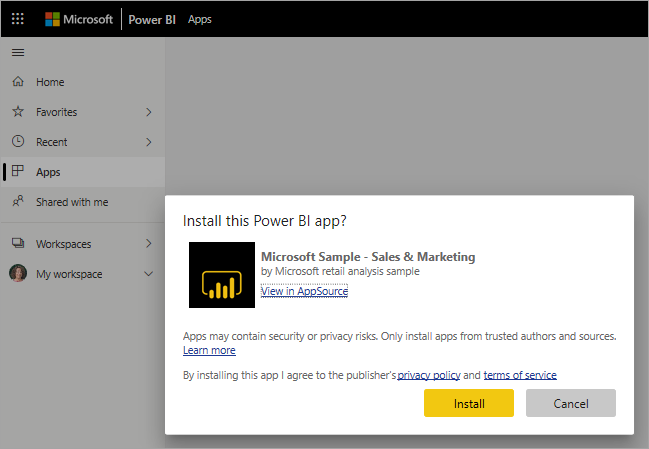
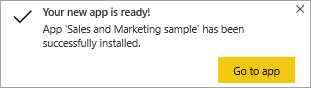
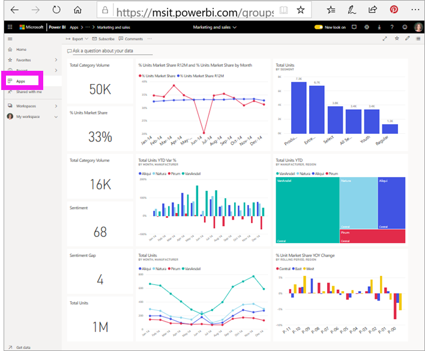

# Install and use the sample Sales and Marketing app in the Power BI service

[!INCLUDE[consumer-appliesto-yyny](../includes/consumer-appliesto-yyny.md)]

Now that you have a [basic understanding of how to get Power BI content](end-user-app-view.md), let's get the Marketing and Sales app from Microsoft AppSource (appsource.com). 

## Microsoft AppSource (appsource.com)
Here is the link to the app: [Marketing and sales app](https://appsource.microsoft.com/product/power-bi/microsoft-retail-analysis-sample.salesandmarketingsample?tab=Overview). Selecting this link opens the download page for this app on Microsoft AppSource. 

1. You may be asked to sign in before you can get the app. Sign in using the same email address you use for Power BI. 

    

2. Select **Get it now**. 

    

3. If this is your first time signing in to AppSource, you'll need to agree to the terms of use. 

    

4. The Power BI service opens. Confirm that you want to install this app.

    

5. The Power BI service will display a success message once the app is installed. Select **Go to app** to open the app. Depending on how the designer created the app, either the app dashboard or app report will display.

    

    You can also open the app directly from your app content list by selecting **Apps** and choosing **Sales & Marketing**.

    

6. Choose whether to explore or customize and share your new app. Because we've selected a Microsoft sample app, let's start by exploring. 

    

7.  Your new app opens with a dashboard. The app *designer* could have set the app to open to a report instead.  

    

## Interact with the dashboards and reports in the app
Take some time to explore the data in the dashboards and reports that make up the app. You have access to all of the standard Power BI interactions such as filtering, highlighting, sorting, and drilling down.  Still a little confused by the difference between dashboards and reports?  Read the [article about dashboards](end-user-dashboards.md) and the [article about reports](end-user-reports.md).  

## Next steps
* [Back to the apps overview](end-user-apps.md)
* [View a Power BI report](end-user-report-open.md)
* [Other ways content is shared with you](end-user-shared-with-me.md)
