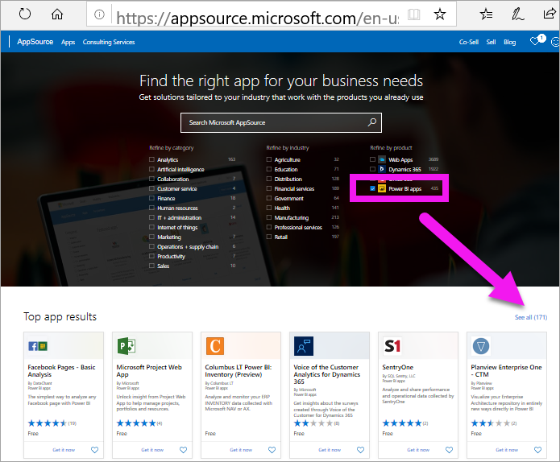
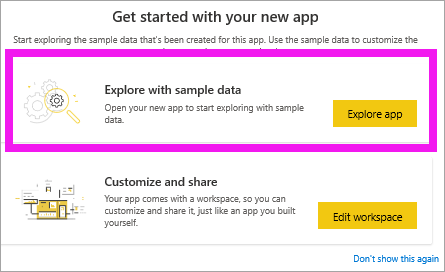

# Install and use the sample Sales and Marketing app in the Power BI service
Now that you have a [basic understanding of how to get Power BI content](end-user-app-view.md), let's use Microsoft AppSource (appsource.com) to get an app. 

## Microsoft AppSource (appsource.com)
 Microsoft AppSource contains many apps created by colleagues and the community. Only apps that you can access (i.e., the app author has given you or given everyone permission) are displayed.

In this example, we'll open one of the Microsoft sample apps. On AppSource you'll find apps for many of the services that you use to run your business.  Services such as Salesforce, Microsoft Dynamics, Google Analytics, GitHub, Zendesk, Marketo, and many more. To learn more, visit [Apps for services you use with Power BI](../service-connect-to-services.md). 

1. In a browser, open https://appsource.microsoft.com, and select **Power BI apps**.

    

2. Select **See all** to display the list of all Power BI apps currently available on AppSource. Scroll or search for the app named **Microsoft Sample - Sales & Marketing**.

    

3. Select **Get it now** and agree to the terms of use.

    

4. Confirm that you want to install this app.

    

5. The Power BI service will display a success message once the app is installed. Select **Go to app** to open the app. Depending on how the designer created the app, either the app dashboard or app report will display.

    

    You can also open the app directly from your app content list by selecting **Apps** and choosing **Sales & Marketing**.

    

6. Choose whether to explore or customize and share your new app. Because we've selected a Microsoft sample app, let's start by exploring. 

    

7.  Your new app opens with a dashboard. The app *designer* could've set the app to open to a report instead.  

    

## Interact with the dashboards and reports in the app
Take some time to explore the data in the dashboards and reports that make up the app. You have access to all of the standard Power BI interactions such as filtering, highlighting, sorting, and drilling down.  Still a little confused by the difference between dashboards and reports?  Read the [article about dashboards](end-user-dashboards.md) and the [article about reports](end-user-reports.md).  

## Next steps
* [Back to the apps overview](end-user-apps.md)
* [View a Power BI report](end-user-report-open.md)
* [Other ways content is shared with you](end-user-shared-with-me.md)
