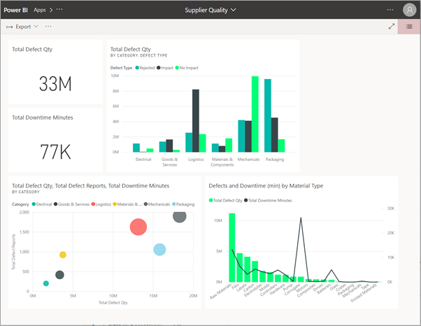
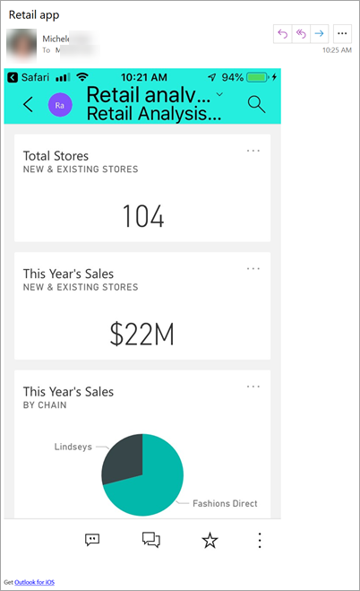
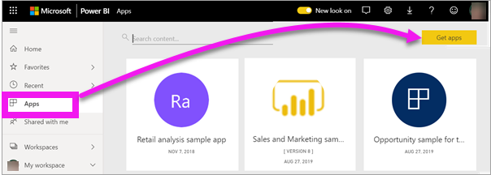
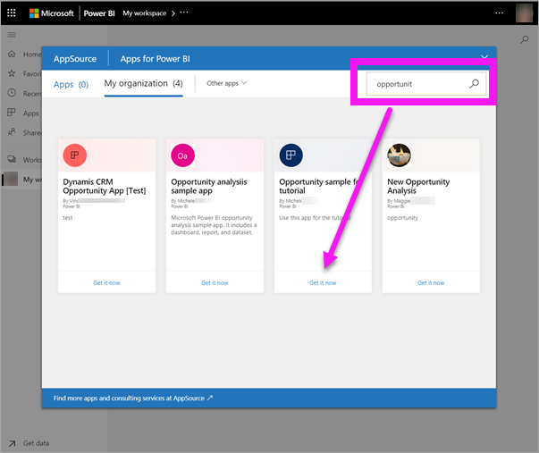
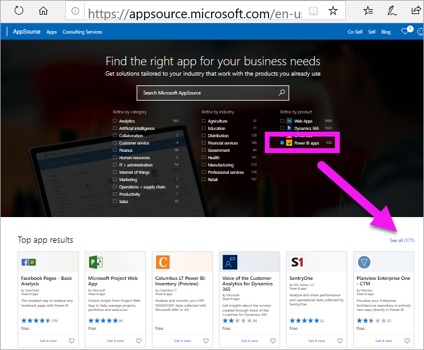
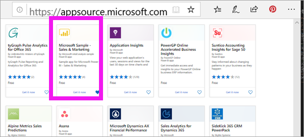
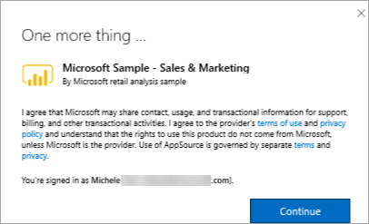
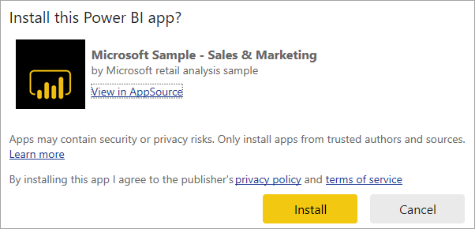

# Install and use apps with dashboards and reports in Power BI

[!INCLUDE[consumer-appliesto-ynny](../includes/consumer-appliesto-ynny.md)]

[!INCLUDE [power-bi-service-new-look-include](../includes/power-bi-service-new-look-include.md)]

Now that you have a [basic understanding of apps](end-user-apps.md), let's learn how to open and interact with apps. 

## Ways to get a new app
There are several ways to get a new app:
* You can get it from the Power BI app marketplace in Power BI.
* A report designer in your organization can install the app automatically in your Power BI account.
* You can use a direct link to an app that you have received from the app creator. 

In your Power BI mobile app, you can only install an app from a direct link. If the app designer installs the app automatically, you'll see it in your list of apps.

## Apps and licenses
Not all Power BI users can view and interact with apps. 
- If you have a free license, you can open apps that have been shared with you, and that are stored in a workspace in Premium capacity.
- If you have a Pro license, you can open apps that have been shared with you.

## Install an app from a direct link
The easiest way to install a new app yourself is to get a direct link, in email, from the app designer.  

**On your computer** 

When you select the link in email, the Power BI service ([https://powerbi.com](https://powerbi.com)) opens the app in your browser. 

**On your iOS or Android mobile device** 

When you select the link in email on your mobile device, the app installs automatically and opens in the mobile app. You may have to sign in first. 

## Get the app from Microsoft AppSource
You can also find and install apps from Microsoft AppSource. Only apps that you can access (i.e., the app author has given you or given everyone permission) are displayed. 

> [!NOTE]
> If you are using a free user license, you'll be able to download apps but won't be able to view them unless you upgrade to a Power BI Pro account or unless the app is stored in Premium capacity. For more information, see [licenses for consumers](end-user-license.md).

1. Select **Apps**  > **Get apps**. 
   
        
2. In AppSource under **My organization**, search to narrow the results and find the app you're looking for.
   
    
3. Select **Get it now** to add it to your Apps content list. 

## Get an app from the Microsoft AppSource website 

In this example, we'll open one of the Microsoft sample apps. On AppSource you'll find apps for many of the services that you use to run your business.  Services such as Salesforce, Microsoft Dynamics, Google Analytics, GitHub, Zendesk, Marketo, and many more. To learn more, visit [Apps for services you use with Power BI](../connect-data/service-connect-to-services.md). 

1. In a browser, open [https://appsource.microsoft.com](https://appsource.microsoft.com), and select **Power BI apps**.

    

2. Select **See all** to display the list of all Power BI apps currently available on AppSource. Scroll or search for the app named **Microsoft Sample - Sales & Marketing**.

    

3. Select **Get it now** and agree to the terms of use.

    

4. Confirm that you want to install this app.

    

5. The Power BI service will display a success message once the app is installed. Select **Go to app** to open the app. Depending on how the designer created the app, either the app dashboard or app report will display.

    

    > [!NOTE]
    > If you are using a free user license, you'll be able to download apps but won't be able to view them unless you upgrade to a Power BI Pro account. 

    You can also open the app directly from your app content list by selecting **Apps** and choosing **Sales & Marketing**.

    

6. Choose whether to explore or customize and share your new app. Because we've selected a Microsoft sample app, let's start by exploring. 

    

7.  Your new app opens with a dashboard. The app *designer* could've set the app to open to a report instead.  

    

## Interact with the dashboards and reports in the app
Take some time to explore the data in the dashboards and reports that make up the app. You have access to all of the standard Power BI interactions such as filtering, highlighting, sorting, and drilling down.  Still a little confused by the difference between dashboards and reports?  Read the [article about dashboards](end-user-dashboards.md) and the [article about reports](end-user-reports.md).  

## Update an app 

From time to time, app creators may release new versions of their apps. How you get the new version depends on how you received the original. 

* If you got the app from your organization, the update to the new version is entirely transparent - you don't have to do anything. 

* If you got the app from AppSource, the next time you open the app you'll see a notification banner. The notification lets you know that a new version is available. 

    1. Select **Get it** to update.  

        <!-- -->

    2. When prompted to install the updated app, select **Install**. 

         

    3. Since you already have a version of this app, decide whether to replace the existing version or whether to install the updated app in a new workspace.   

         

    > [!NOTE] 
    > Installing a new version overwrites any changes you may have made to the reports and dashboards. To keep your updated reports and dashboards, you can save them under a different name or in a different location before installing. 

    4. Once you've installed the updated version, select **Update app** to complete the update process. 

## Next steps
* [Back to the apps overview](end-user-apps.md)
* [View a Power BI report](end-user-report-open.md)
* [Other ways content is shared with you](end-user-shared-with-me.md)

