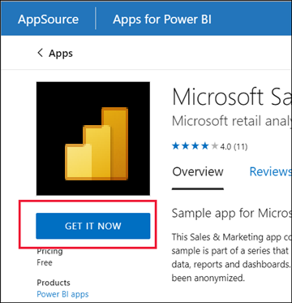
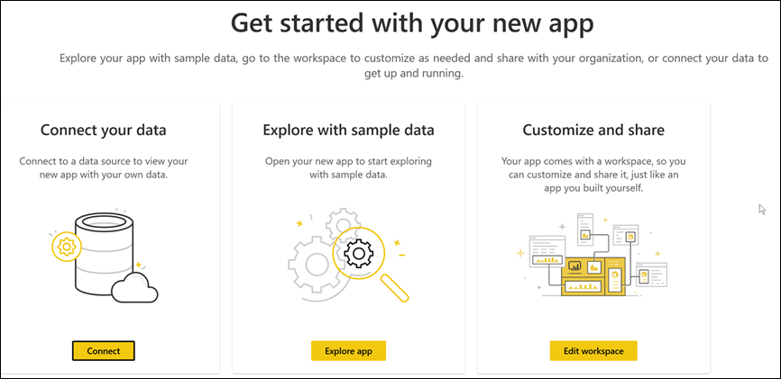
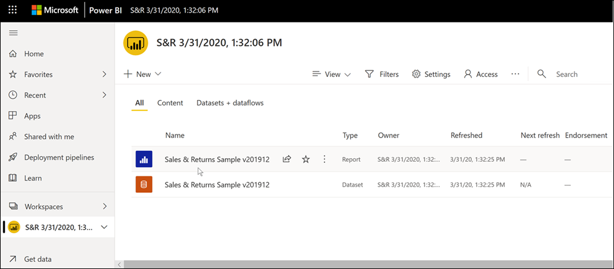
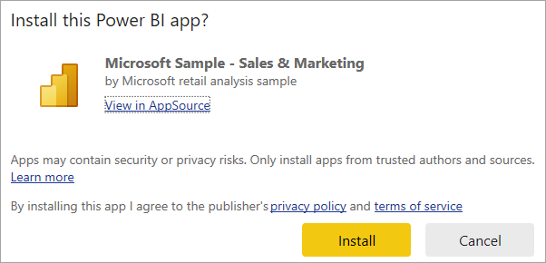
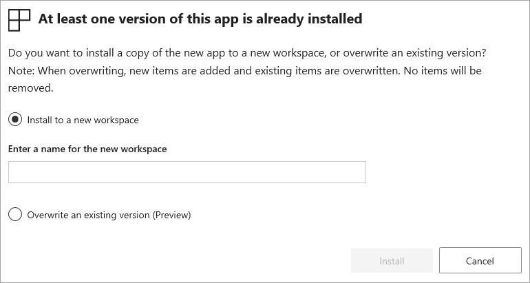

# Install and use apps with dashboards and reports in Power BI

[!INCLUDE[consumer-appliesto-ynny](../includes/consumer-appliesto-ynny.md)]

Now that you have a [basic understanding of apps](end-user-apps.md), you can learn how to open and interact with them. 

## Ways to get a new app

You can get a new app:

* From the Power BI apps marketplace in the Power BI service.
* By using a direct link to an app that you receive from the app designer. 
* When an app designer in your organization installs the app automatically in your Power BI account.

With Power BI mobile, you can only install an app from a direct link. The Power BI apps marketplace isn't available in Power BI mobile. If the app designer installs the app automatically, you'll see it in your list of apps.

## Apps and licenses

Not all Power BI users can view and interact with apps. If you have a free license, you can open apps that are stored in Premium capacity or Fabric F64 or greater capacity and that are shared with you. If you have a Pro license or a Premium Per User license, you can open apps that are shared with you.

So, if you can't open an app, contact your administrator or help desk. For information about licensing, see [Power BI licensing](end-user-license.md).

## Get the app from the Power BI apps marketplace

You can find and install apps from the Power BI apps marketplace. In the apps marketplace, you'll find both organizational apps and template apps.

- An *organizational app* is available to Power BI users in your organization. These apps also include pre-built dashboards and reports that you can use as-is or customize and share. Your organization might have apps for things like tracking sales, measuring performance, or analyzing hiring success.
- A *template app* comes with pre-built dashboards and reports that you can use to connect to many of the services you use to run your business, such as SalesForce, Microsoft Dynamics, and Google Analytics.

1. To install an app, [sign in to the Power BI service](./end-user-sign-in.md) if prompted. 

2. Select **Apps > Get apps**.  
   If you're brand new to Power BI, your App page looks like the following example. If you already have apps installed, select **Get apps** from the upper right corner of the page.

    :::image type="content" source="./media/end-user-app-view/power-bi-get-apps.png" alt-text="Screenshot of the Apps page on the navigation pane." lightbox="./media/end-user-app-view/power-bi-get-apps.png":::

3. The Power BI apps marketplace opens.

   :::image type="content" source="./media/end-user-app-view/power-bi-app-marketplace.png" alt-text="Screenshot of the Power BI apps marketplace." lightbox="./media/end-user-app-view/power-bi-app-marketplace.png":::

   Three tabs are available for you to use:
   * **All apps** - Browse both template apps and all the organizational apps that are available to you. Template apps are distinguished by the shopping bag icon in the upper right corner of their tiles.
   * **Organizational apps** - Browse organizational apps that have been shared with you. 
   * **Template apps** - Browse template apps that are hosted on AppSource.

   Alternatively, you can use the search box to get a filtered selection of apps. Type part of the name of an app or category, such as finance, analytics, or marketing, to make it easier to find the item you're looking for. 

   The search box is sensitive to the tab you have open. Only apps of the selected type are returned. If the **All apps** tab is open, both organizational and template apps are returned. It can be confusing when an organizational app and a template app have the same name. Just remember that the template app tiles have a shopping bag icon in the top right corner.

4. When you find the app that you want, select **Get it Now** to install it.

   

 * If you're installing an organizational app, it will immediately be added to your list of apps.
 * If you're installing a template app, you'll be taken to the template app offering in AppSource. See [an example](end-user-app-marketing.md) of how to download and install a sample template app from the Power BI apps marketplace. The app is installed, along with a workspace of the same name.

   > [!NOTE]
   > If you're using a free user license, you can download apps but you can't view them unless you upgrade to a Power BI Pro or Premium Per User license or unless the app is stored in a Premium capacity or Fabric F64 or greater capacity. For more information, see [Licenses for business users](end-user-license.md).

## Install an app from a direct link

You can also install an organizational app from a direct link:

- **On your computer**. When you select the link in an email, the [Power BI service](https://app.powerbi.com) opens the app in your browser. 

- **On your iOS or Android mobile device**. When you select the link in an email on your mobile device, the app installs automatically and opens in the mobile app. You might have to sign in first. 

## Interact with the dashboards and reports in the app

Take some time to explore the data in the dashboards and reports that make up the app. You have access to all of the standard Power BI interactions, such as filtering, highlighting, sorting, and drilling down. The extent of what you can do with an app is controlled by the permissions that the *designer* assigned to you. How you can interact with the app's dashboards and reports is controlled by the access and roles that the *designer* assigned to you. 

Still a little confused by the difference between dashboards and reports?  Learn more about [dashboards](end-user-dashboards.md) or [reports](end-user-reports.md) in Power BI.  

### Open an app

1. After you install an app or receive an app from a colleague, view it in your Apps content list by selecting **Apps** from the navigation pane. The following example shows the App page view set to **Gallery**. You can select **View** and then choose **List** to see your apps as a list.

   :::image type="content" source="./media/end-user-app-view/power-bi-apps-card.png" alt-text="Screenshot showing the Apps page on the navigation pane with the View dropdown highlighted." lightbox="./media/end-user-app-view/power-bi-apps-card.png":::

2. Select the app to open it. Depending on the app, you might receive a prompt that looks similar to the following example. Some apps ask you for contact information (name and email) or for product details (customer ID, subscription number, or parameters). Many apps load with sample data and provide a link for you to connect your own data. For guidance on which option to select, see [Install template apps](../connect-data/service-template-apps-install-distribute.md).

   

3. Select the app card to open it.

   :::image type="content" source="./media/end-user-app-view/power-bi-app-card.png" alt-text="Screenshot of the Sales and Marketing app card with the owner name, date, and time.":::

4. The **Sales and Marketing Sample** app opens to a report. The layout might look different if your app opens to a dashboard. If you select a report in the dashboard, the layout will look like the following example.

   :::image type="content" source="./media/end-user-app-view/power-bi-app-number.png" alt-text="Screenshot of the Sales and Marketing app with different areas identified by numbers." lightbox="./media/end-user-app-view/power-bi-app-number.png":::

Apps have different layouts, visuals, colors, and options, but they all have most of the features shown in this example:

1. Name of the app and last updated time. Select the dropdown arrow to look up the owner and Help contact.
2. Select **Power BI** to return to [Home](end-user-home.md).
3. Your menu bar. 
4. The report page canvas.
5. The app navigation pane.  Below the name of the app is the list of content. This app has one report with six pages. Select a report page name to open it. We currently have the *Return rate* page open. 
6. Select the arrow to expand the **Filters** pane.

You can explore the associated workspace if you've been given access. When you install or download a template app, the Power BI service creates a workspace for you. When you install an organizational app, it might not include access to the workspace. For more information, see [Collaborate in workspaces](end-user-workspaces.md). Select **Power BI** (number 2) to return to **Home** and choose **Workspaces**. 

### Share reports and dashboards from an app

You can share reports and dashboards that are in an app the same way you share any other report or dashboard: 

- Open the report or dashboard, and select **Share**.

    :::image type="content" source="../collaborate-share/media/service-how-to-collaborate-distribute-dashboards-reports/power-bi-share-new-look.png" alt-text="Screenshot of the Share button on the ribbon.":::

See the article [Share Power BI reports and dashboards with coworkers and others](../collaborate-share/service-share-dashboards.md) for more information.

## Get an update of an app 

Sometimes app designers release new versions of their apps. How you get the new version depends on how you received the original. 

* If you got the app from your organization, the update to the new version is automatic and you don't have to do anything. 

* If you got a template app from AppSource, the next time you open the app you'll see a notification banner. The notification lets you know that a new version is available. 

    1. Select **Get it** to update.  

        <!-- -->

    2. When prompted to install the updated app, select **Install**. 

         

    3. Because you already have a version of this app, you can decide whether you want to replace the existing version, update only the workspace content *without* updating the app, or install the updated app in a new workspace.

         

     > [!NOTE] 
     > Installing a new version overwrites any changes you might have made to the app's reports and dashboards. To keep your updated reports and dashboards, save them under a different name or in a different location before installing. 

    4. Once you've installed the updated version, select **Update app** to complete the update process. 

## Considerations and troubleshooting

- The ability to install apps can be turned on and off by your Power BI administrator. Contact your IT department or help desk if you need this feature enabled.
- The use of apps requires either a Pro or Premium Per User license or for the app to be stored in a workspace in Premium shared capacity. [Learn about licenses](end-user-license.md).

## Related content

* [Back to the apps overview](end-user-apps.md)
* [View a Power BI report](end-user-report-open.md)
* [Other ways content is shared with you](../collaborate-share/end-user-shared-with-me.md)
