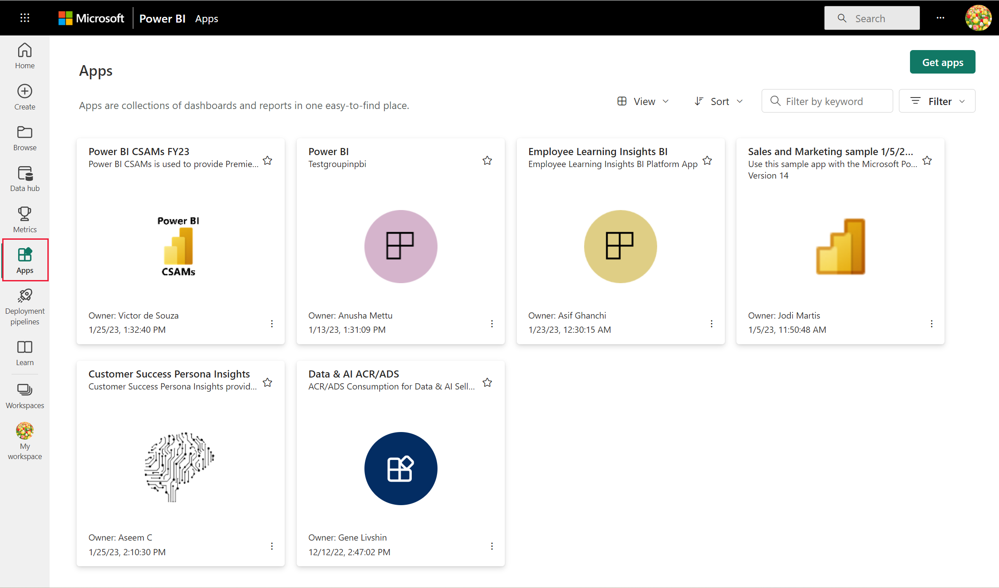

# Install and use apps with dashboards and reports in Power BI
Now that you have a [basic understanding of apps](end-user-apps.md), let's learn how to open and interact with apps. 

## Ways to get a new app
Remember, there are several ways to get a new app. A report designer colleague can install the app automatically in your Power BI account, or send you a direct link to an app. And, you can go to AppSource and search for apps available to you from both inside and outside your company. 

In Power BI on your mobile device, you can only install an app from a direct link, and not from AppSource. If the app author installs the app automatically, you'll see it in your list of apps.

### Install an app from a direct link
The easiest way to install a new app yourself is to get a direct link, in email, from the app author.  

**On your computer** 

When you select the link in email, Power BI service ([https://powerbi.com](https://powerbi.com)) opens in a browser. Confirm that you want to install the app, and Power BI opens to the app landing page.

**On your iOS or Android mobile device** 

When you select the link in email on your mobile device, the app installs automatically and opens the app content list in the mobile app. 

### Get the app from Microsoft AppSource
You can also find and install apps from Microsoft AppSource. Only apps that you an access (i.e., the app author has given you or given everyone permission) are displayed.

1. Select **Apps**  > **Get apps**. 
   
     
2. In AppSource under **My organization**, you can search to narrow the results and find the app you're looking for.
   
     
3. Select **Get it now** to add it to your Apps content list. 

## Interact with the dashboards and reports in the app
Now you can explore the data in the dashboards and reports in the app. You have access to all the standard Power BI interactions such as filtering, highlighting, sorting, and drilling down. You can also [export the data to Excel ](end-user-export-data.md) from a table or other visual in a report. Read about [interacting with reports in Power BI](end-user-reading-view.md). 

## Next steps
* [Power BI apps for external services](end-user-connect-to-services.md)
* Questions? [Try asking the Power BI Community](http://community.powerbi.com/)

