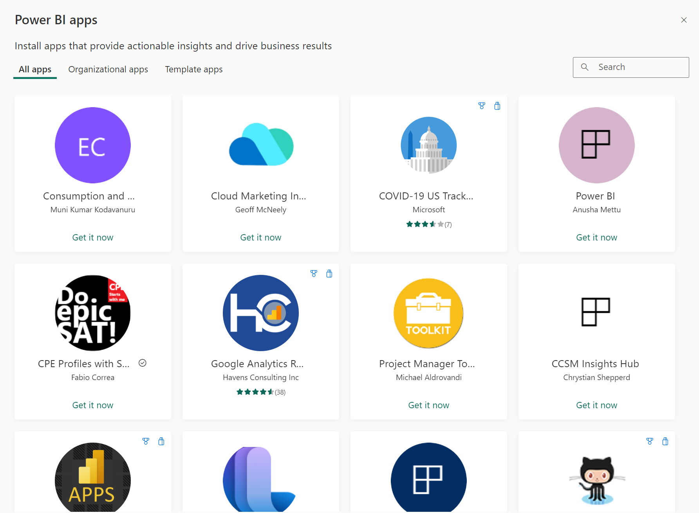

# Install and use apps with dashboards and reports in Power BI

[!INCLUDE[consumer-appliesto-ynny](../includes/consumer-appliesto-ynny.md)]

[!INCLUDE [power-bi-service-new-look-include](../includes/power-bi-service-new-look-include.md)]

Now that you have a [basic understanding of apps](end-user-apps.md), let's learn how to open and interact with apps. 

## Ways to get a new app
There are several ways to get a new app:
* You can get it from the Power BI app marketplace in Power BI.
* A report designer in your organization can install the app automatically in your Power BI account.
* You can use a direct link to an app that you have received from the app creator. 

In your Power BI mobile app, you can only install an app from a direct link. If the app designer installs the app automatically, you'll see it in your list of apps.

## Apps and licenses
Not all Power BI users can view and interact with apps. 
- If you have a free license, you can open apps that have been shared with you, and that are stored in a workspace in Premium capacity.
- If you have a Pro license, you can open apps that have been shared with you.

## Get the app from the Power BI apps marketplace

You can find and install apps from the Power BI apps marketplace. In the apps marketplace you can get both organizational apps and template apps.

1. [Sign in to the Power BI service](./end-user-sign-in.md) if you aren't already signed in. 

1. Once you're in Power BI, select **Apps > Get apps**. 

    

1. The Power BI apps marketplace opens.

   

   Three tabs are available for you to use:
   * **All apps** - Browse both template apps and all the organizational apps that are available to you. Template apps are distinguished by the shopping bag icon in the upper right corner of their tiles.
   * **Organizational apps** - Browse organizational apps that have been shared with you. 
   * **Template apps** - Browse template apps that are hosted on AppSource.

   Alternatively, you can use the search box to get a filtered selection of apps. Typing part of the name of an app, or of a category such as finance, analytics, marketing, etc., will make it easier to find the item you're looking for. 

   The search box is sensitive to the tab you have open - only apps of the selected type will be returned. If the **All apps** tab is open, both organizational and template apps are returned. This can be confusing when an organizational app and a template app have the same name. Just remember that the template app tiles have a a shopping bag icon in the top right corner.

When you find the app you want, click **Get it now** to install it.
* If you're installing an organizational app, it will immediately be added to your list of apps.
* If you're installing a template app, you will be taken to the template app offering in AppSource. See [an example](end-user-app-marketing.png) of how to download and install a sample template app from the Power BI apps marketplace. 

   > [!NOTE]
   > If you are using a free user license, you'll be able to download apps but won't be able to view them unless you upgrade to a Power BI Pro account or unless the app is stored in Premium capacity. For more information, see [licenses for consumers](end-user-license.md).

## Install an app from a direct link
You can also install a organizational app from a direct link in email from the app designer.  

**On your computer** 

When you select the link in email, the Power BI service ([https://powerbi.com](https://powerbi.com)) opens the app in your browser. 

**On your iOS or Android mobile device** 

When you select the link in email on your mobile device, the app installs automatically and opens in the mobile app. You may have to sign in first. 

## Interact with the dashboards and reports in the app
Take some time to explore the data in the dashboards and reports that make up the app. You have access to all of the standard Power BI interactions such as filtering, highlighting, sorting, and drilling down.  Still a little confused by the difference between dashboards and reports?  Read the [article about dashboards](end-user-dashboards.md) and the [article about reports](end-user-reports.md).  

## Update an app 

From time to time, app creators may release new versions of their apps. How you get the new version depends on how you received the original. 

* If you got the app from your organization, the update to the new version is entirely transparent - you don't have to do anything. 

* If you got the app from AppSource, the next time you open the app you'll see a notification banner. The notification lets you know that a new version is available. 

    1. Select **Get it** to update.  

        <!-- -->

    2. When prompted to install the updated app, select **Install**. 

         

    3. Since you already have a version of this app, decide whether to replace the existing version or whether to install the updated app in a new workspace.   

         

    > [!NOTE] 
    > Installing a new version overwrites any changes you may have made to the reports and dashboards. To keep your updated reports and dashboards, you can save them under a different name or in a different location before installing. 

    4. Once you've installed the updated version, select **Update app** to complete the update process. 

## Next steps
* [Back to the apps overview](end-user-apps.md)
* [View a Power BI report](end-user-report-open.md)
* [Other ways content is shared with you](end-user-shared-with-me.md)

