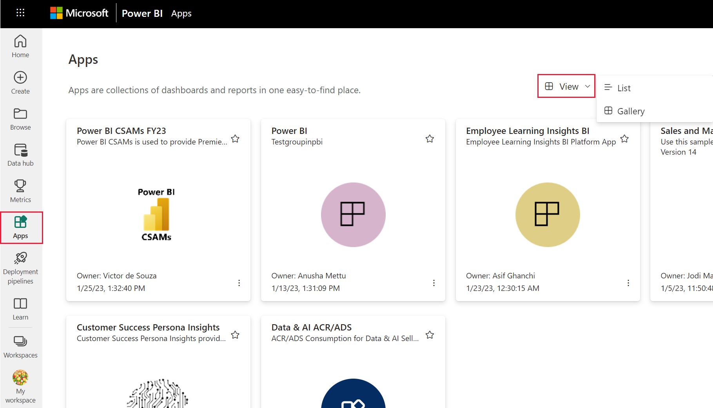
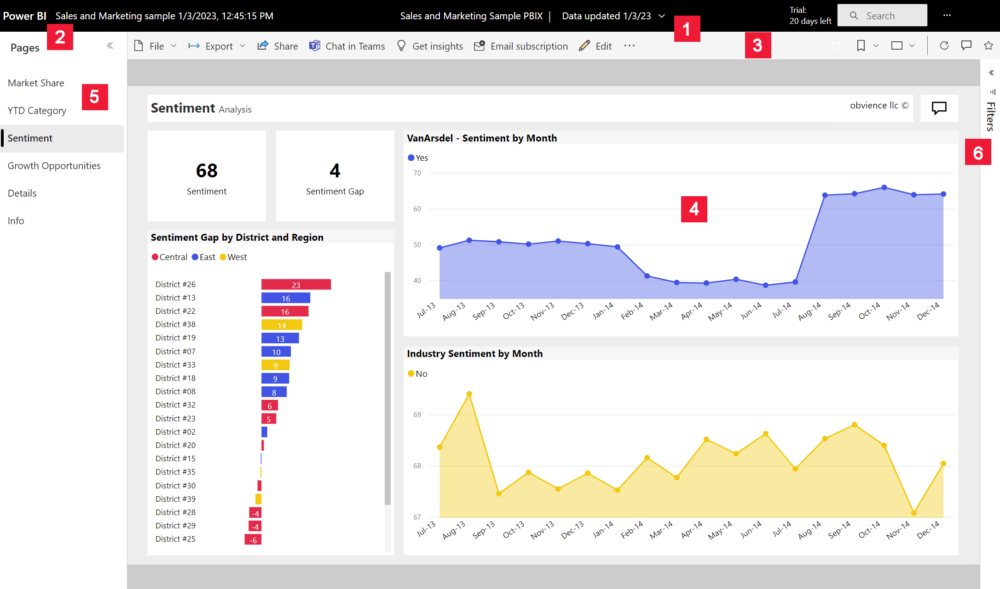
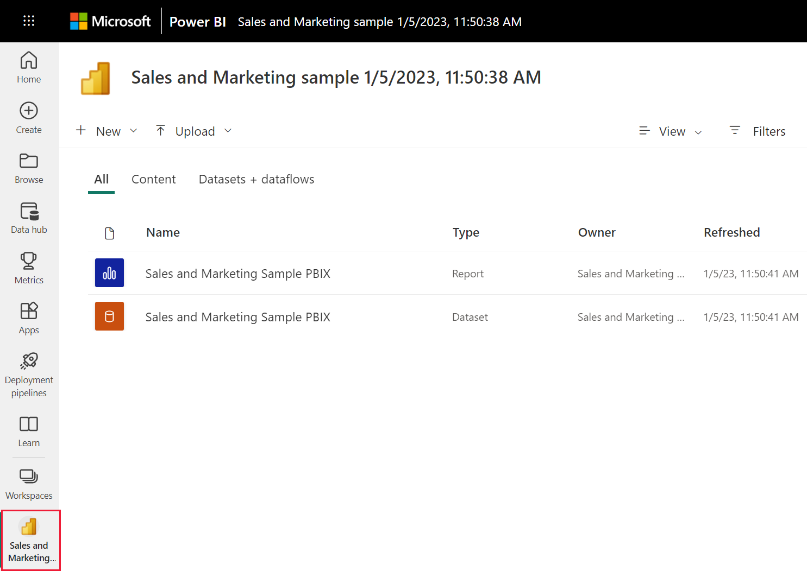

# Install and use apps with dashboards and reports in Power BI

[!INCLUDE[consumer-appliesto-ynny](../includes/consumer-appliesto-ynny.md)]

Now that you have a [basic understanding of apps](end-user-apps.md), let's learn how to open and interact with apps. 

## Ways to get a new app
There are several ways to get a new app:
* You can get it from the Power BI app marketplace in the Power BI service.
* You can use a direct link to an app that you have received from the app designer. 
* An app designer in your organization can install the app automatically in your Power BI account.

With Power BI mobile, you can only install an app from a direct link. If the app designer installs the app automatically, you'll see it in your list of apps.

## Apps and licenses
Not all Power BI users can view and interact with apps. 
- If you have a free license, you can open apps that are stored in Premium capacity and have then been shared with you.  
- If you have a Pro license, you can open apps that have been shared with you.

So, if you cannot open an app, contact your administrator or help desk. For information about licensing, see [Power BI licensing](end-user-license.md).

## Get the app from the Power BI apps marketplace

You can find and install apps from the Power BI apps marketplace. In the apps marketplace you can get both organizational apps and template apps.

- An *organizational app* is available to Power BI users in your organization. These apps also include pre-built dashboards and reports that you can use as-is or customize and share. Your organization may have apps for tracking sales, measuring performance, or analyzing hiring success.
- A *template app* comes with pre-built dashboards and reports that you can use to connect to many of the services you use to run your business, such as SalesForce, Microsoft Dynamics, and Google Analytics.

1. [Sign in to the Power BI service](./end-user-sign-in.md) if you aren't already signed in. 

1. Once the Power BI service is open, select **Apps > Get apps**. 

    

1. The Power BI apps marketplace opens.

   

   Three tabs are available for you to use:
   * **All apps** - Browse both template apps and all the organizational apps that are available to you. Template apps are distinguished by the shopping bag icon in the upper right corner of their tiles.
   * **Organizational apps** - Browse organizational apps that have been shared with you. 
   * **Template apps** - Browse template apps that are hosted on AppSource.

   Alternatively, you can use the search box to get a filtered selection of apps. Typing part of the name of an app, or of a category such as finance, analytics, marketing, etc., will make it easier to find the item you're looking for. 

   The search box is sensitive to the tab you have open - only apps of the selected type will be returned. If the **All apps** tab is open, both organizational and template apps are returned. This can be confusing when an organizational app and a template app have the same name. Just remember that the template app tiles have a a shopping bag icon in the top right corner.

4. When you find the app you want, select **Get it now** to install it.

   

* If you're installing an organizational app, it will immediately be added to your list of apps.
* If you're installing a template app, you will be taken to the template app offering in AppSource. See [an example](end-user-app-marketing.md) of how to download and install a sample template app from the Power BI apps marketplace. The app is installed, along with a workspace of the same name.

   > [!NOTE]
   > If you are using a free user license, you'll be able to download apps but won't be able to view them unless you upgrade to a Power BI Pro account or unless the app is stored in a Premium shared capacity. For more information, see [licenses for business users](end-user-license.md).

## Install an app from a direct link
You can also install an organizational app from a direct link.    

**On your computer** 

When you select the link in email, the Power BI service ([https://app.powerbi.com](https://app.powerbi.com)) opens the app in your browser. 

**On your iOS or Android mobile device** 

When you select the link in email on your mobile device, the app installs automatically and opens in the mobile app. You may have to sign in first. 

## Interact with the dashboards and reports in the app
Take some time to explore the data in the dashboards and reports that make up the app. You have access to all of the standard Power BI interactions such as filtering, highlighting, sorting, and drilling down.  The extent of what you can do with an app is controlled by the permissions that the *designer* assigned to you.  How you can interact with the app's dashboards and reports is controlled by the access and roles that the *designer* assigned to you. 

Still a little confused by the difference between dashboards and reports?  Read the [article about dashboards](end-user-dashboards.md) and the [article about reports](end-user-reports.md).  

### Open an app

You've installed an app, or have received an app from a colleague. To view that app, open your Apps content list by selecting **Apps** from the navigation pane.

Hover and select the app to open. Depending on the app, you may receive a prompt that looks similar to this:

For guidance on which option to select, see [Install template apps](../connect-data/service-template-apps-install-distribute.md).

Hover over the app to see details, and select the app card to open the app.

The app opens. Every app will look different - different layout, visuals, colors, options. But all apps do have some common features.

1. Name of the app and last updated time. Select the dropdown arrow to look up the owner and Help contact.
1. Select **Power BI** to return to [Home](end-user-home.md).
1. Your action bar. 
1. The report page canvas.
1. The app navigation pane.  Below the name of the app is the list of content. This app has one report with six pages. Select a report page name to open it. We currently have the *Return rate* page open. 
1. Select the arrow to expand the **Filters** pane.

You can also explore the associated workspace if you've been given access.  When you install or download a template app, the Power BI service creates a workspace for you. When you install an organizational app, it may not include access to the workspace. [Learn about workspaces](end-user-workspaces.md). Select **Power BI** (number 2) to return to **Home** and choose **Workspaces**. 

## Update an app 

From time to time, app designers may release new versions of their apps. How you get the new version depends on how you received the original. 

* If you got the app from your organization, the update to the new version is entirely transparent - you don't have to do anything. 

* If you got a template app from AppSource, the next time you open the app you'll see a notification banner. The notification lets you know that a new version is available. 

    1. Select **Get it** to update.  

        <!-- -->

    2. When prompted to install the updated app, select **Install**. 

         

    3. Since you already have a version of this app, decide whether you want to replace the existing version, update only the workspace content _without_ updating the app,  or install the updated app in a new workspace.

         

     > [!NOTE] 
     > Installing a new version overwrites any changes you may have made to the app's reports and dashboards. To keep your updated reports and dashboards, you can save them under a different name or in a different location before installing. 

    4. Once you've installed the updated version, select **Update app** to complete the update process. 

## Considerations and troubleshooting

- The ability to install apps can be turned on and off by your Power BI administrator. Contact your IT department or help desk if you need this feature enabled.    
- The use of apps requires either a Pro license or for the app to be stored in a workspace in Premium shared capacity. [Learn about licenses](end-user-license.md).

## Next steps
* [Back to the apps overview](end-user-apps.md)
* [View a Power BI report](end-user-report-open.md)
* [Other ways content is shared with you](end-user-shared-with-me.md)

