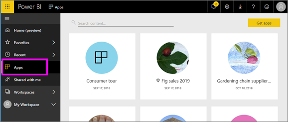

# Apps in Power BI
## What is a Power BI app?
An *app* is a Power BI content type that combines related dashboards and reports, all in one place. An app can have one or more dashboards and one or more reports, all bundled together. Apps are created by Power BI *designers* who distribute and share the apps with *consumers* like you. 

Your apps are organized in the **Apps** content list.

> [!NOTE]
> The use of the apps feature require a Power BI Pro license. <!-- add link to how to figure out your license -->

## App ***designers*** and app ***consumers***
Depending on your role, you may be someone who creates apps (*designer*) for your own use or to share with colleagues. Or, you may be someone who receives and downloads apps (*consumer*) created by others. This article is for app *consumers*.

## Advantages of apps
Apps are easy to find and install in the Power BI service ([https://powerbi.com](https://powerbi.com)) and on your mobile device. After you install an app, you don't have to remember the names of a lot of different dashboards because they're all together in one app, in your browser or on your mobile device.

With apps, whenever the app author releases updates, you automatically see the changes. The author also controls how often the data is scheduled to refresh, so you don't need to worry about keeping it up to date. 

<!-- add conceptual art -->
## Get a new app
You can get apps in a few different ways. 
- The app author can install the app automatically in your Power BI account, and the next time you open Power BI, you'll see the new app in the **Apps** content list. 
- The app author can email you a direct link to an app. Selecting the link opens the app in Power BI.
- You can search for apps in AppSource, where you see all the apps that you can access. AppSource contains apps published by report designers both inside and outside of your company. For example, you may find an app on AppSource for a service that you already use, such as Google Analytics, GitHub, or Microsoft Dynamics. 
- In Power BI on your mobile device, you can only install an app from a direct link, and not from AppSource. If the app author installs the app automatically, you'll see it in your list of apps.

## Next step
* [Open and interact with an app](end-user-app-view.md)

