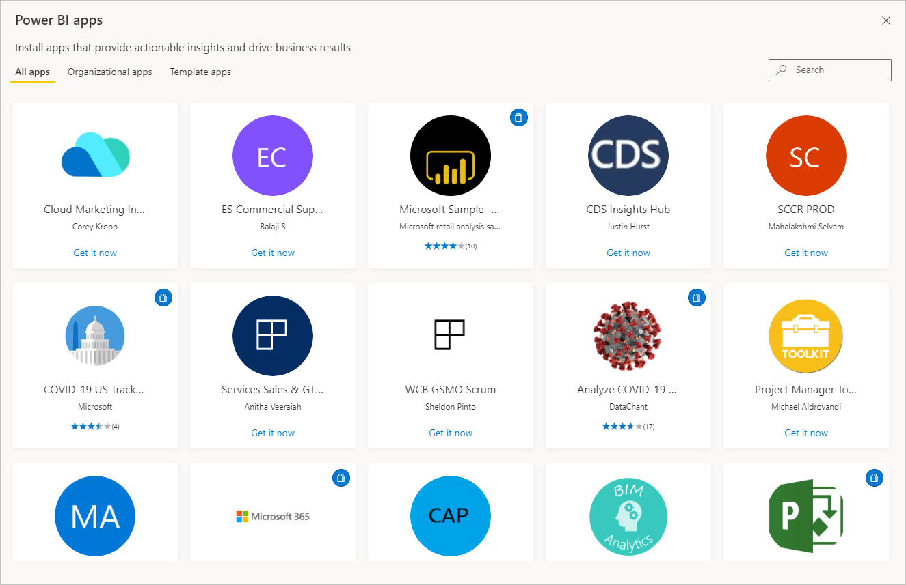
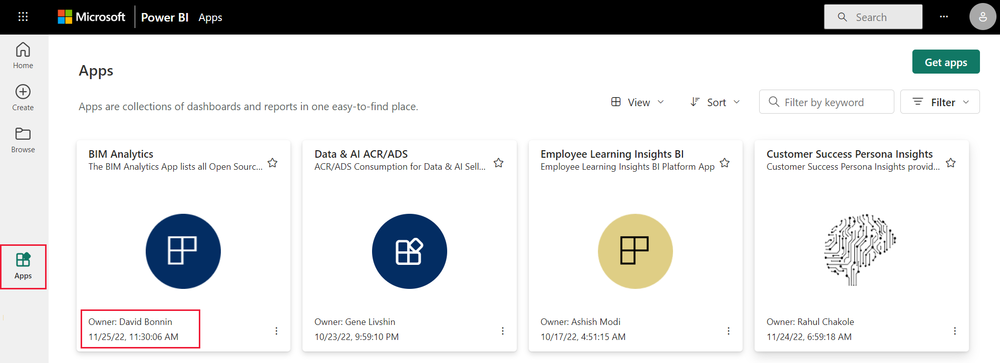

# Apps in Power BI

[!INCLUDE[consumer-appliesto-ynny](../includes/consumer-appliesto-ynny.md)]

## What is a Power BI app?

Power BI designers create official packaged content, then distribute the content to a broad audience organized as an *app*. Apps are created in workspaces where members collaborate on Power BI content with their colleagues. They publish the finished app to individuals, large groups of people in an organization, or an entire organization. An app can have permissions that are different than the permissions set on a workspace. This capability makes it easier for designers to manage permissions on an app.

An app combines related content, like dashboards, spreadsheets, semantic models, and reports, all in one place. An app has one or more of each content type bundled together. There are many ways a designer can share an app. You can learn more about how apps are shared in the [Get a new app](#get-a-new-app) section below.

There's a unique type of app called a [template app](../connect-data/service-template-apps-install-distribute.md). A Power BI Pro or Premium Per User license is required to install, customize, and distribute a template app. Power BI partners use the content from template apps to build and package analytical data into a new app. They then deploy that app to other Power BI tenants through an available platform, like AppSource or their own web service.

## App designers and app users

Depending on your role, you might be a designer who creates apps for your own use or to share with colleagues. Or, you might be a business user who receives and downloads apps created by others. The resources in this article are for business users.

Viewing and opening an app requires certain permissions. The recipient must have a Power BI Pro or Premium Per User (PPU) license, or the app must be shared with the recipient in a type of cloud storage called **Premium capacity**. To learn more about licenses and Premium capacity, see [Licensing for the Power BI service](end-user-license.md).

## Advantages of apps

Apps are an easy way for designers to share many types of content at one time. App designers create dashboards and reports and then bundle them together into an app. The designers share or publish the app to a location where you, the business user, can access it. It's easier to find and install content in the [Power BI service](https://powerbi.com) or on your mobile device when it's organized together as an app. After you install an app, you don't have to remember the names of several dashboards or reports because they're all together in one app. You can easily access the app in your browser or on your mobile device.

When the app author releases updates, you get a notification or you automatically see the changes. The author controls how often the data is scheduled to refresh, so you don't need to worry about keeping it up to date.

<!-- add conceptual art -->
## Get a new app

There are several ways to get a new app. You can search, find, and install apps in the apps marketplace, or app designers can share apps with you.

### Find and install apps from the Power BI apps marketplace

1. To find apps in the apps marketplace, select **Apps** on your navigation pane.

    :::image type="content" source="./media/end-user-apps/power-bi-app-select.png" alt-text="A screenshot that shows the navigation pane with Apps outlined.":::

1. On the Apps page, select **Get apps**.

    :::image type="content" source="./media/end-user-apps/power-bi-get-apps-button.png" alt-text="A screenshot of the Apps page with the Get apps button outlined.":::

1. Browse through the list of apps in the Power BI apps marketplace until you find one to install. **Organizational apps** are only available to people in your company. **Template apps** are published by Microsoft and the community, and they're available for any Power BI user with a Pro license to install.

    

1. After you install an app, it's available in your **Apps** content list. Select **Apps** in the navigation pane to display your apps. The last updated date and the owner are on the bottom of each app card.

    

For detailed step-by-step instructions for getting and exploring an app, see [Install and use apps with dashboards and reports in Power BI](end-user-app-view.md).

There are a few other ways to get apps. 

* The app designer installs the app automatically in your Power BI account. The next time you open the Power BI service, the new app is in your **Apps** content list.
* The app designer emails you a direct link to an app. Selecting the link opens the app in the Power BI service.
* In Power BI on your mobile device, you can only install an app from a direct link, and not from the apps marketplace. If the app author installs the app automatically, it's available in your list of apps.

## Related content

* [Install and use apps with dashboards and reports in Power BI](end-user-app-view.md)
* [Other ways to share content](../collaborate-share/end-user-shared-with-me.md)
