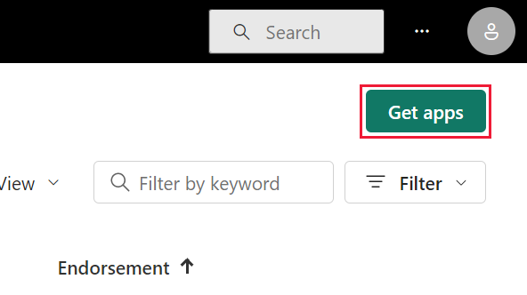

# Apps in Power BI

[!INCLUDE[consumer-appliesto-ynny](../includes/consumer-appliesto-ynny.md)]

## What is a Power BI app?

Power BI designers create official packaged content, then distribute the content to a broad audience organized as an *app*. Apps are created in workspaces where members can collaborate on Power BI content with their colleagues. They publish the finished app to individuals, large groups of people in an organization, or an entire organization. An app makes it easier for designers to manage permissions on the collections because the app can have permissions that are different than those set on the workspace.

An app combines related content, like dashboards, spreadsheets, datasets, and reports, all in one place. An app has one or more of each content type bundled together. There are many ways a designer can share an app. For more information, see the [Get a new app](#get-a-new-app) section below.

There's a special type of app called a *[template app](../connect-data/service-template-apps-install-distribute.md)*. A Power BI Pro or Premium Per User license is required to install, customize, and distribute a template app. Power BI template apps are used by Power BI partners to build and package analytical content into an app. They then deploy that app to other Power BI tenants through an available platform, like AppSource or their own web service.  

## App designers and app users

Depending on your role, you might be a designer who creates apps for your own use or to share with colleagues. Or, you might be a business user who receives and downloads apps created by others. The resources in this article are for business users.

Viewing and opening an app requires certain permissions. The recipient must either have a Power BI Pro or Premium Per User (PPU) license or the app must be shared with the recipient in a type of cloud storage called **Premium capacity**. To learn more about licenses and Premium capacity, see [Licensing for the Power BI service](end-user-license.md).

## Advantages of apps

Apps are an easy way for designers to share many types of content at one time. App designers create the dashboards and reports and bundle them together into an app. The designers then share or publish the app to a location where you, the business user, can access it. Because related dashboards and reports are bundled together, it's easier for you to find and install in the Power BI service ([https://powerbi.com](https://powerbi.com)) or on your mobile device. After you install an app, you don't have to remember the names of several dashboards or reports because they're all together in one app, available to you in your browser or on your mobile device.

When the app author releases updates, you either get a notification or you automatically see the changes. The author also controls how often the data is scheduled to refresh, so you don't need to worry about keeping it up to date.

<!-- add conceptual art -->
## Get a new app

There are several ways to get a new app. You can search, find, and install apps in the apps marketplace or app designers can share apps with you.

### Find and install apps from the Power BI apps marketplace

To find apps in the apps marketplace, select **Apps** on your navigation pane, and then select **Get apps**.

Add screenshot of navigation pane Apps.

Browse through the list of apps in the Power BI apps marketplace until you find one to install. **Organizational apps** are only available to people in your company. **Template apps** are published by Microsoft and the community, and they're available for any Power BI user to install.

There are a few other ways to get apps. Some of these ways are listed below. But for detailed step-by-step instructions for getting and exploring an app, see [Open and interact with an app](end-user-app-view.md).

* The app designer can install the app automatically in your Power BI account, and the next time you open the Power BI service, you'll see the new app in your **Apps** content list.
* The app designer can email you a direct link to an app. Selecting the link opens the app in the Power BI service.
* In Power BI on your mobile device, you can only install an app from a direct link, and not from the apps marketplace. If the app author installs the app automatically, you'll see it in your list of apps.

Your apps are organized in the **Apps** content list. Select **Apps** in the navigation pane to display your apps. The last updated date and the owner are on the bottom of each app card.

## Next steps

* [Open and interact with an app](end-user-app-view.md)
* [Other ways to share content](end-user-shared-with-me.md)
