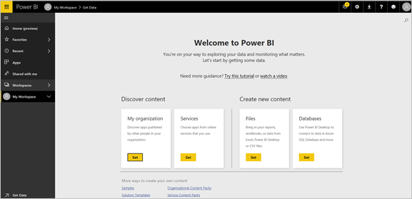
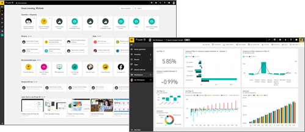
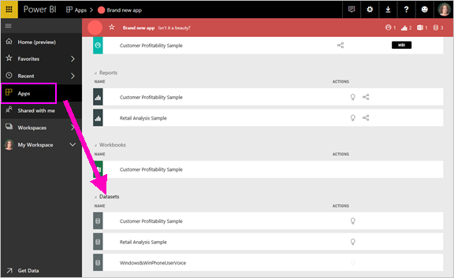
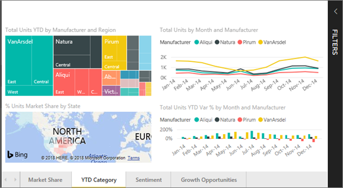
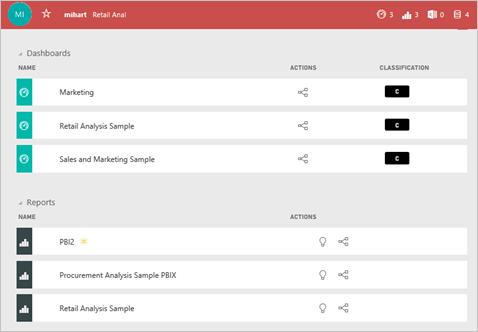

# Basic concepts for Power BI service consumers

## Power BI consumers and designers

This article assumes that you've already read the [Power BI overview](../power-bi-overview.md) and have identified yourself as a Power BI ***consumer***. Consumers receive Power BI content, like dashboards and reports, from colleagues. Consumers use Power BI service, which is the website-based version of Power BI.

You'll undoubtedly hear the term "Power BI Desktop" or just "Desktop." It is a stand-alone tool used by *designers* who build and share dashboards and reports with you. It's important to know that there are other Power BI tools out there. As long as you're a consumer, you'll only work with Power BI service. This article applies only to Power BI service.

## Terminology and concepts

This article isn't a visual tour of Power BI, nor is it a hands-on tutorial. Instead, it's an overview article that will get you comfortable with Power BI terminology and concepts. It will teach you the lingo and the lay of the land. For a tour of Power BI service and its navigation, go to [Quickstart - Getting around in Power BI service](end-user-experience.md).

## Open Power BI service for the first time

Most Power BI consumers get Power BI service because 1) their company buys licenses and 2) an admin assigns the licenses to employees like you.

To get started, open a browser and enter **app.powerbi.com**. The first time you open Power BI service, you'll see something the following:

As you use Power BI, you'll personalize what you see when you open the website each time. For example, some people like Power BI to open to the **Home** page while others have a favorite dashboard they want to see first. Don't worry, this article will teach you how to personalize your experience.

- [Introducing Power BI Home & Global Search](https://powerbi.microsoft.com/blog/introducing-power-bi-home-and-global-search)

- [Featured dashboards in Power BI service](end-user-featured.md)

But before we get much further, let's back up and talk about the building blocks that make up Power BI service.

_______________________________________________________

## Power BI content

### Introduction to building blocks

For a Power BI consumer, the five building blocks are: ***visualizations***, ***dashboards***, ***reports***, ***apps***, and ***datasets***. These are sometimes referred to as *Power BI* ***content***. *Content* exists in ***workspaces***. A typical workflow involves all of the building blocks: A Power BI *designer* (yellow in diagram below) collects data from *datasets*, brings it into Power BI for analysis, creates *reports* full of *visualizations* that highlight interesting facts and insights, pins visualizations from reports to a dashboard and shares the reports and dashboards with *consumers* like you (black in diagram below). The *designer* shares them in the form of *apps* or other types of shared content.

At its most basic.

-  a ***visualization*** (or *visual*), is a type of chart built by Power BI *designers*. The visuals display the data from *reports* and *datasets*. Typically, *designers* build the visuals in Power BI Desktop.

    For more info, see [Interact with Visuals in reports, dashboards, and apps](end-user-visualizations.md).

-  A *dataset* is container of data. For example, it might be an Excel file from the World Health Organization. It could also be a company-owned database of customers or it might be a Salesforce file.  

-  A *dashboard* is a single screen with interactive visuals, text, and graphics. A dashboard collects your most important metrics, on one screen, to tell a story or answer a question. The dashboard content comes from one or more reports and one or more datasets.

    For more info, see [Dashboards for Power BI service consumers](end-user-dashboards.md).

-  A *report* is one or more pages of interactive visuals, text, and graphics that together make up a single report. Power BI bases a report on a single dataset. Often, the service organizes report pages to address a central area of interest or answer a single question.

    For more info, see [Reports in Power BI](end-user-reports.md).

-  An *app* is a way for *designers* to bundle and share related dashboards and reports together. *Consumers* receive some apps automatically but can go search for other apps created by colleagues or by the community. For example, external services you may already use, like Google Analytics and Microsoft Dynamics CRM, offer Power BI apps.

To be clear, if you're a new user and you've logged in to Power BI for the first time, you won't see dashboards, apps, or reports yet.

_______________________________________________________

## Datasets

A *dataset* is a collection of data that *designers* import or connect to and then use to build reports and dashboards. As a consumer, you won't interact directly with datasets, but it's still nice to learn how they fit into the bigger picture.  

Each dataset represents a single source of data. For example, the source could be an Excel workbook on OneDrive, an on-premises SQL Server Analysis Services tabular dataset, or a Salesforce dataset. Power BI supports many different data sources.

When a designer shares an app with you, you can see which the designer included datasets with the app.

What you can do with **ONE** dataset...

- You can use it over and over.

- You can use it in many different reports.

- You can display visualizations from that one dataset on many different dashboards.

  

Additionally, you can use datasets from other workspaces to create content (reports, dashboards) in your workspace. Power BI shows these datasets using the referenced dataset icon:

On to the next building block -- visualizations.

_______________________________________________________

## Visualizations

Visualizations (also known as visuals) display insights that Power BI discovered in the data. Visualizations make it easier to interpret the insight, because your brain can comprehend a picture faster than a spreadsheet of numbers.

Just some of the visualizations you'll come across in Power BI are: waterfall, ribbon, treemap, pie, funnel, card, scatter, and gauge:

   

See the [full list of visualizations included with Power BI](../power-bi-visualization-types-for-reports-and-q-and-a.md).

Visualizations called *custom visuals* are also available from the community. If you receive a report with a visual you don't recognize, likely it's a custom visual. If you need help with interpreting the custom visual, look up the name of the report or dashboard *designer* and contact them.

What you can do with **ONE** visualization in a report...

- You can use it over and over in the same report using copy/paste.

- You can use it on many different dashboards.

_______________________________________________________

## Reports

A Power BI report is one or more pages of visualizations, graphics, and text. All of the visualizations in a report come from a single dataset. *Designers* share reports with *consumers* who [interact with the reports in *Reading view*](end-user-reading-view.md).

What you can do with **ONE** report...

- You can associate it with multiple dashboards (tiles pinned from that one report can appear on multiple dashboards).

- You can create it using data from only one dataset.  

- You can make it part of multiple apps

  

_______________________________________________________

## Dashboards

A dashboard represents a customized view of some subset of the underlying dataset(s). *Designers* build dashboards and share them with *consumers*; either individually or as part of an app. A dashboard is a single canvas that has *tiles*, graphics, and text.

  

A tile is a rendering of a visual that a *designer* *pins*, for example, from a report to a dashboard. Each pinned tile shows a [visualization](end-user-visualizations.md) that Power BI created from a dataset and pinned to that dashboard. A tile can also contain an entire report page and can contain live streaming data or a video. There are many ways that *designers* add tiles to dashboards. There are too many to cover in this overview article. To learn more, see [Dashboard tiles in Power BI](end-user-tiles.md).

Consumers can't edit dashboards. You can however add comments, view related data, set it as favorite, subscribe, and more.

What are some purposes for dashboards?  Here are just a few:

- to see, in one glance, all the info needed to make decisions

- to monitor the most-important info about your business

- to ensure all colleagues are on the same page, viewing and using the same info

- to monitor the health of a business or product or business unit or marketing campaign, and so on

- to create a personalized view of a larger dashboard -- all the metrics that matter to you

**ONE** dashboard...

- can display visualizations from many different datasets

- can display visualizations from many different reports

- can display visualizations pinned from other tools (for example, Excel)

  

_______________________________________________________

## Apps

These collections of dashboards and reports organize related content together into a single package. Power BI *designers* build them and share them with individuals, groups, an entire organization, or the public. As a consumer, you can be confident you and your colleagues are working with the same data; a single trusted version of the truth.

Apps are easy to find and install in the [Power BI service](https://powerbi.com) and on your mobile device. After you install an app, you don't have to remember the names of a lot of different dashboards. They're all together in one app, in your browser, or on your mobile device.

This app has three related dashboards and three related reports that make up a single app.

With apps, whenever the app author releases updates, you automatically see the changes. The author also controls the schedule for how often Power BI refreshes the data. You don't need to worry about keeping it up-to-date.

You can get apps in a few different ways:

- The app designer can install the app automatically in your Power BI account.

- The app designer can send you a direct link to an app.

- You can search for it in Microsoft AppSource, where you see all the apps that you can use.

In Power BI on your mobile device, you can only install apps from a direct link, and not from AppSource. If the app designer installs the app automatically, you'll see it in your list of apps.

Once you've installed the app, just select it from your Apps list and select which dashboard or report to open and explore first.

I hope this article gave you an understanding of the building blocks that make up Power BI service for consumers.

## Next steps

- Review and bookmark the [Glossary](end-user-glossary.md)

- Take a [tour of Power BI service](end-user-experience.md)

- Read the [overview of Power BI written especially for consumers](end-user-consumer.md)

- Watch a video in which Will reviews the basic concepts and gives a tour of Power BI service.

    <iframe width="560" height="315" src="https://www.youtube.com/embed/B2vd4MQrz4M" frameborder="0" allowfullscreen></iframe>
