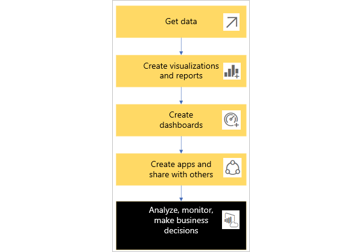
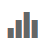
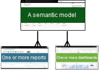
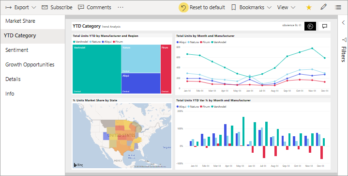
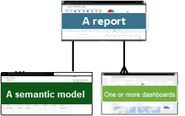
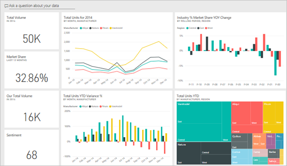
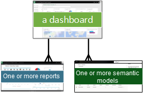
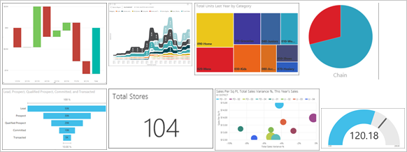
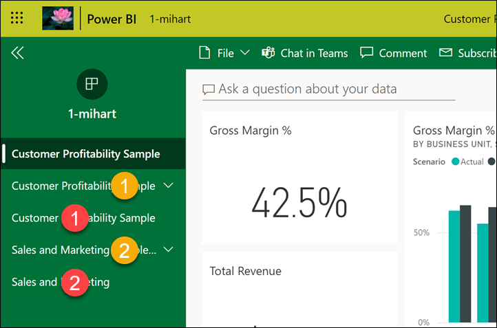
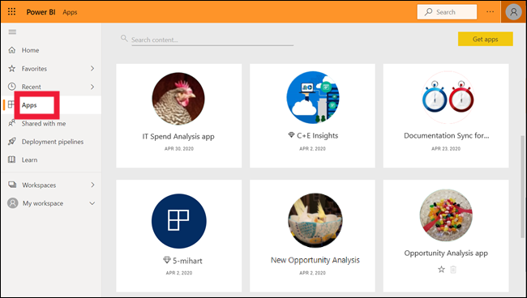

# Basic concepts for the Power BI service business user

[!INCLUDE[consumer-appliesto-ynnm](../includes/consumer-appliesto-ynnm.md)]

Use this article to familiarize yourself with some of the terms and concepts associated with the Power BI service. Understanding these terms and concepts makes it easier for you to read through the other Power BI articles and to work in the Power BI service (app.powerbi.com). 

:::image type="content" source="media/end-user-basic-concepts/power-bi-workspace-cloud.png" alt-text="An image of a word cloud of words associated with the Power BI service.":::

This article assumes that you already read the [Power BI overview](../fundamentals/power-bi-overview.md) and identified yourself as a [Power BI business user](end-user-consumer.md). *Business users* receive Power BI content, like dashboards, reports, and apps, from *creator* colleagues. *Business users* work with the **Power BI service** (app.powerbi.com), which is the website-based version of Power BI. 

### This article isn't about Power BI Desktop

You likely heard the term "Power BI Desktop" or just "Desktop." It's the stand-alone tool used by *designers* who build and share dashboards and reports with you. It's important to know that there are other Power BI tools out there. But, as long as you're a *business user*, you typically work with the Power BI service. This article applies only to the Power BI service.

For more information about the full suite of Power BI tools, see [What is Power BI?](../fundamentals/power-bi-overview.md).

## Let's get started
To follow along, open app.powerbi.com in your browser. 

There are many objects and concepts that make up the Power BI service, too many to cover in a single article. So this article introduces you to the most common:  **_visualizations_**, **_dashboards_**, **_reports_**, **_apps_**, and **_semantic models_** (formerly called *datasets*). These objects are sometimes referred to as *Power BI* **_content_**. *Content* exists within **_workspaces_**. 

A typical Power BI workflow involves all of the building blocks. A Power BI *designer* (yellow in the diagram) collects data from *semantic models*, brings it into Power BI Desktop for analysis, and creates *reports* full of *visualizations* that highlight interesting facts and insights. The designer pins visualizations from reports to *dashboards*, and shares the reports and dashboards with business users like you (black in the diagram). There are many different ways that a designer can share content with you: as individual pieces of content, content bundled together in an *app*, or by giving you permissions to a workspace where the content is stored. (Don't worry, we talk about the different ways that content is shared later in this article.)

At its most basic:

-  A **_visualization_** (or *visual*), is a type of chart built by Power BI *designers*. The visuals display the data from *reports* and *semantic models*. Because they're highly interactive, you can slice, filter, highlight, change, and even drill into visualizations.  

    For more info, see [Interact with visuals in reports, dashboards, and apps](end-user-visualizations.md).

-  A *semantic model* is a container of data. For example, it might be an Excel file from the World Health Organization. It might also be a company-owned database of customers, or it might be a Salesforce file. And it might be all three if the designer combines them into a single model. Semantic models are managed by *designers*.

-  A *dashboard* is a single screen with *tiles* of interactive visuals, text, and graphics. A dashboard collects your most important metrics, on one screen, to tell a story or answer a question. The dashboard content comes from one or more reports and one or more semantic models.

    For more info, see [Dashboards for the Power BI service business users](end-user-dashboards.md).

-  A *report* is one or more pages of interactive visuals, text, and graphics that together make up a single report. Power BI bases a report on a single semantic model. Often, the *designer* organizes report pages to each address a central area of interest or answer a single question.

    For more info, see [Reports in Power BI](end-user-reports.md).

-  An *app* is a way for *designers* to bundle and share related dashboards, reports, and semantic models together. *Business users* receive some apps automatically but can go search for other apps created by colleagues or by the community. For example, out-of-the-box apps are available for external services you may already use, like Google Analytics and Microsoft Dynamics CRM.

To be clear, if you're logged in to the Power BI service for the first time, you probably don't see any shared dashboards, apps, or reports yet.

_______________________________________________________

## Workspaces

Workspaces are places to collaborate with colleagues on specific content. Workspaces are created by Power BI designers to hold collections of dashboards and reports. The designer can then share the workspace with colleagues. Designers can also bundle a collection of dashboards and reports into an app and distribute it to the entire community, to their organization, or to specific people or groups. Certain types of apps called template apps, create a workspace when the app is installed. [Learn more about apps.](end-user-apps.md)

Everyone using the Power BI service also has a **My workspace**. **My workspace** is your personal sandbox where you can create content for yourself.

To see your workspaces in Power BI select **Workspaces** from your navigation pane.

:::image type="content" source="media/end-user-basic-concepts/power-bi-workspaces.png" alt-text="Screenshot of Power BI with Workspaces selected.":::

[Learn more about workspaces].(end-user-workspaces.md)
_______________________________________________________

## Semantic models

A *semantic model* is a collection of data that *designers* import or connect to and then use to build reports and dashboards. As a *business user*, it's possible that you never interact directly with semantic models, but it's still helpful to learn how they fit into the bigger picture.  

Each semantic model represents a single source of data. For example, the source could be an Excel workbook on OneDrive, an on-premises SQL Server Analysis Services tabular dataset, or a Google Analytics dataset. Designers can combine more than one source into a single semantic model. Power BI supports more than 150 data sources and is always adding more. 

When a designer shares an app with you, or gives you permissions to a workspace, you can look up which semantic models are being used. But you can't add or change anything in the semantic model. This means that as you interact with dashboards and reports, the underlying data is safe. Changes you make to the dashboards and reports don't affect the semantic model. 

One semantic model...

- Can be used over and over by report designers to create dashboards, reports, and apps.

- Can be used to create many different reports.

- Visuals from that one semantic model can appear on many different dashboards.

  

To learn more about semantic models, visit these articles:
- [How do designers assign permissions to semantic models](../connect-data/service-datasets-build-permissions.md)    
- [How semantic models are shared with colleagues](../collaborate-share/service-share-dashboards.md)

On to the next building block, reports.

_______________________________________________________

## Reports

A Power BI report is one or more pages of visualizations, graphics, and text. All of the visualizations in a report come from a single semantic model. *Designers* build reports and share them with others; either individually or as part of an app. Typically, *business users* [interact with reports in *Reading view*](end-user-reading-view.md).

One report...

- Can be created using data from only one semantic model. Power BI Desktop can combine more than one data source into a single semantic model in a report, and that report can be imported into Power BI. 

- Can be associated with multiple dashboards (tiles pinned from that one report can appear on multiple dashboards).

- Can be part of multiple apps.

  

_______________________________________________________

## Dashboards

A dashboard represents a customized graphical view of some subset of one or more underlying semantic models. *Designers* build dashboards and share them with *business users*; either individually or as part of an app. If a *business user* is given permissions to a report, they can build their own dashboards too. A dashboard is a single canvas that has *tiles*, graphics, and text.

Dashboards can look similar to a report page. You know that you're on a dashboard if you see a natural language query field in the upper left corner. Also, when you select a visual tile on a dashboard you jump to the underlying report or to a URL or to the natural language query that was used to create that tile. For more explanation, see [Reports versus dashboards](end-user-reports.md#dashboards-versus-reports).

  

A *tile* is a rendering of a visual that a designer *pins*, for example, from a report to a dashboard. Most pinned tiles show a [visualization](end-user-visualizations.md) that a designer created from a semantic model, saved in a report, and then pinned to that dashboard. A tile can also contain an entire report page and can contain live streaming data or a video. There are many ways that *designers* add tiles to dashboards, too many to cover in this overview article. To learn more, see [Dashboard tiles in Power BI](end-user-tiles.md).

*Business users* can't edit dashboards. You can however add comments, view related data, set it as a favorite, subscribe, and more.

What are some purposes for dashboards? Here are just a few:

- To see, in one glance, all the information needed to make decisions

- To monitor the most-important information about your business

- To ensure all colleagues are on the same page; viewing and using the same information

- To monitor the health of a business or product or business unit or marketing campaign, and so on

- To create a personalized view of a larger dashboard, all the metrics that matter to you

**ONE** dashboard...

- Can display visualizations from many different semantic models

- Can display visualizations from many different reports

- Can display visualizations pinned from other tools (for example, Excel)

  

_______________________________________________________

## Visualizations

Visualizations (also known as visuals) display insights that Power BI discovers in the data. Visualizations make it easier to interpret the insight, because your brain can comprehend a picture quicker than it can comprehend a spreadsheet of numbers.

Just some of the visualizations available in Power BI are: waterfall, ribbon, treemap, pie, funnel, card, scatter, and gauge.

   

See the [full list of visualizations included with Power BI](../visuals/power-bi-visualization-types-for-reports-and-q-and-a.md).

### Custom visuals
If you receive a report with a visual you don't recognize, and you don't see it included in the [full list of visualizations included with Power BI](../visuals/power-bi-visualization-types-for-reports-and-q-and-a.md), likely it's a *custom visual*. Custom visuals are created by Power BI community members and submitted to Power BI for use in reports. 

_______________________________________________________

## Apps

These collections of dashboards and reports organize related content together into a single package. Power BI *designers* build them in workspaces and share apps with individuals, groups, entire organizations, or the public. As a *business user*, you can be confident that you and your colleagues are working with the same information; a single trusted version of the truth.

Sometimes, the app's workspace itself is shared, and there can be many people collaborating and updating both the workspace and the app. The extent of what you can do with an app is determined by the permissions and access you're given.

> [!NOTE]
> The use of apps requires a Power BI Pro or Premium Per User (PPU) license, or for the app workspace to be stored in Premium capacity. [Learn about licenses](end-user-license.md).

Apps are easy to find and install in the [Power BI service](https://powerbi.com) and on your mobile device. After you install an app, you don't have to remember the names of a lot of different dashboards and reports. They're all together in one app, in your browser, or on your mobile device.

This app has two dashboards and two reports that make up a single app. Selecting an arrow to the right of a report name displays a list of the pages that make up that report.

Whenever the app is updated, you automatically see the changes. Also, the designer controls the schedule for how often Power BI refreshes the data. You don't need to worry about keeping it up-to-date.

You can get apps in a few different ways:

- The app designer can install the app automatically in your Power BI account.

- The app designer can send you a direct link to an app.

- You can search from within the Power BI service for apps available to you from your organization or from the community. You can also visit [Microsoft AppSource](https://appsource.microsoft.com/marketplace/apps?product=power-bi), where you find all the apps that you can use.

In Power BI on your mobile device, you can only install apps from a direct link, and not from AppSource. If the app designer installs the app automatically, you see it in your list of apps.

Once you install the app, just select it from your Apps list and choose which dashboard or report to open and explore first.

Now that you have an understanding of the building blocks that make up the Power BI service for business users, continue learning using these links. Or, [start using the Power BI service](end-user-experience.md) with some sample data. 

## Related content

- Review and bookmark the [Glossary](end-user-glossary.md)

- Take a [tour of the Power BI service](end-user-reading-view.md)

- Read the [overview of Power BI written especially for business users](end-user-consumer.md)

- Watch a video that reviews the basic concepts and gives a tour of the Power BI service.

    > [!NOTE]  
    > This video might use earlier versions of Power BI Desktop or the Power BI service.

    > [!VIDEO https://www.youtube.com/embed/B2vd4MQrz4M]
