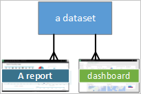
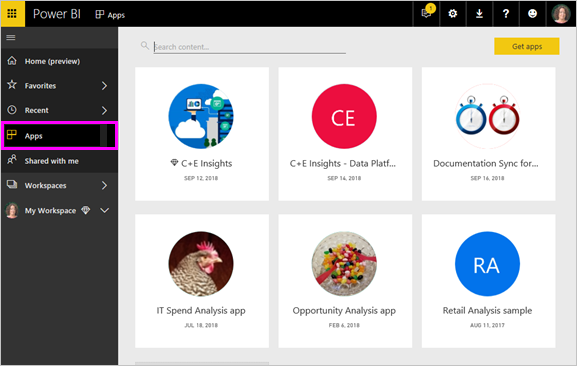

# Basic concepts for Power BI service ***consumers***

## Power BI *consumers* and *designers*
This article assumes that you've already read [Power BI overview](../power-bi-overview.md) and have identified yourself as a Power BI ***consumer***. Consumers receive Power BI content, like dashboards and reports, from colleagues. Consumers use Power BI service, which is the website-based version of Power BI.

You'll undoubtedly hear the term "Power BI Desktop" or just "Desktop", and this is a stand-alone tool used by *designers* who build and share dashboards and reports with you. It's important to know that there are other Power BI tools out there, but as long as you're a consumer, you'll only work with Power BI service. And this article applies only to Power BI service.

## Terminology and concepts
This article isn't a visual tour of Power BI, nor is it a hands-on tutorial. Instead it's an overview article that we hope will get you comfortable with Power BI terminology and concepts. Kind of teach you the lingo and lay of the land. For a tour of Power BI service and its navigation, visit [Take a tour](end-user-experience.md).

## Open Power BI service for the first time
Most Power BI consumers get Power BI service because 1) their company buys licenses and 2) an administrator assigns those license to employees like you.

To get started, simply open a browser and type **app.powerbi.com**. The very first time you open Power BI service, you'll see something like this.

As you use Power BI, you'll personalize what you see when you open the website each time.  For example, some people like Power BI to open to the Home page while others have a favorite dashboard they want to see first. Don't worry, we'll teach you how to do this.
- [Home preview](https://powerbi.microsoft.com/blog/introducing-power-bi-home-and-global-search)    
- [Set content as **featured**](end-user-featured.md)

But before we get much further, let's back up and talk about the building blocks that make up Power BI service.

## Power BI ***content***
### Introduction to building blocks
For a Power BI consumer, the 5 building blocks are: ***visualizations***, ***dashboards***, ***reports***, ***apps***, and ***datasets***. These are sometimes referred to as *Power BI* ***content***. And *content* exists in ***workspaces***. A typical workflow involves all of these building blocks:  A Power BI *designer* (yellow in diagram below) collects data from *datasets*, brings it into Power BI for analysis, creates *reports* full of *visualizations* that highlight interesting facts and insights, pins visualizations from reports to a dashboard and shares the reports and dashboards with *consumers*, like you, (black in diagram below) in the form of *apps* or other types of shared content.

At its most basic.
*  a ***visualization*** (or *visual*), is a type of chart built by Power BI *designers* using the data in *reports* and *datasets*. Typically, *designers* build the visuals in Power BI Desktop.

    For more information, see [Visualizations for Power BI *consumers*](end-user-visualizations.md)

*  A *dataset* is container of data. For example, it might be an Excel file from the World Health Organization or it might be a company-owned database of customers or it might be a Salesforce file.  

*  A *dashboard* is a single screen with interactive visuals, text, and graphics. A dashboard collects your most important metrics, on one screen, to tell a story or answer a question. The dashboard content comes from one or more reports and one or more datasets.

    For more information, see [Dashboards for Power BI *consumers*](end-user-dashboards.md)

*  A *report* is one or more pages of interactive visuals, text, and graphics that together make up a single report. A report is based on a single dataset. Often report pages are organized to each address a central area of interest or answer a single question.

    For more information, see [Reports for Power BI *consumers*](end-user-reports.md)

*  An *app* is a way for *designers* to bundle and share related dashboards and reports together. *Consumers* receive some apps automatically but can go search for other apps created by colleagues or by the community. For example, external services you may already use, such as Google Analytics and Microsoft Dynamics CRM, offer Power BI apps.

To be clear, if you're a brand new user; and you've logged in to Power BI for the first time, you have no dashboards, apps, or reports yet.
_______________________________________________________

## Datasets
A *dataset* is a collection of data that *designers* import or connect to and then use to build reports and dashboards. As a consumer, you won't interact directly with datasets, but it's still nice to understand how they fit into the bigger picture.  

Each dataset represents a single source of data, for example, an Excel workbook on OneDrive, or an on-premises SSAS tabular dataset, or a Salesforce dataset. There are many different data sources supported.

When a designer shares an app with you, you can see which datasets are included with the app.

**ONE** dataset...

* can be used over and over
* can be used in many different reports
* Visualizations from that one dataset can display on many different dashboards

  

Additionally, datasets from other workspaces can be used to create content (reports, dashboards) in your workspace. These datasets are shown using the referenced dataset icon:

On to the next building block -- visualizations.
__________________________________________________________

## Visualizations
Visualizations (aka visuals) display insights that have been discovered in the data. Visualizations make it easier to interpret the insight, because your brain can comprehend a picture faster than a spreadsheet of numbers, for example.

Just some of the visualizations you'll encounter in Power BI are: waterfall, ribbon, treemap, pie, funnel, card, scatter, and gauge. See the [full list of visualizations included with Power BI](../power-bi-visualization-types-for-reports-and-q-and-a.md).

   

Visualizations are also available from the community and these are called *custom visuals*. If you receive a report with a visual you don't recognize, likely it's a custom visual. If  you need help interpreting the custom visual, <!--[look up the name of the report or dashboard *designer*](end-user-owner.md)-->look up the name of the report or dashboard *designer* and contact him or her.

**ONE** visualization in a report...

* can be used over and over in the same report using copy/paste.
* can be used on many different dashboards
__________________________________________________
## Reports
A Power BI report is one or more pages of visualizations, graphics, and text. All of the visualizations in a report come from a single dataset. *Designers* share reports with *consumers* who [interact with the reports in *Reading view*](end-user-reading-view.md).

**ONE** report...

* can be associated with multiple dashboards (tiles pinned from that one report can appear on multiple dashboards).
* are created using data from only one dataset.  
* can be part of multiple apps

  

________________________________________________

## Dashboards
A dashboard represents a customized view of some subset of the underlying dataset(s). *Designers* build dashboards and share them with *consumers*; either individually or as part of an app. A dashboard is a single canvas that contains *tiles*, graphics, and text.

  

A tile is a rendering of a visual that a *designer* *pins*, for example, from a report to a dashboard.  Each pinned tile displays a [visualization](end-user-visualizations.md) that was created from a dataset and pinned to that dashboard. A tile can also contain an entire report page and can contain live streaming data or a video. There are many ways that *designers* add tiles to dashboards; too many to be covered in this overview topic. To learn more, see [Dashboard tiles in Power BI](end-user-tiles.md).

From a consumer standpoint, dashboards cannot be edited. You can however add comments, view related data, set it as favorite, subscribe, and more.

What are some purposes for dashboards?  Here are just a few:

* to see, in one glance, all the information needed to make decisions
* to monitor the most-important information about your business
* to ensure all colleagues are on the same page, viewing and using the same information
* to monitor the health of a business or product or business unit or marketing campaign, etc.
* to create a personalized view of a larger dashboard -- all the metrics that matter to you

**ONE** dashboard...

* can display visualizations from many different datasets
* can display visualizations from many different reports
* can display visualizations pinned from other tools (e.g., Excel)

  

________________________________________________

## Apps
These collections of dashboards and reports organize related content together into a single package. Power BI *designers* build them and share them with individuals, groups, an entire organization, or the public. As a consumer, you can be confident that you and your colleagues are working with the same data; a single trusted version of the truth.

Apps are easy to find and install in the Power BI service (https://powerbi.com) and on your mobile device. After you install an app, you don't have to remember the names of a lot of different dashboards because they're all together in one app, in your browser or on your mobile device.

This app has three related dashboards and three related reports that make up a single app.

With apps, whenever the app author releases updates, you automatically see the changes. The author also controls how often the data is scheduled to refresh, so you don't need to worry about keeping it up to date.

You can get apps in a few different ways. The app designer can install the app automatically in your Power BI account, or send you a direct link to an app, or you can search for it in Microsoft AppSource, where you see all the apps that you can access. In Power BI on your mobile device, you can only install apps from a direct link, and not from AppSource. If the app designer installs the app automatically, you'll see it in your list of apps.

Once the app is installed, just select it from your Apps list and select which dashboard or report to open and explore first.   

I hope this article gave you an understanding of the building blocks that make up Power BI service for consumers.

## Next steps
- Review and bookmark the [Glossary](end-user-glossary.md)    
- Take a [tour of Power BI service](end-user-experience.md)
- Read the [overview of Power BI written especially for consumers](end-user-consumer.md)    
- Watch a video in which Will reviews the basic concepts and gives a tour of Power BI service. <iframe width="560" height="315" src="https://www.youtube.com/embed/B2vd4MQrz4M" frameborder="0" allowfullscreen></iframe>
