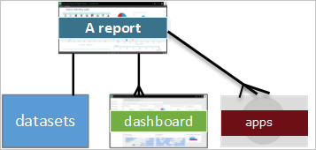

# Basic concepts for the Power BI service business user

[!INCLUDE[consumer-appliesto-ynnm](../includes/consumer-appliesto-ynnm.md)]

This article assumes that you've already read the [Power BI overview](../fundamentals/power-bi-overview.md) and have identified yourself as a [Power BI business user](end-user-consumer.md). *Business users* receive Power BI content, like dashboards, reports, and apps, from colleagues. *Business users* work with the Power BI service (app.powerbi.com), which is the website-based version of Power BI.

Receiving content from others requires one of the following:
- A Power BI Pro or Premium Per User (PPU) user license
- Your organization to have a subscription for Power BI Premium, and for the content to be shared with you from a Power BI Premium capacity. [Look up your license and subscription types](end-user-license.md).

You'll undoubtedly hear the term "Power BI Desktop" or just "Desktop." It is the stand-alone tool used by *designers* who build and share dashboards and reports with you. It's important to know that there are other Power BI tools out there. As long as you're a business user**, you'll only work with the Power BI service. This article applies only to the Power BI service.

## Terminology and concepts

This article isn't a visual tour of Power BI, nor is it a hands-on tutorial. Instead, it's an overview article that will get you comfortable with Power BI terminology and concepts. It will teach you the lingo and the lay of the land. For a tour of the Power BI service and its navigation, go to [Quickstart - Getting around in the Power BI service](end-user-experience.md).

## Open the Power BI service for the first time

Most Power BI *business users* get the Power BI service because 1) their company buys licenses and 2) an admin assigns the licenses to employees.

To get started, open a browser and enter **app.powerbi.com**. The first time you open the Power BI service, you'll see something like the following:

As you use the Power BI service, you'll personalize what you see when you open the website each time. For example, some people like Power BI to open to  **Home**, while others have a favorite dashboard they want to see first. Don't worry, these two article will teach you how to personalize your experience.

- [Introducing Power BI Home & Global Search](https://powerbi.microsoft.com/blog/introducing-power-bi-home-and-global-search)

- [Featured dashboards in the Power BI service](end-user-featured.md)

But before we get much further, let's back up and talk about the building blocks that make up the Power BI service.

_______________________________________________________

## Power BI content

### Introduction to building blocks

For a Power BI *business user*, the five building blocks are: **_visualizations_**, **_dashboards_**, **_reports_**, **_apps_**, and **_datasets_**. These are sometimes referred to as *Power BI* **_content_**. *Content* exists in **_workspaces_**. A typical workflow involves all of the building blocks: A Power BI *designer* (yellow in diagram below) collects data from *datasets*, brings it into Power BI for analysis, creates *reports* full of *visualizations* that highlight interesting facts and insights, pins visualizations from reports to *dashboards*, and shares the reports and dashboards with *business users* like you (black in diagram below). The *designer* shares them in the form of dashboards, reports, or apps.

At its most basic:

-  a **_visualization_** (or *visual*), is a type of chart built by Power BI *designers*. The visuals display the data from *reports* and *datasets*. Typically, *designers* build the visuals in Power BI Desktop.

    For more info, see [Interact with Visuals in reports, dashboards, and apps](end-user-visualizations.md).

-  A *dataset* is a container of data. For example, it might be an Excel file from the World Health Organization. It could also be a company-owned database of customers or it might be a Salesforce file. Datasets are managed by *designers*.

-  A *dashboard* is a single screen with interactive visuals, text, and graphics. A dashboard collects your most important metrics, on one screen, to tell a story or answer a question. The dashboard content comes from one or more reports and one or more datasets.

    For more info, see [Dashboards for the Power BI service business users](end-user-dashboards.md).

-  A *report* is one or more pages of interactive visuals, text, and graphics that together make up a single report. Power BI bases a report on a single dataset. Often, the *designer* organizes report pages to address a central area of interest or answer a single question.

    For more info, see [Reports in Power BI](end-user-reports.md).

-  An *app* is a way for *designers* to bundle and share related dashboards and reports together. *Business users* receive some apps automatically but can go search for other apps created by colleagues or by the community. For example,out-of-the-box apps are available for external services you may already use, like Google Analytics and Microsoft Dynamics CRM.

To be clear, if you're a new user and you've logged in to the Power BI service for the first time, probably won't see any shared dashboards, apps, or reports yet.

_______________________________________________________

## Datasets

A *dataset* is a collection of data that *designers* import or connect to and then use to build reports and dashboards. As a *business user*, you won't interact directly with datasets, but it's still nice to learn how they fit into the bigger picture.  

Each dataset represents a single source of data. For example, the source could be an Excel workbook on OneDrive, an on-premises SQL Server Analysis Services tabular dataset, or a Salesforce dataset. Power BI supports many different data sources.

When a designer shares an app with you, you can look up which datasets are being used, by opening **Related content**.  You won't be able to add or change anything in the dataset. But, if the designer gives you permissions, you'll be able to download the the report, look for [insights in the data](end-user-insights.md), or even [create your own report](../create-reports/service-report-create-new.md) based on the dataset.  

One dataset...

- Can be used over and over by a report designer to create dashboards and reports

- Can be used to create many different reports

- Visuals from that one dataset can appear on many different dashboards

  

On to the next building block -- visualizations.

_______________________________________________________

## Visualizations

Visualizations (also known as visuals) display insights that Power BI discovers in the data. Visualizations make it easier to interpret the insight, because your brain can comprehend a picture quicker than a spreadsheet of numbers.

Just some of the visualizations you'll come across in Power BI are: waterfall, ribbon, treemap, pie, funnel, card, scatter, and gauge.

   

See the [full list of visualizations included with Power BI](end-user-visual-type.md).

Special visualizations called *custom visuals* are available from the community. If you receive a report with a visual you don't recognize, likely it's a custom visual. If you need help with interpreting the custom visual, look up the name of the report or dashboard *designer* and contact them. Contact information is available by selecting the title from the top menu bar.

One visualization in a report...

- Can appear multiple times in the same report

- Can appear on many different dashboards

_______________________________________________________

## Reports

A Power BI report is one or more pages of visualizations, graphics, and text. All of the visualizations in a report come from a single dataset. *Designers* build reports and share them with others; either individually or as part of an app.  Typically, *Business users* [interact with reports in *Reading view*](end-user-reading-view.md).

One report...

- Can be associated with multiple dashboards (tiles pinned from that one report can appear on multiple dashboards).

- Can be created using data from only one dataset.  

- Can be part of multiple apps.

  

_______________________________________________________

## Dashboards

A dashboard represents a customized graphical view of some subset of the underlying dataset(s). *Designers* build dashboards and share them with *business users*; either individually or as part of an app. A dashboard is a single canvas that has *tiles*, graphics, and text.

  

A tile is a rendering of a visual that a *designer* *pins*, for example, from a report to a dashboard. Each pinned tile shows a [visualization](end-user-visualizations.md) that a designer created from a dataset and pinned to that dashboard. A tile can also contain an entire report page and can contain live streaming data or a video. There are many ways that *designers* add tiles to dashboards, too many to cover in this overview article. To learn more, see [Dashboard tiles in Power BI](end-user-tiles.md).

*Business users* can't edit dashboards. You can however add comments, view related data, set it as favorite, subscribe, and more.

What are some purposes for dashboards?  Here are just a few:

- to see, in one glance, all the information needed to make decisions

- to monitor the most-important information about your business

- to ensure all colleagues are on the same page; viewing and using the same information

- to monitor the health of a business or product or business unit or marketing campaign, and so on

- to create a personalized view of a larger dashboard -- all the metrics that matter to you

**ONE** dashboard...

- can display visualizations from many different datasets

- can display visualizations from many different reports

- can display visualizations pinned from other tools (for example, Excel)

  

_______________________________________________________

## Apps

These collections of dashboards and reports organize related content together into a single package. Power BI *designers* build them in workspaces and share apps with individuals, groups, entire organizations, or the public. As a *business user*, you can be confident that you and your colleagues are working with the same information; a single trusted version of the truth.

Sometimes, the app's workspace itself is shared, and there can be many people collaborating and updating both the workspace and the app. The extent of what you can do with an app will be determined by the permissions and access you are given.

> [!NOTE]
> The use of apps requires a Power BI Pro or Premium Per User (PPU) license, or for the app workspace to be stored in Premium capacity. [Learn about licenses](end-user-license.md).

Apps are easy to find and install in the [Power BI service](https://powerbi.com) and on your mobile device. After you install an app, you don't have to remember the names of a lot of different dashboards and reports. They're all together in one app, in your browser, or on your mobile device.

This app has two dashboards and two reports that make up a single app. If you were to select the arrow to the right of a report name, you'd see a list of pages that make up that report.

Whenever the app is updated, you automatically see the changes. Also, the designer controls the schedule for how often Power BI refreshes the data. You don't need to worry about keeping it up-to-date.

You can get apps in a few different ways:

- The app designer can install the app automatically in your Power BI account.

- The app designer can send you a direct link to an app.

- You can search from within the Power BI service for apps available to you from your organization or from the community. You can also visit [Microsoft AppSource](https://appsource.microsoft.com/marketplace/apps?product=power-bi), where you will see all the apps that you can use.

In Power BI on your mobile device, you can only install apps from a direct link, and not from AppSource. If the app designer installs the app automatically, you'll see it in your list of apps.

Once you've installed the app, just select it from your Apps list and select which dashboard or report to open and explore first.

I hope this article gave you an understanding of the building blocks that make up the Power BI service for business users.

## Next steps

- Review and bookmark the [Glossary](end-user-glossary.md)

- Take a [tour of the Power BI service](end-user-experience.md)

- Read the [overview of Power BI written especially for business users](end-user-consumer.md)

- Watch a video in which Will reviews the basic concepts and gives a tour of the Power BI service.

    <iframe width="560" height="315" src="https://www.youtube.com/embed/B2vd4MQrz4M" frameborder="0" allowfullscreen></iframe>
