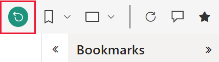

# Bookmarks in the Power BI service

[!INCLUDE[consumer-appliesto-ynnm](../includes/consumer-appliesto-ynnm.md)]

## Introduction to bookmarks

A bookmark captures the state of a report page. It saves the settings that you make to filters, slicers, and visuals on a page. When the report page is set the way you want, give it a suitable name. Now you can return to that state of the report page by selecting the bookmark.

## Types of bookmarks

There are two types of bookmarks, *personal* and *report*. Designers add report bookmarks to a report. When a designer shares the report with colleagues, the bookmarks go with the report. Everyone that opens and views that report can see and use the report bookmarks. Personal bookmarks can be created by anyone who can open a report. They don't require edit permissions. If you create personal bookmarks and share your report, the personal bookmarks don't go with the report. Personal bookmarks are for your use only. However, if you want to share your personal bookmarks, this article provides tips and tricks to do so.

Report bookmarks are created by others and shared with you. To view shared content, a Power BI Pro or Premium Per User license is required. For more information, see [Licenses and subscriptions for business users](end-user-license.md).

If you design reports and create report bookmarks for others to use, see [Create report bookmarks in Power BI](../create-reports/desktop-bookmarks.md).

## Use personal bookmarks to save insights and build stories in Power BI

There are many uses for personal bookmarks. For example, if you discover an interesting insight and want to preserve it, you can create a personal bookmark to return to later. Or if you need to step away from your work and want to preserve it, use a personal bookmark. You can even make a personal bookmark your default view of a report, so each time you return, that view of the report page opens.

Create a collection of bookmarks, arrange them in the order you want, and show each bookmark in a presentation to highlight a series of insights. This works like a slideshow where you select an arrow to go forward or backward. There's a limit of 20 personal bookmarks per report.

### Open the Bookmarks pane

Select the :::image type="icon" source="media/end-user-bookmarks/power-bi-bookmark.png"::: icon in the upper right corner of a visual to open the **Bookmarks** pane. Select **Add a personal bookmark** or **Show more bookmarks**.

### Share changes

You can't share your personal bookmarks with others, but you can save a report with your personal bookmarked view active. When colleagues who have read access to the report open that report, they see the view you selected. The personalized view of the report doesn't override the designer's original report or the designer's report bookmarks. When you share with colleagues who don't have read access, reshare permissions are required. If you're unable to share your view of the report, contact the report owner to request reshare permission.

If you do have reshare permissions, when you share the report you can choose to include your changes.

- If you have a personal bookmark active when you share your report, recipients will see the bookmarked version of that report page but will not see your bookmark listed under their "Personal bookmarks" list. So, they'll see the result of your personal bookmark. For example, if your bookmark filters the report page to show data for the year 2020.
- Similar to the method above, with a personal bookmark active, you can share in Microsoft Teams. Select **Chat in Teams** from the top menu. In the **Chat in Teams** dialog, provide the name of the Team or Channel that you with to share to, then select **Share**. Or, from the **Chat in Teams** dialog, copy the generated URL and share that. For more information, see [Share personal bookmarks in Teams chat](../collaborate-share/service-share-reports.md).
- With a personal bookmark active, use the comment feature.  When you add a comment, the Power BI service saves the current view and that is the view other users will see when they select the comment. For more information, see [Add comments to dashboards and reports](end-user-comment.md)
- If you then change your personal bookmark, it has no effect on your recipients' view of that report page. For example, if you select a different personal bookmark that shows data for the year 2021, your view of the report will change.  However, your recipients will still see the version your shared, showing 2020.

When a personal bookmark is on you can use the comment feature on the Power BI service. Add a comment. This comment will save the view with another user when they click on the comment.

> [!NOTE]
> To share reports, you need a Power BI Pro or Premium Per User license, or the report must be saved in reserved capacity. To learn more, see [Licensing and subscriptions for business users](end-user-license.md).

:::image type="content" source="media/end-user-bookmarks/power-bi-share-changes.png" alt-text="Share changes":::

## Create personal bookmarks

If you can view a report, you can add personal bookmarks. You can create up to 20 personal bookmarks per report. When you create a bookmark, the following elements are saved with the bookmark:

- The current page
- Filters
- Slicers, including slicer type (for example, dropdown or list) and slicer state
- Visual selection state, such as cross-highlight filters
- Sort order
- Drill location

If you have access to the **Selection** pane, you can also set and save:

- The visibility of an object
- The focus or **Spotlight** modes of any visible object

### Create two bookmarks

Configure a report page how you want it to appear in the bookmark. The following example has filters applied. There are changes to the:

1. existing Date filter on the **Filters** pane.
1. existing Regions filter on the **Filters** pane. **West** is selected.
1. data point on the doughnut chart visual. It cross-filters and cross-highlights the report canvas.

1. When your report page and visuals are arranged how you want, select **Personal bookmarks** from the **Bookmarks** pane and then select **Add**.

1. The personal bookmark gets a generic name, or you can enter a name. Select **Save**. To *rename*, *make default*, *delete*, or *update* your bookmark, select the ellipses next to the bookmark's name, and then select an action from the menu that appears.

1. Open the **YTD Category** page of your report and create another personal bookmark. The bookmark in the following example captures the YTD information for the VanArsdel company.

    

1. To open the **Bookmarks** pane, select **Show more bookmarks** in the **Bookmarks** menu. To switch between your two bookmarks, select the name of a bookmark in the **Bookmarks** pane.

    

1. To return to the original published view of the report, select the **Reset** icon, and then select **Reset** on the dialog.

    

## Open report bookmarks

To view the report bookmarks created by the report designer, select **Report bookmarks** from the **Bookmarks** pane.

> [!NOTE]
> To view shared reports, you need a Power BI Pro or Premium Per User license, or the report must be saved in reserved capacity. For more information, see [Licensing and subscriptions for business users](end-user-license.md).

### Report bookmarks

If the report designer includes report bookmarks, they appear under the **Report bookmarks** heading. The following example has four bookmarks named B1 ON, B2 ON, VanArsdel YTD, and All YTD. **All YTD** is selected. Select a bookmark to change to that report view.

## Bookmarks as a slideshow

To present or view bookmarks in a slideshow, select **View** from the **Bookmarks** pane.

When in **View** mode, there are a few features to notice:

- The name of the bookmark appears in the bookmark title bar, which appears at the bottom of the canvas.
- The bookmark title bar has arrows where you can move to the next or previous bookmark.
- To exit **View** mode, select **Exit** from the **Bookmarks** pane, or select the **X** in the bookmark title bar.

In **View** mode, you can close the **Bookmarks** pane to provide more space for your presentation. While in **View** mode, all visuals are interactive and available for cross-highlighting, like they are when interacting with them in other modes.

### Reset all your changes to a report

You can removes all your changes in the report and set it back to the designer's last saved view of the report. From the upper right corner of your report canvas, select **Reset to default**.

:::image type="content" source="media/end-user-bookmarks/power-bi-personalize-reset-all.png" alt-text="Reset all changes":::

## Considerations and limitations

In this release of **personal bookmarks**, there are a few considerations and limitations to keep in mind.

- The bookmark captures the state of the page at the time the bookmark was created. When someone selects the bookmark, Power BI attempts to show them that bookmark in its original report state. However, there are situations where showing the bookmark isn't possible. For example, if the report owner changes the name of a field that is used by the bookmark, Power BI is no longer able to show visuals, filters, or slicers that use that field. Some visuals show no data for the renamed field. Filtered or sliced visuals revert to the default view.

- Most Power BI custom visuals work well with personal bookmarking. If you run into trouble bookmarking a Power BI custom visual, contact the creator of that visual and ask them to add support for bookmarks.

- Your personal bookmarks typically aren't affected if the report designer updates or republishes a report. However, if the designer makes major changes to a report, such as removing fields that are used by a personal bookmark, then you receive an error message the next time you attempt to open that bookmark.

- The personal bookmarks feature is supported in the Power BI mobile app for iOS and Android tablets and in the Power BI Windows app. It's not supported in the Power BI mobile app for phones. However, any change to a visual that you save to a personal bookmark in the Power BI service is valid in all the Power BI mobile apps.

- Personal bookmarks capture the exploration state of the current page. They don't capture changes to other pages. For example, if you have sync-slicers in your report and you personalize the sync-slicer to use a different field and capture a personal bookmark, then the personal bookmark only captures the slicer change on the current page.

## Next steps

[Personalize visuals in a report](end-user-personalize-visuals.md)
