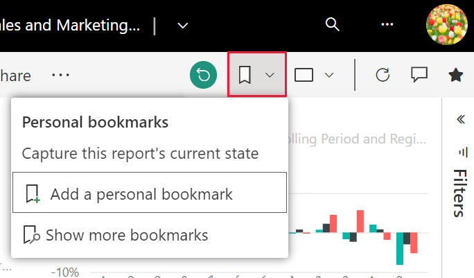
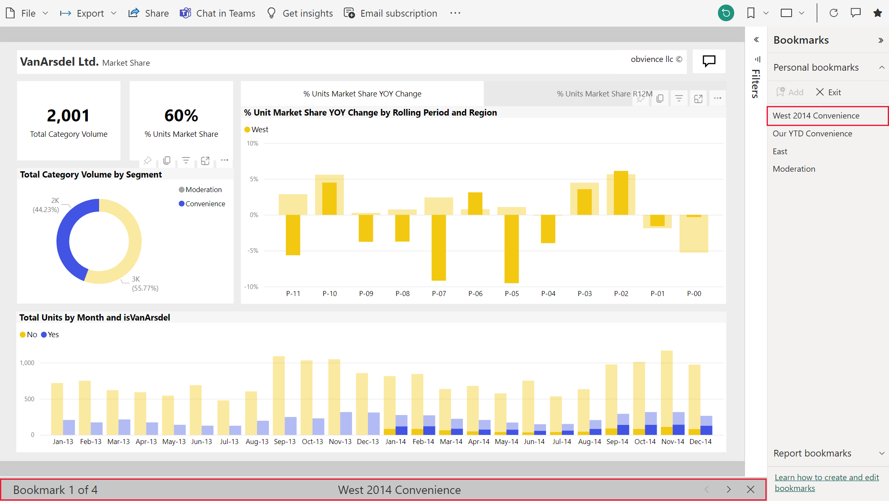

# What are bookmarks?

[!INCLUDE[consumer-appliesto-ynnm](../includes/consumer-appliesto-ynnm.md)]

Bookmarks capture the currently configured view of a report page, including filters, slicers, and the state of visuals. When you select a bookmark, Power BI takes you back to that view. There are two types of bookmarks - those you create yourself and those created by report *designers*. Any Power BI user can create personal bookmarks. However, the ability to use bookmarks created by others requires a Power BI Pro or Premium license. [Which license do I have?](end-user-license.md)

## Use bookmarks to share insights and build stories in Power BI 
There are many uses for bookmarks. Say you discover an interesting insight and want to preserve it -- create a bookmark so you can return later. Need to leave and want to preserve your current work, create a bookmark. You can even make a bookmark your default view of the report, so each time you return, that view of the report page opens first. 

You can also create a collection of bookmarks, arrange them in the order you want, and subsequently step through each bookmark in a presentation to highlight a series of insights that tell a story.  

Share your bookmarked report with colleagues who also have read access to the report. The bookmarked view of the report does not override the designer's original report.  Sharing with colleagues who don't already have read access requires reshare permissions. If you are unable to share your view of the report, contact the report owner to request reshare permission.  

### Share changes 
If you have read and reshare permissions, when you share the report you can choose to include your changes.

:::image type="content" source="media/end-user-bookmarks/power-bi-personalize-share-changes.png" alt-text="Share changes":::
 

## Open bookmarks
To open the Bookmarks pane, select **Bookmarks** > **Show more bookmarks** from the menu bar. 

To return to the original published view of the report, select the **reset** icon.

### Report bookmarks
If the report *designer* included report bookmarks, you'll find them under the **Report bookmarks** heading. This report page has four bookmarks: B1, B2, VanArsdel YTD, and All YTD. **All YTD** is currently selected.

> [!NOTE]
> You will need Power BI Pro or Premium to view shared reports. 

Select a bookmark to change to that report view. 

### Personal bookmarks

If you can view a report, then you can also add personal bookmarks. The maximum number of personal bookmarks per report is 20. When you create a bookmark, the following elements are saved with the bookmark:

* The current page
* Filters
* Slicers, including slicer type (for example, dropdown or list) and slicer state
* Visual selection state (such as cross-highlight filters)
* Sort order
* Drill location
* Visibility (of an object, using the **Selection** pane)
* The focus or **Spotlight** modes of any visible object

Configure a report page the way you want it to appear in the bookmark. In this example:

1. We've changed the existing Date filter on the **Filters** pane,
1. changed the existing Regions filter on the **Filters** pane, and
1.  and selected a data points on the doughnut chart visual to cross-filter and cross-highlight the report canvas. 

Once your report page and visuals are arranged how you want them, select **Add** from the **Bookmarks** pane to add a bookmark. 

**Power BI** creates a personal bookmark and gives it a generic name or a name you enter. You can *rename*, *delete*, or *update* your bookmark by selecting the ellipses next to the bookmark's name, then selecting an action from the menu that appears.

Once you have a bookmark, display it by selecting the bookmark in the **Bookmarks** pane. 

<!--
## Arranging bookmarks
As you create bookmarks, you might find that the order in which you create them isn't necessarily the same order you'd like to present them to your audience. No problem, you can easily rearrange the order of bookmarks.

In the **Bookmarks** pane, simply drag-and-drop bookmarks to change their order, as shown in the following image. The yellow bar between bookmarks designates where the dragged bookmark will be placed.

The order of your bookmarks can become important when you use the **View** feature of bookmarks, as described in the next section. 

-->

## Bookmarks as a slide show
To present or view bookmarks, in order, select **View** from the **Bookmarks** pane to begin a slideshow.

When in **View** mode, there are a few features to notice:

- The name of the bookmark appears in the bookmark title bar, which appears at the bottom of the canvas.
- The bookmark title bar has arrows that let you move to the next or previous bookmark.
- You can exit **View** mode by selecting **Exit** from the **Bookmarks** pane or by selecting the **X** found in the bookmark title bar.

When you're in **View** mode, you can close the **Bookmarks** pane (by clicking the X on that pane) to provide more space for your presentation. And, while in **View** mode, all visuals are interactive and available for cross-highlighting, just as they would otherwise be when interacting with them. 

<!--
## Visibility - using the Selection pane
With the release of bookmarks, the new **Selection** pane is also introduced. The **Selection** pane provides a list of all objects on the current page and allows you to select the object and specify whether a given object is visible. 

You can select an object using the **Selection** pane. Also, you can toggle whether the object is currently visible by clicking the eye icon to the right of the visual. 

When a bookmark is added, the visible status of each object is also saved based on its setting in the **Selection** pane. 

It's important to note that **slicers** continue to filter a report page, regardless of whether they are visible. As such, you can create many different bookmarks, with different slicer settings, and make a single report page appear very different (and highlight different insights) in various bookmarks.

## Bookmarks for shapes and images
You can also link shapes and images to bookmarks. With this feature, when you click on an object, it will show the bookmark associated with that object. This can be especially useful when working with buttons; you can learn more by reading the article about [using buttons in Power BI](../create-reports/desktop-buttons.md). 

To assign a bookmark to an object, select the object, then expand the **Action** section from the **Format Shape** pane, as shown in the following image.

Once you turn the **Action** slider to **On** you can select whether the object is a back button, a bookmark, or a Q&A command. If you select bookmark, you can then select which of your bookmarks the object is linked to.

There are all sorts of interesting things you can do with object-linked bookmarking. You can create a visual table of contents on your report page, or you can provide different views (such as visual types) of the same information, just by clicking on an object.

When you are in editing mode you can use ctrl+click to follow the link, and when not in edit mode, simply click the object to follow the link. 

## Bookmark groups

You can create and use bookmark groups. A bookmark group is a collection of bookmarks that you specify, which can be shown and organized as a group. 

To create a bookmark group, hold down the CTRL key and select the bookmarks you want to include in the group, then click the ellipses beside any of the selected bookmarks, and select **Group** from the menu that appears.

**Power BI Desktop** automatically names the group *Group 1*. Fortunately, you can just double-click on the name and rename it to whatever you want.

With any bookmark group, clicking on the bookmark group's name only expands or collapses the group of bookmarks, and does not represent a bookmark by itself. 

When using the **View** feature of bookmarks, the following applies:

* If the selected bookmark is in a group when you select **View** from bookmarks, only the bookmarks *in that group* are shown in the viewing session. 

* If the selected bookmark is not in a group, or is on the top level (such as the name of a bookmark group), then all bookmarks for the entire report are played, including bookmarks in any group. 

To ungroup bookmarks, just select any bookmark in a group, click the ellipses, and then select **Ungroup** from the menu that appears. 

Note that selecting **Ungroup** for any bookmark from a group takes all bookmarks out of the group (it deletes the group, but not the bookmarks themselves). So to remove a single bookmark from a group, you need to **Ungroup** any member from that group, which deletes the grouping, then select the members you want in the new group (using CTRL and clicking each bookmark), and select **Group** again. 
-->

### Reset all your changes to a report

From the upper-right corner of your report canvas, select **Reset to default**. This removes all your changes in the report and sets it back to the author's last saved view of the report.

:::image type="content" source="media/end-user-bookmarks/power-bi-personalize-reset-all.png" alt-text="Reset all changes":::

## Limitations and considerations
In this release of **bookmarks**, there are a few limitations and considerations to keep in mind.

* Most Power BI custom visuals should work well with bookmarking. If you run into trouble with bookmarking and a Power BI custom visual, contact the creator of that visual and ask them to add support for bookmarks.    
* If you add a visual on a report page after creating a bookmark, the visual will be displayed in its default state. This also means that if you introduce a slicer into a page where you previously created bookmarks, the slicer will behave in its default state.
* Generally, your bookmarks will not be affected if the report *designer* updates or republishes the report. However, if the designer makes major changes to the report, such as removing fields used by a bookmark, then you will receive an error message the next time you attempt to open that bookmark. 
* This feature is supported in the Power BI mobile apps for iOS and Android tablets and in the Power BI Windows app; it is not supported in the Power BI mobile apps for phones. However, any change to a visual you save in a personal bookmark while in the Power BI service is respected in all the Power BI mobile apps.

## Next steps
[Personalize visuals in a report](end-user-personalize-visuals.md)
