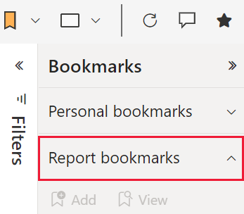

# Bookmarks in the Power BI service

[!INCLUDE[consumer-appliesto-ynnm](../includes/consumer-appliesto-ynnm.md)]

There are two types of bookmarks: *personal* and *report*. Report bookmarks are added to reports by report *designers*. When the designers share their reports with colleagues, the bookmarks travel with the report. Everyone who can open and view that report can also see and use the report bookmarks. Personal bookmarks can be created by anyone who can open a report, they don't even require edit permissions. However, if you create personal bookmarks and share your report, the personal bookmarks do not travel with the report. Personal bookmarks are for your use only. However, if you want to share your personal bookmarks, this article provides some tips and tricks to do so.

This article explains how to create and use *personal* bookmarks.  It also explains how to interact with *report* bookmarks that have been created by others and shared with you. Viewing shared content requires either a Power BI Pro or a Premium Per User license. [Which license do I have?](end-user-license.md)

If you will be designing reports and creating report bookmarks for others to use, see [Create report bookmarks](../create-reports/desktop-bookmarks.md).

## What are bookmarks?

Bookmarks capture the currently configured view of a report page, including filters, slicers, and the state of visuals. When you select a bookmark, Power BI takes you back to that view.  

## Use *personal* *bookmarks* to save insights and build stories in Power BI 
There are many uses for personal bookmarks. Say you discover an interesting insight and want to preserve it -- create a personal bookmark so you can return later. Need to leave and want to preserve your current work, create a personal bookmark. You can even make a personal bookmark your default view of a report, so each time you return, that view of the report page opens first. 

You can also create a collection of bookmarks, arrange them in the order you want, and subsequently step through each bookmark in a presentation to highlight a series of insights that tell a story.  This works like a slideshow, where you click an arrow to go forward or backward. There is a limit of 20 personal bookmarks per report.

### Open the Bookmarks pane

Open the **Bookmarks** pane by selecting the icon and choosing either **Add a personal bookmark** or **Show more bookmarks**.

### Share changes 
While you can't share your actual personal bookmarks with others, you can select a personal bookmark and save the report with that bookmarked view active.  When colleagues who also have read access to the report open that report, they see the view you selected. This personalized view of the report does not override the designer's original report or the designer's *report* bookmarks.  Sharing with colleagues who don't already have read access requires reshare permissions. If you are unable to share your view of the report, contact the report owner to request reshare permission.  

If you do have reshare permissions, when you share the report you can choose to include your changes. 
- If you have a personal bookmark active when you share your report, recipients will see the bookmarked version of that report page but will not see your bookmark listed under their "Personal bookmarks" list. So, they'll see the result of your personal bookmark. For example, if your bookmark filters the report page to show data for the year 2020.
- Similar to the method above, with a personal bookmark active, you can share in Microsoft Teams. Select **Chat in Teams** from the top menu. In the **Chat in Teams** dialog, provide the name of the Team or Channel that you with to share to, then select **Share**. Or, from the **Chat in Teams** dialog, copy the generated URL and share that. For more information, see [Share personal bookmarks in Teams chat](../collaborate-share/service-share-reports.md).
- With a personal bookmark active, use the comment feature.  When you add a comment, the Power BI service saves the current view and that is the view other users will see when they select the comment. For more information, see [Add comments to dashboards and reports](end-user-comment.md)
- If you then change your personal bookmark, it has no effect on your recipients' view of that report page. For example, if you select a different personal bookmark that shows data for the year 2021, your view of the report will change.  However, your recipients will still see the version your shared, showing 2020.

When a personal bookmark is on you can use the comment feature on the Power BI service. Add a comment. This comment will save the view with another user when they click on the comment.
 
> [!NOTE]
> To share reports, you will need a Power BI Pro or Premium Per User license, or for the report to be saved in reserved capacity. To learn more, see [Licensing](end-user-license.md).

:::image type="content" source="media/end-user-bookmarks/power-bi-share-changes.png" alt-text="Share changes":::
 

## Create personal bookmarks in the Power BI service
If you can view a report, then you can also add personal bookmarks. The maximum number of personal bookmarks per report is 20. When you create a bookmark, the following elements are saved with the bookmark:

* The current page
* Filters
* Slicers, including slicer type (for example, dropdown or list) and slicer state
* Visual selection state (such as cross-highlight filters)
* Sort order
* Drill location

If you have access to the **Selection** pane, you can also set and save:
* Visibility (of an object, using the **Selection** pane)
* The focus or **Spotlight** modes of any visible object

### Create two bookmarks
Configure a report page the way you want it to appear in the bookmark. In this example:

1. We've changed the existing Date filter on the **Filters** pane,
1. changed the existing Regions filter on the **Filters** pane to **West**, and
1.  selected a data point on the doughnut chart visual to cross-filter and cross-highlight the report canvas. 

1. Once your report page and visuals are arranged how you want them, from the **Bookmarks** pane, select **Personal bookmarks > Add**. 

1. Power BI creates a personal bookmark and gives it a generic name or a name you enter. You can *rename*, *delete*, or *update* your bookmark by selecting the ellipses next to the bookmark's name, then selecting an action from the menu that appears.

1. Select **Save**.

1. Open the **YTD Category** page of your report and create another personal bookmark. This bookmark captures YTD information for just our company, VanArsdel.

    

1. Now that you have two bookmarks, switch between them by selecting the bookmark in the **Bookmarks** pane. 

    

1. To return to the original published view of the report, select the **reset** icon.

    

## Open *report* bookmarks
To view the report bookmarks created by the report *designer*, from the **Bookmarks** pane, select **Report bookmarks**.  

> [!NOTE]
> To view shared reports, you will need a Power BI Pro or Premium Per User license, or for the report to be saved in reserved capacity. To learn more, see [Licensing](end-user-license.md).

### Report bookmarks
If the report *designer* included report bookmarks, you'll find them under the **Report bookmarks** heading. This report page has four bookmarks: B1, B2, VanArsdel YTD, and All YTD. **All YTD** is currently selected.

Select a bookmark to change to that report view. 

## Bookmarks as a slide show
To present or view bookmarks, in order, select **View** from the **Bookmarks** pane to begin a slideshow. 

When in **View** mode, there are a few features to notice:

- The name of the bookmark appears in the bookmark title bar, which appears at the bottom of the canvas.
- The bookmark title bar has arrows that let you move to the next or previous bookmark.
- You can exit **View** mode by selecting **Exit** from the **Bookmarks** pane or by selecting the **X** found in the bookmark title bar.

When you're in **View** mode, you can close the **Bookmarks** pane (by clicking the X on that pane) to provide more space for your presentation. And, while in **View** mode, all visuals are interactive and available for cross-highlighting, just as they would otherwise be when interacting with them. 

### Reset all your changes to a report

From the upper-right corner of your report canvas, select **Reset to default**. This removes all your changes in the report and sets it back to the designer's last saved view of the report.

:::image type="content" source="media/end-user-bookmarks/power-bi-personalize-reset-all.png" alt-text="Reset all changes":::

## Limitations and considerations
In this release of **personal bookmarks**, there are a few limitations and considerations to keep in mind.

* Most Power BI custom visuals should work well with personal bookmarking. If you run into trouble with bookmarking and a Power BI custom visual, contact the creator of that visual and ask them to add support for bookmarks.    
* If you add a visual on a report page after creating a personal bookmark, the visual will be displayed in its default state. This also means that if you introduce a slicer into a page where you previously created personal bookmarks, the slicer will behave in its default state.
* Generally, your personal bookmarks will not be affected if the report *designer* updates or republishes the report. However, if the designer makes major changes to the report, such as removing fields used by a personal bookmark, then you will receive an error message the next time you attempt to open that bookmark. 
* This feature is supported in the Power BI mobile apps for iOS and Android tablets and in the Power BI Windows app; it is not supported in the Power BI mobile apps for phones. However, any change to a visual you save in a personal bookmark while in the Power BI service is respected in all the Power BI mobile apps.

## Next steps
[Personalize visuals in a report](end-user-personalize-visuals.md)

