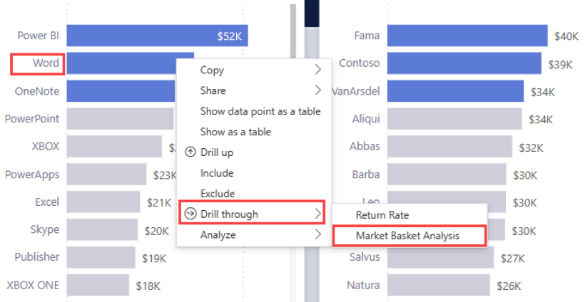
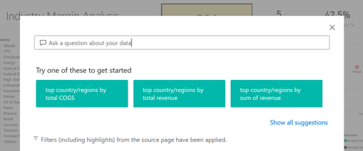

# Buttons in the Power BI service
In the reports that you receive from colleagues, you may have noticed buttons and wondered how to use them. Some have words, some have arrows, others have graphics, and some even have dropdown menus. This article will teach you how to recognize a button and how to figure out what to do with it.

## How to recognize a button
Buttons can look a lot like shapes, images, or icons on a report page. But if an action occurs when you select (click) it -- then it's probably a button.

## Types of buttons
Report creators add buttons to reports to help you with navigation and exploration. Just some of the button types are: back, bookmark, arrows, Q&A, help, and blank. 

### Back buttons 
A back button may have an arrow icon and when you select it, Power BI takes you back to the previous page.  Back buttons are often used with drillthrough. Here's an example of a back button used with drillthrough.

1. The user has selected **Word** in the bar chart and is drilling through to  **Market basket analysis**.

    

2. By choosing **Market basket analysis**, Power BI opens the *Market basket analysis* report page and uses the selections made on the source page to filter what is shown on the destination page.

    

    You're now on the **Market basket analysis** report page, which is filtered for **Word**. To return to the previous page, select the back button that is labeled **Go back**. 

## Bookmark buttons
Report *designers* often include bookmarks with their reports. You can view the list of report bookmarks by selecting **Bookmarks** from the upper right corner. When a report designer adds a bookmark *button*, it's just an alternate way to navigate to the particular report page that's associated with that bookmark. The page will have the applied filters and settings that are captured by the bookmark. [Learn more about bookmarks in Power BI](end-user-bookmarks.md). 

In this example, the button has a bookmark icon and the name of the bookmark, *Urban*. 

By choosing the bookmark button, Power BI takes you to the location and settings as defined for that bookmark.  In this case, the bookmark is on the *Growth opportunities* report page and that page is cross-filtered for **Urban**.

## Drillthrough buttons
There are two ways to drill through in the Power BI service. Drilling through takes you to a different report page and the data on that destination page is presented according to the filters and selections you've made on the source page.

One way to drill through in a report is to right-click a data point in a visual, select **Drill through**, and choose the destination. This method is described above in the section titled **Back button**. But sometimes the report designers use a drillthrough *button* instead, to make the action more obvious and to call attention to important insights.  

Drillthrough buttons can have more than one prerequisite. Unless you fulfill all the prerequisites, the button will not work. Let's look at an example.

Here is a drillthrough button that will take us to the *Store details* page. Hovering over the button reveals a tooltip that lets us know that we need to select both a store and a product. Until we select one of each, the button remains inactive.

Now that we've selected one product (**Word**), and one store (**Leo**), the button changes color to let us know that it is now active.

Selecting the drillthrough button takes us to the *Store* report page. The *Store* page is filtered for our selections of **Word** and **Leo**.

Drillthrough buttons can also have dropdown menus that offer you a choice of destinations. Once you've made your selections on the source report page, select the destination report page for the drillthrough. In the example below, we're changing our selection to drill through to the *Market details* report page. 

## Page navigation

Page navigation buttons take you to a different page in the same report. Report designers often create navigation buttons to tell a story or guide you through the report insights. In the example below, the report designer added a button on each report page that takes you back to the first page, the top-level summary page, in the report. This page navigation button is helpful because there are many pages in this report.

## Q&A buttons 
Selecting a Q&A button opens the Power BI Q&A Explorer window. The Q&A window displays on top of the report page and can be closed by selecting the X. [Learn about Q&A](end-user-q-and-a.md)

## Web URL
Web URL buttons open a new browser window. Report designers might add this type of button as a reference source, to link to the corporate website or a help page, or even as a link to a different report or dashboard. In the example below, the Web URL button let's you download the source file for the report. 

Since the page opens in a separate window, close the window or select your Power BI tab to return to the Power BI report.

## Next steps
[Bookmarks](end-user-bookmarks.md)    
[Drill up, drill down](end-user-drill.md)
