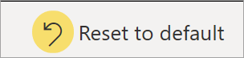
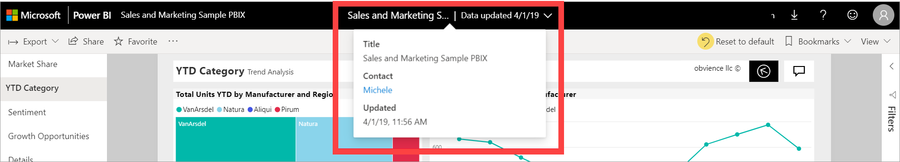

# Change how a chart is sorted in a Power BI report

[!INCLUDE[consumer-appliesto-ynnn](../includes/consumer-appliesto-ynnn.md)]

> [!IMPORTANT]
> **This article is for Power BI service users who don't have edit permissions for a report or semantic model. If you're a report designer, administrator, or owner, see [Sort one column by another column in Power BI](../create-reports/desktop-sort-by-column.md) for information that is more relevant to you**.

In the Power BI service, you can highlight important information in a visual by sorting data fields, like numeric data (such as sales figures) or text data (such as state names). After you sort a visual, you can [save a personalized version](#save-your-sort-order-changes) of your changes. The Power BI service provides flexibility and quick menus that allow you to efficiently sort your visuals.

In a Power BI report, you can sort most visuals by one, and sometimes two fields, but some visuals can't be sorted, like treemaps, filled maps, scatter charts, gauge charts, waterfall charts, cards, and visuals on a dashboard.

This video demonstrates sorting features, like how to change the sort order, and introduces other features that are available in the Power BI service.

> [!VIDEO https://www.microsoft.com/videoplayer/embed/RWRpNT]

## Get started

To choose a sorting option, open any report that you've created or that has been shared with you, select a visual that can be sorted, and choose **More options** (...). Depending on the type of visual, the sorting options are **Sort descending**, **Sort ascending**, **Sort by** and **Sort axis**.

:::image type="content" source="media/end-user-change-sort/power-bi-actions.png" alt-text="Screenshot showing the visual's More options menu. The sorting options are outlined.":::

## Sort alphabetically or numerically

Visuals can be sorted alphabetically by the names of the categories in the visual or by the numeric values of each category. For example, in this chart's Y-axis, the **Sales Stage** is sorted alphabetically.

:::image type="content" source="media/end-user-change-sort/power-bi-sort-category.png" alt-text="Screenshot showing a bar chart with the X axis sorted alphabetically.":::

To change the sort from a category (Sales Stage) to a value (Opportunity Count), select **More actions** (...), **Sort axis**, and then select **Sort ascending** or **Sort descending**. The following example shows the visual sorted by **Opportunity Count** in ascending order. The field and order that are sorted are indicated with a checkmark.

:::image type="content" source="media/end-user-change-sort/power-bi-sort-value.png" alt-text="Screenshot showing the sales per square feet option selected from the menu.":::

## Sort by multiple columns

The data in this table is sorted by **Number of customers**. The small arrow in the column header indicates that the column is sorted. The arrow points down because the column is sorted in descending order.

You can sort multiple columns to create a sorting sequence. To add more columns to the sort order, select the Shift key while also selecting the column header you would like to add next in the sort order. For example, if you select **Number of customers** and then select Shift and **Total revenue**, then the table is sorted first by customers, then by revenue. The red outlines show areas where the sort order changed.

If you select Shift and then select the same column a second time, the sort direction (ascending or descending) is changed. If you select Shift and select a column you've previously added to the sort order, that column moves to the back of the sort order.

## Save your sort order changes

Power BI reports retain the filters, slicers, sorting, and other data view changes that you make, even if you're working in [Reading view](end-user-reading-view.md#reading-view). So, if you navigate away from a report, and return later, your sorting changes are saved. To revert your changes back to the report designer's settings, select **Reset to default** from the top menu on the report page.

The report designer can prevent changes from being saved. If they do, the **Reset to default** button is greyed out.

You can also save your changes with [bookmarks](end-user-bookmarks.md). If the report designer enables the **Personalize visual** feature for the report, you can change the sort order of a visual and save it as a bookmark. If you see the personalize visual icon :::image type="icon" source="media/end-user-change-sort/power-bi-personalize-visual-icon.png"::: in the visual's header, this feature is enabled. You don't need edit permissions to use this feature.

For more information, see [Personalize visuals in a report](end-user-personalize-visuals.md).

## Sort by other criteria

Sometimes you want to sort your data by using a field that isn't included in the visual. For example, you might want to sort by month in sequential order (and not in alphabetical order) or you might want to sort by entire numbers instead of by digit (example, 0, 1, 9, 20 and not 0, 1, 20, 9).  

- To learn how to sort by a different field in the semantic model, see [Sort one column by another column in Power BI](../create-reports/desktop-sort-by-column.md). To use this feature, you must have edit permissions for the report.

- If you're the report designer, you can create new columns in the semantic model to address sorting issues with values, such as dates and numbers. The designer's contact information is listed in the report title's menu.

## Related content

- More about [Interactions with visuals in reports, dashboards, and apps](end-user-visualizations.md).

- [Basic concepts for the Power BI service business user](end-user-basic-concepts.md).
