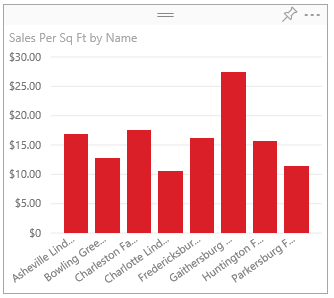

# Change how a chart is sorted in a Power BI report
In a Power BI report, you can sort most visualizations alphabetically by the names of the categories in the chart, or by the numeric
values of each category. For example, this chart is sorted by the category **store name**.

It's easy to change the sort from a category (store name) to a value (sales per square feet) instead.

1. Select the ellipses (...) and choose **Sort by > Sales Per Sq Ft**.
2. If necessary, select the ellipses again and choose **Sort descending**.

   

   **NOTE**: Not all visuals can be sorted.  For example, the following visuals cannot be sorted: Treemap, Map, Filled Map, Scatter, Gauge, Card, Multi Row Card, Waterfall.

## Saving changes you make to sort order
Power BI reports retain the filters, slicers, sorting, and other data view changes that you make. So if you navigate away from a report, and return later, your changes are saved.  If you want to revert your changes back to the report designer's settings, select **Reset to default** from the top menubar. 

If, however, the **Reset to default** button is greyed out, that means the report designer has disabled the ability to save (persist) your changes.

## Sorting using other criteria
Sometimes, you want to sort your visual using a different field or other criteria.  For example, you might want
to sort by month (and not in alphabetical order) or you might
want to sort by entire numbers instead of by digit (example, 0, 1, 9, 20 and not 0, 1, 20, 9).  

In some cases, you may be able to sort the visual the way you'd like, for example, by month.  But if not, it may be because the dataset behind the report needs some tweaking. Ask the report designer to update the dataset.

## Next steps
More about [Visualizations in Power BI reports](end-user-visualizations.md).

[Power BI - Basic Concepts](end-user-basic-concepts.md)